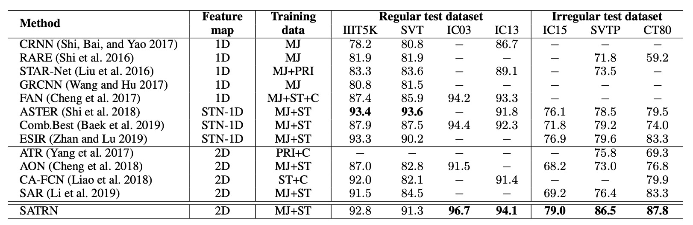
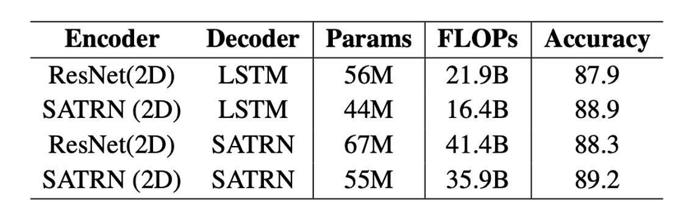

## Transformer Reaches the Battlefield

[**On Recognizing Texts of Arbitrary Shapes with 2D Self-Attention**](https://arxiv.org/abs/1910.04396)

---

Since the Transformer was introduced, its influence has gradually spread across various fields.

This paper, published by Clova AI, aims to bring the advantages of Transformers to the field of Scene Text Recognition (STR), potentially addressing some of its challenges.

## Defining the Problem

The recognition of arbitrarily shaped text continues to be a challenge for researchers.

Although several solutions have been proposed over the past few years, these methods still fall short of delivering ideal results. Most notably, many of these studies assume that the text is arranged horizontally, limiting the model's generalization ability.

By this time, the Transformer had already been around for more than two years, and BERT had taken the NLP world by storm. The authors thought: maybe the Transformer’s attention mechanism could help solve this problem in STR as well.

:::tip
Note: When this paper was published, Vision Transformers (ViT) had not yet been introduced!
:::

## Solving the Problem

### Model Architecture

<figure style={{"width": "70%"}}>

</figure>

The authors proposed a model architecture that looks like a standard Transformer but includes some modifications tailored to the STR task. Since the Transformer architecture has been discussed widely, we won’t go into too much detail here. If you are unfamiliar with it, you can refer to:

- [**[17.06] Transformer: The Beginning of a New Era**](../../transformers/1706-transformer/index.md)

In the encoder part, the input image first passes through a shallow convolutional neural network (CNN) to extract local image patterns and textures, alleviating the computational load on the self-attention module. This CNN consists of two $3 \times 3$ convolutional layers and a $2 \times 2$ max pooling layer with a stride of 2.

The self-attention module is based on Transformer self-attention, utilizing adaptive 2D positional encoding to handle the challenge of arbitrary text arrangements.

For the feedforward network (FFN), the authors introduced a novel Locality-aware Feedforward Layer to enhance the focus on local structures. Here, the original pointwise feedforward layer’s $1 \times 1$ convolutional layer was replaced by a $3 \times 3$ convolutional layer.

In the decoder, the text sequence is extracted from the 2D feature map produced by the encoder.

During decoding, the cross-modal interaction between the image input and text output is realized in the second multi-head attention module. The decoder structure largely mirrors that of a Transformer decoder, relying mainly on multi-head attention and pointwise feedforward layers.

:::tip
**Adaptive 2D Positional Encoding (A2DPE)**

To address the challenge of arbitrary text arrangements, the authors dynamically adjust the ratio between width and height to adapt to different input image features. A2DPE adjusts positional encoding with the following formula:

$$
p_{hw} = \alpha(E) p_{\text{sinu}}^h + \beta(E) p_{\text{sinu}}^w
$$

Here, $p_{\text{sinu}}^h$ and $p_{\text{sinu}}^w$ are sine positional encodings, and $E$ represents the image features. $\alpha(E)$ and $\beta(E)$ are computed through two-layer perceptrons (MLPs) from the image features $E$, with sigmoid functions controlling the relative ratio.
:::

## Discussion

### Comparison with Previous Methods

Compared to other 2D feature map methods, SATRN achieves superior performance across all benchmark tests, particularly in irregular text benchmarks, where it outperforms the second-best method by an average of 4.7 percentage points.

This architecture demonstrates significant advantages in handling arbitrarily shaped text and outperforms other methods that use spatial transformer networks (STN) or 2D feature maps.

### Comparison with the SAR Model

:::tip
In our previous discussion of the SAR model, we mentioned this comparative study, which is detailed in this paper:

- [**[18.11] SAR: 2D Attention Maps**](../1811-sar/index.md)
  :::

SATRN differs significantly from the SAR model in both the encoder (self-attention vs convolutional network) and decoder (self-attention vs LSTM). While SAR uses a ResNet encoder and LSTM decoder, SATRN adopts self-attention-based encoders and decoders.

Compared to SAR, SATRN not only improves accuracy but also enhances computational efficiency. Upgrading SAR’s ResNet encoder to SATRN’s self-attention-based encoder improves accuracy by 1.0 and 0.9 percentage points while reducing 12 million parameters and 5.5 billion FLOPs.

### Multi-line Text Recognition

To evaluate the model’s performance under various text distortions, the authors synthesized a new test set from the IC13 dataset, focusing on rotated and multi-line text.

For rotated text, they trained the model using rotations distributed uniformly from 0° to 360°, adjusting the input image size to 64×64. For multi-line text, the model was trained using synthetic text datasets (SynthText and MJSynth), and manually cropped multi-line text images from IC13 were used for testing.

In experiments, SATRN consistently outperformed baseline models like FAN and SAR at all rotation angles, maintaining stable performance across varying degrees of rotation. In multi-line text recognition, SATRN demonstrated the ability to make large jumps during inference, moving from one line to the next, showcasing its impressive capabilities.

The image below shows attention maps from the SATRN decoder as it extracts 2D features:

### Ablation Study

- **Adaptive 2D Positional Encoding (A2DPE)**: Compared to not using positional encoding, 1D positional encoding, and 2D concatenation encoding, A2DPE demonstrated the best accuracy. It dynamically adjusts aspect ratios to accommodate different text arrangements, significantly boosting model performance.
- **Impact of Feature Map Height**: As the feature map size shrinks, both computational load and accuracy decrease. Accuracy drops sharply when the height downsampling rate exceeds 1/8, emphasizing the importance of maintaining the 2D feature map during computation.

## Conclusion

SATRN demonstrates the effectiveness of using Transformers for STR tasks and achieves state-of-the-art performance across multiple benchmarks, improving accuracy by an average of 5.7 percentage points.

While SATRN improves accuracy, the use of self-attention layers increases memory and computation requirements, particularly in the decoder, where FLOPs and parameter counts are significantly higher. However, this doesn’t seem to be a major issue!

Future research can explore ways to reduce the computational load of the model for more practical applications.
