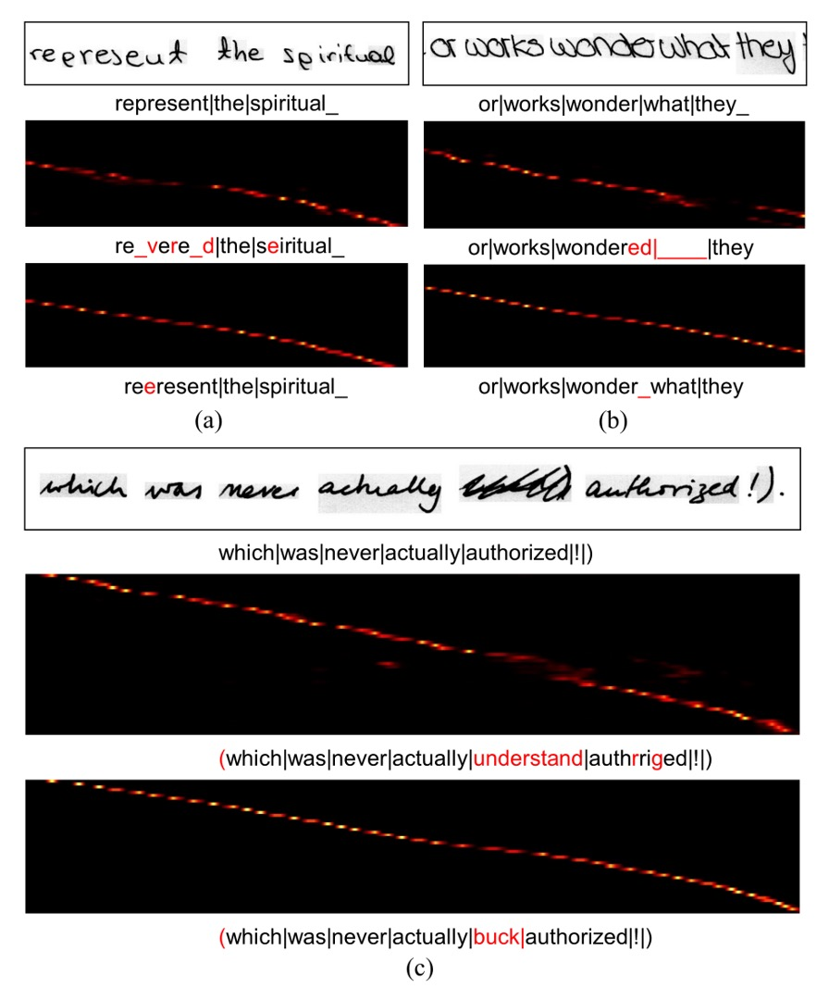
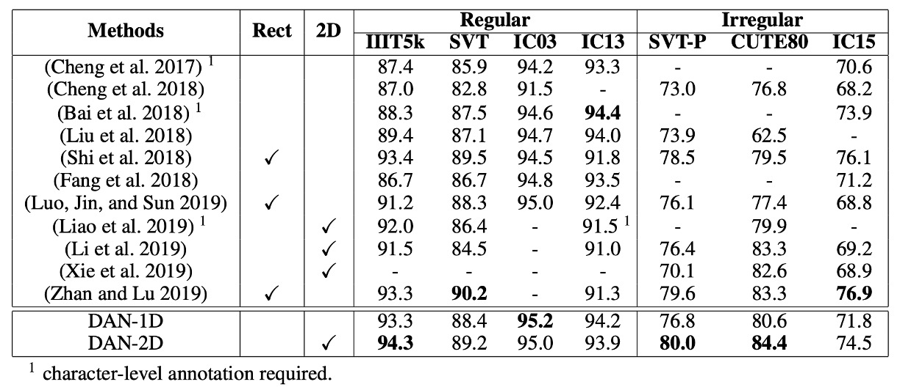
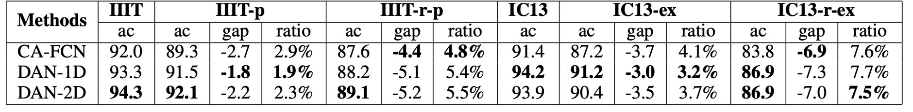

# [19.12] DAN

## They Cannot Be Together

[**Decoupled Attention Network for Text Recognition**](https://arxiv.org/abs/1912.10205)

---

In earlier research, CTC algorithms were commonly used as decoders for final output, but in recent years, attention-based architectures have become more popular. The reason is simple: they often perform better!

Adding an attention mechanism has now become standard practice in the field of Scene Text Recognition (STR).

## Problem Definition

But here lies the issue: **attention maps are often inaccurate.**

### Attention Loss

The authors reviewed past research and observed that the design of attention maps is based on **feature maps** rather than on textual content.

What does that mean? Let's take a look at the image below:

In the image above, the top row shows the original input image, while the bottom row displays the corresponding attention map.

These attention maps are structured with sequential information: the top-left corner corresponds to the first character, and the bottom-right corner corresponds to the last one. A good attention distribution should have a diagonal pattern, indicating that each character is correctly aligned with a specific region.

In the example, however, the distribution deviates from the diagonal and shifts to another region. This suggests that the model fails to focus on the correct textual information at certain time steps.

According to the authors, this problem arises because attention maps are based on feature maps. As shown in the example, the word "ly" might appear visually similar across different sequence points. As a result, the model becomes "confused" and loses alignment.

### Coupled Output

We need attention maps to align text and images effectively. However, if **alignment and decoding operations are coupled**, the alignment will inevitably be influenced by the decoder's output. This coupling introduces **error accumulation and propagation** during training.

---

Thus, the authors argue: **alignment and decoding should not be coupled.**

## Solution

### Model Architecture

To address the coupling issue, the authors propose the **Decoupled Attention Network (DAN)** architecture, as shown above. The key idea is to design a separate branch dedicated solely to learning attention and predicting the character positions.

Let’s break down the architecture step-by-step:

### Feature Extraction

The first step involves **a CNN network to extract features** from the input image, which is a common approach.

The authors use a CNN-based feature encoder similar to previous works, instead of a standard ResNet. The configuration is as follows:

<figure style={{"width": "70%"}}>

</figure>

The input image $x$ (of size $H \times W$) is encoded into a feature map $F$:

$$
F = F(x), \quad F \in \mathbb{R}^{C \times H/r_h \times W/r_w}
$$

where $C$ is the number of output channels, and $r_h$ and $r_w$ are down-sampling factors for height and width, respectively.

### Alignment Module

The **Convolutional Alignment Module (CAM)** processes the feature maps.

CAM collects **multi-scale visual features** from the feature encoder and processes them through a series of down-sampling convolution layers. Inspired by Fully Convolutional Networks (FCNs), CAM computes attention for each channel, with each channel representing a class-specific heatmap.

CAM contains $L$ layers. During the **upsampling stage** (using transposed convolutions), the output features from each layer are added to the corresponding down-sampled feature map. Finally, **sigmoid activation and per-channel normalization** generate the attention map:

$$
A = \{ \alpha*1, \alpha_2, \dots, \alpha*{\text{maxT}} \}
$$

where $\text{maxT}$ is the maximum sequence length for decoding. Each attention map has the size $H/r_h \times W/r_w$.

At each time step, the decoder receives a feature map aligned with the corresponding textual region in the original image.

:::tip
If this step seems confusing, think of it as **Feature Pyramid Networks (FPN)**:

- [**[16.12] FPN: Pyramid Architecture**](../../feature-fusion/1612-fpn/index.md)
  :::

### Decoupled Decoder Module

<figure style={{"width": "70%"}}>

</figure>

Unlike conventional attention decoders, which handle both alignment and recognition, DAN’s **decoder only handles recognition**.

Given the encoded feature map and the attention map, the decoder computes the context vector $c_t$ at time step $t$:

$$
c*t = \sum*{x=1}^{W/r*w} \sum*{y=1}^{H/r*h} \alpha*{t, x, y} F\_{x, y}
$$

The classifier generates the output $y_t$ at each time step:

$$
y_t = w h_t + b
$$

where $h_t$ is the hidden state of a GRU:

$$
h*t = \text{GRU}((e*{t-1}, c*t), h*{t-1})
$$

$e_t$ is the embedding of the previous output $y_t$.

The loss function for DAN is:

$$
\text{Loss} = -\sum\_{t=1}^{T} \log P(g_t | I, \theta)
$$

where $\theta$ represents all trainable parameters, and $g_t$ is the ground truth label at step $t$.

:::tip
**Flexibility of CAM in 1D/2D Modes**

By adjusting the down-sampling factor $r_h$ and CAM stride, DAN can switch between **1D** and **2D recognition modes**:

- **1D Recognition**: When $H/r_h = 1$, suitable for long, structured text.
- **2D Recognition**: When $H/r_h > 1$, ideal for irregular text.
  :::

### Handwriting Recognition Training Strategy

#### Datasets

1. **IAM Dataset**:

   - English handwritten text based on the LOB corpus.
   - Training: 747 documents (6,482 lines).
   - Validation: 116 documents (976 lines).
   - Test: 336 documents (2,915 lines).

2. **RIMES Dataset**:
   - Handwritten French letters.
   - Training: 1,500 paragraphs (11,333 lines).
   - Test: 100 paragraphs (778 lines).

Training is conducted on **full-line text**, with **data augmentation** applied. The input image height is normalized to 192, with width adjusted proportionally (up to 2048).

- $maxT$ is set to 150 to cover the longest text lines.
- CAM layers (except the last) have 128 channels.

The model uses **Character Error Rate (CER%)** and **Word Error Rate (WER%)** for evaluation:

$$
\text{CER / WER} = \frac{\text{Edit Distance}}{\text{Total Characters / Words}}
$$

No language models or dictionaries are used to maintain the purity of the model’s performance.

### Scene Text Recognition Training Strategy

#### Datasets

1. **Regular Scene Text**:

   - **IIIT5K-Words**: 3,000 cropped word images.
   - **Street View Text (SVT)**: 647 word images.
   - **ICDAR 2003 (IC03)**: 867 word images.
   - **ICDAR 2013 (IC13)**: 1,015 word images.

2. **Irregular Scene Text**:
   - **SVT-Perspective (SVT-P)**: 639 perspective images.
   - **CUTE80**: 288 curved-text images.
   - **ICDAR 2015 (IC15)**: 2,077 blurred and multi-oriented images.

Training data includes **SynthText and Synth90k** datasets. Input image size is scaled to height 32, with width adjusted proportionally (up to 128). Other settings include:

- $maxT = 25$ (maximum sequence length).
- CAM depth $L = 8$ with 64 channels per layer (except the last).
- **Bidirectional decoder** used for final predictions.
- **ADADELTA** optimizer with an initial learning rate of 1.0, reduced to 0.1 after the third epoch.

## Discussion

### Handwritten Text Recognition Performance

<figure style={{"width": "70%"}}>

</figure>

- **IAM Dataset**:

  - **DAN outperforms** previous state-of-the-art (SOTA) models in **CER**, with an improvement of **1.5%**.
  - **WER**: Although Bhunia et al. (2019) perform better in WER, their model requires cropped single-word images, whereas **DAN** can recognize entire lines of text, offering greater flexibility in real-world applications.

- **RIMES Dataset**:
  - **CER**: DAN lags behind the SOTA by **0.2%**.
  - **WER**: DAN achieves a **3.7% reduction in errors** (a relative error reduction of 29%) compared to the SOTA.
  - The significant improvement in WER shows that DAN exhibits **stronger semantic learning abilities**, which is particularly helpful for recognizing longer text sequences.

### Ablation Study

<figure style={{"width": "70%"}}>

</figure>

According to the results, varying the **output length** does not significantly affect performance, and the computational resources required for the additional channels are negligible. As long as the set output length exceeds the actual text length, DAN’s performance remains stable.

<figure style={{"width": "80%"}}>

</figure>

As the depth $L$ decreases, DAN’s performance **drops significantly**, indicating that CAM requires sufficient depth to achieve good alignment. To correctly align a character, CAM's receptive field must be large enough to cover the character and its neighboring regions.

### Alignment Error Analysis

<figure style={{"width": "85%"}}>

</figure>

The authors track **attention centers**, identifying the region with the highest attention score. If the current attention center shifts left compared to the previous one, it is recorded as a misalignment. The test samples are divided into five groups based on text length: [0, 30), [30, 40), [40, 50), [50, 60), and [60, 70), with each group containing over 100 samples. The total misalignment data is summed for each group, and the **average misalignment per image (MM/img)** is calculated.

Analysis shows that the improvement in CER is almost directly related to the reduction of misalignment, indicating that DAN’s performance improvement is due to **reducing misalignment errors**.

The following image demonstrates how DAN resolves misalignment errors. The top row shows the input image, the middle row shows the alignment results using traditional attention, and the bottom row shows the results using DAN.

<figure style={{"width": "80%"}}>

</figure>

### Recognition Error Analysis

<figure style={{"width": "80%"}}>

</figure>

The authors present several **error cases** for DAN, as shown above:

1. **(a)**: The character “e” is incorrectly recognized as “p” due to the handwriting style, which makes it difficult to distinguish between the two. Even for humans, it is challenging without context.
2. **(b)**: The recognizer skips a space between two words due to their proximity.
3. **(c)**: Some noise in the texture is misinterpreted as text by DAN.

Despite these mistakes, DAN demonstrates **stronger robustness** compared to traditional attention mechanisms. In the presence of noise, traditional attention often produces unpredictable errors because alignment is disrupted, whereas DAN maintains stable alignment, even when generating additional output.

### Scene Text Recognition Performance

- **Regular Scene Text Recognition**:

  - DAN achieves **new SOTA performance** on **IIIT5K** and **IC03**.
  - On **SVT** and **IC13**, DAN’s performance is comparable to the SOTA models, with minor differences.
  - **DAN-1D** performs better on IC03 and IC13, as the images in these datasets are relatively **clean and regular**.

- **Irregular Scene Text Recognition**:
  - **DAN-2D** achieves SOTA performance on **SVT-P** and **CUTE80**, performing best among 2D models.

### Robustness Study

The authors conducted perturbation tests on **IIIT5K** and **IC13** datasets, comparing DAN with **CA-FCN**.

The perturbation strategies used are as follows:

1. **IIIT-p**: Padding 10% of the image height and width vertically and horizontally.
2. **IIIT-r-p**:
   - Randomly enlarging the four corners of the image (up to 20%).
   - Padding the edges to create a quadrilateral, then re-aligning it back into a rectangular image.
3. **IC13-ex**: Expanding the text bounding box by 10% before cropping.
4. **IC13-r-ex**: Randomly enlarging the bounding box (up to 20%) and cropping it into a rectangular image.

The results show that **DAN is generally more robust** than CA-FCN in most scenarios, proving DAN’s stability.

## Conclusion

From the outset, the authors clearly identified the limitations of traditional attention mechanisms and proposed a **decoupled solution**.

DAN proves to be highly valuable in text recognition tasks, offering **flexibility, robustness, and strong performance**. Its ability to reduce alignment errors makes it an effective tool. While there is still room for improvement in handling noisy and visually similar text, its simple architecture and dictionary-free design make DAN a strong candidate for various text recognition applications.

:::tip
For cases where the decoding length $maxT$ is particularly long, decoupled attention maps may consume significant resources, raising concerns about model efficiency. However, in most real-world scenarios, $maxT$ tends to be short, so this is not a major issue.
:::
