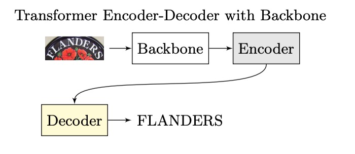
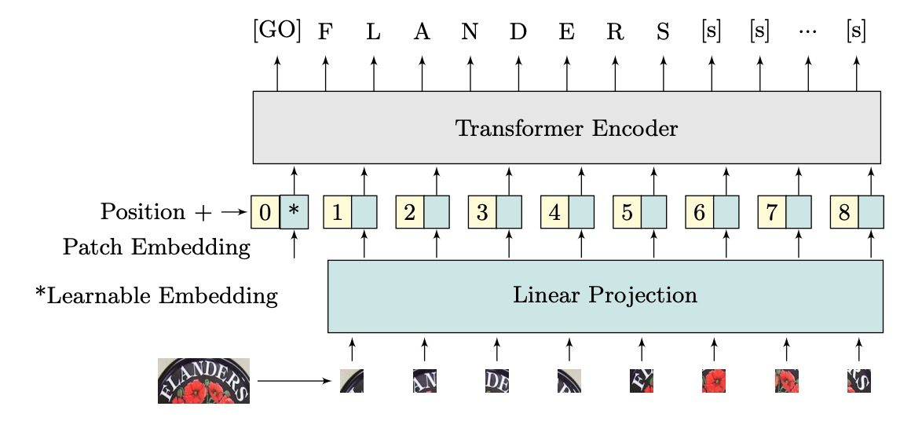
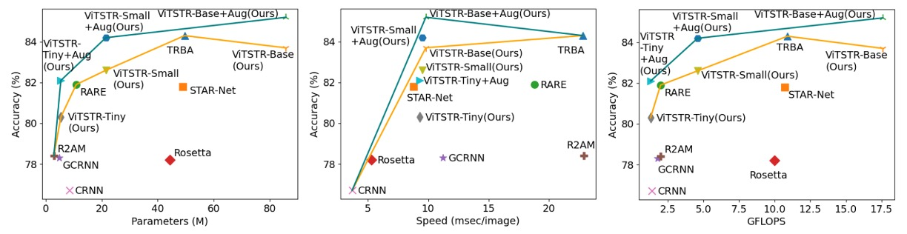

## Encoder-Only Model

[**Vision Transformer for Fast and Efficient Scene Text Recognition**](https://arxiv.org/abs/2105.08582)

---

The Vision Transformer (ViT) architecture is widely known, but it seems that the scene text recognition (STR) field still lacks a defining use case for it.

## Defining the Problem

Let’s first revisit a classic STR architecture, which looks something like this:

<figure style={{"width": "60%"}}>

</figure>

An input image is passed through a CNN to extract features, then into an LSTM for sequence decoding, and finally through a prediction module to obtain the final result.

With the introduction of the Transformer architecture, researchers started applying it to STR. The architecture evolved into something like this:

<figure style={{"width": "60%"}}>

</figure>

In this setup, the encoder part could be a CNN, a Transformer, or another algorithm, but the decoder consistently became a Transformer decoder.

Regardless of whether we use an autoregressive approach for inference, during training, the model can expand in parallel without waiting for the previous time step's output. This significantly improves efficiency.

The authors of ViTSTR propose that if we are already using a Transformer, why not directly output the result after encoding?

Look at the ViT model—it does exactly that.

- [**[20.10] ViT: Pioneering a New World**](../../vision-transformers/2010-vit/index.md)

We just need to modify the architecture like this:

<figure style={{"width": "60%"}}>

</figure>

By eliminating the decoder, we reduce the number of parameters, and we no longer need to worry about autoregressive problems. This leads to a model that is both faster and better—at least in theory. Experimental results will validate whether it's truly effective.

## Problem Solution

### Model Architecture

The authors propose ViTSTR, a model for STR based on the ViT architecture. The main difference lies in the prediction head. While ViT is used for single-object classification, ViTSTR is for recognizing multiple characters, where the correct character sequence and length must be considered.

The input image has dimensions of $x \in \mathbb{R}^{H \times W \times C}$, where $H$ and $W$ are the height and width of the image, and $C$ is the number of channels. The image is reshaped into a sequence of flattened 2D patches $x_p \in \mathbb{R}^{N \times P^2C}$, where each patch has dimensions of $P \times P$ and the sequence length is $N$.

These flattened patches are projected into an embedding of dimension $D$, achieved via a linear projection. A learnable class embedding (the $\text{[GO]}$ token) and positional encoding are added to form the input vectors for the encoder.

ViTSTR uses learnable positional encodings. At the output, feature vectors corresponding to the length of the text sequence are extracted, along with two special tokens: the $\text{[GO]}$ token, which signifies the start of the text, and the $\text{[s]}$ token, which signifies the end of the text.

:::tip
Essentially, it is the same as ViT.

The detailed computations are identical to the Transformer architecture and are omitted here for brevity.
:::

### Model Training Configuration

The authors propose three different model configurations: ViTSTR-Tiny, ViTSTR-Small, and ViTSTR-Base. The encoders are the same across all three models, but their depth and dimensions differ.

Training configurations are as follows:

The authors retrained several powerful baseline models—CRNN, R2AM, GCRNN, Rosetta, RARE, STAR-Net, and TRBA—to compare them fairly with ViTSTR.

Each model was trained at least five times with different random seeds, and the weights that performed best on the test dataset were saved to obtain the average evaluation score.

ViTSTR used pretrained weights from the DeiT model, and the input image size was adjusted to $224 \times 224$ to match the dimensions required by DeiT. No parameters were frozen during training.

:::tip
Typically, the input image size for text recognition is around $32 \times 100$.

Using $224 \times 224$ images here seems somewhat excessive.
:::

## Discussion

### Comparison with Other Models

During training, the authors used RandAugment for image augmentation, which included flipping, bending, blurring, adding noise, distorting, rotating, stretching, compressing, applying perspective transformations, and shrinking. The effects are illustrated below:

The authors compared the results with and without augmentation:

Accuracy improved by 1.8% with ViTSTR-Tiny, 1.6% with ViTSTR-Small, and 1.5% with ViTSTR-Base.

The most significant improvements were seen in irregular datasets:

| Dataset    | ViTSTR-Tiny (%) | ViTSTR-Small (%) | ViTSTR-Base (%) |
| ---------- | --------------- | ---------------- | --------------- |
| CT         | +9.2            | +6.6             | +6.6            |
| SVTP       | +3.8            | +3.3             | +1.8            |
| IC15 1,811 | +2.7            | +2.6             | +1.7            |
| IC15 2,077 | +2.5            | +2.2             | +1.5            |

### Performance Trade-offs

In scene text recognition models, adding a new stage often boosts accuracy but slows down the model and increases computational requirements. For example, upgrading from the RARE model to the TRBA model increased accuracy by 2.2%, but required an additional 38.8 million parameters and added 4 milliseconds to process each image.

Replacing the CTC stage with Attention (e.g., from STAR-Net to TRBA) increased computation time from 8.8 milliseconds per image to 22.8 milliseconds, with only a 2.5% improvement in accuracy. In fact, switching from CTC to Attention results in a more significant slowdown than adding BiLSTM or TPS stages, by over 10 times.

In ViTSTR, upgrading from the tiny version to the small version increases embedding size and the number of heads but doesn’t require additional stages. This upgrade improves accuracy by 2.3% but adds 16.1 million parameters.

Upgrading from tiny to base improves accuracy by 3.4% but increases the number of parameters by 80.4 million.

Despite the increase in parameters, ViTSTR's processing speed remains nearly unchanged. This is because the MLP and MSA layers in the encoder still use parallel operations (e.g., matrix multiplication, softmax, and addition), only increasing tensor dimensions. Thus, processing time for each image increases by only 0.2 to 0.3 milliseconds.

Unlike multi-stage STR models, where new modules usually require additional sequential layers for forward propagation (which cannot be processed in parallel), resulting in significant performance loss, ViTSTR only involves dimensional increases, which causes minimal performance degradation.

## Conclusion

ViTSTR is a simple, single-stage model architecture that balances accuracy, speed, and computational requirements. With data augmentation tailored for STR, ViTSTR significantly improves accuracy, especially on irregular datasets. As it scales, ViTSTR continues to balance precision, speed, and computational demands.

:::tip
It would be interesting to see what happens if we train from scratch with $32 \times 100$ feature maps instead of using DeiT’s pretrained weights and larger input sizes.

Maybe one day, when there's time, we’ll test that out.
:::
