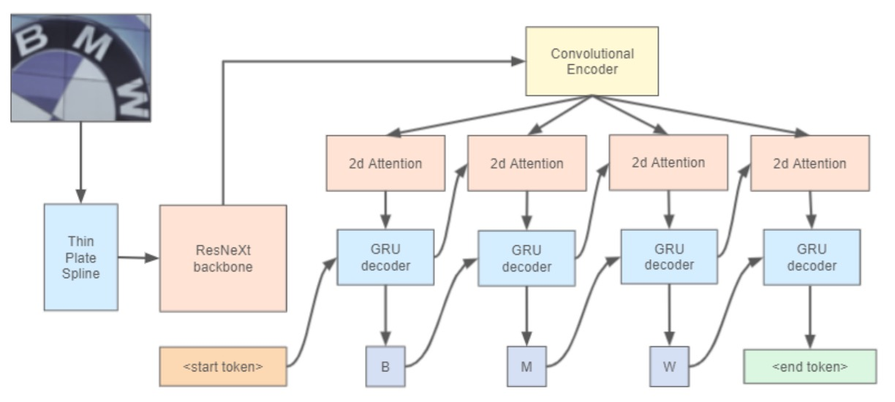

# [21.07] YATR

## Fake Can't Replace the Real

[**Why You Should Try the Real Data for Scene Text Recognition**](https://arxiv.org/abs/2107.13938)

---

In the field of Scene Text Recognition (STR), the majority of models rely heavily on synthetic data for training.

The standard approach is to begin with pre-training on synthetic data, and then either evaluate the model directly on validation datasets or fine-tune it using a small amount of real data before proceeding with evaluation.

## Defining the Problem

There’s no denying the importance of real-world data. Synthetic data must be generated based on specific rules—such as selecting particular fonts, adding noise, or choosing backgrounds.

Where there are rules, there are exceptions. These exceptions are often things that synthetic data cannot cover, which can impact the model’s ability to generalize. In the real world, synthetic data is the exception; real data is the rule.

Would you trust a model's generalization ability if it’s trained on exceptions instead of the rule?

The authors of this paper argue that a combination of synthetic and real data provides the best training material for STR models.

## Solving the Problem

### Model Architecture

<figure style={{"width": "80%"}}>

</figure>

The authors reference the approach used in WWWSTR:

- [**[19.04] WWWSTR: Data and Model Analysis**](../1904-wwwstr/index.md)

However, they do not separate the last two stages; in this architecture, the final stage of text recognition incorporates both sequence modeling and the final prediction in a single step.

For image rectification, the model employs the Thin Plate Spline (TPS) technique from ASTER:

- [**[18.06] ASTER: An Attentional Scene Text Recognizer with Flexible Rectification**](https://ieeexplore.ieee.org/document/8395027)

The TPS spatial transformation mechanism consists of three components:

1. **Localization Network**: First, it generates the spatial transformation parameters for the input image.
2. **Grid Generator**: Based on the predicted parameters, it creates a set of sampling grid points, marking the locations where the input image should be sampled, producing the transformed output.
3. **Sampler**: Using the grid and the input image, it generates the final output image.

The strength of TPS lies in its design, which doesn’t require character-level annotation, making it adaptable to various text recognition architectures. Its parameters can be learned in an end-to-end manner.

For the backbone, ResNeXt-101, a variant of ResNet with enhanced expressive capability, is used.

Finally, for the text recognition head, a 2D attention map with a GRU decoder is employed.

:::tip
Notably, this paper does not introduce any significant innovations in model architecture; the primary focus is instead on the training data.
:::

## Discussion

### The Importance of Real Data

<figure style={{"width": "80%"}}>

</figure>

The authors conducted training experiments using both synthetic and real datasets, keeping all conditions consistent: ResNeXt-101 as the backbone network, a case-insensitive training and testing mode, and no use of the TPS module in this experiment.

The results, shown in the table above, reveal that training exclusively with synthetic datasets fails to produce a robust text recognition model. Conversely, when training solely with real datasets, overall accuracy decreases. The authors suggest this might be due to the greater challenges posed by real-world datasets, indicating that models trained on real data may benefit from longer training cycles.

The best-performing combination was MJSynth + OpenImagesV5, which the authors identify as the optimal training dataset mix.

### Testing with ViTSTR

To further validate the importance of real data, the authors experimented with ViTSTR, a Transformer-based text recognition model.

You can refer to our earlier discussion of ViTSTR:

- [**[21.05] ViTSTR: Encoder-Only Model**](../2105-vitstr/index.md)

Using both synthetic and real datasets for training, they obtained the following results:

<figure style={{"width": "80%"}}>

</figure>

The results show that ViTSTR models trained with real datasets demonstrated a significant improvement across all metrics, with accuracy increasing by about 5% on each validation set. Although the original ViTSTR paper employed various data augmentation techniques, these were insufficient to offset the absence of real data.

## Conclusion

Combining synthetic and real data enhances the generalization capabilities of text recognition models.

While this conclusion may seem intuitive, knowing the exact impact through empirical results is invaluable. If anyone asks, “Why use real data, and what specific difference does it make?” this paper provides a concrete, evidence-based answer.
