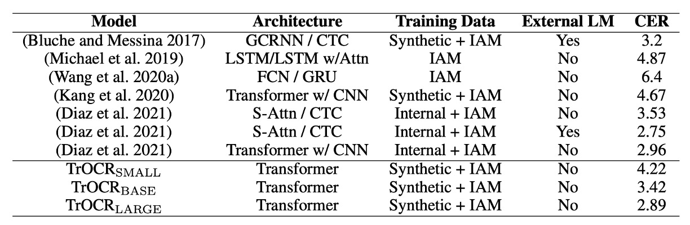

# [21.09] TrOCR

## Pre-training is Key

[**TrOCR: Transformer-based Optical Character Recognition with Pre-trained Models**](https://arxiv.org/abs/2109.10282)

---

This is a straightforward paper, ideal for developers who are new to this field and looking for a clear entry point.

## Problem Definition

Most existing OCR methods still use CNNs as the backbone, with added Transformer-based self-attention mechanisms to improve text image understanding. To further enhance accuracy, many approaches also integrate Connectionist Temporal Classification (CTC) and external language models within the decoder.

Although these methods have seen some success, most models are still trained from scratch and do not fully utilize the advantages of large-scale pre-trained models in computer vision (CV) and natural language processing (NLP).

In this paper, the authors lead by example, showing how pre-trained models can be applied effectively to OCR tasks.

:::tip
While some studies suggest that models trained from scratch perform better, and thus argue against the use of pre-trained models in OCR.
:::

## Solution

### Model Architecture

<figure style={{"width": "90%"}}>

</figure>

The TrOCR model is composed of two parts: an image Transformer and a text Transformer.

:::tip
This architecture is very straightforward, based on the foundational Transformer model. If you're not yet familiar with the Transformer architecture, we recommend referring to our previous article:

- [**[17.06] Transformer: The Dawn of a New Era**](../../transformers/1706-transformer/index.md)
- [**[20.10] ViT: Pioneering a New World**](../../vision-transformers/2010-vit/index.md)
  :::

Unlike traditional text recognition models, TrOCR doesn’t rely on a CNN backbone. Instead, it follows the approach used in ViT, resizing the input image to $384 \times 384$ and then splitting it into $16 \times 16$ patches before feeding it into the image encoder. Both the encoder and decoder use a standard Transformer architecture, with wordpiece units as the output for recognized text.

During training, the image encoder is initialized from ViT-style pre-trained models, such as ViT or DeiT. Similarly, the decoder can be initialized using BERT-style pre-trained models like BERT or RoBERTa.

:::tip
Here are some key takeaways:

1. **There’s no need to worry about choosing an architecture — simply use pre-trained ViT and BERT models.**
2. **The output format isn’t character-based but instead uses wordpiece units.**

If these pre-trained models are new to you, check out our previous readings:

- [**[18.10] BERT: Twelve Layers of Encoders**](../../transformers/1810-bert/index.md)
- [**[19.07] RoBERTa: A Guide to Training BERT**](../../transformers/1907-roberta/index.md)
- [**[20.12] DeiT: Distillation ViT**](../../vision-transformers/2012-deit/index.md)
- [**[21.06] BEiT: Discrete Encoding Pre-Training**](../../vision-transformers/2106-beit/index.md)
  :::

### Training Strategy

- **Phase One**

  In the first phase of pre-training, the authors sampled two million pages from publicly available PDF files. These PDFs were converted into page images, and each text line was extracted to create a dataset of 684 million text line images. Since these PDFs are “digitally generated,” they offer high clarity in the text images.

- **Phase Two**

  Using the open-source text generator TRDG and 5,427 handwritten fonts, the authors synthesized handwritten text line images with text content randomly drawn from Wikipedia pages. This stage generated a dataset of 17.9 million text lines, including the IIIT-HWS dataset.

  Additionally, around 53,000 real-world receipt images were collected. A commercial OCR engine recognized the text on these images, and each text line was cropped and normalized based on its coordinates.

  Finally, TRDG was used to generate around one million printed text line images with receipt fonts and other built-in fonts, resulting in a printed dataset with 3.3 million text lines.

  For scene text recognition, the second phase used the MJSynth and SynthText datasets, comprising about 16 million text images in total.

  :::tip
  TRDG is an open-source text image generator that can be used to create synthetic text images for training OCR models.

  You can find more information about TRDG at [TextRecognitionDataGenerator](https://github.com/Belval/TextRecognitionDataGenerator)
  :::

### Parameter Settings

The image branch of TrOCR utilizes the DeiT and BEiT models, while the text branch uses the RoBERTa model.

The DeiT model implementation and pre-trained weights come from the `timm` library, the BEiT and MiniLM models are from the official UniLM repository, and the RoBERTa model is sourced from Fairseq’s GitHub repository.

:::tip
timm is a PyTorch library that provides efficient and modular implementations of vision models.

You can find more information about timm at [**pytorch-image-models**](https://github.com/huggingface/pytorch-image-models)
:::

Training is conducted using 32 V100 GPUs for pre-training and 8 V100 GPUs for fine-tuning. All models use a batch size of 2,048 and a learning rate of $5 \times 10^{-5}$.

The following details outline additional parameter settings:

- **Resolution and Patch Size**: DeiT and BEiT encoders use an image resolution of $384 \times 384$, with a patch size of $16 \times 16$.
- **Encoder Architecture**:
  - $\text{DeiT}_{\text{SMALL}}$: 12 layers, 384-dimensional hidden size, 6 attention heads.
  - $\text{DeiT}_{\text{BASE}}$ and $\text{BEiT}_{\text{BASE}}$: 12 layers, 768-dimensional hidden size, 12 attention heads.
  - $\text{BEiT}_{\text{LARGE}}$: 24 layers, 1024-dimensional hidden size, 16 attention heads.
- **Decoder Architecture**:
  - Small decoder: 6 layers, 256-dimensional hidden size, 8 attention heads.
  - Base decoder: 512-dimensional hidden size.
  - Large decoder: 12 layers, 1024-dimensional hidden size, 16 attention heads.

## Discussion

### Encoder-Decoder Combinations

Given the variety of encoder and decoder options available, which combination performs best?

The authors conducted experiments to evaluate different encoder-decoder pairings using the SROIE dataset. The results are summarized in the table below:

<figure style={{"width": "80%"}}>

</figure>

For encoders, the authors tested DeiT, BEiT, and ResNet-50; for decoders, they used RoBERTa.

The results show that the BEiT encoder outperformed the other two, while the RoBERTa$_{\text{LARGE}}$ decoder also demonstrated the best performance. This suggests that pre-trained models on visual tasks can significantly enhance text recognition accuracy.

Based on these findings, the authors selected three primary configurations for further experiments:

- **TrOCR$_{\text{SMALL}}$**: Composed of the DeiT$_{\text{SMALL}}$ encoder and MiniLM decoder (62M parameters).
- **TrOCR$_{\text{BASE}}$**: Composed of the BEiT$_{\text{BASE}}$ encoder and RoBERTa$_{\text{LARGE}}$ decoder (334M parameters).
- **TrOCR$_{\text{LARGE}}$**: Composed of the BEiT$_{\text{LARGE}}$ encoder and RoBERTa$_{\text{LARGE}}$ decoder (558M parameters).

### Performance on the SROIE Dataset

<figure style={{"width": "70%"}}>

</figure>

The table above compares the performance of TrOCR models to the current state-of-the-art (SOTA) models on the SROIE dataset.

In terms of language modeling, MSO Lab and CLOVA OCR models use LSTM layers, while H&H Lab uses GRU layers. In contrast, TrOCR utilizes a pure attention-based Transformer decoder.

The results indicate that TrOCR outperforms existing SOTA models on this task without requiring any complex pre-processing or post-processing steps.

### Performance on the IAM Dataset

<figure style={{"width": "95%"}}>

</figure>

The table above compares the performance of TrOCR models to existing methods on the IAM handwriting dataset.

According to the results, models with CTC decoders perform well on this task, with the addition of external language models (LM) significantly reducing the character error rate (CER). Comparing TrOCR to other methods demonstrates that the Transformer decoder is more competitive than the CTC decoder, effectively performing language modeling without the need for an external LM.

### Performance on STR

<figure style={{"width": "95%"}}>

</figure>

The performance of TrOCR was evaluated with fine-tuning on synthetic data alone, as well as fine-tuning on both synthetic and benchmark datasets (IC13, IC15, IIIT5K, SVT training sets). The results were then compared to existing mainstream and recent SOTA methods.

TrOCR achieved five new SOTA results across eight experiments, and performed comparably well in the remaining cases.

:::info
TrOCR underperformed on the IIIT5K dataset.

The authors analyzed this outcome and found that some scene text samples contain symbols, whereas the ground truth labels did not include these symbols. This inconsistency with the pre-training data (where symbols were retained in the ground truth) caused the model to tend toward symbol recognition.
:::

## Conclusion

The key distinction of TrOCR from previous studies is its use of pre-trained models.

By fully leveraging the strengths of pre-trained models, the authors avoid dependence on traditional CNN architectures, reducing model complexity and enhancing computational efficiency. Experimental results show that TrOCR achieves state-of-the-art performance on various OCR tasks with a simple encoder-decoder architecture, highlighting the potential and effectiveness of pre-trained Transformer models in OCR applications.
