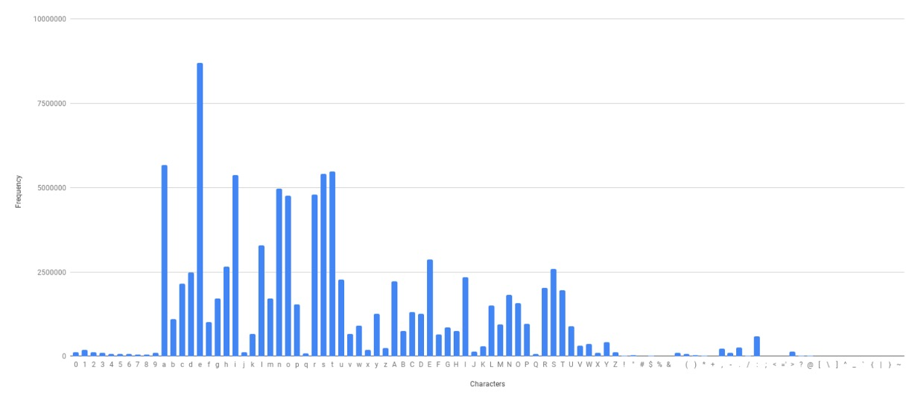

# [22.01] SAFL

## Focal Loss Can Help!

[**SAFL: A Self-Attention Scene Text Recognizer with Focal Loss**](https://arxiv.org/abs/2201.00132)

---

Transformers are increasingly common in Scene Text Recognition (STR) research. For researchers, it’s always a bit more exciting to experiment with new approaches, and this time, the authors decided to apply Focal Loss to see if it could improve model performance.

## Problem Definition

There are two commonly used methods for STR training.

The first is CTC Loss, where the model’s output is compared directly to the labels, calculating the difference between the two. CTC Loss allows for training without aligning the labels explicitly. Instead, the output sequence is provided, and the model learns alignment independently, ultimately yielding the final result.

The second method is CrossEntropy Loss. Models using this method typically require a decoder to align output and labels, often implemented with an LSTM or Transformer decoder.

Since we already have CrossEntropy Loss, exploring alternative loss functions is a natural next step. In object detection, Focal Loss has become popular, so why not give it a try here as well?

Thus, the authors proposed SAFL, an STR model that incorporates Focal Loss as the loss function.

## Solution

### Model Architecture

<figure style={{"width": "95%"}}>

</figure>

The architecture here is straightforward, largely comprising components we’ve seen in previous work.

The first module is an alignment network, which you can refer to here:

- [**[16.03] RARE: Automatic Alignment**](../1603-rare/index.md).

Next is a feature extraction network, followed by a Transformer architecture. For more information on this setup, see:

- [**[19.10] SATRN: Transformers Enter the Scene**](../1910-satrn/index.md).

Finally, the authors replaced CrossEntropy Loss with Focal Loss.

### Why Focal Loss?

<figure style={{"width": "90%"}}>

</figure>

The authors analyzed the vocabulary distribution in the training data and found that some words appear with much higher frequency than others. This kind of distribution can lead to CrossEntropy Loss underperforming, as it tends to be more sensitive to predictions of high-frequency words, while predictions for low-frequency words may be overlooked.

Focal Loss helps mitigate this issue. Its formula is as follows:

$$
\text{FL}(p_t) = -(1 - p_t)^\gamma \log(p_t)
$$

where $p_t$ represents the model’s predicted probability, and $\gamma$ is a hyperparameter, usually set to 2. The effect is that when $p_t$ is closer to 1, the loss value decreases, allowing the model to focus more on misclassified samples rather than those already correctly predicted.

We previously explored this concept, which you can review here:

- [**[17.08] RetinaNet: Focal Loss in Object Detection**](../../object-detection/1708-retinanet/index.md).

## Discussion

### Does Focal Loss Improve Performance?

<figure style={{"width": "80%"}}>

</figure>

As shown in the table above, the model trained with Focal Loss outperforms the one trained with CrossEntropy Loss across all datasets.

On average, Focal Loss increases accuracy by 2.3%. The most significant performance gap between the two variants occurs on the CUTE dataset, with Focal Loss leading by 4.8%.

## Conclusion

In this study, the authors developed SAFL, a scene text recognition deep learning model that combines self-attention mechanisms with Focal Loss.

The experimental results show that SAFL achieves the highest average accuracy on both regular and irregular datasets.

:::tip
If you're working on STR research, consider trying Focal Loss—it might just bring unexpected improvements!
:::
