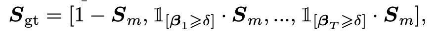
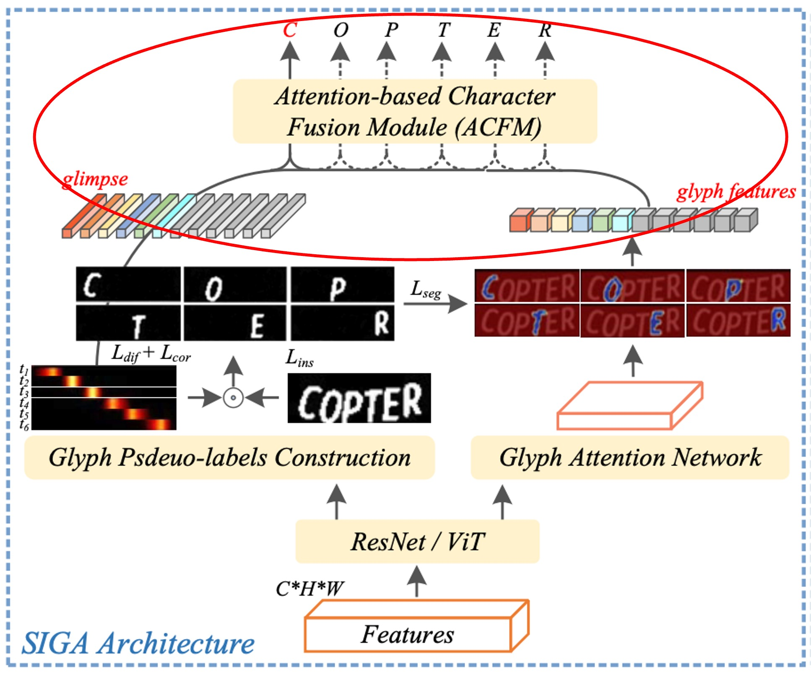

## Glyph Attention Mechanism

[**Self-supervised Implicit Glyph Attention for Text Recognition**](https://arxiv.org/abs/2203.03382)

---

While the integration of language models has become a mainstream approach in this field, some researchers continue to explore alternative methods to improve Scene Text Recognition (STR).

In this paper, the authors focus on studying “glyphs” and achieve promising results.

## Problem Definition

We have reviewed multiple papers on STR in the past.

Historically, attention mechanisms in this field have been categorized into two primary types:

1. **Implicit Attention**: This approach calculates attention weights across all positions in one-dimensional or two-dimensional space, based on sequence-level text annotations. However, it has a drawback: potential misalignment issues.
2. **Supervised Attention**: This method uses character bounding box annotations to generate character segmentation maps. Its drawback is the need for substantial character-level annotated data, which can be memory-intensive when dealing with a large number of character classes.

Neither method seems to be ideal, does it?

The authors decided to approach the problem from the perspective of “glyphs.” Each character has a unique glyph, and there are inherent patterns and relationships between these glyphs. Leveraging these patterns could potentially enhance text feature extraction.

Based on this idea, the authors proposed the "Self-Supervised Implicit Glyph Attention (SIGA)" mechanism. This approach generates glyph structures through self-supervised text segmentation and implicit attention alignment, refining the accuracy of attention during training.

In essence, among the two main approaches mentioned above, the authors chose the first—implicit attention—and further enhanced it with a self-supervised mechanism.

So, how exactly does this work? Let’s continue to explore.

## Solution

### Model Architecture

The diagram above illustrates the model architecture of SIGA.

The overall architecture appears somewhat complex, so let’s break it down into its main components for easier understanding.

### Backbone

This is perhaps the simplest part. In this section, either ResNet or Vision Transformer (ViT) can be used as a feature extractor.

Once the input image passes through the feature extractor, it generates a feature map, which is then fed into the subsequent branches of the model.

### Glyph Pseudo-Label Construction

<figure style={{"width": "80%"}}>

</figure>

This part, referred to as Glyph Pseudo-label Construction (GPC), is the core of SIGA.

The first step here involves self-supervised text segmentation, highlighted by the red box in the diagram.

The authors employ K-means clustering on the internal structure of the text image to directly obtain pseudo-labels for text masking, bypassing the need for time-consuming pixel-level annotation.

:::tip
**Could this affect accuracy?**

The authors note that slight structural variations do not impact the morphological structure of glyphs, so minor inaccuracies are not a concern.
:::

The clustering algorithm is configured to split the image into two classes: foreground and background. According to the authors' experiments, this method effectively clusters the morphological structures of glyphs in most text images.

Following this, the authors use a text segmentation network to extract foreground features from the self-supervised segmentation results.

Although not explicitly depicted in the diagram, the authors detail the implementation in the paper. Specifically, they define the outputs of Conv 0, Block 0, and Block 1 in the ResNet model as $P_0$, $P_1$, and $P_2$, respectively. A top-down pyramid structure is applied to integrate these features:

$$
\begin{cases}
O_2 = \phi(P_2), \\
O_1 = \phi([T(O_2, s_1), P_1]), \\
O_0 = \phi([T(O_1, s_0), P_0]),
\end{cases}
$$

where $\phi(\cdot)$ represents a two-layer convolution with Batch Normalization and ReLU activation, $T(\cdot)$ denotes a 2x upsampling operation on $O_k$, $s_k$ denotes its resolution (i.e., $H_k \times W_k$), and $[\cdot]$ indicates channel-wise concatenation.

:::tip
Based on this description, it appears to be a U-Net-like structure, integrating features through upsampling and concatenation.
:::

Finally, a binary convolutional layer is used to generate the text segmentation mask $S_m$ from $O_0$.

The authors optimize the text segmentation network by matching $S_m$ to the pseudo-label $S_{pl}$ using a binary cross-entropy loss $L_{ins}$, enabling it to recognize glyph morphological structures even in challenging text images.

The outcome resembles the following:

<figure style={{"width": "80%"}}>

</figure>

Here, (a) is the original image, (b) is the pseudo-label generated via clustering, and (c) is the prediction from the text segmentation network.

Notably, the segmentation network’s predictions occasionally surpass the pseudo-label in quality!

### Implicit Attention Alignment

<figure style={{"width": "80%"}}>

</figure>

We’re still looking at the same diagram, but focusing on a different section: attention alignment, indicated by the red box.

In the decoding unit, implicit attention weights $\alpha = \{\alpha_t\}_{t=1,...,T}$ are used to capture significant character dependencies in the encoded sequence.

However, the temporal information in the decoder can be "disturbed by other information" in subsequent decoding steps, causing an alignment drift issue.

To address this, the authors applied an "orthogonal constraint" to ensure that each attention weight vector in the implicit attention aligns accurately with a specific character position. This constraint ensures that attention weights for different characters do not interfere with each other, improving the accuracy of character position alignment.

The process for this method is as follows:

1. **Calculate Correlation Coefficient $S_{cor}$**:

   The authors computed the correlation coefficient for each pair of attention vectors $\alpha_t$ for different characters. By maintaining orthogonality (i.e., perpendicularity or zero correlation) between attention vectors for different characters, each vector $\alpha_t$ is focused solely on the character corresponding to its step, unaffected by the character positions of other steps.

   For instance, suppose we have an image containing three characters, resulting in three attention vectors $\alpha_1, \alpha_2, \alpha_3$. The orthogonal constraint ensures that $\alpha_1$ only focuses on the first character, $\alpha_2$ on the second, with a near-zero correlation between them, preventing overlap in their attention areas.

2. **Generate Character Saliency Maps $S_{sal}$**:

   Next, each attention vector $\alpha_t$ generates a corresponding character saliency map. Using a one-dimensional linear interpolation function $\xi$, each $\alpha_t$ distribution is mapped to fit the image width $W$, producing $\beta_t$. A nonlinear activation function $\sigma$ then maps $\beta_t$ to the range $[0,1]$, creating a more precise attention distribution corresponding to the character's location.

   For example, if we have an image with a width of 10 pixels, the attention vector $\alpha_t$ is transformed into $\beta_t$ by interpolation, generating positional weights that indicate where the character lies, such as between pixels 3 and 5, meaning the model considers the character to be located within this range.

3. **Optimize the Loss Function $L_{seq}$**:

   - **$L_{cor}$**: This loss reflects the correlation coefficient $S_{cor}$, minimizing $L_{cor}$ to keep attention vectors for different characters orthogonal and avoid alignment drift.
   - **$L_{dif}$**: This loss measures the difference between $S_m$ (the real character mask) and $S_{sal}$ (the generated character saliency map). Minimizing $L_{dif}$ enables the model to align generated character positions closely with the actual character positions.

   For instance, if the real mask for the second character covers pixels 5 through 8, the corresponding region in $S_{sal}$ should also overlap within this range. By minimizing $L_{dif}$, the model automatically adjusts attention to align generated character positions more accurately with real positions.

### Glyph Pseudo-Label Construction

<figure style={{"width": "80%"}}>

</figure>

As shown in the image above, the aligned attention weights $\beta_t$ are multiplied by the text segmentation mask $S_m$ to generate glyph features for each character. This operation maps the foreground areas (i.e., character shapes) in the segmentation mask to the glyph pseudo-label $S_{gt}$ based on each character's attention position.

Assuming $S_{gt}$ as the glyph pseudo-label, it is constructed through the following concatenation operation:

$$
S_{gt} = [1 - S_m, 1[\beta_1 > \delta] \cdot S_m, ..., 1[\beta_T > \delta] \cdot S_m]
$$

where:

- $1 - S_m$ denotes the background regions in $S_m$.
- $1[\beta_t > \delta] \cdot S_m$ selects the character's foreground region, identifying character positions based on each attention weight $\beta_t$ (keeping only values exceeding the threshold $\delta$).
- $[ \cdot ]$ represents channel-wise concatenation, so $S_{gt}$ contains multiple channels, each representing different character positions within the text.

:::tip
In the paper, this part of the equation is represented as `\mathbb{1}`, as shown below, but the notation here doesn’t support it, nor does switching to `\mathbbm{1}`. So we use `1` instead.

<figure style={{"width": "70%"}}>

</figure>

:::

In the experiments, the threshold $\delta$ was set to 0.05, meaning that any element in $\beta_t$ exceeding 0.05 is considered foreground and retained in $S_{gt}$. This design helps filter out low-confidence pixels, preserving high-confidence character regions and improving the accuracy of the pseudo-labels.

In the testing phase, the glyph pseudo-label construction module is removed, meaning that during testing, the model relies directly on trained weights for prediction without generating glyph pseudo-labels.

### Glyph Attention Network (GLAN)

<figure style={{"width": "80%"}}>

</figure>

The original term for this is Glyph Attention Network (GLAN).

Remember the mathematical expression we discussed earlier?

To recap, here it is:

:::info
Define the outputs of Conv 0, Block 0, and Block 1 in the ResNet model as $P_0$, $P_1$, and $P_2$, and apply a top-down pyramid structure to integrate the features:

$$
\begin{cases}
O_2 = \phi(P_2), \\
O_1 = \phi([T(O_2, s_1), P_1]), \\
O_0 = \phi([T(O_1, s_0), P_0]),
\end{cases}
$$

:::

The output $O_0$ was used in the previous section to construct the “glyph pseudo-label.”

Now, $O_1$ and $O_2$ will be used for the Glyph Attention Network (GLAN).

The glyph attention maps generated by GLAN have a fixed length and are channel-independent of character classes. Each specific channel corresponds to a particular order of glyph attention.

The approach here is to predict the glyph attention map $S_{gam}$ by applying several convolutional layers to features $O_k$. The channel count for $S_{gam}$ is set to $N_s = 1 + M$, where 1 represents the background class, and $M$ represents the maximum number of characters in a text image (e.g., set to 26).

:::tip
For example, if we are recognizing the GB2312 Chinese character set with 6,763 characters:

If we use convolutional layers with a feature channel count of 256, a supervised attention approach would require 1.7M parameters (256×6763), whereas this method only requires 6.9K (256×27).
:::

Next, the constructed glyph pseudo-label $S_{gt}$ is used as a supervisory signal. A combined loss function of multi-class Dice loss and cross-entropy loss is applied to improve the segmentation performance of the Glyph Attention Network.

The formulas are as follows:

$$
\begin{cases}
L_{dice} = \frac{1}{L} \sum_{j=2}^{L+1} \left( 1 - \frac{2 \sum_{i=1}^n (\omega_{j,i} \omega^*_{j,i})}{\sum_{i=1}^n \omega_{j,i} + \sum_{i=1}^n \omega^*_{j,i}} \right), \\
L_{cel} = -\frac{1}{n} \sum_{i=1}^n \left( \rho_i \log\left(\sum_{j=2}^{M+1} \omega^*_{j,i}\right) + (1 - \rho_i) \log\left(1 - \sum_{j=2}^{M+1} \omega^*_{j,i}\right) \right), \\
L_{seg} = L_{dice} + L_{cel},
\end{cases}
$$

where $\omega_{j,i}$ and $\omega^*_{j,i}$ are the confidence scores of pixel $p_i$ for the $j$-th channel in the glyph pseudo-label $S_{gt}$ and glyph attention map $S_{gam}$, respectively, and $\rho_i$ is the confidence score of pixel $p_i$ in $S_m$. $L$ represents the number of characters in the text image.

### Attention-based Character Fusion Module

<figure style={{"width": "60%"}}>

</figure>

This module, termed the Attention-based Character Fusion Module, is shown within the red box in the above figure.

As mentioned, in the decoding step $t$, the visually aligned "glimpse" $g_t$ and glyph feature $I_{k,t}$ represent two distinct character feature representations.

Since their contributions to Scene Text Recognition (STR) might vary across different text images, the authors dynamically fuse the sequential feature $I_{k,t}$ with $g_t$ to enrich the semantic information for character recognition. This dynamic adjustment of the weighting between $I_{k,t}$ and $g_t$ based on the characteristics of the current image allows the model to extract more useful information from both feature sources.

This design ensures that the model can flexibly combine visual and glyph features during character recognition, leading to more precise recognition results.

## Discussion

### Comparison with Other Methods

<figure style={{"width": "100%"}}>

</figure>

Language-independent text recognition methods mainly rely on visual information to recognize text.

:::info

- **SIGAR**: SIGA with a ResNet backbone
- **SIGAS**: SIGA with an SVTR backbone
- **SIGAT**: SIGA with a ViT backbone
  :::

The table above shows a comparison of SIGAR with existing language-independent models, evaluating them across different backbone types to fairly assess their performance on standard benchmark datasets.

- **CNN-based Methods**

  SIGAR demonstrates leading performance across seven benchmark datasets.

  Compared to supervised attention methods (e.g., CAFCN and TextScanner), SIGAR does not require additional character-level annotations and still achieves notable performance gains on these benchmarks, with improvements ranging from 2.0% to 11.8%.

  When compared to implicit attention methods, SIGAR also shows superior performance, surpassing the second-best results on benchmark datasets such as IIIT (0.3%), IC03-860 (0.7%), IC03-867 (0.8%), IC13-857 (0.6%), IC13-1015 (0.5%), and IC15-1811 (1.1%).

  The authors also implemented SVTR as the backbone network for STR, with results showing that SIGAS achieved higher accuracy on four out of six standard benchmarks, improving average accuracy by 0.63%.

- **Transformer-based Methods**

  SIGAT exhibits a significant advantage, setting new best results on benchmark datasets including IIIT, SVT, IC03-860, IC03-867, IC13-857, IC13-1015, and CT.

  These results indicate that introducing glyph attention enables SIGA to successfully extract more discriminative visual features, resulting in excellent performance on context-based benchmark datasets.

---

Language models can refine visual output through semantic inference, reducing prediction errors and enhancing overall recognition accuracy on context benchmarks.

As shown in the table above, when further compared to language-related models, SIGAR achieved competitive results on most standard benchmark datasets. Even without semantic inference, SIGAT achieved the best accuracy on six out of eight benchmarks.

SIGAT’s performance on the SVT, IC13-857, SP, and CT benchmarks improved by 1.5%, 0.4%, 1.2%, and 0.9%, respectively. This indicates that even a purely visual model can perform well on context benchmarks.

### Visualization Analysis

<figure style={{"width": "85%"}}>

</figure>

In the figure above, images in (a) and (b) are generated by the representative implicit attention method ABINet and by SIGA, respectively.

SIGA’s approach can perceive intricate glyph structure details, especially when the glyphs in the text image are very blurry (as in the fifth set). SIGA can even degrade gracefully to a similar attention form as other STR models.

:::tip
We’ve previously covered ABINet. For those who haven’t seen it, refer to our previous article:

- [**[21.03] ABINet: Thinking more!**](../2103-abinet/index.md)
  :::

## Conclusion

This paper is one of the first in the STR field to delve into the impact of glyph structure on text recognition, offering a new perspective for attention-based text recognition models.

By combining self-supervised text segmentation and implicit attention alignment, SIGA automatically generates glyph pseudo-labels as attention supervision for the model. This approach overcomes the traditional reliance on character-level annotations, significantly improving the precision of glyph structure alignment and focus. This advancement could encourage future research to consider more visual details of text to enhance model recognition capabilities.

:::tip
One limitation of this architecture is the large number of hyperparameters!

The paper dedicates a significant section to finding the optimal hyperparameters, but we believe its main contribution is exploring the “glyph” concept, so we’ve left out some of the experimental details.

Interested readers can explore the original paper, which contains many fascinating experimental results.
:::
