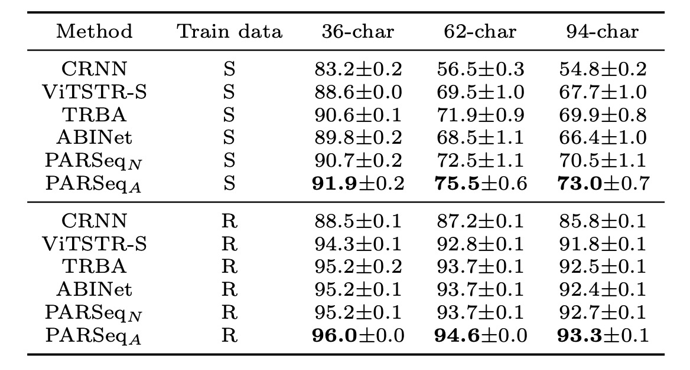

## Wrod oerdr dseon't mteartr for redaing

[**Scene Text Recognition with Permuted Autoregressive Sequence Models**](https://arxiv.org/abs/2207.06966)

---

You might have noticed that the subtitle’s text is scrambled.

Or… maybe you didn’t notice at all.

## Defining the Problem

Research into word order manipulation has been actively explored in recent years.

One of the more well-known studies is XLNet, which employs a two-stream attention mechanism that trains the model by permuting word order. While XLNet was an earlier approach, subsequent Scene Text Recognition (STR) research has also utilized similar methods. For example, ABINet’s decoder branch trains its language model by applying randomized masks during training.

:::tip
If you haven’t read these papers, you might want to check out our previous articles:

- [**[19.06] XLNet: Two-Stream Attention Mechanism**](../../transformers/1906-xlnet/index.md)
- [**[21.03] ABINet: Thinking more!**](../2103-abinet/index.md)
  :::

If you’d prefer a quick refresher, here’s a summary:

The concept behind the two-stream attention mechanism has a few key ideas. First, it uses “self-masking,” similar to Masked Language Modeling (MLM), where words are masked, and the model learns to predict them. The difference is that while MLM uses a special token to represent masked words, the two-stream mechanism retains positional information but masks semantic information. This enables the model to focus on predicting the final output based on meaning.

The second key idea is “permutation.” By scrambling the word order, the model is prevented from merely memorizing word positions instead of learning semantics. The scrambled word order forces the model to focus on semantic prediction rather than positional memory.

The authors of this paper build on these ideas to design a new STR model. “PAR” in PARSeq stands for “Permuted Autoregressive,” which highlights the idea of “permutation” in autoregressive modeling to boost performance.

If the summary above makes sense, you’ve basically understood this paper.

## Solving the Problem

### Model Architecture

<figure style={{"width": "85%"}}>

</figure>

The model architecture may seem complex at first glance, so let’s break it down step by step:

### Encoder Design

<figure style={{"width": "60%"}}>

</figure>

If you’re familiar with the Vision Transformer (ViT) paper, this part should be straightforward.

First, let’s look at the “ViT Encoder” in the diagram above. This component converts images into tokens, then extracts features using the Transformer’s encoder.

For an image $x \in \mathbb{R}^{W \times H \times C}$ (width $W$, height $H$, and channels $C$), it’s divided into $p_w \times p_h$ patches, each flattened and then embedded into $d_{model}$-dimensional tokens. Finally, positional embeddings are added to these tokens.

All output tokens from the ViT serve as inputs to the decoder, represented by $\mathbf{z} = Enc(\mathbf{x}) \in \mathbb{R}^{\frac{WH}{p_w p_h} \times d_{model}}$.

Once the image features have been processed by the encoder, they proceed to the next stage, the cross-attention decoder, highlighted in green above. After passing through the MLP in the output layer, the model generates its final predictions.

:::info
In this architecture, the encoder consists of 12 layers, while the decoder has only 1 layer. Based on the authors' experiments, a single-layer decoder is sufficient for optimal performance.
:::

:::tip
Not familiar with ViT?

You can refer to our article here: [**[20.10] ViT: Pioneering a New World**](../../vision-transformers/2010-vit/index.md)
:::

### Decoder Design

<figure style={{"width": "85%"}}>

</figure>

As shown above, to generate output via the decoder, we start with a set of special tokens that represent the “positions,” indicating where the decoder will produce outputs.

If we mask certain parts, we see a basic decoder structure. At this point, the model’s architecture appears fairly standard, similar to previous STR models we’ve seen.

So, how do we integrate a language model into this structure?

### Review

<figure style={{"width": "85%"}}>

</figure>

As shown above, in ABINet, the output from the vision branch is passed to the language model for "correction," producing the output of the language branch. Finally, features from both branches are combined to yield the final result.

In this paper, the authors modified this structure by embedding the language model within the initialization phase of the decoder in PARSeq’s approach.

### Permutation Language Modeling

<figure style={{"width": "80%"}}>

</figure>

The core concept of PARSeq is **Permutation Language Modeling (PLM)**.

Before “Positional Tokens” actually query the image information, they first go through a PLM process where the word order is shuffled, and predictions are made through the Transformer’s decoder.

The essence of PLM lies in training the model across all possible permutations. For a sequence with $ T $ elements, there are $ T! $ possible permutations. The PLM objective function is given by:

$$
\log p(\mathbf{y} | \mathbf{x}) = \mathbb{E}_{\mathbf{z} \sim \mathcal{Z}_T} \left[ \sum_{t=1}^T \log p_{\theta} (y_{z_t} | \mathbf{y}_{\mathbf{z}_{<t}}, \mathbf{x}) \right]
$$

Implementing PLM in Transformers does not require physically rearranging the label sequence $ y $. Instead, it’s achieved by adjusting the attention mask, as shown in the table below:

<figure style={{"width": "85%"}}>

</figure>

To mitigate the exponential growth in computation with $ T! $ permutations, PLM samples only $ K $ permutations, including the left-to-right ordering $[1, 2, \dots, T]$ and $ K/2 - 1 $ random permutations.

:::tip
In this design, you might notice that standard autoregressive (AR) training is simply a special case of PLM, where only one order $[1, 2, \dots, T]$ is used.

This is a classic example of “making others’ ideas a subset of mine, thereby strengthening my own design”!
:::

### Decoding Methods

PLM training, combined with proper parameterization, enables PARSeq to support multiple decoding methods.

The authors focus primarily on two contrasting decoding methods: **Autoregressive (AR)** and **Non-autoregressive (NAR)** decoding, as well as a technique called **Iterative Refinement**.

<figure style={{"width": "85%"}}>

</figure>

1. **Table (a): Autoregressive (AR) Decoding**

   - AR decoding generates one new token per iteration.
   - A left-to-right attention mask is applied.
   - In the first iteration, the context is set to the start token $[B]$, using only the first positional query token $ p_1 $.
   - For the $ i $-th iteration, the position queries $[p_1, \dots, p_i]$ are used, and the context is set to the previous output (using the argmax value) prepended with the start token $[B]$.

2. **Table (b): Non-autoregressive (NAR) Decoding**

   - NAR decoding generates all output tokens simultaneously.
   - All positional queries $[p_1, \dots, p_{T+1}]$ are used without an attention mask.
   - The context is always the start token $[B]$.

3. **Table (c): Iterative Refinement**
   - Iterative refinement can be performed regardless of whether AR or NAR decoding is used initially. Each iteration uses the previous output (truncated at the end token $[E]$) as the current context, similar to AR decoding.
   - All positional queries $[p_1, \dots, p_{T+1}]$ are used, with a cloze-style mask applied.
   - The cloze mask begins as an all-ones mask, then masks out positions of correctly generated tokens, allowing subsequent iterations to focus on tokens that were not generated correctly.

### Loss Function

The loss is computed only on the final output, meaning the final predicted result. When using $K$ permutations, the loss function is the average of the cross-entropy loss for each permutation:

$$
\mathcal{L} = \frac{1}{K} \sum_{k=1}^K{\mathcal{L}_{ce}(\mathbf{y}_k, \hat{\mathbf{y}})}
$$

During training, padding tokens are ignored. Although the order of words may vary due to permutation, the final output must consistently match the expected result.

### Experimental Setup

All models are trained on a dual-GPU setup with mixed precision in a PyTorch Distributed Data Parallel (DDP) environment, with a total of 169,680 iterations and a batch size of 384.

The learning rate varies per model. The Adam optimizer is used along with a 1-cycle learning rate scheduler. At iteration 127,260 (75% of the total), Stochastic Weight Averaging (SWA) is applied, replacing the 1-cycle scheduler with the SWA scheduler. Validation is performed every 1,000 steps, and the final checkpoint is selected based on the averaged weights.

- **Model Configuration**: For PARSeq, $K = 6$ permutations are used. Both PARSeq and ViTSTR use an image patch size of 8×4.
- **Label Preprocessing**: Following prior research, the maximum label length is set to $T = 25$, and the charset size $S = 94$ includes uppercase and lowercase letters, numbers, and punctuation marks.
- **Image Preprocessing**: Images are first augmented, resized, and then normalized to the range $[-1, 1]$. Augmentation operations primarily consist of RandAugment (excluding Sharpness), with the addition of Invert to improve recognition of house number data, as well as GaussianBlur and PoissonNoise for STR data augmentation. The augmentation strategy uses 3 layers with a magnitude of 5. All images are resized to 128×32 pixels.

## Discussion

### Analysis of Training Permutations

<figure style={{"width": "80%"}}>

</figure>

Due to the exponential increase in computational demand, training on all possible permutations is infeasible. Instead, the authors randomly selected a subset of permutations. The table above shows the effect of different numbers of training permutations $K$ on test accuracy across various decoding schemes.

- **Single Permutation Training ($K = 1$)**:

  With $K = 1$, only the left-to-right order is used, simplifying the training to standard autoregressive (AR) modeling. In this setup, non-autoregressive (NAR) decoding does not work, while AR decoding performs as expected. Here, the refinement (or cloze) decoding accuracy is only 71.14%, which is relatively low, even considering that the initial prediction uses the ground truth labels.

- **Multiple Permutation Training ($K \geq 6$)**:

  When $K \geq 6$, all decoding schemes achieve satisfactory performance, indicating that PLM is indeed essential for a unified STR model. Intuitively, NAR decoding cannot function effectively with only one or two orders (forward and/or reverse, $K \leq 2$) because the training context lacks sufficient variety. NAR decoding relies on prior knowledge for each character, which can only be adequately learned if all characters in the charset naturally appear as the first character in sequences.

- **Optimal Balance ($K = 6$)**:

  Using $K = 6$ achieves the best balance between decoding accuracy and training time. The high cloze accuracy of the internal language model (approximately 94%) demonstrates the advantage of combining image features with language context for prediction refinement. After all, the primary input signal in STR comes from the image rather than language context alone.

### Comparison with Existing Methods

<figure style={{"width": "85%"}}>

</figure>

The authors compared PARSeq with well-known and recent SOTA methods and reproduced several models for a fair comparison. In most cases, the reproduced models achieved higher accuracy than originally reported. An exception was ABINet, where the reproduced accuracy dropped by about 1.4%, likely due to ABINet’s extended training schedule (80 epochs for the language model and 8 for the vision model) and additional datasets (WikiText-103).

Regarding accuracy, PARSeqA achieved the highest word accuracy across synthetic and real data training, with PARSeqN consistently placing second or third. When trained on real data, all reproduced models achieved much higher accuracy than the original results, with PARSeqA setting new SOTA records.

---

The accuracy across different charset sizes is shown below:

<figure style={{"width": "80%"}}>

</figure>

The average accuracy for different charsets shows a sharp decline from 36 to 62 and 94 charset sizes when trained on synthetic data, suggesting a lack of diversity in uppercase and lowercase characters in synthetic datasets. PARSeqA consistently achieved the highest accuracy across all charset sizes.

## Conclusion

By introducing the concept of PLM, PARSeq integrates the language model into the STR framework and enhances performance through multi-permutation training. This approach achieves SOTA results across key STR metrics and performs optimally across different charset sizes.

The appeal of language models is undeniable, and as we integrate the latest NLP techniques into other domains, we may find even more exciting breakthroughs.
