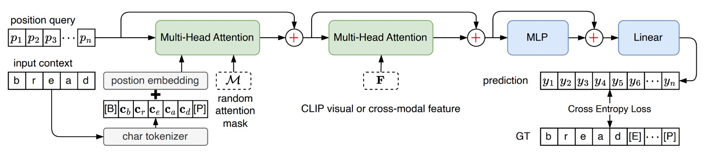
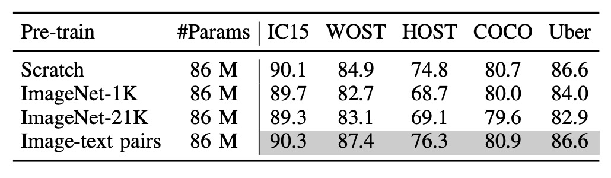

## The Blessing of Multimodality

[**CLIP4STR: A Simple Baseline for Scene Text Recognition with Pre-trained Vision-Language Model**](https://arxiv.org/abs/2305.14014)

---

Contrastive learning has swept across various fields.

Following contrastive learning, multimodal learning has become a major focus in recent years, giving rise to a new term:

- **VLM, Vision-Language Models.**

In the industry, almost everyone—regardless of age or background—can confidently chant: VLM!

With all the hype, it’s only natural for researchers in the field of text recognition to join the action, right?

## Defining the Problem

Scene Text Recognition (STR) faces challenges when dealing with text that is rotated, curved, blurred, or occluded. Despite decades of work, STR’s performance on these challenging cases remains less than ideal.

It’s time to shake things up.

Since CLIP was introduced in 2021, its powerful cross-modal learning capabilities have made it a hot topic. CLIP’s ability to perceive and interpret various text forms in natural images holds promise as a potential solution for STR.

Wait a second—what exactly is CLIP?

Why the sudden shift in style?

:::tip
We’ve already explored CLIP, so readers unfamiliar with it might want to check out our previous article:

- [**[21.03] CLIP: Breaking the Dimensional Barrier**](../../multimodality/2103-clip/index.md)
  :::

## CLIP

We know you might not feel like diving into the details, so here’s a brief overview of CLIP.

Below is the architecture of CLIP:

Imagine we have a set of image-text pairs, where one pair could be a picture of a dog and the caption “a cute little dog.”

In each training batch, CLIP processes multiple such pairs. The image encoder, possibly a ResNet or ViT, processes the images to obtain image features, while the text encoder, typically a Transformer, processes the text to obtain text features.

The model then compares these features to ensure that the cosine similarity between correctly matched images and text (e.g., a dog image and “a cute little dog”) is maximized, while the cosine similarity between mismatched pairs (e.g., a dog image and the text “an apple”) is minimized.

It’s a straightforward architecture!

Finally, stack 400 million image-text pairs, and start training!

### So, What Does This Mean?

What’s the significance here?

Once trained, we can search for images using natural language directly, or conversely, provide an image and let the model generate a corresponding description. If images containing text, such as those in STR tasks, are present in this massive training set, then CLIP’s architecture might establish associations between the appearance of text images and the meaning of the text.

- **Is there a link between text images and the text itself? That’s precisely what STR aims to resolve!**

Additionally, CLIP’s training data comes from real-world scenarios, meaning the features it produces can interpret the world from a broader perspective, unrestricted by the traditional STR training data. This can significantly enhance STR’s performance.

Most notably, for distorted, skewed, or heavily occluded text, CLIP’s data includes “unimaginable” varieties, so it may be able to detect these text features.

:::tip
**What does “unimaginable” mean?**

You might not feel the impact of “400 million” image-text pairs, so let’s put it in perspective: early STR datasets, such as SynthText, had around 800,000 image-text pairs. Union14M, proposed recently, is currently the largest STR dataset, with 14 million pairs—17 times the size of SynthText.

CLIP’s training dataset is 30 times the size of Union14M and 500 times that of SynthText.

If you viewed one image per second, it would take you about 12 continuous years to go through the entire dataset.

:::

### Zero-Shot Testing

To validate this concept, the authors conducted zero-shot testing on CLIP.

They wanted to assess CLIP’s “understanding” of text. In the image below, the leftmost column shows the input text, the middle column shows attention visualization results, and the rightmost column shows the text output:

<figure style={{"width": "60%"}}>

</figure>

To our surprise, CLIP can recognize text!

Moreover, when faced with occluded text, as shown in the example with `+occluded` above, CLIP automatically considers the relationship between the text and the background, resulting in an output that splits the probability between “cat” and “horse.”

## Problem Solving

Since CLIP already has a certain degree of text understanding, our goal now is to "guide" it, focusing its capabilities on the STR task.

:::tip
Unless we have sufficient computing power or an extremely large dataset, we usually avoid fine-tuning CLIP's parameters, as doing so could disrupt its multimodal learning capabilities.

Generally, we freeze CLIP’s parameters and stack a small, task-specific network on top to tackle our particular problem.
:::

### Model Architecture

Assuming you’re already familiar with CLIP, let’s dive straight into this architecture.

---

CLIP has two branches: a text branch and an image branch.

In the CLIP4STR architecture, the image is first fed into the "CLIP image branch" to obtain image features. These features are then passed into a custom “image decoder” to process the features and generate an initial text prediction.

As shown above, when an image is input, the model might first output something like "briiad." Since this output may be incorrect, it is then fed into the "CLIP text branch" to extract text features.

Finally, the text and image features are concatenated and fed into a custom "cross-modal decoder" to refine and produce the final text prediction.

In this setup, the "CLIP text branch" is frozen, meaning it is not trained further. Additionally, when concatenating the text and image features, gradients do not propagate back to the image branch, ensuring the image branch remains unaffected by the text branch.

Here, the primary role of the "CLIP text branch" functions more like a "spell checker" rather than a text generator.

:::tip
The spell-checking concept here draws from ABINet. Readers interested in more details can refer to:

- [**[21.03] ABINet: Thinking more!**](../2103-abinet/index.md)
  :::

### Text Decoder

Remember the "cross-modal decoder" module we mentioned earlier?

This module directly adopts the decoder structure from PARSeq. The difference is that, in PARSeq, the target for the second cross-attention layer comes from the output image features. In CLIP4STR, however, this target is the concatenated output features from both the "CLIP text branch" and the "CLIP image branch."

:::tip
If you’re unfamiliar with PARSeq, feel free to check out our previous article:

- [**[22.07] PARSeq: Wrod oerdr dseon't mteartr for redaing**](../2207-parseq/index.md)
  :::

## Discussion

### Comparison with Other Methods

The table above shows CLIP4STR’s performance across 11 STR benchmark datasets. Compared to other state-of-the-art (SOTA) methods, CLIP4STR achieves the latest SOTA results on 9 of these benchmark datasets.

### Basic Ablation Study

<figure style={{"width": "70%"}}>

</figure>

The study begins with a baseline model that only includes a ViT-S encoder for the visual branch, with no pre-training.

1. Introducing PSM (Permuted Sequence Modeling) and following PARSeq’s training recipe brings a 0.7% accuracy improvement.
2. Replacing the encoder with CLIP’s image encoder ViT-B/16 shows no significant improvement, indicating a need for further adaptation.
3. Adjusting training parameters by setting the patch size to 16×16, using a smaller learning rate for the encoder, a larger one for the decoder, and reducing training epochs to 16 rounds.

At this point, the model has already surpassed previous SOTA performance.

4. Adding a cross-modal branch further boosts the average accuracy by 0.4% across 9 benchmark datasets, demonstrating its effectiveness.
5. Introducing a larger model, ViT-L/14, yields an additional 0.7% improvement in accuracy.

The CLIP-ViT-L/14 converges faster on STR than CLIP-ViT-B/16, requiring only 10 training epochs.

### How Should We Freeze CLIP?

<figure style={{"width": "80%"}}>

<figurecaption>#Params represents the number of trainable parameters, while `token` indicates the use of pre-trained token embeddings only. The top half shows the frozen text branch, and the bottom half shows the frozen image branch.</figurecaption>
</figure>

---

Common freezing strategies include:

1. **Freezing the CLIP text branch**: Freezing half of the layers, a standard practice for adapting large language models to new tasks.
2. **Freezing the CLIP image branch**: This makes the image branch untrainable, which could impact final performance.

The authors conducted a series of experiments, showing that freezing the language model has minimal impact on performance, while freezing the image model significantly affects performance.

Even with the pre-trained token embeddings of the CLIP text encoder fixed, the system can still achieve good results, indicating that semantic understanding in STR is relatively straightforward, focusing mainly on words and phrases rather than complex language.

Freezing the image model, however, has a more substantial impact, possibly due to the domain gap between STR data and CLIP’s pre-trained data. CLIP’s pre-training primarily uses natural images, whereas STR data consists of cropped text images. Thus, a fully trainable image encoder is necessary in CLIP4STR to bridge this gap.

### Is Multimodality Really Useful?

<figure style={{"width": "80%"}}>

</figure>

To verify whether multimodal pre-training truly benefits STR, the authors re-trained the “image branch.”

Three different image encoders were tested:

- **Randomly Initialized ViT**: No pre-training.
- **ImageNet-1K Pre-trained ViT**: Pre-trained on ImageNet-1K.
- **ImageNet-21K Pre-trained ViT**: Pre-trained on ImageNet-21K.

The table above shows that models pre-trained on image-text pairs perform best, followed by models trained from scratch.

:::tip
This aligns with findings from PARSeq, where pre-trained models did not perform as well in STR tasks!
:::

### Can We Use PEFT?

<figure style={{"width": "40%"}}>

</figure>

Aside from full fine-tuning, parameter-efficient fine-tuning (PEFT) methods for large pre-trained models are becoming increasingly popular. For example, CoOp trains only learnable prefix prompts, while CLIP-Adapter adds tunable linear layers on top of a frozen VLM.

Given the success of PEFT methods in some tasks, the authors applied two PEFT methods to STR in this study:

1. **CLIP-Adapter**: Adds two linear layers on top of the frozen CLIP model, with a residual addition ratio of $\lambda = 0.2$.
2. **LST (Ladder Side-Tuning)**: Uses a ladder side network with the frozen CLIP model, where features are downsampled, then upsampled to match the original feature dimensions.

The results show that CLIP-Adapter outperforms the frozen model but does not reach the performance of a fully fine-tuned model. In contrast, LST yields a more significant improvement in accuracy, although it still lags behind the fully fine-tuned model.

When training resources are limited, LST serves as a viable alternative.

:::tip
For further reading on LLM tuning, we’ve reviewed a few papers previously, which readers might find useful:

- [**[19.02] Adapter: Saving 96% of Parameters**](../../model-tuning/1902-adapter/index.md)
- [**[21.01] Prefix-Tuning: Is it the Same or Different?**](../../model-tuning/2101-prefix-tuning/index.md)
  :::

## Conclusion

Multimodal model architectures have achieved tremendous success across a variety of tasks in recent years. This study demonstrates the effectiveness of CLIP in the STR domain, achieving SOTA performance.

The path forward is not an endpoint; rather, it’s time for a new turn.
