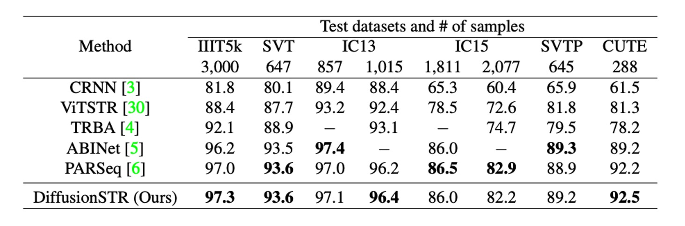
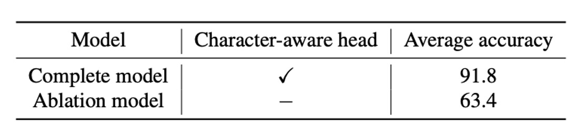

## Text Signals Amidst Noise

[**DiffusionSTR: Diffusion Model for Scene Text Recognition**](https://arxiv.org/abs/2306.16707)

---

Sometimes, the logic of research is simple: you spot a promising technique in another field, try applying it to your own problem, and perhaps you've got yourself a new paper.

## Problem Definition

Diffusion models have been a hot topic for several years, primarily in the field of image generation. But why not take this fresh approach and apply it to text recognition?

## Solution

### Model Architecture

We’ll assume you’re already well-versed in diffusion models, so let’s jump right into how the authors of this paper used it as a foundation for text recognition.

The architecture is quite simple. First, an image is encoded using a Vision Transformer (ViT), extracting visual feature representations. A sequence filled with noise, $x_T$, is fed into a Transformer, which iteratively refines this noisy sequence into $x_{T-1}$, repeating this process $T$ times, until the final output sequence, $x_0$, is obtained.

In the last step, $x_0$ is passed through a feedforward neural network (FFN) to produce the recognized text sequence, and a character-aware head predicts the location of characters within the sequence.

The diffusion model follows a two-stage process:

- **Forward Process**: Adds noise step by step to the data point $x_0$ until it becomes pure Gaussian noise, $x_T$.
- **Reverse Process**: Gradually denoises this noisy signal to reconstruct the original data $x_0$.

The authors employed a multi-step diffusion model to handle discrete variables like characters. They also incorporated special tokens such as [EOS] (end of sequence), [PAD] (padding), and [MASK] (noise).

The training process uses a simplified loss function $L_{\text{simple}}$, relying on mean squared error (MSE) for stable training. Interestingly, no language model was used in this architecture, as the authors believed language models would add unnecessary complexity, potentially obscuring the performance of the diffusion model.

### Transformer Architecture

The authors leveraged a Transformer decoder with time-position encoding to transform sequences in the diffusion model.

Key differences from traditional Transformers include:

1. Introducing visual features $z$ to conditionally process the text sequence through a cross-attention mechanism.
2. Predicting all character probabilities simultaneously rather than one at a time (non-autoregressive).
3. The output has dual purposes: being converted into a text sequence via FFN and fed into a character-aware head for predicting whether each character position contains a real character.

During training, a random timestep $t$ is sampled, and using a noise schedule $\alpha_t, \alpha_{\bar{t}}$, the model computes the noisy sequence $x_t$. The decoder then operates as $x_{t-1} = \text{Dec}(x_t, z, t)$ to calculate the loss.

For inference, the process begins with a fully masked (noisy) sequence $x_T$, and over $T$ iterations, conditioned on the visual features $z$ generated by the visual encoder, the model eventually outputs $x_0$. This final output is passed through FFN to produce the recognized text sequence.

The authors also introduced a character-aware head to classify whether positions in the fixed-length sequence correspond to real characters. This binary classification task uses a binary cross-entropy loss function.

## Discussion

### Comparison with Other Methods

The table above shows a comparison of DiffusionSTR with other recent methods on the MJ and ST datasets.

DiffusionSTR performs well across multiple datasets and is competitive with the latest state-of-the-art methods.

For instance, ABINet and PARSeq use strong language models, while TRBA adopts an image correction module as a preprocessing step. Despite its simpler architecture without these additional techniques, DiffusionSTR achieves similar levels of accuracy.

### Advantages of Diffusion Models

<figure style={{"width": "70%"}}>

</figure>

The experiments reveal that DiffusionSTR offers several advantages:

1. **Less sensitive to noise**: It excels in handling noisy images.
2. **Robustness to blurred images**: It performs well even with blurred images.

### Impact of Character-Aware Head

The results demonstrate the significant impact of the character-aware head on accuracy. Without predicting character locations, accuracy drops dramatically.

### Effect of Diffusion Steps

This table shows how the total number of diffusion steps affects accuracy. The results confirm that as the number of steps increases, accuracy improves. Beyond 1,000 steps, accuracy gains begin to plateau.

## Conclusion

This paper presents a novel method of progressively refining noisy text sequences conditioned on visual information. Unlike existing methods, this approach proves highly effective, even matching state-of-the-art performance on benchmark datasets.

This innovative application of diffusion models opens up new possibilities in text recognition research.

:::tip
Interestingly, the paper does not mention inference time. Since diffusion models involve iterative processes, it's likely that this model runs relatively slowly.
:::
