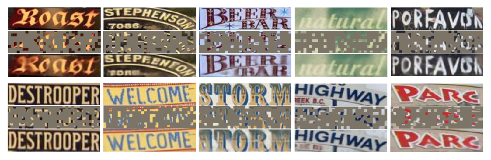

# [23.07] Union14M

## Chess Pieces Falling Like Stars

[**Revisiting Scene Text Recognition: A Data Perspective**](https://arxiv.org/abs/2307.08723)

---

We’ve explored dozens of papers on scene text recognition (STR), and the validation datasets in use tend to revolve around the same few: ICDAR, IIIT5K, SVT, SVTP, and CUTE80.

Truth be told, performance on these datasets is already near saturation.

## Defining the Problem

As shown above, this graph represents the average performance across six widely-used STR datasets.

Starting with familiar models like CRNN, advancing through SAR, SATRN, and ABINet, the field achieved more than **92% accuracy by 2022.** However, progress has since plateaued, leaving little room for further improvements.

Does this imply that STR is a **“solved” problem**? Or is it possible that the validation datasets we rely on are too limited, preventing us from exposing deeper challenges within the field?

If existing benchmarks cannot help us move forward, perhaps it’s time to overturn the chessboard—upending the status quo to create new possibilities. And with the pieces now falling freely, it’s time to reassemble them into something entirely new.

## Problem Solution

Since current datasets no longer capture the full scope of real-world challenges in STR, the authors propose **Union14M**, a large-scale, unified dataset.

Union14M brings together **4 million labeled images (Union14M-L)** and **10 million unlabeled images (Union14M-U)**, consolidated from **17 publicly available datasets.** The structure is shown below:

<figure style={{"width": "80%"}}>

</figure>

By aggregating existing datasets and categorizing diverse challenges, Union14M aims to better represent the variability of real-world text, offering new insights into the limitations of current STR models and pushing the field forward.

### Union14M-L

Union14M-L consists of 4 million labeled images gathered from **14 public datasets** with the goal of representing diverse real-world scenarios. Some of these datasets include:

- **ArT**: Focuses on curved text images.
- **ReCTS, RCTW, LSVT, KAIST, NEOCR, and IIIT-ILST**: Provide street-view text from various countries.
- **MTWI**: Extracts text images from web pages.
- **COCOTextV2**: Includes low-resolution and vertical text images.
- **IntelOCR, TextOCR, and HierText**: Collected from OpenImages, covering around 9 million images of various real-world scenarios.

Simply merging these datasets, however, would not suffice. Challenges such as inconsistent annotations, duplicate samples, non-Latin characters, or corrupted images must be addressed. The authors applied several optimization strategies to ensure high-quality consolidation:

- **Cropping Text Instances**: Instead of using polygon annotations, the authors applied **minimum rotated rectangles** to crop text regions. This method introduces more background noise, making the model more robust against distractions and reducing dependency on precise detectors. This setup also helps analyze the pure recognition performance of models.

- **Removing Duplicates**: To eliminate redundancy, the authors first filtered out overlaps between Union14M-L and other common benchmarks. They also removed duplicate samples within the 14 datasets. For example, **HierText, TextOCR, and IntelOCR** overlap, as they all derive from OpenImages. The authors kept HierText as the main reference, removing the redundant samples from the other two datasets.

- **Excluding Non-Latin Characters and Ignored Samples**: To focus on Latin-based text, only samples containing letters, numbers, or symbols were kept, while images marked as "ignored" were excluded.

### Union14M-U

Union14M-U comprises **10 million unlabeled images**, leveraging self-supervised learning—a growing trend in computer vision and STR. Since manually labeling text images is both time-consuming and requires linguistic expertise, the authors explored how unlabeled data can enhance STR models.

They sourced these unlabeled images from **Book32, OpenImages, and Conceptual Captions (CC)**. To select high-quality text instances, the authors employed **three different text detectors** and adopted an **IoU voting mechanism** to ensure consistency. Additionally, they removed duplicate samples from OpenImages to avoid redundancy with the labeled portion of Union14M.

### Diverse Text Styles

<figure style={{"width": "80%"}}>

</figure>

As depicted in the above image, Union14M includes a wide variety of text styles. These styles range from **curved, slanted, and vertical text** to challenging scenarios with **blur, complex backgrounds, and occlusion.** The dataset also captures text from diverse real-world environments, such as **street signs and brand logos.**

One important aspect is the large presence of **vertical text**, which is quite common in real-world scenarios but often underrepresented in synthetic datasets.

### Rich Vocabulary

<figure style={{"width": "80%"}}>

</figure>

The vocabulary used in synthetic datasets is often derived from common corpora, but real-world text can vary significantly, including combinations not typically found in standard datasets—such as **license plate numbers** or **mixed Chinese-English pinyin.** As shown above, the vocabulary size of Union14M-L is nearly double that of synthetic datasets, providing a richer and more representative collection of real-world scenarios.

This expanded vocabulary enhances the depth and breadth of analysis available for STR models.

### Model Architecture

<figure style={{"width": "80%"}}>

</figure>

After constructing the Union14M dataset, the authors proposed a **self-supervised learning-based solution: MAERec**.

This model takes advantage of **self-supervised pretraining** to leverage the **10 million unlabeled images** from Union14M-U.

The core of MAERec is based on **Vision Transformers (ViT)**, which excel at **masked image modeling**.

- [**[21.11] MAE: A Quarter of the Clue**](../../vision-transformers/2111-mae/index.md)

The input image is divided into **4 × 4 image patches** and passed through the **ViT backbone network**. The output sequence is then processed by an **autoregressive decoder** (using the **Transformer decoder** from SATRN) to generate the final text prediction.

- [**[19.10] SATRN: Transformer Reaches the Battlefield**](../1910-satrn/index.md)

To ensure fair comparisons, the **number of character classes** is standardized to **91 classes** (including numbers, uppercase and lowercase letters, symbols, and spaces), while other hyperparameters remain consistent with the original model configurations.

### Pretraining and Fine-Tuning

<figure style={{"width": "85%"}}>

</figure>

To fully utilize the large number of unlabeled images from Union14M-U, the authors adopted the **MAE framework** for pretraining, with some modifications.

As shown above, **even with a 75% masking ratio**, the **ViT backbone** can still generate high-quality reconstructed text images. This demonstrates that **MAERec** effectively learns both the structural and semantic representations of text, capturing useful features even from highly incomplete images.

After pretraining, the pretrained ViT weights are used to **initialize MAERec**, followed by **fine-tuning on Union14M-L**.

## Discussion

### The Harsh Reality

<figure style={{"width": "80%"}}>

</figure>

The authors evaluated **13 representative STR models**, all trained on synthetic datasets, and tested them on Union14M-L. As shown in the table above, these models **suffered a significant performance drop** on Union14M-L, with the average accuracy falling by:

- **20.50%!**

:::tip
Who still dares to claim that STR is a solved problem?
:::

### Uncovering the Challenges

To identify the types of errors common to these 13 models, the authors assigned a **difficulty score** to each sample in Union14M-L, focusing on those that most models failed to recognize correctly. From these, they identified **four unresolved challenges** and **three additional real-world scenarios** that have been underexplored in previous research.

- **Curve Text**

  As shown in image (a), recognizing **curved text** has been a focus in recent years, with two main approaches:

  1. **Correction-based models**
  2. **Models leveraging 2D attention mechanisms**

  While these methods have performed well on datasets like **CUTE**, the proportion of curved text in these datasets is small, and the curvature tends to be moderate. When faced with highly curved text, existing models still struggle.

  ***

- **Multi-Oriented Text**

  In image (b), text appears in **vertical, slanted, or mirrored orientations** on various surfaces, such as vertical text on signboards or slanted text due to camera angles. Most STR models assume near-horizontal text alignment, neglecting multi-oriented text challenges.

  These models often resize images to a fixed height (e.g., 32 pixels) while maintaining the aspect ratio. However, such resizing can **compress vertical or slanted text**, making it harder to recognize.

  ***

- **Artistic Text**

  Image (e) showcases **artistic text**, which is crafted with unique fonts, effects, and layouts, often embedded within complex backgrounds. Each instance of artistic text can be unique, making it a **zero-shot or few-shot problem**. Models require specialized networks to handle this. Due to the lack of artistic text samples in synthetic datasets, current models struggle to maintain robustness when encountering these texts in real-world scenarios.

  ***

- **Contextless Text**

  As shown in image (f), **contextless text** refers to text that carries no inherent meaning or is not found in dictionaries, such as abbreviations or random combinations of letters, numbers, and symbols. Even with clear backgrounds and minimal distortion, models may misinterpret these texts due to over-reliance on semantic knowledge from training corpora.

  For example, a model might mistakenly recognize “YQJ” as “you,” which could be dangerous in applications like license plate recognition, invoice processing, or ID verification, where **misrecognition can lead to security risks or financial losses**.

  ***

- **Salient Text**

  Image (c) depicts **salient text**, where irrelevant characters coexist with the primary text. When multiple texts of different sizes are adjacent or overlapping, these distractors may be included in the recognition, reducing model accuracy.

  In the detection phase, **ROI masking strategies** (as proposed by Liao et al.) can help remove such distracting characters. However, when detection models fail to locate text regions accurately, it becomes crucial for recognition models to **quickly identify key regions** for robust performance.

  ***

- **Multi-Words Text**

  As seen in image (d), **multi-word text** appears in contexts like **logos or phrases**, where a single word is insufficient to convey complete meaning. Most STR models are trained on synthetic datasets with individual word-level annotations, making them prone to **ignoring spaces between words**.

  The authors observed that models often concatenate multiple words into one or modify some visible characters to match grammatical rules. For instance, **"Live to Evolve"** might be incorrectly recognized as **"liveroee"**, as the model interprets it as a single word.

  ***

- **Incomplete Text**

  As shown in image (g), text can become incomplete due to **occlusion or inaccurate detection bounding boxes**. When the beginning or end of a word is cropped, models might automatically fill in the missing parts to produce a complete prediction, even though the missing characters are not visible.

  This behavior is especially prominent in **systems relying on language models**, where predictions are heavily influenced by prior linguistic knowledge. However, this **auto-completion feature** can reduce reliability in certain applications. For example, if an image only shows “ight,” the model might complete it as **"might"** or **"light"**, but the ideal output would be just **"ight,"** leaving the decision to the downstream system for further anomaly detection.

  Therefore, it is essential to thoroughly evaluate the auto-completion feature and carefully assess its potential impact on downstream applications.

### The Benchmark Dataset

<figure style={{"width": "80%"}}>

</figure>

To thoroughly evaluate the performance of STR models in real-world scenarios and facilitate further research on the **seven key challenges**, the authors developed a **challenge-oriented benchmark dataset**:

- **Union14M-Benchmark**

This benchmark is divided into **eight subsets**, containing a total of **409,393 images**, representing a wide range of textual complexities and diversities.

### Experimental Results

To comprehensively compare the models, the authors first reported results using models trained on **synthetic datasets (MJ + ST)**:

Next, they re-trained all models using **Union14M**:

---

Compared to traditional benchmark datasets, models trained on synthetic data showed a significant 48.5% drop in average accuracy on the Union14M-Benchmark. However, when models were trained on Union14M-L, the accuracy drop was mitigated to 33.0%, indicating that real-world text images are far more complex than those in the six common benchmarks.

Moreover, models trained on Union14M-L achieved accuracy improvements of 3.9% on standard benchmarks and 19.6% on the Union14M-Benchmark. This demonstrates the inadequacy of synthetic data for addressing real-world complexities and highlights the generalization benefits of training with real-world datasets.

:::tip
The relatively smaller improvement on traditional benchmarks suggests that these benchmarks have reached a saturation point.
:::

When models were trained only on Union14M-L, the highest average accuracy achieved on the Union14M-Benchmark was 74.6%, reinforcing that STR remains an unsolved problem. While large-scale real-world data provides some performance gains, more research is needed to overcome existing challenges.

Performance on the incomplete text subset showed a significant decline for all models trained with synthetic data. The drop was particularly severe for language models:

- **Language models**: 10.2% drop
- **CTC models**: 5.6% drop
- **Attention models**: 5.9% drop

The authors attribute this drop to the **error-correction behavior** of language models, where the models **attempt to auto-complete text** perceived as missing characters. This issue was somewhat alleviated when models were trained on Union14M-L, possibly due to the larger vocabulary, which reduced overfitting to training corpora. However, this auto-completion problem persists and requires further investigation.

## Conclusion

This paper presents a wealth of insights, addressing both **current model limitations** and **dataset challenges**. The creation of Union14M was a significant undertaking, providing a more comprehensive real-world text recognition dataset that allows for more thorough model evaluation.

:::tip
We highly recommend reading the original paper and visiting their GitHub repository.

Project link: [**Union14M GitHub**](https://github.com/Mountchicken/Union14M)
:::
