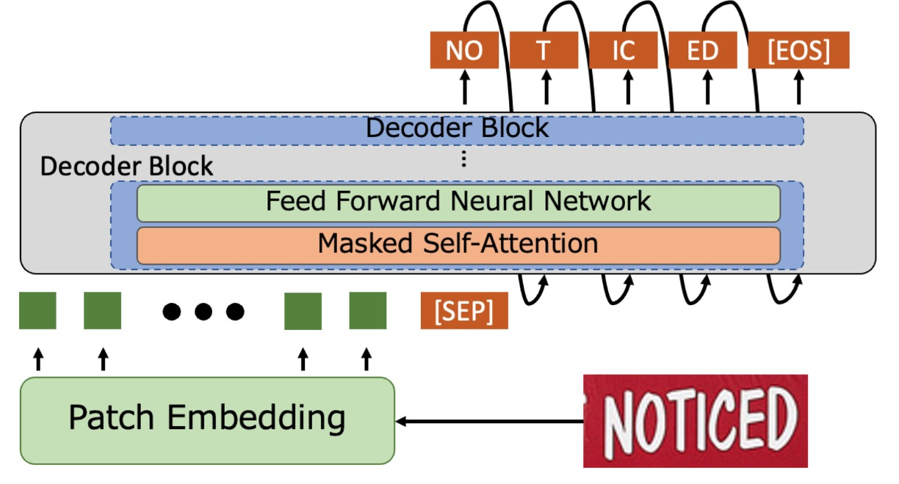
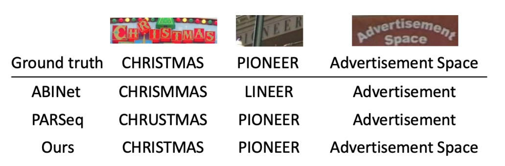
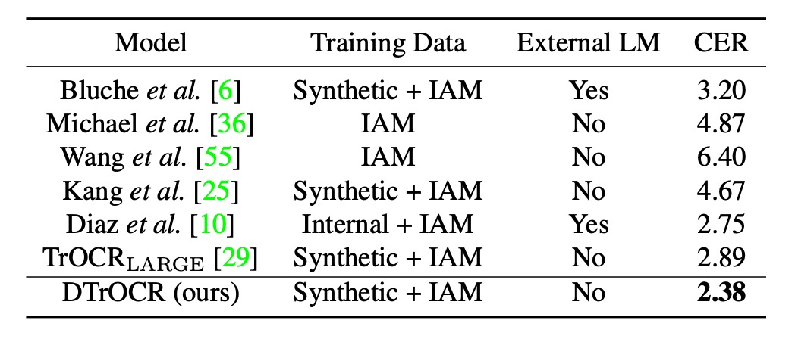

## Decoder-Only Approach

[**DTrOCR: Decoder-only Transformer for Optical Character Recognition**](https://arxiv.org/abs/2308.15996)

---

This paper was authored by a Japanese OCR company, which is an uncommon group of authors in this field.

The model is named D-TrOCR, where "Decoder-only" is the key concept.

When we first saw it, we couldn’t help but think of pronouncing it as "Doctor." (?)

## Problem Definition

We previously reviewed **TrOCR**, and you might still recall some of it.

:::tip
If not, you can revisit our earlier article:

- [**[21.09] TrOCR: Pretraining is Justice**](../2109-trocr/index.md)
  :::

TrOCR extensively employs a pretraining architecture, combining encoder and decoder models to create a complete OCR processing pipeline.

However, the authors of this paper questioned the necessity of the encoder model for OCR tasks:

- **What if we only need the decoder to accomplish OCR?**

Does this idea sound familiar?

You're right! OpenAI made a similar claim when introducing GPT: **we only need the decoder!**

When writing papers, paying homage to groundbreaking ideas by applying them to different fields can often result in something remarkable. This might just be one of those cases!

## Problem Solving

### Model Architecture

<figure style={{"width": "80%"}}>

</figure>

In simple terms, the encoder component is removed, and the image input is directly fed into the decoder.

The input image is processed through the Patch Embedding module, where it is divided into small patches and converted into vectors. Positional encodings are added to these input vectors, which are then passed to the decoder for text generation. This process is similar to the approach used in ViT.

The decoder receives these vectors and appends a special token `[SEP]` at the end. It then begins generating text starting from `[SEP]` and continues until it encounters `[EOS]`, indicating the end.

During the prediction phase, word piece tokenization is used, and Beam Search is employed to produce the final text output.

The decoder architecture directly utilizes the pre-trained GPT-2 model, eliminating the need for training from scratch and saving a significant amount of time.

### Synthetic Dataset Pretraining

The original language model is trained on large-scale text datasets, but such models are not suitable for handling OCR tasks. This is because the model lacks the ability to recognize image features and cannot associate images with text.

To address this, the authors further pre-trained the model using artificially synthesized datasets. These datasets include various types of text, such as scene text, handwritten text, and printed text.

In the TrOCR paper, the training data was annotated using PDF files and commercial OCR systems. However, this data preparation process is time-consuming and labor-intensive. Instead, the authors opted for text corpora to generate synthetic data for better reproducibility. The relevant corpora include **PILE**, **CC100**, and **Chinese NLP Corpus**.

The process of generating synthetic data is as follows:

- Three open-source libraries were used to generate synthetic datasets, splitting the text corpus into three categories: scene text, printed text, and handwritten text recognition, with a distribution of 60%, 20%, and 20%, respectively.
- For scene text recognition, 4 billion horizontal text images and 2 billion vertical text images were generated using **SynthTIGER**, utilizing default fonts for English and 64 commonly used fonts for Chinese.
- **MJSynth** and **SynthText** were used to generate 100 million multi-line English text images, with a word count of 5 per line.
- For printed text recognition, 2 billion images were generated using the default settings of **TextRender**.
- For handwritten text recognition, 2 billion images were generated using **TRDG**, leveraging 5,427 English handwriting fonts and 4 Chinese handwriting fonts.

:::tip
For related synthetic tools, we’ve compiled a list elsewhere. If you’re interested, you can refer to:

- [**Text Synthesis Tool Resources**](https://docsaid.org/en/docs/wordcanvas/tools)
  :::

### Real Dataset Pretraining

To enhance the model's adaptability in real-world environments, fine-tuning with real datasets is still necessary.

The real datasets used in the paper include: **COCO-Text**, **RCTW**, **Uber-Text**, **ArT**, **LSVT**, **MLT19**, and **ReCTS**.

:::tip
If you’re planning to conduct similar experiments, we recommend using [**Union14M**](https://github.com/Mountchicken/Union14M) directly for real-world data. This will save you the time and effort of downloading these individual datasets.
:::

### Implementation Details

1. **Model Configuration**

   - **Decoder Model**:

     - Utilized English GPT-2 and Chinese GPT-2 models.
     - Model specifications:
       - 12-layer Transformer.
       - Each layer has a 768-dimensional hidden size.
       - 12 attention heads in the multi-head attention mechanism.
     - Used Byte Pair Encoding (BPE) vocabulary.

   - **Image Patch Embedding**:
     - Following prior research, an 8 × 4 patch size was used.
     - Relative positional encoding was applied.
     - Maximum token length was set to 512.

---

2. **Training Settings**

   - **Pretraining**:

     - English model: Pretrained on English datasets.
     - Chinese model: Pretrained on a combination of Chinese and English datasets.
     - Training parameters:
       - 1 epoch with a batch size of 32.
       - AdamW optimizer with a learning rate of $10^{-4}$.

   - **Fine-Tuning**:
     - Initialized with pretrained weights.
     - Fine-tuned on target datasets:
       - Most datasets were trained for 1 epoch with a learning rate of $5 \times 10^{-6}$.
       - The SROIE dataset was trained for 4 epochs.
     - The same optimizer and batch size as in pretraining were used.

---

3. **Data Augmentation**

   - Applied RandAugment (excluding the "Sharpness" augmentation).
   - Added the following augmentations:
     - **Invert**: Color inversion.
     - **Gaussian Blur**: Apply Gaussian blurring.
     - **Poisson Noise**: Add Poisson noise.
   - RandAugment configuration:
     - Three-layer policy.
     - Augmentation magnitude set to 5.
   - All images were resized to 128 × 32 pixels.
   - Retained the original image orientation and applied random rotations:
     - Keep original orientation (95% probability).
     - Rotate 90 degrees clockwise (2.5% probability).
     - Rotate 90 degrees counterclockwise (2.5% probability).
   - Normalized images to the range $[-1, 1]$.

## Discussion

### STR Comparison

<figure style={{"width": "85%"}}>

</figure>

The training conditions are categorized into two types: synthetic datasets and real datasets. Across all benchmarks, DTrOCR outperformed existing methods significantly, regardless of the dataset type.

Existing methods, such as TrOCR, ABINet, PARSeq, and MaskOCR, rely on encoders combined with language models (LMs) to enhance accuracy. However, DTrOCR achieves higher accuracy without the need for an encoder.

As shown in the figure above, even when faced with occlusions and irregular layouts, DTrOCR can effectively recognize text in real datasets. Moreover, it accurately identifies multi-line text, a capability that many existing methods fail to achieve.

<figure style={{"width": "80%"}}>

</figure>

### SROIE Comparison

<figure style={{"width": "60%"}}>

</figure>

Existing methods rely on CNN feature extractors or ViT family architectures. However, DTrOCR surpasses these methods without utilizing such structures.

### Handwritten Performance

<figure style={{"width": "60%"}}>

</figure>

The IAM Handwriting Database is used for this evaluation, which has seen relatively little research. The best previous approach involved training on Diaz's internal annotated dataset, utilizing external LMs and Transformer-based models like TrOCR.

However, DTrOCR surpasses the accuracy of these methods, even when trained solely on synthetic datasets and benchmark datasets.

### CTR Performance

<figure style={{"width": "60%"}}>

</figure>

The Chinese benchmark tests include four subsets: scene, web, document, and handwritten text.

:::tip
The standards for the Chinese benchmark tests follow prior research:

- [**[21.12] Benchmarking Chinese Text Recognition: Datasets, Baselines, and an Empirical Study**](https://arxiv.org/abs/2112.15093)
  :::

DTrOCR achieves significantly higher accuracy across all subsets compared to existing methods.

Notably, TrOCR and MaskOCR utilize pretraining methods based on Masked Language Models (MLMs), while DTrOCR leverages generative pretraining (predicting the next word token).

The experiments demonstrate that generative decoders can more flexibly model sequential patterns, especially when dealing with complex text sequences like Chinese.

## Conclusion

In this paper, the authors presented an extremely simple OCR model structure, demonstrating that OCR tasks can be accomplished effectively using only a decoder model. They validated the effectiveness of this approach.

Across multiple benchmarks, DTrOCR consistently surpassed state-of-the-art methods in accuracy and exhibited strong generalization capabilities. Moving forward, this model might evolve along the path of large language models (LLMs), focusing on improvements in speed and performance.

:::tip
Generative models often share a common drawback: slower speed.

Imagine using a commercial LLM, where text appears one token at a time. If an image contains hundreds of characters, how long would you need to wait for the results?

- Alternatively, consider this question: **How long are you willing to wait?**

In current OCR applications, users' patience typically lasts no more than 10 seconds. Beyond that, users are likely to abandon the task. Thus, while DTrOCR's overall performance is already impressive, enhancing its speed might be the next major challenge for the authors to tackle.
:::
