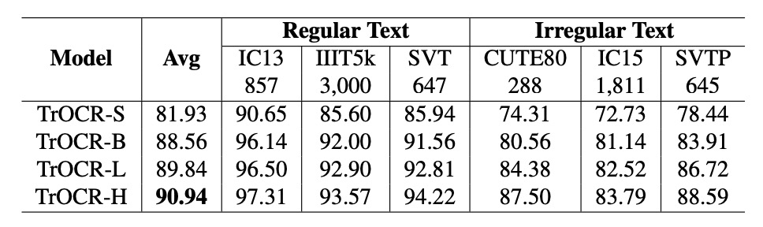
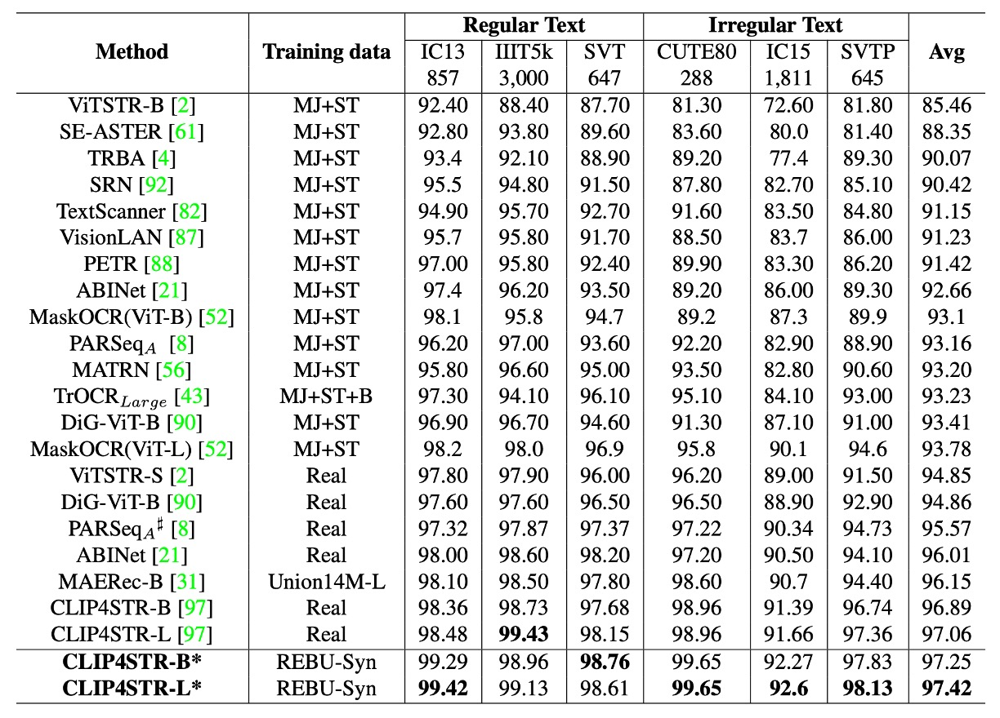

## Scaling Law for OCR

[**An Empirical Study of Scaling Law for OCR**](https://arxiv.org/abs/2401.00028)

---

A few years ago, researchers in the NLP field attempted to summarize the scaling law for models, compiling several simple formulas.

Now, it’s already 2024, yet no paper seems to have addressed this issue in the OCR field.

To address this gap, Huawei's Noah's Ark Lab took on the challenge.

## Defining the Problem

First, we must confirm that larger models are indeed better. Only then does further investment make sense, as endeavors without purpose are unlikely to attract investors' interest.

In the NLP domain, this question was explored years ago, with subsequent research delving even deeper. Examples include:

- [**[20.01] Scaling Laws: Scaling Laws for Neural Language Models**](../../transformers/2001-scaling_laws/index.md)
- [**[22.03] Chinchilla’s Law**](https://arxiv.org/abs/2203.15556)

These studies were focused on NLP, but researchers in OCR seem to have paid little attention to this question.

Since people are hesitant to invest resources without understanding the risks, this area clearly needs research to bridge the gap.

## Solving the Problem

This paper does not propose a new model architecture. Instead, the authors design an experimental framework to examine the scaling law of models from the following perspectives:

1. **Model Size**: Refers to the number of parameters in the model, ranging from 50 million to 1 billion.
2. **Dataset Size**: Refers to the size of the training dataset, ranging from 1 million to 1 billion samples.
3. **Computation Time**: Refers to the time required to train the model, ranging from 100 hours to 1,000 hours.

In addition to this, the authors introduce a new dataset: **REBU-Syn**. This dataset, proposed in the paper, combines real and synthetic data, curated from existing publicly available datasets.

### Model Scaling

The first aspect to explore is model size.

The authors reference two notable previous studies: **TrOCR** and **PARSeq**.

:::tip
If you're unfamiliar with these models, you can refer to our earlier articles:

- [**[21.09] TrOCR: Pretraining is Justice**](../2109-trocr/index.md)
- [**[22.07] PARSeq: Wrod oerdr dseon't mteartr for redaing**](../2207-parseq/index.md)
  :::

TrOCR is a text recognition model based entirely on the Transformer architecture. It was the first to combine vision Transformers with text Transformers for OCR tasks.

To analyze how model size impacts performance, the authors scale TrOCR models from **TrOCR-S** to **TrOCR-H**, with parameter sizes ranging from 43.09 million to 1.037 billion.

- **TrOCR-S**: Uses DeiT$_\text{SMALL}$ as the encoder and MiniLM as the decoder.
- **TrOCR-B**: Uses BEIT$_\text{BASE}$ as the encoder and RoBERTa$_\text{LARGE}$ as the decoder.
- **TrOCR-L and TrOCR-H**: Use BEIT$_\text{LARGE}$ as the encoder and RoBERTa$_\text{LARGE}$ as the decoder.

<figure style={{"width": "80%"}}>

</figure>

---

PARSeq uses a Transformer-based encoder-decoder architecture.

- The **Encoder** employs a ViT model to extract image features. It removes the `[CLS]` token and feeds all output tokens to the decoder.
- The **Decoder** adopts a Transformer decoder similar to preLayerNorm, with the number of attention heads defined as $nhead = \frac{d_{model}}{32}$.

The authors scale PARSeq models to four sizes to study the scaling laws for large OCR models:

- **PARSeq-S**: The base version.
- **PARSeq-B, PARSeq-L, and PARSeq-H**: Gradually expanded model sizes, ranging from 22.51 million to 682 million parameters. Detailed configurations are shown in the table below.

<figure style={{"width": "80%"}}>

</figure>

### Data Scaling

In the early stages, model training primarily relied on synthetic data. However, as more real-world data became available, training models on real data proved to be more efficient. To scale up the training dataset, the authors created a new dataset: **REBU-Syn**, which consists of approximately 6 million real-world samples and 18 million publicly available synthetic samples, in a **3:1 ratio**.

:::tip
**Why 3:1?**

This ratio wasn’t chosen arbitrarily. In later sections, the authors present experiments demonstrating that this ratio yields the best results.
:::

The real-world dataset is divided into the following components:

- **R Group**: Includes common real-world sources such as COCO-Text, RCTW17, UberText, ArT, LSVT, MLT19, ReCTS, TextOCR, and OpenVINO.
- **E Group**: Features two datasets commonly used in text detection tasks, Total Text and CTW1500, significantly expanding the range of real-world data.
- **B Group**: Contains training data from benchmark datasets like IIIT 5k-word, Street View Text, ICDAR13, and ICDAR15.
- **U Group**: Includes 4 million labeled images from 14 datasets collectively called Union14ML.

---

The synthetic dataset is composed of the following:

- **Commonly Used Datasets**:

  - **MJSynth (MJ)**: 8.9 million samples.
  - **SynthText (ST)**: 5.5 million samples.

- **Additional Synthetic Data**:
  - **Curved SynthText (CST)**: Designed for detecting curved text.
  - **SyntheAdd (SA)**: Generates data containing rare characters, such as punctuation marks.

In addition to public synthetic datasets, the authors generated more synthetic data using two tools: **TextRecognitionDataGenerator** and **SynthText**.

The text corpus was drawn from 700,000 entries from widely used English-language corpora globally. Backgrounds for the synthetic data were selected from natural scene images provided by SynthText.

:::tip
If you’re interested in synthetic data generation tools, we’ve compiled related resources here:

- [**Resources for Text Synthesis Tools**](https://docsaid.org/docs/wordcanvas/tools)
  :::

### Experimental Setup

The authors defined different hyperparameter configurations for each model architecture:

- **TrOCR Models**
  - **TrOCR-S**: Batch size $1024$, learning rate $4 \times 10^{-4}$.
  - **TrOCR-B**: Batch size $256$, learning rate $1 \times 10^{-4}$.
  - **TrOCR-L**: Batch size $128$, learning rate $4 \times 10^{-5}$.
- **PARSeq Models**
  - A consistent learning rate of $7 \times 10^{-4}$ was used, with batch sizes as close to $1024$ as possible.

For text tokenization, **BPE (Byte Pair Encoding)** [68] and **SentencePiece** [37] were used to split text lines into subword units:

- [**[15.08] Neural Machine Translation of Rare Words with Subword Units**](https://arxiv.org/abs/1508.07909)
- [**[18.08] SentencePiece**](https://arxiv.org/abs/1808.06226)

The primary evaluation metric was **word accuracy**. To ensure fair comparisons across models and datasets, the final output strings were standardized to a common set of $36$ characters (lowercase letters and digits).

## Discussion

Model performance $E$ is primarily influenced by the following three variables:

- **Number of Model Parameters ($N$)**: Reflecting the complexity and capacity of the model.
- **Amount of Training Data ($D$)**: Representing the scale of the data available for training.
- **Model Computation Cost ($C$)**: Denoting the computational resource requirements, including FLOPs or GPU training time.

The goal of the experiments is to describe and validate the power-law relationship between model performance $E$ and the variables $N$, $D$, and $C$. The study also aims to determine if a smooth and scalable trend exists, enabling performance to improve effectively with increased resource allocation.

### Power-Law for Model Size

- **TrOCR Models**

    

    <figure style={{"width": "80%"}}>
    
    </figure>
    

  The number of parameters $N$ and model performance $E$ exhibit a power-law relationship, expressed as:

  $$
  E(N) = \frac{1.97 \times 10^4}{N^{0.223}}
  $$

  The power-law formula is fitted based on the first three models (TrOCR-S, TrOCR-B, and TrOCR-L). The final model, TrOCR-H, aligns closely with the fitted curve, validating the effectiveness of the power-law relationship.

- **PARSeq Models**

    

    <figure style={{"width": "80%"}}>
    
    </figure>
    

  Similar to TrOCR, the number of parameters $N$ and performance $E$ in PARSeq follow a power-law relationship:

  $$
  E(N) = \frac{6.316 \times 10^{-74}}{N^{0.018}}
  $$

### Power-Law for Dataset Size

- **TrOCR Models**:

  

  <figure style={{"width": "80%"}}>
  
  </figure>
  

  The dataset size $D$ and model performance $E$ follow a power-law relationship, expressed as:

  $$
  E(D) = \frac{1.84 \times 10^5}{D^{-0.3271}}
  $$

  The results show that changes in dataset size (blue solid line) align with the power-law formula (gray solid line), verifying the significant impact of dataset size on performance.

- **PARSeq Models**:

  

  <figure style={{"width": "80%"}}>
  
  </figure>
  

  As the dataset size increases, performance improves significantly, as shown in the table above.

### Power-Law for Computational Resources

<figure style={{"width": "80%"}}>

</figure>

The computational resources $C$ and model performance $E$ exhibit a power-law relationship, expressed as:

$$
E(C) = \frac{4.45 \times 10^4}{C^{-0.3271}}
$$

The results indicate that the error rate and computational resources can be described using a power-law formula, with detailed data shown by the gray solid line in the figure above.

### Ratio of Synthetic to Real Data

<figure style={{"width": "50%"}}>

</figure>

Real data generally outperforms synthetic data in training efficiency. However, due to its high cost and limited availability, synthetic data remains indispensable.

To explore this, the authors fixed the amount of real data and gradually increased the proportion of synthetic data (from 0.5 to 5 times), observing changes in model accuracy, as shown in the table above.

The results show that when the ratio of synthetic to real data is 1:3, the model achieves the highest accuracy of 96.85%. Beyond this ratio, accuracy begins to decline, possibly because the data distribution becomes overly skewed toward synthetic data, affecting model performance.

### Necessity of Pretraining

<figure style={{"width": "80%"}}>

</figure>

The effectiveness of pretrained models in improving OCR performance has been a topic of debate, with inconsistent findings in previous studies.

In this paper, the authors compared models pretrained on ImageNet-21k with models trained from scratch for OCR tasks.

The results showed that models pretrained on ImageNet-21k performed worse on OCR tasks in both PARSeq and CLIP4STR experiments compared to models trained from scratch. This suggests that pretraining on non-OCR-specific tasks may be unhelpful or even detrimental to OCR performance.

However, pretraining on OCR-specific datasets significantly improves performance. For instance, the PARSeq-S model trained on the REBU-Syn dataset achieved an accuracy of 96.85%, surpassing the performance of a model trained solely on the real data REBU dataset. Further fine-tuning the pretrained model with REBU real data improved the accuracy to 97.01%.

Based on these findings, the authors recommend the following best practices:

1. Train the model on a comprehensive dataset containing both synthetic and real data.
2. Fine-tune the model with real data to achieve further accuracy improvements.

### Comparison with Other Models

<figure style={{"width": "85%"}}>

</figure>

The authors retrained **CLIP4STR**, using a **3:1 ratio of synthetic to real data** for training and fine-tuning with task-specific pretrained models.

The experimental results show that the accuracy of **CLIP4STR-B** improved from **96.54%** to **97.25%**, a **0.65% increase**, setting a new record for text recognition tasks. The **CLIP4STR-L** model achieved even better results, attaining a **97.42% Top-1 average accuracy** across **6 commonly used evaluation benchmarks**.

:::tip
When revisiting the CLIP4STR paper, we noticed discrepancies between the reported experimental results and the original paper. The numbers here may reflect the authors' own retrained results rather than those from the original publication.

If you're unfamiliar with CLIP4STR, you can refer to our previous article:

- [**[23.05] CLIP4STR: The Blessing of Multimodality**](../2305-clip4str/index.md)
  :::

## Conclusion

This study confirms the power-law relationships between **model size**, **dataset size**, and **computational resources** with model performance. As these three factors increase, model performance improves predictably.

During training, the authors recommend using a **3:1 ratio of real to synthetic data** for optimal performance. Additionally, they demonstrate that using **task-specific pretrained models** significantly enhances performance.

:::tip
Are the recently popular Vision-Language Models (VLMs) helpful for OCR tasks? Based on the findings of this study, unless these pretrained models are specifically trained for OCR tasks, the answer is likely no.

However, some classic VLMs, like CLIP, operate at a scale 20 times larger than the experiments in this paper. Can the conclusions of this paper truly represent the capabilities of such large-scale VLMs?

Thus, the debate over whether pretraining can improve OCR performance is far from over.
:::
