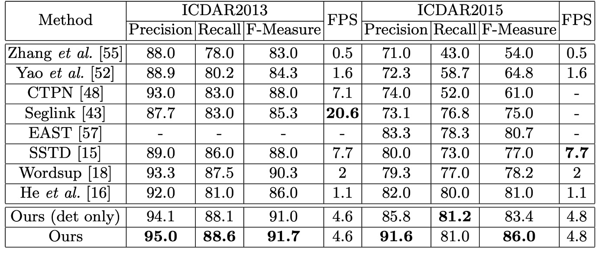

# [18.07] Mask TextSpotter

## Localization as Recognition

[**Mask TextSpotter: An End-to-End Trainable Neural Network for Spotting Text with Arbitrary Shapes**](https://arxiv.org/abs/1807.02242)

---

When we first encountered this paper, both the model design philosophy and the illustration style gave us a sense of familiarity. Upon reviewing the authors' team, we realized it belongs to Face++, the same group behind CA-FCN!

- [**[18.09] CA-FCN: A New Dimension**](../../test-recognition/1809-cafcn/index.md)

Many of their papers have been published in CVPR and have had a major impact in the field.

---

Returning to this paper, the authors were inspired by Mask R-CNN. Using pixel-level prediction, they simultaneously predict the position and class of text.

To pay homage to Mask R-CNN, the authors named their model **Mask TextSpotter**.

## Problem Definition

In real-world scenarios, text can take on many shapes: horizontal, vertical, curved, slanted...

All kinds of shapes you can and cannot imagine.

---

Text detection methods are usually inspired by object detection designs, but these approaches struggle with adapting to variable text shapes, leading to poor performance.

On the other hand, text recognition at the time was still largely dominated by the **CTC method**, which works better for horizontal text but struggles with curved text.

Is it possible to find a method that can **detect text locations and recognize text simultaneously**?

We want the best of both worlds!

## Solution

### Model Architecture

The model architecture is illustrated briefly above. Let’s follow the paper to understand it in more detail.

This architecture consists of four main parts, as shown in the figure:

1. **Feature Pyramid Network (FPN)** as the backbone network.
2. **Region Proposal Network (RPN)** to generate text proposals.
3. **Fast R-CNN** for **bounding box regression**.
4. **Mask Branch** for text instance segmentation and character segmentation.

---

### Backbone & Neck

To establish high-level semantic feature maps across different scales, the authors employed **ResNet-50** as the backbone, combined with an **FPN structure**. The FPN merges features from different resolutions top-down, improving accuracy with minimal additional computational cost.

### Region Proposal Network (RPN)

The **Region Proposal Network (RPN)** generates text proposals for both the Fast R-CNN and mask branches.

At each stage, different-sized anchors are used, with areas of:

- $32^2, 64^2, 128^2, 256^2, 512^2$ pixels, corresponding to the five stages $\{P_2, P_3, P_4, P_5, P_6\}$.

Each stage uses three aspect ratios $\{0.5, 1, 2\}$ for training.

The **RoI Align** method is used for region feature extraction, which better preserves spatial information compared to **RoI Pooling**, aiding in segmentation tasks.

### Fast R-CNN Branch

During training, RPN generates many text proposals, which are fed into the **Fast R-CNN** branch and the **mask branch**.

The Fast R-CNN branch handles:

- **Classification**: Classifying proposals as text or non-text.
- **Regression**: Adjusting the bounding boxes of text proposals.

This branch refines the bounding boxes proposed by RPN, using RoI features aligned to a resolution of $7 \times 7$.

### Mask Branch

The **mask branch** performs two tasks: **text instance segmentation** and **character segmentation**.

Each RoI (fixed at $16 \times 64$) is processed by four convolutional layers and one deconvolutional layer. The mask branch generates 38 output maps, including:

- **Global word map**: Localizing text regions.
- **36 character maps**: Corresponding to 26 letters and 10 digits.
- **Background map**: Marking non-character regions for post-processing.

:::tip
Note that this design is **case-insensitive**, so only 26 letters are used.
:::

### Label Generation

- **RPN and Fast R-CNN Target Generation**

  The **polygon annotations** are converted into **minimum horizontal rectangles** that enclose them. Then, targets for **RPN** and **Fast R-CNN** are generated according to the [8, 40, 32] strategy.

- **Mask Branch Label Generation**

  Based on the proposals generated by RPN and the annotations $P$ and $C$ (if available), two types of mask maps are generated:

  1. **Global Map**: For text region localization.
  2. **Character Map**: For labeling character classes.

- **Global Map Generation**

  A polygon is drawn on an initially blank mask map (all 0s), filling the interior with 1s.

- **Character Map Generation**

  

  As shown above, the center of the character box is fixed, and each side is shortened to one-fourth of its original length. Pixels inside the shrunken box are assigned the character’s class index, while those outside are set to 0. If no character box is annotated, all pixels are set to -1.

### Loss Function

Since the architecture contains several branches, the authors employ a **multi-task loss function** for optimization:

$$
L = L_{\text{rpn}} + \alpha_1 L_{\text{rcnn}} + \alpha_2 L_{\text{mask}}
$$

- $L_{\text{rpn}}$ and $L_{\text{rcnn}}$ are the RPN and Fast R-CNN loss functions, respectively.
- $L_{\text{mask}}$ is the mask branch loss, including:

  - **Global instance segmentation loss**: $L_{\text{global}}$
  - **Character segmentation loss**: $L_{\text{char}}$

  $$
  L_{\text{mask}} = L_{\text{global}} + \beta L_{\text{char}}
  $$

The hyperparameters $\alpha_1, \alpha_2, \beta$ are experimentally set to 1.0.

- **Global Segmentation Loss**

  With $N$ pixels in the mask map, $y_n \in \{0, 1\}$ as pixel labels, and $x_n$ as model output, the loss is:

  $$
  L_{\text{global}} = -\frac{1}{N} \sum_{n=1}^{N} \left[ y_n \cdot \log(S(x_n)) + (1 - y_n) \cdot \log(1 - S(x_n)) \right]
  $$

  where $S(x)$ is the **sigmoid function** mapping outputs to probabilities between 0 and 1.

- **Character Segmentation Loss**

  The character segmentation output consists of 37 mask maps (36 for characters and one for the background). The weighted spatial soft-max loss is:

  $$
  L_{\text{char}} = -\frac{1}{N} \sum_{n=1}^{N} W_n \sum_{t=0}^{T-1} Y_{n,t} \log\left( \frac{e^{X_{n,t}}}{\sum_{k=0}^{T-1} e^{X_{n,k}}} \right)
  $$

  where $Y$ is the ground truth label, and **$W$** is a weight balancing the loss between positive samples and the background class.

  The weight $W_i$ is defined as:

  $$
  W_i =
  \begin{cases}
  1 & \text{if} \quad Y_{i,0} = 1, \\
  \frac{N_{\text{neg}}}{N - N_{\text{neg}}} & \text{otherwise}
  \end{cases}
  $$

### Inference Phase

During inference, the mask branch uses the output of Fast R-CNN for more accurate proposals. The steps are as follows:

1. **Input Test Image**: Obtain candidate boxes via Fast R-CNN.
2. **Remove Redundant Boxes**: Apply **Non-Maximum Suppression (NMS)**.
3. **Generate Mask Maps**: Generate global and character masks.
4. **Extract Text Contours**: Predict polygons from global masks.
5. **Generate Character Sequence**: Use **pixel voting** to extract character sequences.

### Pixel Voting Algorithm

Pixel voting converts the predicted character masks into character sequences:

1. **Binarize Background Map**: Threshold at 192.
2. **Connected Region Detection**: Extract all connected regions.
3. **Average Pixel Value Calculation**: Compute average pixel values per region.
4. **Character Assignment**: Assign the class with the highest average to each region.
5. **Character Sorting**: Sort characters from left to right.

## Discussion

### Horizontal Text Recognition

The authors evaluated the model's performance on horizontal text detection and recognition using the **ICDAR2013** dataset. During testing, all input images were resized so that their shorter side measured 1000 pixels, and the model was evaluated online.

The results show that even with **single-scale evaluation**, the model achieved an **F-Measure of 91.7%**, outperforming some previous methods that used multi-scale evaluation. For **word spotting**, the model performed comparably to state-of-the-art methods. Additionally, in the **end-to-end recognition task**, the model achieved a performance boost of **1.1% to 1.9%**.

### Skewed Text Recognition

The authors also evaluated the model on the **ICDAR2015** dataset to test its effectiveness in detecting and recognizing skewed text. Since ICDAR2015 contains a large amount of small-sized text, the authors tested the model on **three different input scales**:

- **Original resolution**: 720 × 1280
- **Two enlarged resolutions**: Inputs resized so that the shorter side measures 1000 and 1600 pixels

In the original resolution, the model achieved an **F-Measure of 84%**, which is **3.0% higher** than the best-performing multi-scale methods. At the larger input sizes, the F-Measure increased to **86.0%**, outperforming competing models by at least **5.0%**.

In both **word spotting** and **end-to-end recognition**, the model demonstrated remarkable performance, achieving **13.2% to 25.3%** overall improvements compared to prior state-of-the-art methods.

### Curved Text Recognition

To assess the model's robustness in recognizing curved text, the authors used the **Total-Text** dataset. During testing, the input images were resized to have a shorter side of 1000 pixels. Unlike ICDAR2015, where text regions are marked with quadrilaterals, the Total-Text dataset uses **polygons with variable numbers of vertices**, which allows for better representation of curved text regions.

The results showed that **Mask TextSpotter** outperformed previous methods by **8.8 percentage points** in detection. In the **end-to-end recognition task**, the model improved performance by **at least 16.6%** over prior approaches.

The following figure illustrates the differences in stability between TextBoxes (top row) and Mask TextSpotter (bottom row):

- [**[16.11] TextBoxes: A Fast Text Detector with a Single Deep Neural Network**](https://arxiv.org/abs/1611.06779)

:::tip
The authors attributed the model’s superior detection performance to **more precise localization outputs** that use **polygons** to enclose text areas rather than horizontal rectangles. Additionally, Mask TextSpotter can effectively process **2D character sequences** (like curved text), whereas traditional sequence-based recognition networks only handle **1D sequences**.
:::

### Visualization

## Conclusion

**Mask TextSpotter** demonstrates excellent capability in handling horizontal text (ICDAR2013), skewed text (ICDAR2015), and curved text (Total-Text). It addresses the limitations of traditional methods in curved text recognition and fills a gap in handling irregular text shapes.

The end-to-end design not only improves efficiency but also enables superior performance across multiple tasks, including **detection, word spotting, and end-to-end recognition**. This makes it highly valuable for both academic research and real-world applications.

:::tip
However, the number of prediction heads depends on the number of character classes. If the target language has many characters (e.g., Chinese with over 8000 common characters), this design might result in an excessively large model, making it impractical for real-world applications.

Future research will need to address such scalability issues. We can explore these topics in depth later.
:::
