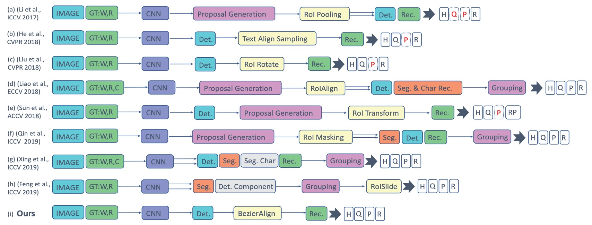
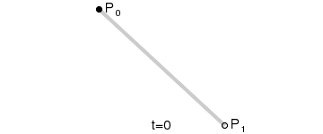
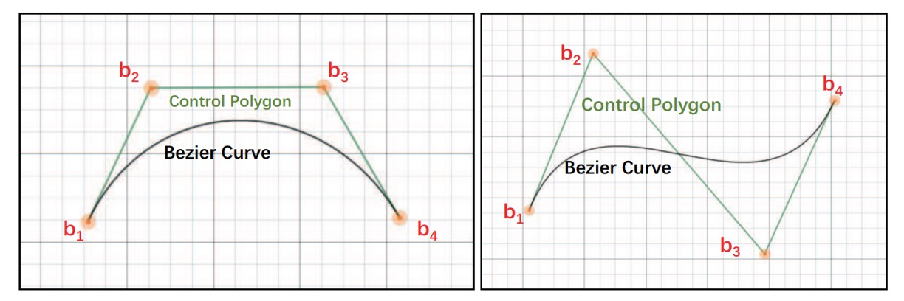
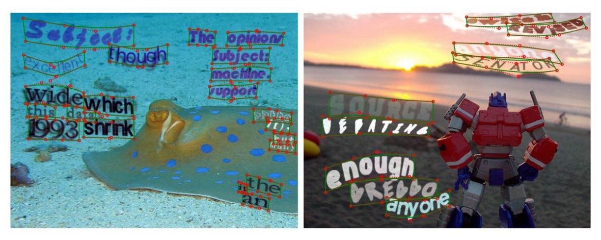
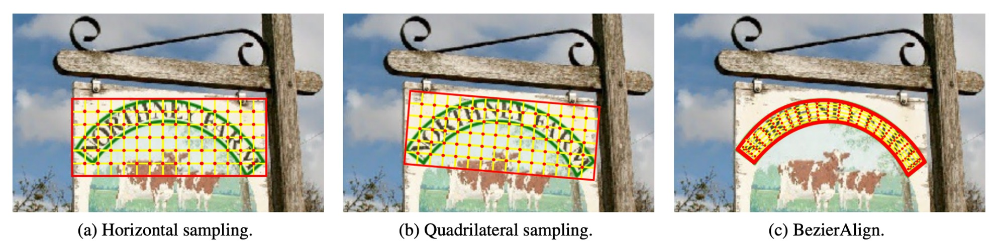
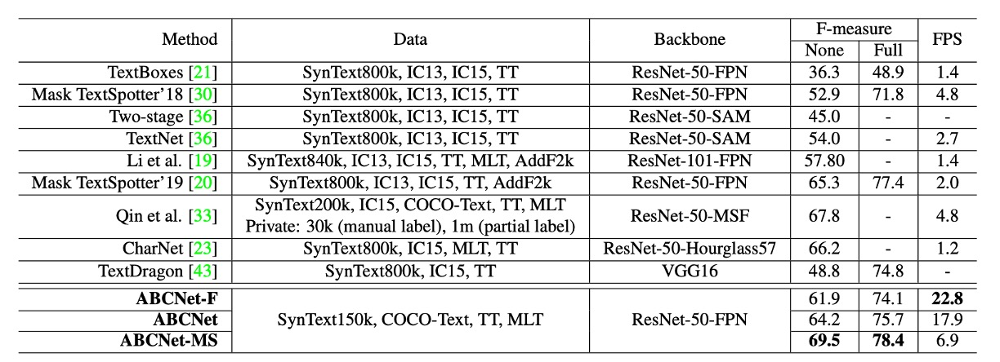

## Greetings from Bezier Curves

[**ABCNet: Real-time Scene Text Spotting with Adaptive Bezier-Curve Network**](https://arxiv.org/abs/2002.10200)

---

OCR has been advancing for years, but text detection and recognition tasks remain challenging.

## Defining the Problem

Text detection and recognition are the two primary tasks of OCR.

- **Text Detection** identifies the location of text within an image. Many methods for this task are derived from object detection and segmentation techniques. However, text often appears distorted, slanted, or curved, making detection difficult.

- **Text Recognition** converts detected text into recognizable characters. The performance of recognition is heavily influenced by detection errors. Therefore, many approaches assume irregular text as input, developing methods based on **STN (Spatial Transformer Networks)** or **2D attention mechanisms**.

Below is a recap of some past approaches:

The authors argue that the complexity of multi-stage systems makes them slow and difficult to maintain in real-world applications. To address the issue of deformed text, the authors introduce **Bezier curves** to model the shape of the text and propose a **Bezier Correction Network** to solve both detection and recognition.

Wait, what’s a **Bezier curve**?

## Bezier Curves

- [**Bézier curve - Wikipedia**](https://en.wikipedia.org/wiki/B%C3%A9zier_curve)

A **Bezier curve** is a **mathematical curve** used to describe **smooth shapes**. It is widely applied in **computer graphics, typography, animation, and UI design** to create smooth, scalable curves. A Bezier curve is defined by a set of **control points** that determine how the curve bends. The first and last control points define the curve's endpoints, while the intermediate points shape the curve.

These curves retain their smoothness under scaling, making them ideal for modeling various shapes, from straight lines to complex geometries.

Here’s a glimpse of different types of Bezier curves:

- **Linear Bezier Curve (Degree 1)**: Straight line between two control points.

  - $B(t) = (1 - t) P_0 + t P_1, \quad 0 \leq t \leq 1$

    

- **Quadratic Bezier Curve (Degree 2)**: Uses three control points.

  - $B(t) = (1 - t)^2 P_0 + 2(1 - t) t P_1 + t^2 P_2$

    

- **Cubic Bezier Curve (Degree 3)**: Four control points, often used in fonts, animation, and UI.

  - $B(t) = (1 - t)^3 P_0 + 3(1 - t)^2 t P_1 + 3(1 - t) t^2 P_2 + t^3 P_3$

    

- **Quartic Bezier Curve (Degree 4)**: Five control points.

  - $B(t) = (1 - t)^4 P_0 + 4(1 - t)^3 t P_1 + 6(1 - t)^2 t^2 P_2 + 4(1 - t) t^3 P_3 + t^4 P_4$

    

- **Quintic Bezier Curve (Degree 5)**: Six control points.

  - $B(t) = (1 - t)^5 P_0 + 5(1 - t)^4 t P_1 + 10(1 - t)^3 t^2 P_2 + 10(1 - t)^2 t^3 P_3 + 5(1 - t) t^4 P_4 + t^5 P_5$

    

:::info
All these GIFs are from the Bezier curve section on Wikipedia.
:::

## Solution Overview

After learning about Bezier curves, it seems like we’ve read the paper. (~Not! Yet!~)

### Model Architecture

The authors remove traditional **anchor boxes** and **multi-stage pipelines**, using Bezier curves to describe the shape of the text and proposing an **end-to-end framework** for detecting text of arbitrary shapes.

Since cubic Bezier curves are sufficient for most curved text, the authors use **8 control points** to represent the text boundary in a bounding box.

<figure style={{"width": "80%"}}>

</figure>

Control points are learned by **relative displacement** to simplify the model and improve accuracy:

$$
\Delta x = b_i^x - x_{\text{min}}, \quad \Delta y = b_i^y - y_{\text{min}}
$$

Here, $x_{\text{min}}$ and $y_{\text{min}}$ are the minimum $x$ and $y$ values of the bounding box vertices.

The prediction head uses a **single convolutional layer** to output 16 channels (for $\Delta x$ and $\Delta y$), making it lightweight and accurate.

:::tip
The text region is divided into upper and lower curves to enclose the text region. Therefore, a cubic Bezier curve requires 4 control points, and two curves together require 8 control points.

Each point has coordinates $(x, y)$, so 8 control points have a total of 16 coordinates.
:::

### Generating GroundTruth

Since existing datasets do not have Bezier curve annotations, the authors propose a method to generate **Bezier curve ground truth** from polygonal annotations using the **least squares method**.

The equation looks like this:

$$
\begin{bmatrix}
B_{0,3}(t_0) & \cdots & B_{3,3}(t_0) \\
B_{0,3}(t_1) & \cdots & B_{3,3}(t_1) \\
\vdots & \ddots & \vdots \\
B_{0,3}(t_m) & \cdots & B_{3,3}(t_m)
\end{bmatrix}
\begin{bmatrix}
b_{x0} & b_{y0} \\
b_{x1} & b_{y1}\\
b_{x2} & b_{y2}\\
b_{x3} & b_{y3}\\
\end{bmatrix}
=
\begin{bmatrix}
p_{x0} & p_{y0} \\
p_{x1} & p_{y1} \\
\vdots & \vdots \\
p_{xm} & p_{ym}
\end{bmatrix}
$$

where $m$ represents the number of polygonal annotation points, and $t$ is calculated based on the cumulative length of the polyline and the perimeter ratio, as shown in the example below:

### Synthetic Data

To train an end-to-end scene text detection model, a large amount of free synthetic data is needed. However, the existing **SynText dataset** (containing 800,000 images) only provides quadrilateral bounding boxes for mostly straight text, which is insufficient for handling arbitrarily shaped scene text. To address this limitation, the authors expanded the dataset by synthesizing 150,000 diverse images to enhance the model's ability to detect curved text.

The composition of the new dataset is as follows:

- **94,723 images**: Containing mostly **straight text**.
- **54,327 images**: Containing mostly **curved text**.

The sources for these images are:

- **VGG synthesis method**: Used to generate the synthetic images.
- **40,000 background images**: Sourced from the **COCO-Text dataset**.

Each background image from COCO-Text is prepared with a **segmentation mask**, along with **scene depth information**, to improve the blending of text with the background. To further increase the variety of text shapes, the authors modified the VGG synthesis method by incorporating **various artistic fonts** and a **rich text corpus**. They applied **curved distortions** and **diverse layouts** to the generated text, simulating a wide range of real-world text styles. For each text instance, **polygonal annotations** were automatically generated to describe the shape.

Additionally, the polygonal annotations were converted into **cubic Bezier curves** as ground truth, ensuring that the model can accurately fit various curved text shapes and improve detection performance. These processes simplify the data generation workflow while effectively enhancing the model's ability to detect arbitrarily shaped text, meeting the demands of real-world applications.

The results of the synthetic data generation are shown below:

### Bezier Alignment

Traditional sampling methods include:

- [**RoI Pooling**](https://arxiv.org/abs/1707.03985)
- [**RoI Rotate**](https://arxiv.org/abs/1801.01671)
- [**Text-Align-Sampling**](https://arxiv.org/abs/1803.03474)
- [**RoI Transform**](https://arxiv.org/abs/1812.09900)

**BezierAlign** is an extension of **RoIAlign**, but unlike RoIAlign, it uses a **non-rectangular sampling grid** to align features. Each row of the alignment grid is perpendicular to the boundary of the Bezier curve, ensuring accurate alignment. The sampling points are evenly distributed along both width and height, and **bilinear interpolation** is applied to compute the final sampling results.

Given a feature map and the control points of a Bezier curve, the pixel positions in the rectangular output feature map are calculated as follows:

Assume the size of the output feature map is $h_{\text{out}} \times w_{\text{out}}$.

The process is as follows:

- For the $i$-th pixel $g_i$ its horizontal position is denoted as $(g_{iw}, g_{ih})$.
- The parameter $t$ is computed using the formula:

  $$
  t = \frac{g_{iw}}{w_{\text{out}}}
  $$

- Using $t$ and the Bezier curve equation, the **top boundary point** $t_p$ and **bottom boundary point** $b_p$ are calculated.

- Based on $t_p$ and $b_p$, the position of the sampling point $o_p$ is determined using:

  $$
  o_p = b_p \cdot \frac{g_{ih}}{h_{\text{out}}} + t_p \cdot \left(1 - \frac{g_{ih}}{h_{\text{out}}}\right)
  $$

- Once the position $o_p$ is obtained, **bilinear interpolation** is applied to compute the final value at that point.

---

BezierAlign can handle text regions of **arbitrary shapes**, free from the limitations of rectangular grids. This makes it particularly effective for detecting and recognizing curved text. It is efficient and avoids fragmentation, simplifying the computation process. Compared to traditional methods, BezierAlign shows significant improvements in both alignment accuracy and efficiency. A detailed comparison is shown below:

### Text Recognition Head

<figure style={{"width": "80%"}}>

</figure>

The text recognition branch shares the backbone features with the detection branch. The architecture is as follows:

- **6 convolutional layers**: With varying strides.
- **Average pooling**: Compresses height to 1.
- **BLSTM**: Captures bidirectional context.
- **Fully connected layer**: Outputs $(w, n, n_{\text{class}})$, where $n_{\text{class}} = 97$ (including letters, numbers, symbols, and EOF).

During training, the recognition branch directly extracts RoI features from the Bezier curve's ground truth, ensuring that the detection and recognition branches do not interfere with each other. Text alignment uses **CTC Loss** to align the output classification results with the text, ensuring the model's training stability.

During inference, the RoI region is replaced by the Bezier curve results obtained from the detection branch, ensuring that the text is accurately aligned in curved regions.

### Training Configuration

- **Backbone**: ResNet-50 with a Feature Pyramid Network (FPN).
- **RoIAlign**: Applied on feature maps at 5 different resolutions:
  - Resolutions are $1/8$, $1/16$, $1/32$, $1/64$, and $1/128$ of the input image.
- **BezierAlign**: Applied on feature maps of 3 different sizes:
  - Sizes are $1/4$, $1/8$, and $1/16$ of the input image.
- **Pretraining datasets**:
  - 150,000 synthetic images.
  - 15,000 selected images from the **COCO-Text dataset**.
  - 7,000 images from the **ICDAR-MLT dataset**.

The model is **pretrained on public English word-level datasets** and fine-tuned on the target dataset.

---

Data Augmentation Strategies

- **Random scaling during training**:
  - The shorter side of the input is randomly chosen between 560 and 800 pixels.
  - The longer side is constrained to a maximum of 1333 pixels.
- **Random cropping**:
  - Ensures the cropped region covers at least half of the original image and does not truncate text.
  - If the cropping conditions cannot be met, cropping is skipped.

---

Hardware Setup

- **4 Tesla V100 GPUs** are used for training.
- **Batch size**: 32 images per batch.

---

Training Parameters

- **Maximum iterations**: 150,000.
- **Initial learning rate**: 0.01.
- **Learning rate schedule**:
  - Reduced to **0.001** at 70,000 iterations.
  - Further reduced to **0.0001** at 120,000 iterations.

The entire training process takes approximately **3 days** to complete.

## Discussion

The authors conducted comparisons and ablation studies on the **Total-Text dataset** to evaluate the performance of their method. The results are as follows:

### BezierAlign Analysis

<figure style={{"width": "80%"}}>

</figure>

To validate the effectiveness of **BezierAlign**, the authors performed ablation experiments on **Total-Text**, exploring the impact of different sampling point configurations, as shown in the table above.

The results demonstrate that **the number of sampling points significantly affects the performance and computational speed**. When the sampling configuration is **(7, 32)**, the model achieves the best balance between **F-measure** and **frames per second (FPS)**. Therefore, the authors adopted this configuration for subsequent experiments.

Furthermore, a comparison between BezierAlign and previous sampling methods (as shown below) reveals that **BezierAlign significantly improves end-to-end detection performance**:

<figure style={{"width": "80%"}}>

</figure>

### BezierCurve Analysis

<figure style={{"width": "80%"}}>

</figure>

The results shown above indicate that **Bezier curve-based detection does not introduce additional computational overhead** compared to standard bounding box-based detection.

### Experimental Results on Total-Text

The authors compared **ABCNet** with other methods, as shown in the table above:

- **Single-scale inference**: ABCNet achieves near real-time inference speeds while maintaining high performance, achieving an optimal balance between **speed and accuracy**.
- **Multi-scale inference**: Accuracy improves further, with ABCNet achieving **state-of-the-art performance** under multi-scale settings. ABCNet also demonstrates a **significant improvement in runtime** compared to previous methods.
- **Accelerated version**: ABCNet’s optimized version achieves comparable accuracy while delivering inference speeds that are **more than 11 times faster** than the previous best-performing method.

## Conclusion

ABCNet continues the design of past ROI proposals, first introducing Bezier curves and proposing the BezierAlign layer to align the feature map with the Bezier curve boundary, improving the accuracy of text detection and recognition. Additionally, the authors propose a new data synthesis method to generate diverse text images, further enhancing the model's generalization ability.

The design philosophy of this paper provides new perspectives and directions for future text detection and recognition tasks, worthy of further research and exploration.
