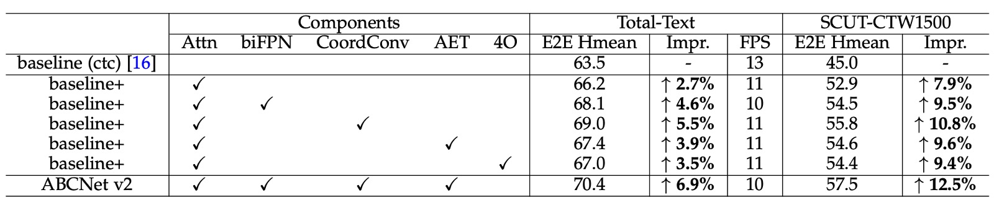
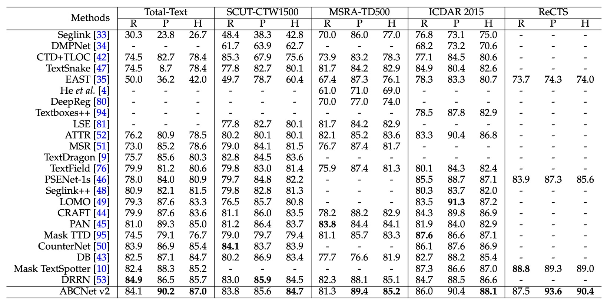
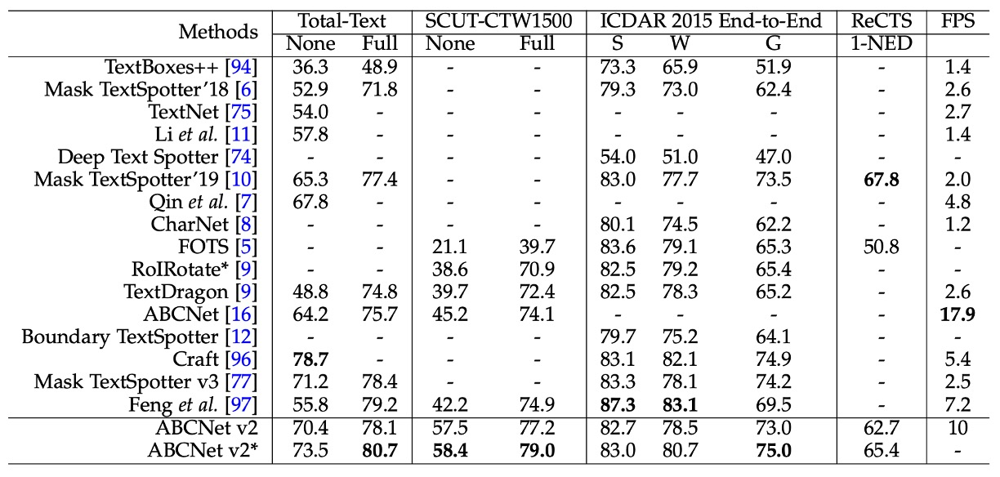

## The One-bit Challenge

[**ABCNet v2: Adaptive Bezier-Curve Network for Real-time End-to-end Text Spotting**](https://arxiv.org/abs/2105.03620)

---

After submitting the first version of the paper, the authors received feedback from reviewers, leading them to revise the paper, add new sections, and release an updated version as **ABCNet v2**. Since most of the content and training approach remains consistent with the first version, we will focus here on the new additions. For an overview of the core concepts of ABCNet, you may refer to our previous review:

- [**[20.02] ABCNet: The Greeting of Bezier Curves**](../2002-abcnet/index.md)

## Problem Definition

Inspired by several other works, the authors decided to enhance ABCNet. Their main references for this upgrade were:

1. [**[19.11] EfficientDet: Scalable and Efficient Object Detection**](https://arxiv.org/abs/1911.09070)

   - This paper introduces the BiFPN, an optimized version of the Feature Pyramid Network (FPN). The authors adopted this approach in ABCNet.

2. [**[18.07] An Intriguing Failing of Convolutional Neural Networks and the CoordConv Solution**](https://arxiv.org/abs/1807.03247)

   - This paper proposes CoordConv, highlighting the importance of spatial coordinate information for CNNs.

3. [**[20.03] SOLOv2: Dynamic and Fast Instance Segmentation**](https://arxiv.org/abs/2003.10152)
   - SOLOv2 implements CoordConv for instance segmentation, which the authors also integrated into ABCNet.

---

The upgraded ABCNet v2 introduces several innovations:

- **Bezier curve-based text representation.** (This feature remains from the first version.)
- **BezierAlign feature alignment method.** (Also retained from the original.)
- **BiFPN implementation**, a bidirectional multi-scale feature pyramid for global text features. (New addition.)
- **Adaptive end-to-end training strategy.** (New addition.)
- **Addition of a Chinese text recognition dataset**, enabling Chinese character recognition. (New addition.)
- **Model quantization** to enhance inference speed. (New addition.)

## Problem-Solving Strategies

Let’s review the newly introduced components in ABCNet v2.

### Model Architecture

### Coordinate Convolution Module

This module, known as CoordConv, addresses the limitations of traditional convolutional layers when mapping (x, y) coordinates to pixel space coordinates. Based on previous research, the authors incorporated relative coordinates directly into the feature map, creating a new feature map $f_{coord}$ enriched with coordinate information. This feature map is passed through three convolutional layers (kernel size 3, stride 1, padding 1) to enhance scene text detection performance.

### Attention-based Recognition Branch

The recognition branch consists of six convolutional layers, one bidirectional LSTM, and an attention module. During recognition, the model gradually predicts characters by using the previous hidden state and weighted sums. The character classes are set to 96 (for English letters) or 5462 (for bilingual recognition in Chinese and English). The attention weights are computed as follows:

$$
e_{t,s} = K^\top \tanh(W h_{t-1} + U h_s + b)
$$

Weighted sum:

$$
c_t = \sum_{s=1}^n a_{t,s} h_s
$$

Updating the hidden state:

$$
h_t = \text{GRU}((\text{embed}_{t-1}, c_t), h_{t-1})
$$

### Adaptive End-to-End Training (AET)

In ABCNet’s first version, only ground-truth Bezier curve alignments were used as inputs for the recognition branch during training, while detection results were used for feature cropping in testing. The authors observed potential error propagation issues when the detection results were less precise than ground-truth Bezier boundaries, impacting downstream tasks.

To address this, the authors proposed Adaptive End-to-End Training (AET), which operates as follows:

1. **Detection Result Filtering**: Detection results are first filtered by confidence thresholds, and Non-Maximum Suppression (NMS) is applied to remove redundant detections.

2. **Recognition Label Assignment**: Each detection result is assigned recognition labels by minimizing the sum of distances between the detected control points and the ground-truth control points. The formula is as follows:

   $$
   \text{rec} = \arg \min_{\text{rec}^* \in cp^*} \sum_{i=1}^n |cp^*_{x_i, y_i} - cp_{x_i, y_i}|
   $$

   where $cp^*$ represents ground-truth control points, and $n$ is the number of control points. This ensures that each detection result is paired with the closest possible ground-truth label.

3. **Label Set Update**: The new target labels are concatenated with the original ground-truth set, which is then used for further recognition training.

### Model Quantization

The authors explore model quantization, an approach to reduce model precision to improve inference speed—an area not commonly studied in text detection.

:::tip
Model quantization is a vast field, covering topics like dynamic quantization, static quantization, and hybrid quantization. Although the authors detail a set of quantization formulas, understanding the theory of model quantization may diverge from the core focus here. Readers interested in these details may wish to explore separate resources on model quantization theory.
:::

## Discussion

### Ablation Study

To evaluate the impact of each component, the authors conducted ablation studies on the Total-Text and SCUT-CTW1500 datasets. The main results are as follows:

1. **Attention-based Recognition Module**: Adding the attention-based recognition module improved accuracy by 2.7% on Total-Text and by 7.9% on SCUT-CTW1500.
2. **BiFPN Architecture**: Using the BiFPN architecture resulted in an additional improvement of 1.9% on Total-Text and 1.6% on SCUT-CTW1500, with only a minor reduction in inference speed (1 FPS), achieving a good balance between speed and accuracy.
3. **Coordinate Convolution (CoordConv)**: Incorporating CoordConv boosted results by 2.8% and 2.9% on the two datasets, respectively, with minimal additional computational cost.
4. **Adaptive End-to-End Training (AET)**: Implementing AET led to performance gains of 1.2% on Total-Text and 1.7% on SCUT-CTW1500.
5. **Bezier Curve Order**: The authors explored the effect of Bezier curve order. They found that regenerating labels with 4th-order Bezier curves and training ABCNet v2 to regress control points improved results, especially on the SCUT-CTW1500 dataset, which uses line-level annotations. However, using 5th-order Bezier curves on Total-Text led to a slight drop from 66.2% to 65.5% compared to the baseline, likely due to high-order curves introducing instability in control points, which complicates regression.

### Comparison of Text Detection Methods

Experiments on the detection task were conducted across four datasets, including two for arbitrarily-shaped text (Total-Text and SCUT-CTW1500), two for multi-oriented text (MSRA-TD500 and ICDAR 2015), and a bilingual dataset, ReCTS.

As shown in the table, the ABCNet v2 method achieved state-of-the-art performance on all datasets, surpassing previous best methods.

### Comparison of Text Recognition Methods

For end-to-end scene text spotting, ABCNet v2 achieved the best performance on the SCUT-CTW1500 and ICDAR 2015 datasets, significantly outperforming previous methods.

### Quantized Model Performance

<figure>

<figurecaption>“A/W” represent activation and weight bit-width configurations, respectively, while "†" indicates the use of a progressive training strategy.</figurecaption>
</figure>

---

The authors conducted an extensive analysis on the performance of quantized models.

Initially, they pre-trained the low-bit models on a synthetic dataset and then fine-tuned them on TotalText and CTW1500 for improved performance. The pre-training phase involved 260K iterations with a batch size of 8, starting with a learning rate of 0.01, which was reduced tenfold at the 160K and 220K iterations. For fine-tuning on TotalText, the batch size remained 8, with an initial learning rate of 0.001, and 5K iterations were conducted. The same configuration was used for fine-tuning on CTW1500, but with a total of 120K iterations, and the learning rate was reduced tenfold at the 80K iteration. All convolutional layers in the network were quantized, except for the input and output layers.

The results, shown in the table, highlight the following observations:

- **4-bit Models**: The performance of 4-bit models is nearly equivalent to that of full-precision models.

  - The 4-bit model pre-trained on the synthetic dataset achieved an end-to-end Hmean of 57.6%, which slightly outperforms the full-precision model’s 58.9%.
  - After fine-tuning on TotalText and CTW1500, the end-to-end Hmean of the 4-bit model was only 0.7% and 0.8% lower than the full-precision model, respectively.

  These results indicate significant redundancy in full-precision models for scene text detection tasks. The near-lossless performance in 4-bit models aligns with similar observations in image classification and object detection tasks.

- **1-bit Models (Binary Network, BNN)**: The binary network achieved an end-to-end Hmean of only 44.3%, showing a notable performance drop.
  - To address this, the authors proposed a progressive training strategy (indicated by †), gradually reducing the quantization bit-width (e.g., from 4-bit → 2-bit → 1-bit), which significantly improved BNN performance.
  - With the new training strategy, the BNN trained on the synthetic dataset achieved an end-to-end Hmean only 1.8% lower than the full-precision version (57.6% vs. 55.8%).

## Conclusion

This paper introduced several new components, including the attention-based recognition module, BiFPN structure, coordinate convolution, and a novel adaptive end-to-end training strategy.

The authors showcased a variety of training techniques and strategies, offering valuable insights with practical applications. This work is highly instructive, presenting many techniques that could be beneficial in real-world implementations.
