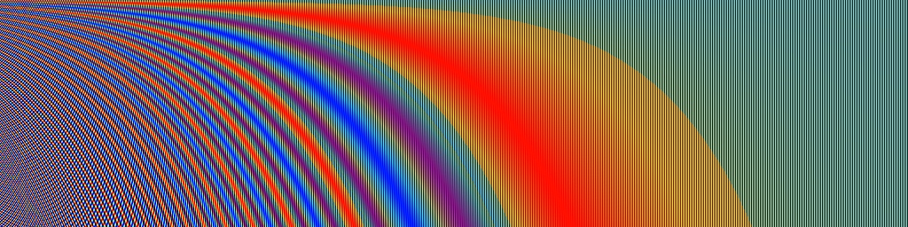

## The Dawn of a New Era

[**Attention Is All You Need**](https://arxiv.org/abs/1706.03762)

---

Unlike previous sequential models, the Transformer model introduced a new era of self-attention mechanisms.

This model no longer relies on recursive calculations of sequences but instead uses attention mechanisms for sequence modeling, making the training and inference processes more efficient.

## Problem Definition

In previous sequence modeling tasks, RNN and LSTM models were the mainstream.

However, these models have some issues during training and inference:

- **Limitations of Recursive Computation**: RNN and LSTM models require step-by-step computation of each element in the sequence during training, which makes it difficult for the models to perform efficient parallel computation.
- **Long-Distance Dependency Problem**: Due to the recursive computation method of RNN and LSTM models, they struggle to capture dependencies between distant positions in long sequences.

## Solving the Problem

### Model Design

<div align="center">
<figure style={{"width": "50%"}}>

</figure>
</div>

This is the Transformer model architecture diagram provided in the original paper.

Although this diagram is very concise (???), most people usually do not understand it at first glance.

Believe it or not, this is already simplified!

Let's write a simple code snippet to see how this model actually works:

### Input Layer

Here, the input is a sequence of data, represented as a tensor.

- First dimension: Batch size, referred to as `B`.
- Second dimension: Sequence length, referred to as `T`.
- Third dimension: Feature dimension, referred to as `D`.

Let's start with a simple example:

```python
input_text = ['你', '好', '啊', '。']
input_text_mapping = {
    '你': 0,
    '好': 1,
    '啊': 2,
    '。': 3
}
```

In this example, the input text is "你好啊。", with a total of 4 characters.

:::info
Here, we greatly simplify the entire training process to make it easier for you to understand.
:::

Next, convert this input into a tensor:

```python
import torch
import torch.nn as nn

input_tensor = torch.tensor([
    input_text_mapping[token]
    for token in input_text]
)
print(input_tensor)
# >>> tensor([0, 1, 2, 3])
```

Next, we embed each element:

```python
embedding = nn.Embedding(num_embeddings=4, embedding_dim=512)
embedded_input = embedding(input_tensor)
print(embedded_input)
# >>> tensor([[ 0.1,  0.2,  0.3,  ...,  0.4],
#             [ 0.5,  0.6,  0.7,  ...,  0.8],
#             [ 0.9,  1.0,  1.1,  ...,  1.2],
#             [ 1.3,  1.4,  1.5,  ...,  1.6]])
print(embedded_input.shape)
# >>> torch.Size([4, 512])
```

:::tip
Embedding is not a complex technique; it simply projects each element into a higher-dimensional space using a linear transformation layer.
:::

Finally, don't forget we need a 3D tensor as input, so we need to add a batch size dimension. In this example, the batch size is 1.

```python
embedded_input = embedded_input.unsqueeze(0)
print(embedded_input.shape)
# >>> torch.Size([1, 4, 512])
```

### Positional Encoding

In the original RNN and LSTM models, the model can capture dependencies in the sequence through the position of elements in the sequence. Therefore, we do not need to explicitly design positional encodings, as the model implicitly includes positional information during each iteration of the For-Loop.

However, in the Transformer architecture, there is no such implicit positional information; all we have are linear transformation layers. In these layers, each element is independent, without any relational information, and the internal representation lacks any correlation. Therefore, we need an additional positional encoding to help the model capture the positional information in the sequence.

In the paper, the authors propose a simple method for positional encoding using sine and cosine functions. For a given sequence position $pos$ and encoding dimension $i$, the positional encoding is calculated as:

$$
PE_{(pos, 2i)} = \sin\left(\frac{pos}{10000^{\frac{2i}{d_{model}}}}\right)
$$

$$
PE_{(pos, 2i+1)} = \cos\left(\frac{pos}{10000^{\frac{2i}{d_{model}}}}\right)
$$

Where:

- $pos$ is the position of the element in the sequence (starting from 0).
- $i$ is the index in the feature dimension (starting from 0).
- $d_{model}$ is the dimension of the positional encoding (usually the same as the feature dimension of the model input).

Let's implement a positional encoding function based on the above formula:

```python
import math
import torch

def sinusoidal_positional_encoding(length, dim):
    """ Sinusoidal positional encoding for non-recurrent neural networks.
        REFERENCES: Attention Is All You Need
        URL: https://arxiv.org/abs/1706.03762
    """
    if dim % 2 != 0:
        raise ValueError(
            'Cannot use sin/cos positional encoding with '
            f'odd dim (got dim={dim})')

    # position embedding
    pe = torch.zeros(length, dim)
    position = torch.arange(0, length).unsqueeze(1)
    div_term = torch.exp(
        (torch.arange(0, dim, 2, dtype=torch.float) * -(math.log(10000.0) / dim)))
    pe[:, 0::2] = torch.sin(position.float() * div_term)
    pe[:, 1::2] = torch.cos(position.float() * div_term)

    return pe
```

This function considers both sequence length and feature dimensions, providing each position with a fixed positional encoding.

Let's visualize the positional encoding, assuming a sequence length of 256 and a feature dimension of 512:

```python
import cv2
import numpy as np

pos_mask = sinusoidal_positional_encoding(256, 512)
pos_mask = pos_mask.numpy()
pos_mask = (pos_mask-pos_mask.max()) / (pos_mask.max()-pos_mask.min())
pos_mask = np.array(pos_mask * 255).astype(np.uint8)
pos_mask = cv2.applyColorMap(pos_mask, cv2.COLORMAP_JET)
```



:::tip
**What is the significance of the number 10000 in the formula?**

The number 10000 represents the scale of the positional encoding. By restricting the scale within a suitable range, it effectively captures the relationships between different positions while avoiding the adverse effects of excessively high or low frequencies.

If the number 10000 is changed to 100, the frequencies of the sine and cosine functions increase, causing positional encodings to repeat over shorter distances. This might reduce the model's ability to perceive relationships between distant positions as their encodings will appear more similar.
:::

After obtaining the positional encoding, we need to add it to the input embedding tensor:

```python
pos_emb = sinusoidal_positional_encoding(4, 512)
embedded_input = embedded_input + pos_emb
```

### Self-Attention Mechanism

After obtaining the input encoding, we can move on to the core part of the Transformer model: the self-attention mechanism.

Here, we need to prepare three transformation matrices:

1. **Query Matrix `W_q`.**

   First, declare a set of weights `W_q`, then multiply the input embedding tensor by the Query matrix to get the Query tensor.

   ```python
   W_q = nn.Linear(512, 512)
   query = W_q(embedded_input)
   print(query.shape)
   # >>> torch.Size([1, 4, 512])
   ```

2. **Key Matrix `W_k`.**

   Similarly, declare a set of weights `W_k`, then multiply the input embedding tensor by the Key matrix to get the Key tensor.

   ```python
   W_k = nn.Linear(512, 512)
   key = W_k(embedded_input)
   print(key.shape)
   # >>> torch.Size([1, 4, 512])
   ```

3. **Value Matrix `W_v`.**

   Finally, declare a set of weights `W_v`, then multiply the input embedding tensor by the Value matrix to get the Value tensor.

   ```python
   W_v = nn.Linear(512, 512)
   value = W_v(embedded_input)
   print(value.shape)
   # >>> torch.Size([1, 4, 512])
   ```

So, what exactly is this QKV stuff?

You can think of the transformation matrices as projections.

Projections mean "viewing from a different perspective."

The QKV process involves three different projections of the input, followed by the self-attention mechanism calculations.

---

The second step of the self-attention mechanism is to calculate the attention scores.

$$
\text{Attention}(Q, K, V) = \text{softmax}\left(\frac{QK^\top}{\sqrt{d_k}}\right)V
$$

In this step, we perform a dot product between the Query tensor and the Key tensor.

```python
attn_maps = torch.matmul(query, key.transpose(-2, -1))
print(attn_maps.shape)
# >>> torch.Size([1, 4, 4])
```

This gives us an attention score matrix of size 4x4.

In this example, it explores the relationships between [你, 好, 啊, 。] (you, good, ah, .).

In the formula, you'll see `1/sqrt(d_k)`, which scales the attention scores to prevent them from becoming too large or too small.

```python
attn_maps = attn_maps / math.sqrt(512)
```

Next is the Softmax operation:

```python
attn_maps = F.softmax(attn_maps, dim=-1)
```

:::tip
**Why use Softmax? Why not Sigmoid?**

The Softmax function converts all attention scores into a probability distribution, ensuring the total attention score sums to 1. This allows better weighting of

each position. Additionally, the Softmax function has a competition mechanism, enabling the model to differentiate between positions more effectively.
:::

After calculating the attention map, we can perform a weighted sum of the Value tensor:

```python
attn_output = torch.matmul(attn_maps, value)
print(attn_output.shape)
# >>> torch.Size([1, 4, 512])
```

Finally, apply residual connections:

```python
attn_output = embedded_input + attn_output
```

### Multi-Head Attention Mechanism

After understanding the above section, your next question might be: "What if we want multiple attention scores instead of just one for each position?"

The authors also thought of this, so they proposed the **multi-head attention mechanism**.

In the multi-head attention mechanism, we prepare multiple sets of QKV matrices and perform self-attention calculations for each set.

<div align="center">
<figure style={{"width": "70%"}}>

</figure>
</div>

Although the concept is to have multiple heads, in practice, we do not prepare multiple sets of QKV matrices. Instead, we split the original QKV matrices into multiple sub-matrices and perform self-attention calculations on each sub-matrix, like this:

```python
# Split into multiple heads
Q = Q.view(Q.size(0), Q.size(1), self.num_heads, self.head_dim).transpose(1, 2)
K = K.view(K.size(0), K.size(1), self.num_heads, self.head_dim).transpose(1, 2)
V = V.view(V.size(0), V.size(1), self.num_heads, self.head_dim).transpose(1, 2)
```

However, this is too engineering-focused and does not introduce new concepts, so we will not delve deeper here.

### Cross-Attention Mechanism

In the Transformer architecture, the attention mechanisms in the Encoder and Decoder are similar but have some differences.

In the Encoder, we perform self-attention calculations for each position in the sequence; in the Decoder, besides self-attention calculations for each position, we also need to perform attention calculations on the Encoder's output, which is known as **cross-attention**.

The Decoder consists of two parts: the first part performs self-attention on its own sequence, and the second part performs cross-attention on the Encoder's output. We have covered self-attention; now let's discuss cross-attention calculations.

Again, we need to prepare three transformation matrices:

1. **Query Matrix `W_q`.**

   First, declare a set of weights `W_q`, multiply the Decoder's input embedding tensor by the Query matrix to get the Query tensor. The length of `decoder_input` can be different from `encoder_output`. If we encounter a translation problem, this length might be 10.

   ```python
   W_q = nn.Linear(512, 512)
   decoder_query = W_q(decoder_input)
   print(decoder_query.shape)
   # >>> torch.Size([1, 10, 512])
   ```

   :::tip
   Here, the input is `decoder_input`.
   :::

2. **Key Matrix `W_k`.**

   Similarly, declare a set of weights `W_k`, multiply the Encoder's output embedding tensor by the Key matrix to get the Key tensor.

   ```python
   W_k = nn.Linear(512, 512)
   encoder_key = W_k(encoder_output)
   print(encoder_key.shape)
   # >>> torch.Size([1, 4, 512])
   ```

   :::tip
   Here, the input is `encoder_input`.
   :::

3. **Value Matrix `W_v`.**

   Finally, declare a set of weights `W_v`, multiply the Encoder's output embedding tensor by the Value matrix to get the Value tensor.

   ```python
   W_v = nn.Linear(512, 512)
   encoder_value = W_v(encoder_output)
   print(encoder_value.shape)
   # >>> torch.Size([1, 4, 512])
   ```

   :::tip
   Here, the input is `encoder_input`.
   :::

The subsequent steps are the same as the self-attention mechanism: first, calculate the attention map:

```python
attn_maps = torch.matmul(decoder_query, encoder_key.transpose(-2, -1))
print(attn_maps.shape)
# >>> torch.Size([1, 10, 4])
```

Then, perform scaling and Softmax:

```python
attn_maps = attn_maps / math.sqrt(512)
attn_maps = F.softmax(attn_maps, dim=-1)
```

Finally, perform a weighted sum of the Value tensor:

```python
attn_output = torch.matmul(attn_maps, encoder_value)
print(attn_maps.shape)
# >>> torch.Size([1, 10, 4])
print(encoder_value.shape)
# >>> torch.Size([1, 4, 512])
print(attn_output.shape)
# >>> torch.Size([1, 10, 512])
```

:::info
In the self-attention phase of the Decoder, a mask operation is typically added to ensure that during decoding, future information cannot be seen. This mask is usually an upper triangular matrix, ensuring that the Decoder can only see the generated part during decoding.

```python
def _generate_square_subsequent_mask(
    sz: int,
    device: torch.device = torch.device(torch._C._get_default_device()),  # torch.device('cpu'),
    dtype: torch.dtype = torch.get_default_dtype(),
) -> Tensor:
    r"""Generate a square causal mask for the sequence.

    The masked positions are filled with float('-inf'). Unmasked positions are filled with float(0.0).
    """
    return torch.triu(
        torch.full((sz, sz), float('-inf'), dtype=dtype, device=device),
        diagonal=1,
    )
```

:::

### Feed-Forward Network

After the self-attention mechanism, we need to pass through a simple feed-forward network to extract features.

```python
ffn = nn.Sequential(
    nn.Linear(512, 2048),
    nn.ReLU(),
    nn.Linear(2048, 512)
)
ffn_output = ffn(attn_output)
output = attn_output + ffn_output
print(output.shape)
# >>> torch.Size([1, 4, 512])
```

This feed-forward network is a typical fully connected network. Here, we use two fully connected layers with a ReLU activation function in between.

Additionally, there is an expand-dim operation in the module, usually with an expansion factor of 4. This operation is similar to the concept of the Inverted Residual Bottleneck Block proposed in MobileNet-V2. The main purpose is to improve the model's nonlinear representation ability by expanding the dimensions and then compressing them.

### Layer Normalization

We haven't mentioned `LayerNorm` yet.

This operation is straightforward. After understanding all the steps above, it just takes a few lines of code.

In each step, we should apply `LayerNorm` to each output. There are two types: Norm-First and Norm-Last, depending on your model architecture. We will discuss this in more detail in other papers.

```python
norm1 = nn.LayerNorm(512)
attn_output = norm1(embedded_input + attn_output)

# ...

norm2 = nn.LayerNorm(512)
output = norm2(attn_output + ffn_output)
```

:::tip
**Why not use Batch Normalization?**

Sequence data relies more on its characteristics than those of batch data. Therefore, `LayerNorm` is more suitable than `BatchNorm` in this context.
:::

## Discussion

### Why Use Self-Attention?

<div align="center">
<figure style={{"width": "80%"}}>

</figure>
</div>

In short, it's fast.

---

The authors summarized the computational complexity of RNN, CNN, and Self-Attention, as shown in the figure above.

The author summarizes the computational complexity of RNN, CNN, and Self-Attention as shown in the diagram above.

1. **Self-Attention Layer (Unrestricted)**:

   - **Per-layer complexity:** $\mathcal{O}(n^2 \cdot d)$: In the self-attention mechanism, each input token (with sequence length $n$) must compute attention with all other tokens, forming a complete $n \times n$ attention matrix. Each matrix element requires computation based on a $d$-dimensional embedding, so the total complexity of the attention matrix is $\mathcal{O}(n^2 \cdot d)$.
   - **Sequential computation:** $\mathcal{O}(1)$: The entire attention matrix can be computed in parallel, and all comparisons can happen simultaneously.
   - **Maximum path length:** $\mathcal{O}(1)$: Since each token can directly connect to any other token via the attention mechanism, the maximum path length is just one step.

2. **RNN**:

   - **Per-layer complexity:** $\mathcal{O}(n \cdot d^2)$: The recurrent layer processes each token sequentially. The computation for each token involves combining the current token embedding (with $d$ dimensions) and the hidden state (also $d$-dimensional), resulting in an operational cost of $\mathcal{O}(d^2)$. Since $n$ tokens are processed, the overall complexity is $\mathcal{O}(n \cdot d^2)$.
   - **Sequential computation:** $\mathcal{O}(n)$: Due to the sequential nature of RNNs, each token must wait for the computation of the previous token before processing the next.
   - **Maximum path length:** $\mathcal{O}(n)$: In an RNN, the path length between two tokens depends on the number of intermediate tokens between them.

3. **CNN**:

   - **Per-layer complexity:** $\mathcal{O}(k \cdot n \cdot d^2)$: In the convolutional layer, a convolutional kernel of width $k$ slides over the entire sequence to compute local features. Each of the $n$ tokens requires computation on a $d$-dimensional embedding, and the cost of each convolution operation is proportional to $d^2$. Therefore, the total complexity is $\mathcal{O}(k \cdot n \cdot d^2)$.
   - **Sequential computation:** $\mathcal{O}(1)$: Each convolution filter can be applied to the entire sequence simultaneously.
   - **Maximum path length:** $\mathcal{O}(\log_k(n))$: Through stacking dilated convolution layers, the network can connect tokens that are farther apart in a logarithmic manner, with respect to $k$.

4. **Restricted Self-Attention Layer**:

   - **Per-layer complexity:** $\mathcal{O}(r \cdot n \cdot d)$: In this case, each token can only attend to a neighborhood of size $r$. The attention matrix becomes $n \times r$, but each matrix element still requires computation based on a $d$-dimensional embedding, so the overall complexity is $\mathcal{O}(r \cdot n \cdot d)$.
   - **Sequential computation:** $\mathcal{O}(1)$: Similar to the unrestricted self-attention layer, all comparisons can be performed simultaneously.
   - **Maximum path length:** $\mathcal{O}(\frac{n}{r})$: Since each token can only attend to a small neighborhood, the path length between two distant tokens increases to $\mathcal{O}(\frac{n}{r})$.

### Experimental Results: Machine Translation

<div align="center">
<figure style={{"width": "80%"}}>

</figure>
</div>

In the WMT 2014 English-German translation task, the Transformer (big) improved the BLEU score by over 2.0 points compared to the previous best models (including ensemble models), setting a new record of 28.4 BLEU. This model trained for 3.5 days using 8 P100 GPUs. Even the base model surpassed all previously published models and ensemble models at a significantly lower training cost.

In the WMT 2014 English-French translation task, the Transformer (big) achieved a BLEU score of 41.0, outperforming all previously published single models at a quarter of the training cost.

## Conclusion

The Transformer is a groundbreaking architecture that not only solves several problems of RNN and LSTM models but also improves the efficiency of model training and inference.

When it was first introduced, it didn’t make much of a splash.

Although Transformer was continuously and passionately discussed within the academic community for several years, it was widely known from natural language processing to computer vision fields. On the other hand, in the industrial sector, it was mostly engineers and researchers who took an interest in the topic.

---

However, when OpenAI's ChatGPT was released, everything changed.

Yes.

Everything changed.
