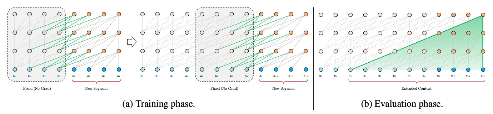
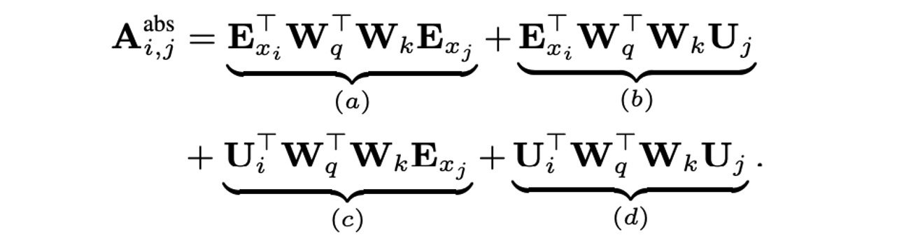
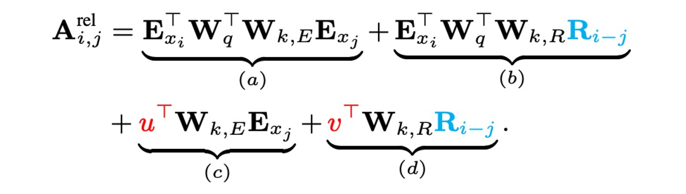

## Longer Contexts

[**Transformer-XL: Attentive Language Models Beyond a Fixed-Length Context**](https://arxiv.org/abs/1901.02860)

---

[**BERT**](../1810-bert/index.md) uses a fixed sequence length during training and prediction. But ideally, how should we input text for training?

- **The best way would be to input the entire text at once, regardless of its length!**

## Defining the Problem

But that's not feasible.

Reality is harsh, with limited computing power and memory. We can't input all the text at once. The authors identify several specific issues:

### Computational Resource Constraints

Training large models requires substantial computational resources, including high-performance GPUs or TPUs. Memory limits the text length that can be processed at once; too long texts cause memory overflow or excessive computation time. The attention mechanism of Transformers uses memory that grows quadratically with the context length, making it difficult to handle long texts.

### Context Fragmentation Problem

To fit within computational limits, texts are usually segmented into fixed-length chunks. This approach results in the loss of contextual information, hindering the model's ability to make accurate predictions. Fixed-length contexts restrict the model's predictive capacity, leading to suboptimal performance. The lack of cross-segment context information decreases the model's optimization efficiency, failing to capture long-term dependencies in the text.

:::info
For example, the BERT model has a context length of only 512 tokens. Therefore, when processing long texts, BERT segments the text into multiple chunks for processing.
:::

## Solving the Problem

### Model Architecture

The authors first address the context fragmentation problem by introducing a recurrence mechanism similar to those used in RNN models. In training, the hidden states from the previous segment are stored and reused when processing the next segment. This allows the model to leverage information from previous segments, effectively capturing long-term dependencies and avoiding context fragmentation.

For instance, suppose we have two consecutive segments, Segment A and Segment B. Traditionally, the model processes Segment B independently, unaware of Segment A. With the recurrence mechanism, the model can refer to Segment A’s hidden states while processing Segment B, providing richer contextual information.

Additionally, since the model can reuse previously computed states, there is no need to compute everything from scratch each time. In the evaluation phase, Transformer-XL’s speed was found to be 1,800 times faster than standard models.

### New Challenges

In a standard Transformer model, sequence order information is provided by position encodings, which indicate each token’s position in the sequence and are input along with the token embeddings.

If we use the same position encodings in the recurrence mechanism, the model cannot differentiate between identical positions in different segments, leading to performance degradation.

For example, consider the sentence: **"The cat sat on the mat."** split into two segments:

- Segment A: "The cat sat"
- Segment B: "on the mat."

In a standard Transformer, each word's position is determined by its absolute position in the sentence. If we use the same position encodings for both segments, the model cannot distinguish the relative positions. "on" and "The" would both be encoded as position 1, "the" and "cat" as position 2, etc., confusing the model about their actual positions in the sequence.

### Relative Position Encoding

In a standard Transformer, the attention scores between query vector $q_i$ and key vector $k_j$ can be decomposed into four terms:

These terms represent:

- $E_{x_i}^T W_q^T W_k E_{x_j}$: Content-based attention.
- $E_{x_i}^T W_q^T W_k U_j$: Attention related to the absolute position encoding of the key vector.
- $U_i^T W_q^T W_k E_{x_j}$: Attention related to the absolute position encoding of the query vector.
- $U_i^T W_q^T W_k U_j$: Attention related to the absolute position encoding of both query and key vectors.

This method has issues when reusing hidden states, as position encodings from different segments mix.

To resolve this, the authors propose relative position encoding, reparameterizing the four terms:

Each term now has an intuitive meaning:

- $E_{x_i}^T W_q^T W_k E_{x_j}$: Content-based attention.
- $E_{x_i}^T W_q^T W_k R_{i-j}$: Relative position bias related to content.
- $u^T W_k E_{x_j}$: Trainable parameter $u$ controlling global content bias.
- $v^T W_k R_{i-j}$: Trainable parameter $v$ controlling global position bias.

Improvements include:

- **Replacing Absolute Position Encoding**: Replacing the absolute position encoding $U_j$ used in terms (b) and (d) with their relative counterparts $R_{i-j}$. This indicates that only relative distance matters for determining attention priors. $R$ is a sinusoidal encoding matrix without learnable parameters.
- **Introducing Trainable Parameters**: Introducing trainable parameters $u$ and $v$ to replace the absolute position encoding of the query vector $U_i$ in terms (c) and (d). This suggests that attention bias for different tokens should remain the same regardless of the query position.

With these improvements, the authors developed the Transformer-XL architecture.

## Discussion

### Model Performance

Transformer-XL was applied to word-level and character-level language modeling datasets, including WikiText-103, enwik8, text8, the One Billion Word Benchmark, and Penn Treebank.

- **Table 1: WikiText-103**:

  - The largest word-level language modeling benchmark.
  - Contains 1.03M training tokens from 28K articles.
  - Attention length is 384 during training and 1600 during evaluation.
  - Uses adaptive softmax and input representations.
  - Transformer-XL reduced the state-of-the-art perplexity from 20.5 to 18.3.

- **Table 2: enwik8**:

  - Contains 100M bytes of unprocessed Wikipedia text.
  - Transformer-XL showed significant advantages over RNN-based models.
  - A 12-layer architecture achieved the same results as a 64-layer network with only 17% of the parameter budget.
  - Increasing model size to 18 and 24 layers achieved new state-of-the-art results.

- **Table 3: text8**:

  - Contains 100M processed Wikipedia characters with only 26 letters and spaces.
  - The same models and hyperparameters used for enwik8 were applied without further tuning.

- **Table 4: One Billion Word Benchmark**:
  - Tests short-term dependency modeling ability since sentences are shuffled.
  - Transformer-XL significantly outperformed models using standard Transformers.

:::tip
Perplexity (PPL) is a critical metric in NLP for evaluating language model performance. It measures how well a probability model predicts a sample. Lower perplexity indicates better predictive performance.

- **Calculation Formula**

  Given a language model's probability $P(W)$ for a sentence $W = w_1, w_2, ..., w_N$, perplexity is calculated as:

  $\text{PPL}(W) = P(W)^{-\frac{1}{N}} = \left( \prod_{i=1}^N P(w_i | w_1, w_2, ..., w_{i-1}) \right)^{-\frac{1}{N}}$

  For a dataset $D$:

  $\text{PPL}(D) = 2^{-\frac{1}{N} \sum_{i=1}^N \log_2 P(w_i | w_1, w_2, ..., w_{i-1})}$

  Here, $N$ is the total number of words in the dataset, and $P(w_i | w_1, w_2, ..., w_{i-1})$ is the conditional probability of word $w_i$. Lower perplexity indicates the model assigns higher probability to the correct word sequence.
  :::

### Ablation Studies

The authors examined the effectiveness of the recurrence mechanism and the new position encoding scheme:

1. **Effectiveness of Relative Position Encoding**:

   

   On WikiText-103, a dataset requiring long-term dependency modeling, the study compared relative and absolute position encoding under different conditions.

   The results, shown above, indicate that absolute position encoding is only effective for half losses, as it excludes very short attention lengths during training, allowing better generalization.

   The study concluded that both the recurrence mechanism and the new encoding scheme are essential for optimal performance and extending attention length during evaluation. Despite a backpropagation length of 128 during training, attention length could be increased to 640 during testing, reducing perplexity with increased attention length.

   :::tip
   The terms "full losses" and "half losses" refer to how loss is calculated during training, indicating the extent of the model's focus on different parts of the input segment.

   1. **Full losses**:

      - The model considers the prediction error across the entire input segment, including all positions from start to end. This demands a comprehensive understanding of the entire segment, including long-term dependencies.

   2. **Half losses**:
      - The model only considers prediction errors for the latter half of the input segment. This approach focuses more on recent content, which can improve generalization when distant information is less relevant.

   In the study, half losses performed better with absolute position encoding, suggesting reduced reliance on distant information.
   :::

2. **Effectiveness of the Recurrence Mechanism**:

   

   To isolate the impact of solving context fragmentation from capturing long-term dependencies, the authors used the One Billion Word Benchmark, which doesn't require long-term dependencies.

   Training a 20-layer Transformer-XL with approximately 0.3B parameters for 400K steps showed that segment-level recurrence significantly improved performance, confirming that the recurrence mechanism effectively addresses context fragmentation.

## Conclusion

Transformer-XL demonstrated remarkable capabilities in language modeling, achieving superior performance in perplexity and efficiently handling long-term dependencies compared to RNNs and standard Transformers.

Moreover, Transformer-XL significantly accelerates evaluation and generates coherent text, showing promise for applications in text generation, unsupervised feature learning, image, and speech modeling. It has the potential to be a vital tool in advancing existing technologies and developing new applications.
