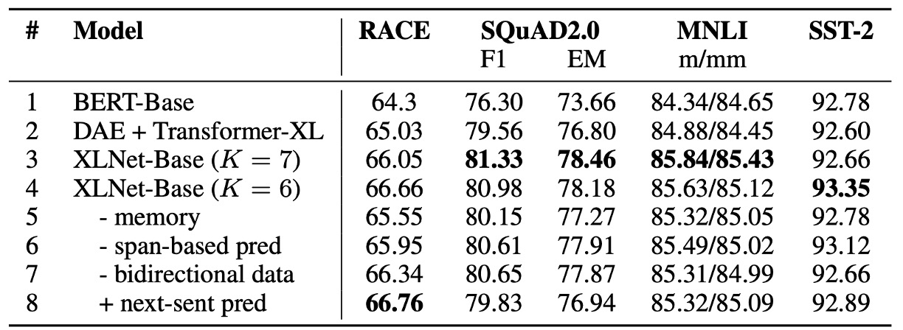

## Two-Stream Attention Mechanism

[**XLNet: Generalized Autoregressive Pretraining for Language Understanding**](https://arxiv.org/abs/1906.08237)

---

BERT’s success provided a lot of inspiration for further research in language models.

Earlier in 2019, the authors of this paper had already published **Transformer-XL**, a novel Transformer architecture that was capable of capturing long-range dependencies.

- [**[19.01] Transformer-XL: Longer Contexts**](../1901-transformer-xl/index.md)

However, the authors still felt this was insufficient, as Transformer-XL couldn’t fully leverage all contextual information simultaneously.

## Defining the Problem

In language modeling, there are two dominant approaches: autoregressive (AR) and autoencoding (AE).

BERT is a representative of autoencoding models, while GPT is an example of autoregressive models. Each has its pros and cons.

- **Autoregressive Models**

  Autoregressive models use a self-supervised training method that involves predicting the next word in a sequence, similar to a “language completion” task.

  Given a sequence of words $x = [x_1, \dots, x_T]$, an autoregressive language model maximizes the likelihood by a forward autoregressive factorization:

  $$
  \max_{\theta} \log p_{\theta}(x) =
  $$

  $$
  \sum_{t=1}^{T} \log p_{\theta}(x_t | x_{<t}) =
  $$

  $$
  \sum_{t=1}^{T} \log \frac{\exp(h_{\theta}(x_{1:t-1})^T e(x_t))}{\sum_{x'} \exp(h_{\theta}(x_{1:t-1})^T e(x'))}
  $$

  where $h_{\theta}(x_{1:t-1})$ is a contextual representation generated by a neural network, and $e(x)$ represents the embedding of a word.

  The limitation of this training approach is that it cannot capture all contextual information at once. This becomes problematic in language understanding tasks where full context is needed for proper comprehension.

- **Autoencoding Models**

  Autoencoding models use a different self-supervised training strategy, often called the Masked Language Model (MLM), popularized by BERT. During training, random words are masked and the model predicts the missing words from the context. The goal is to reconstruct the masked words $\bar{x}$ from the corrupted sequence $\hat{x}$:

  $$
  \max_{\theta} \log p_{\theta}(\bar{x}|\hat{x}) \approx \sum_{t=1}^{T} m_t \log p_{\theta}(x_t | \hat{x}) =
  $$

  $$
  \sum_{t=1}^{T} m_t \log \frac{\exp(H_{\theta}(\hat{x})^T_t e(x_t))}{\sum_{x'} \exp(H_{\theta}(\hat{x})^T_t e(x'))}
  $$

  where $m_t = 1$ indicates that $x_t$ was masked, and $H_{\theta}$ represents the hidden representation generated by the Transformer. In this case, the model can capture both past and future context.

  However, this creates a mismatch between training and prediction, as the masked tokens do not exist during inference. Furthermore, BERT’s architecture prevents it from modeling joint probabilities directly, unlike autoregressive models.

The authors sought to develop an autoregressive language model that could still leverage the full context for tasks requiring comprehension:

**This model is XLNet!**

## Solving the Problem

### Permutation Language Modeling

Permutation Language Modeling is a novel objective introduced by the authors, designed to combine the strengths of autoregressive models (predicting words based on previous context) with those of BERT (capturing bidirectional context).

For example, for a sequence of length $T$ (such as “The cat sat on the mat,” which has six words), there are $T!$ possible permutations of the sequence.

```
Permutation 1: "sat the on mat cat The"
Permutation 2: "on The mat the cat sat"
Permutation 3: ...
```

During training, the model randomly selects a permutation and predicts the next word according to this new order.

Let $Z_T$ represent the set of all possible permutations of an index sequence of length $T$. The objective of permutation language modeling can be written as:

$$
\max_{\theta} \mathbb{E}_{z \sim Z_T} \left[ \sum_{t=1}^{T} \log p_{\theta}(x_{z_t} | x_{z\_{<t}}) \right]
$$

### Two-Stream Self-Attention


To implement permutation language modeling, the authors introduce a **Two-Stream Self-Attention** mechanism.

Importantly, **only the factorization order is permuted, not the word order within the sentence**. This means the natural order of the words is maintained, but a masking mechanism controls the prediction order during training.

For example, given a sequence $x = [x_1, x_2, x_3, x_4]$, the prediction order might be $x_3 → x_2 → x_4 → x_1$.

The model predicts each word's probability based on this order while maximizing the likelihood of the sequence.

The two streams in this mechanism refer to two types of hidden states:

- **Content Stream**

    <div align="center">
    <figure style={{"width": "60%"}}>
  
  </figure>
  </div>

  The content stream $h_{\theta}(x_{z \leq t})$ contains the full context, including the information about the target word $x_{z_t}$. This means that when predicting a word, the content stream has access to the entire sequence, including the current word.

  The content stream is updated like in a standard Transformer model, where the queries ($Q$), keys ($K$), and values ($V$) are calculated based on all the words in the sequence. This allows the model to aggregate information across the whole context.

  For example, if the sequence is "A, B, C, D" and the model is predicting "C", the content stream can see the entire sequence, including "C" itself.

- **Query Stream**

    <div align="center">
    <figure style={{"width": "60%"}}>
  
  </figure>
  </div>

  The query stream generates a representation based on the target position but without directly accessing the target word’s content. It relies on the context to predict the word at that position, preventing the model from “cheating” by looking ahead.

  The query stream $g_{\theta}(x_{z < t}, z_t)$ only considers the context $x_{z<t}$ and the target position $z_t$, **excluding the target word $x_{z_t}$**. This forces the query stream to infer the target word based on its position and surrounding words.

In practice, predicting the entire sequence for each permutation would be inefficient, so the authors use a **partial prediction strategy**, where only a subset of the sequence (usually the last few tokens) is predicted. This allows the model to leverage longer contexts for more informed predictions.

:::tip
BERT also uses partial prediction, masking only 15% of words.
:::

### Revisiting Partial Prediction Mechanism

Partial prediction means the model only predicts some words in the sequence during training, not every word.

For BERT, this is necessary because masking all words would leave the model with too little context for meaningful predictions. Similarly, XLNet uses partial prediction to reduce optimization difficulty by focusing on words with enough context.

For instance, in the sentence "New York is a city," the model might predict only "New" and "York".

- **BERT’s Problem: Independence Assumption**

  BERT assumes that the words it predicts are independent of each other. It predicts each masked word in isolation, ignoring the potential dependencies between them.

  In this example, BERT treats “New” and “York” as separate predictions, aiming for:

  $$
      \mathcal{J}_{\text{BERT}} = \log p(\text{New} | \text{is a city}) + \log p(\text{York} | \text{is a city})
  $$

  This means that BERT predicts "New" and "York" based only on the context "is a city," without considering the relationship between "New" and "York."

- **XLNet’s Advantage: Capturing Dependencies**

  In contrast, XLNet can capture the dependencies between words because of its autoregressive prediction. As it processes the sequence in an autoregressive manner, the model can use previously predicted words as context.

  For example, XLNet might process the sequence in the order "is → a → city → New → York." By the time it predicts "York," it already knows "New," allowing it to learn the relationship between the two words.

  XLNet’s objective can be written as:

  $$
  \mathcal{J}_{\text{XLNet}} = \log p(\text{New} | \text{is a city}) + \log p(\text{York} | \text{New, is a city})
  $$

  This shows that XLNet predicts "York" based on both "New" and "is a city," capturing the word dependencies that BERT overlooks.

Thus, XLNet learns richer dependencies between words, extracting more useful information during training.

In short, XLNet can learn more dependencies between words, leading to denser training signals and more effective learning than BERT.

## Discussion

### Fair Comparison with BERT


Here, the authors conduct a fair comparison between BERT and XLNet to isolate the improvements from the increased data and those from the architectural improvements of XLNet.

The table above compares the best performance of three BERT variants against XLNet, trained with the same data and hyperparameters. XLNet consistently outperforms BERT across all datasets under identical settings.

### Comparison with RoBERTa

<figure>

<figcaption align="center">Reading Comprehension and Document Ranking</figcaption>
</figure>

<figure>

<figcaption align="center">Question Answering</figcaption>
</figure>

<figure>

<figcaption align="center">Text Classification</figcaption>
</figure>

<figure>

<figcaption align="center">Natural Language Understanding</figcaption>
</figure>

---

Following the release of this paper, other pretraining models like RoBERTa and ALBERT emerged.

- [**[19.07] RoBERTa: A Guide to Training BERT**](../1907-roberta/index.md)
- [**[19.09] ALBERT: A Compact Version of BERT**](../1909-albert/index.md)

To compare with RoBERTa fairly, the authors conducted experiments using the same hyperparameters and full dataset. The results show that XLNet outperforms both BERT and RoBERTa across reading comprehension, question answering, text classification, and natural language understanding tasks.

Two key observations stand out:

1. For tasks like SQuAD and RACE, which require explicit reasoning and involve longer contexts, XLNet performs significantly better. This advantage is likely due to its use of the Transformer-XL architecture.
2. Even in tasks with large amounts of labeled data, such as MNLI (with over 390k samples), Yelp (560k samples), and Amazon (3 million samples), XLNet still improves performance significantly.

:::info
The authors exclude ALBERT from this comparison due to its use of a much larger hidden layer size (up to 4096), which drastically increases computation (measured by FLOPs), making it difficult to draw meaningful conclusions.
:::

### Ablation Study



The authors performed an ablation study to validate the importance of each design choice in XLNet and how they contribute to the model’s performance.

The table above compares six different variants of XLNet-Base (rows 3 to 8), the original BERT-Base (row 1), and a Transformer-XL-based model using BERT’s denoising autoencoding objective but with bidirectional input (row 2).

All models use the same 12-layer architecture and hyperparameters as BERT-Base and are trained on Wikipedia and BooksCorpus datasets, with results being the median of five runs.

- **The Advantage of Permutation Language Modeling and Transformer-XL** (comparing rows 1 to 4):

  Compared to BERT-Base (row 1), the XLNet-Base model with Transformer-XL and permutation language modeling performs significantly better across all datasets. This indicates that these two design choices play a major role in XLNet's superiority over BERT.

- **The Importance of Memory Caching** (row 5):

  Removing the memory caching mechanism leads to a significant drop in performance, especially on the RACE task, which involves longer contexts. This shows that memory caching is crucial for handling long-range dependencies.

- **The Role of Segment-Level Recurrence and Bidirectional Input** (rows 6 and 7):

  Removing segment-level recurrence and bidirectional input also results in lower performance, demonstrating their contribution to XLNet’s effectiveness.

- **The Impact of Next Sentence Prediction** (row 8):

  Interestingly, BERT’s Next Sentence Prediction objective does not significantly improve XLNet’s performance. As a result, the authors excluded this objective in XLNet’s final design.

## Conclusion

XLNet builds on the strengths of Transformer-XL and introduces the permutation language modeling objective, combining the advantages of both autoregressive and autoencoding models. In a fair comparison, XLNet consistently outperforms BERT and RoBERTa across a wide range of natural language processing tasks, especially in tasks requiring long-range context.

With these innovations, XLNet emerges as one of the most powerful language models, offering valuable new perspectives for the future of language modeling research.

By the end of 2019, XLNet was undoubtedly the most powerful LM architecture available.
