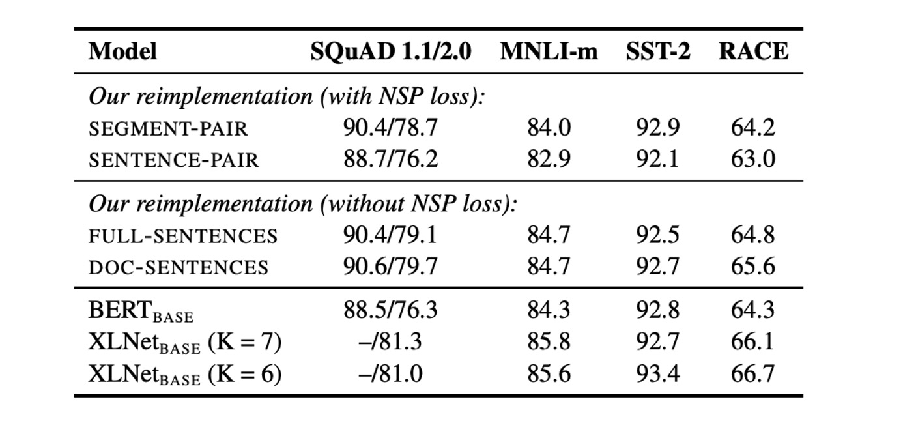
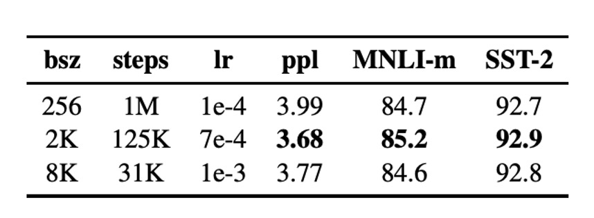

# [19.07] RoBERTa

## A Guide to Training BERT

[**RoBERTa: A Robustly Optimized BERT Pretraining Approach**](https://arxiv.org/abs/1907.11692)

---

BERT’s success inspired a wave of subsequent research, and this paper revisits its design with a focus on optimization. Through a series of experiments, the authors discovered several areas where BERT could be improved significantly.

## Defining the Problem

Let’s begin by reviewing the key aspects of BERT's design:

BERT's pretraining involves two main objectives: Masked Language Modeling (MLM) and Next Sentence Prediction (NSP).

BERT first undergoes pretraining on large-scale unlabelled text, followed by fine-tuning on labelled data.

Built on a Transformer architecture, BERT consists of L layers of Transformers, each with A self-attention heads, and hidden layers of dimension H.

BERT’s pretraining objectives consist of:

- **Masked Language Modeling (MLM)**:

  - Randomly masking 15% of the tokens in the input sequence, where the objective is to predict the masked tokens. Of the selected tokens, 80% are replaced with a [MASK] token, 10% remain unchanged, and 10% are replaced with random tokens.

- **Next Sentence Prediction (NSP)**:
  - NSP is a binary classification task that predicts whether two segments of text are consecutive. Positive samples come from contiguous sentences, while negative samples are from different documents. Each type of sample represents 50% of the training data.

BERT uses the Adam optimizer with the following hyperparameters:

- $\beta_1 = 0.9$, $\beta_2 = 0.999$, and L2 regularization with a weight decay of 0.01.
- The learning rate gradually increases to a peak of 1e-4 over the first 10,000 steps and then decays linearly.
- A dropout probability of 0.1 is applied to all layers, and GELU activation functions are used.
- Pretraining continues for 1,000,000 updates, with a batch size of 256 sequences, each with a maximum sequence length of 512 tokens.

BERT was trained on a combination of the BOOKCORPUS and English WIKIPEDIA datasets, which together amount to 16GB of uncompressed text.

---

The authors of RoBERTa assert that many of these design choices can be improved, and they set out to optimize BERT in several key areas.

## Solving the Problem

### Optimization of Implementation Details

Most hyperparameters follow the original BERT optimization settings, except for adjustments in the peak learning rate and the number of warm-up steps, which vary depending on the specific settings.

The authors found that training is highly sensitive to the epsilon value in the Adam optimizer, with adjustments potentially improving performance or stability. When using larger batch sizes, setting $\beta_2 = 0.98$ also enhances stability.

Unlike some prior work, the authors did not introduce shorter sequences during the first 90% of the updates, opting instead to use full-length sequences (up to 512 tokens) throughout the entire pretraining phase.

Training was conducted using mixed-precision floating-point computation on DGX-1 machines, each equipped with 8 × 32GB Nvidia V100 GPUs.

### Optimizing the Training Data

Pretraining BERT-like models requires a large corpus of text data. Prior research showed that increasing the dataset size generally improves performance in downstream tasks.

Though many studies used larger and more diverse datasets than the original BERT, not all of these additional datasets are publicly available. In their experiments, the authors collected as much data as possible to ensure high data quality and quantity.

In the end, the authors utilized five different English corpora of varying sizes and domains, totaling over 160GB of uncompressed text:

1. **BOOKCORPUS** and **WIKIPEDIA**: The same datasets used in the original BERT training (16GB).
2. **CC-NEWS**: English news articles from the CommonCrawl News dataset, spanning from September 2016 to February 2019, containing 63 million articles (after filtering, 76GB).

3. **OPENWEBTEXT**: An open-source recreation of the WebText dataset described by Radford et al. (2019), containing web pages linked from Reddit posts with at least three upvotes (38GB).

4. **STORIES**: A dataset introduced by Trinh and Le (2018), consisting of text from CommonCrawl that matches the Winograd schema story style (31GB).

:::tip
We put in a lot of effort, used ten times more data, and got a better model!

This is an internal joke, as the authors show that even without increasing data, modifying training strategies yields superior results.
:::

## Discussion

In the paper, the authors break down the key areas of improvement into several topics:

### Static Masking vs. Dynamic Masking

<figure style={{ "width": "60%"}}>

</figure>

The original BERT implementation used static masking, where the masks were applied once during preprocessing and reused for every epoch. To avoid training on the same masked patterns, the data was duplicated 10 times, allowing each sequence to be masked in 10 different ways over 40 epochs, with each masked version being seen four times.

Dynamic masking, on the other hand, generates new masking patterns each time the sequence is fed into the model, making it particularly useful for longer training steps or when larger datasets are used for pretraining.

Results showed that dynamic masking performed comparably to static masking, even showing a slight advantage. Therefore, the authors adopted dynamic masking for their experiments.

### Next Sentence Prediction (NSP)

In the original BERT, inputs consisted of two text segments, which could come from the same document or different documents, with the model learning whether these segments were from the same source (the NSP objective).

Some research had questioned the necessity of NSP, suggesting that removing it might not negatively affect performance.

To evaluate this, the authors compared several input formats:

- **SEGMENT-PAIR+NSP**: The same as original BERT, retaining the NSP loss, with input consisting of two segments.
- **SENTENCE-PAIR+NSP**: Input consists of two natural sentences, retaining NSP loss, but with shorter sequences than the 512-token maximum.
- **FULL-SENTENCES**: Input consists of full sentences, NSP loss is removed, and sequences may span document boundaries.
- **DOC-SENTENCES**: Similar to FULL-SENTENCES, but sequences do not cross document boundaries, and NSP loss is removed.

The results indicated that removing the NSP loss either matched or slightly improved downstream task performance.

### Large Batch Training

<figure style={{ "width": "60%"}}>

</figure>

Training with larger batch sizes improves optimization speed and downstream task performance. Original BERTBASE used a batch size of 256 sequences, with a total of one million training steps.

The results showed that increasing the batch size improved perplexity on MLM and downstream task accuracy. Larger batch training also facilitates distributed data parallelism. As a result, the authors opted to use a batch size of 8000 sequences for subsequent experiments.

### Tokenization

Byte-Pair Encoding (BPE) can handle large vocabularies in natural language. BPE treats subword units as the basic unit of text.

The original BERT used a vocabulary of 30K subword-level BPE tokens. In this paper, the authors experimented with a 50K byte-level BPE vocabulary without additional preprocessing or tokenization.

Initial experiments showed little difference in performance between the two, with byte-level BPE performing slightly worse in some tasks. However, due to its broader applicability, the authors used byte-level BPE in subsequent experiments.

### Training Data Size

The authors first used the same architecture as $BERT_{\text{LARGE}}$ (L = 24, H = 1024, A = 16, 355M parameters) and pretrained it on the same BOOKCORPUS and WIKIPEDIA datasets for 100K steps.

Using 1024 V100 GPUs, training took roughly one day.

Results showed that even with the same data, RoBERTa achieved significant improvements over the original $BERT_{\text{LARGE}}$, underscoring the importance of design choices.

:::tip
1024 V100 GPUs. (？？？)
:::

## Conclusion

Key areas of improvement highlighted in the paper:

1. Train the model for longer.
2. Use larger batches and train on more data.
3. Remove the "NSP" objective.
4. Train with longer input sequences.
5. Use dynamic masking on the training data.

RoBERTa achieves state-of-the-art results on the GLUE, RACE, and SQuAD benchmarks, without requiring multitask fine-tuning for GLUE or additional data for SQuAD. These results highlight the importance of previously overlooked design choices.

The lesson here can be generalized: a well-designed training setup can lead to significantly better model performance, a concept that applies across many domains.
