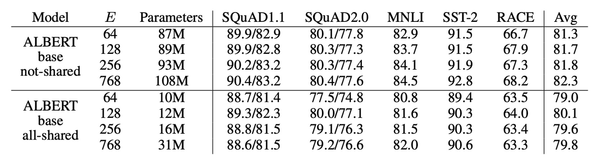
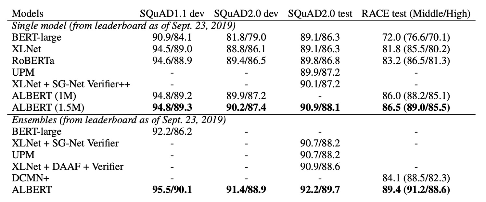

# [19.09] ALBERT

## A Compact Version of BERT

[**ALBERT: A Lite BERT for Self-supervised Learning of Language Representations**](https://arxiv.org/abs/1909.11942)

---

After BERT, there's still more BERT.

## The Problem

BERT, with its massive 340M parameters, is computationally expensive to train. While BERT serves as a baseline, subsequent research models have increasingly grown in size, with models reaching billions of parameters.

0.1B ➔ 0.3B ➔ 0.5B ➔ 1.0B ➔ 1.5B ➔ ？？？

The authors of this paper argue that models cannot simply keep growing in size. The resources required for training such models are becoming prohibitive.

- **We need a smaller BERT!**

## The Solution

ALBERT shares the same architecture as BERT but introduces several innovations to reduce model size and improve efficiency:

### Factorized Embedding Parameterization

In BERT and its successors (such as XLNet and RoBERTa), the size of the WordPiece embeddings $E$ and the hidden layers $H$ are tied together, with $E ≡ H$.

This has two main drawbacks:

- **From a modeling perspective**: WordPiece embeddings primarily learn context-independent representations, whereas hidden layer embeddings focus on context-sensitive representations. By decoupling $E$ and $H$, the model can allocate parameters more effectively. Hidden layers should have larger capacity ($H > E$).

- **From a practical perspective**: In natural language processing, the vocabulary size $V$ is usually very large. If $E ≡ H$, increasing $H$ significantly increases the size of the embedding matrix, which is of size $V \times E$. This can lead to models with billions of parameters, many of which are sparsely updated during training.

ALBERT addresses this by factorizing the embedding parameters into two smaller matrices:

- The one-hot vectors are first projected into a lower-dimensional embedding space of size $E$.
- They are then projected into the hidden layer space.

This factorization reduces the number of embedding parameters from $O(V \times H)$ to $O(V \times E + E \times H)$.

When $H > E$, the parameter count is significantly reduced!

:::tip
**Let’s look at an example.**

Suppose the vocabulary size $V$ is 30,000 and the hidden layer size $H$ is 1,024. In BERT, where $E ≡ H$, the embedding matrix has $V \times H = 30,000 \times 1,024 = 30,720,000$ parameters.

In ALBERT, if we set the embedding size $E$ to a smaller value like 128, the embedding matrix is factorized into two parts:

- The first part has $V \times E = 30,000 \times 128 = 3,840,000$ parameters.
- The second part has $E \times H = 128 \times 1,024 = 131,072$ parameters.

So, ALBERT’s total embedding parameter count is $3,840,000 + 131,072 = 3,971,072$, a significant reduction from BERT’s 30,720,000 parameters.

This not only reduces memory requirements but also improves computational efficiency.
:::

### Cross-layer Parameter Sharing

Several prior works have focused on improving model parameter efficiency:

- **Dehghani et al. (2018) with Universal Transformer (UT)**:

  - [**[18.07] Universal transformers**](https://arxiv.org/abs/1807.03819)

  They proposed a Universal Transformer and found it outperformed standard Transformers. Universal Transformer shares parameters across layers, a similar approach to ALBERT, enhancing the model’s learning capabilities, particularly with respect to time-stepping between different layers.

- **Bai et al. (2019) with Deep Equilibrium Models (DQE)**:

  - [**[19.09] Deep equilibrium models**](https://arxiv.org/abs/1909.01377)

  Their research showed that Deep Equilibrium Models (DQE) reach an "equilibrium" where the input and output embeddings for a layer become identical. This means that the model's representational power stabilizes at this equilibrium point, with no significant changes in the output.

ALBERT takes inspiration from these approaches, implementing **cross-layer parameter sharing** in several ways:

- Sharing only the parameters of the feed-forward network (FFN) across layers.
- Sharing only the attention mechanism parameters.

By default, ALBERT shares **all parameters across all layers**, unless otherwise specified. Through measuring L2 distance and cosine similarity, the authors analyzed the embedding behavior, showing that ALBERT’s embeddings exhibit **oscillating dynamics**, unlike the DQE model that converges.

ALBERT’s embeddings don’t reach a stable equilibrium like DQE, but rather maintain dynamic changes. These oscillations could offer unique advantages for ALBERT’s design and performance.

### Sentence-Order Prediction Loss (SOP)

In addition to the MLM loss, BERT also used an additional NSP (Next Sentence Prediction) loss. However, subsequent studies found that NSP was ineffective and removed it.

The authors hypothesize that NSP’s inefficacy comes from the task being too simple compared to MLM. NSP combines topic prediction and coherence prediction, with topic prediction being easier to learn and overlapping with MLM learning.

The authors emphasize that modeling sentence-level coherence is important for language understanding and propose the **Sentence-Order Prediction (SOP)** loss:

- Positive examples are the same as BERT, two consecutive segments from the same document.
- Negative examples are also two consecutive segments from the same document, but with their order swapped.

The model must predict which segment comes first, forcing it to learn more fine-grained distinctions in coherence.

## Discussion

### BERT vs. ALBERT: Overall Comparison

ALBERT’s design choices primarily focus on improving parameter efficiency.

As shown above, ALBERT-xxlarge uses only about 70% of BERT-large's parameters, yet it outperforms BERT in multiple downstream tasks, including SQuAD v1.1 (+1.9%), SQuAD v2.0 (+3.1%), MNLI (+1.4%), SST-2 (+2.2%), and RACE (+8.4%).

Additionally, ALBERT’s training throughput surpasses BERT’s. On the same TPU setup, ALBERT-large processes data 1.7 times faster than BERT-large, though ALBERT-xxlarge is slower, taking roughly three times as long as BERT-large due to its larger size.

### Embedding Parameter Factorization

The table above shows the impact of varying the embedding size $E$ on ALBERT-base.

For non-shared parameters (BERT-style), a larger embedding size yields slight performance improvements. However, in the fully parameter-shared (ALBERT-style) setup, $E = 128$ performs best.

Based on these results, the authors decided to use an embedding size of $E = 128$ in future model expansions.

### Cross-layer Parameter Sharing

The table above presents the results of experiments with different cross-layer parameter sharing strategies:

- Using ALBERT-base configuration ($E = 768$ and $E = 128$).

Fully sharing parameters impacts performance slightly in both settings, but with $E = 128$, the drop is minimal (-1.5). With $E = 768$, the drop is more significant (-2.5).

Most of the performance drop comes from sharing FFN parameters. Sharing attention parameters has almost no impact on performance with $E = 128$ (+0.1) but has a small negative impact with $E = 768$ (-0.7).

While dividing layers into groups and sharing parameters within each group could be considered, the experiments show that the smaller the group, the better the performance, but the more parameters are required.

Therefore, the authors ultimately chose the full parameter-sharing strategy as the default.

### The Effectiveness of Sentence-Order Prediction

The authors compared three types of cross-sentence loss conditions:

- None (XLNet and RoBERTa style).
- NSP (BERT style).
- SOP (ALBERT style).

Results show that NSP has no discriminative power for SOP tasks (accuracy of 52.0%, close to random), suggesting NSP mainly learns topic shifts. SOP performs well on the NSP task (78.9% accuracy) and even better on SOP tasks (86.5%).

Moreover, SOP significantly improves downstream performance on multi-sentence encoding tasks: SQuAD1.1 increases by 1%, SQuAD2.0 by 2%, and RACE by 1.7%.

### State-of-the-art Results on NLU Tasks

<figure>

<figcaption>ALBERT's performance on the GLUE benchmark</figcaption>
</figure>

---

<figure>

<figcaption>ALBERT's performance on SQuAD and RACE benchmarks</figcaption>
</figure>

---

Finally, the authors present state-of-the-art results in two fine-tuning settings: **Single-model** and **Ensemble** models:

- **Single-model**:
  - Median results of five runs are reported on the development set.
  - ALBERT uses the best configuration: ALBERT-xxlarge with both MLM and SOP loss functions and no dropout.
- **Ensemble models**:
  - Checkpoints are selected based on development set performance, ranging from 6 to 17 depending on the task.
  - On GLUE and RACE benchmarks, the predictions of multiple models are averaged, while in SQuAD, the prediction scores for multiple spans and the "unanswerable" decisions are averaged.

Both single and ensemble models demonstrate significant improvements over the previous state-of-the-art on three benchmarks:

- **GLUE**: ALBERT achieves a score of 89.4.
- **SQuAD 2.0**: F1 score reaches 92.2.
- **RACE**: Accuracy reaches 89.4.

ALBERT's performance on RACE is particularly impressive, with large gains over other models:

- +17.4% over BERT.
- +7.6% over XLNet.
- +6.2% over RoBERTa.
- +5.3% over DCMI+.

## Conclusion

ALBERT introduces innovative ways to improve parameter efficiency and introduces a more targeted loss function that enhances cross-sentence understanding. Its design has a profound impact on future large language models.

For those developing language models with limited resources, ALBERT is an excellent option!
