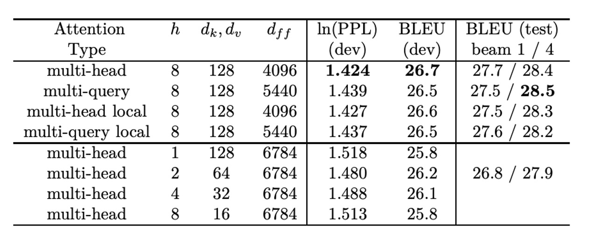

# [19.11] MQA

## Shared Key-Value Mechanism

[**Fast Transformer Decoding: One Write-Head is All You Need**](https://arxiv.org/abs/1911.02150)

---

In the age of the sharing economy, it seems that sharing can also be applied to the attention mechanism. This paper is authored by Noam Shazeer, one of the co-authors of the landmark paper "Attention is All You Need."

## Problem Definition

In this paper, the author points out that in the conventional attention mechanism, during the decoding process, each position computes over all key-value pairs. This results in a lot of redundant computations, especially due to the autoregressive nature of the output, where every step involves recalculating previous results.

The author identifies this as an inefficiency that can be optimized.

## Revisiting the Attention Mechanism

To understand how the author improves this inefficiency, we first need to revisit the original attention mechanism.

:::tip
Throughout this section, we’ll use the `einsum` operator extensively to represent matrix operations. If you're not familiar with this operator, you can refer to this article:

- [**Einsum is All you Need**](https://rockt.github.io/2018/04/30/einsum)

In this paper, the author uses `tf.einsum`. If you're more familiar with PyTorch, you can simply replace it with `torch.einsum`.

Let’s assume you're already proficient with the `einsum` operator now.
:::

:::warning
**Mathematical Warning:** The following sections contain detailed matrix operations. If you're not interested in the specifics, feel free to skip ahead to the conclusion:

- [**Conclusion**](#conclusion)
  :::

### Dot-Product Attention

We start with the dot-product attention mechanism, which deals with a single query vector and a set of key-value pairs.

```python
def DotProductAttention(q, K, V):
    """
    Dot-Product Attention on one query.
    Args:
    q: A vector of shape [k] (query)
    K: A matrix of shape [m, k] (keys)
    V: A matrix of shape [m, v] (values)

    Returns:
    y: A vector of shape [v] (output)
    """
    # Compute dot-product between query q and key matrix K, resulting in logits of shape [m]
    logits = tf.einsum("k,mk->m", q, K)

    # Apply softmax to logits to get the weights for each key, resulting in weights of shape [m]
    weights = tf.nn.softmax(logits)

    # Use the weights to compute a weighted sum of the value matrix V, resulting in output vector y of shape [v]
    y = tf.einsum("m,mv->v", weights, V)

    return y
```

This is the classic **dot-product attention mechanism**. It computes the similarity between the query and keys using a dot product and then applies those similarities as weights to the values, producing the final output.

### Multi-head Attention

Next, we look at multi-head attention, which combines several dot-product attention mechanisms to improve model performance.

In the function below, the parameter meanings are as follows:

- $d$: The dimensionality of the query vector
- $m$: The number of key-value pairs
- $h$: The number of attention heads
- $k$: The dimensionality of the linear projection for queries and keys
- $v$: The dimensionality of the linear projection for values

```python
import tensorflow as tf

def MultiheadAttention(x, M, P_q, P_k, P_v, P_o):
    """
    Multi-head Attention on one query.

    Args:
    x: A vector of shape [d], representing the query
    M: A matrix of shape [m, d], representing keys and values
    P_q: A tensor of shape [h, d, k], representing the linear projection for queries
    P_k: A tensor of shape [h, d, k], representing the linear projection for keys
    P_v: A tensor of shape [h, d, v], representing the linear projection for values
    P_o: A tensor of shape [h, d, v], representing the linear projection for output

    Returns:
    y: A vector of shape [d], representing the final output
    """

    # Linear projection of query x, resulting in shape [h, k]
    q = tf.einsum("d, hdk->hk", x, P_q)

    # Linear projection of keys and values in M
    # K is of shape [h, m, k], and V is of shape [h, m, v]
    K = tf.einsum("md, hdk->hmk", M, P_k)
    V = tf.einsum("md, hdv->hmv", M, P_v)

    # Compute logits as dot-product between query and key, resulting in shape [h, m]
    logits = tf.einsum("hk, hmk->hm", q, K)

    # Apply softmax to compute attention weights, resulting in shape [h, m]
    weights = tf.nn.softmax(logits)

    # Use weights to compute a weighted sum of values, resulting in shape [h, v]
    o = tf.einsum("hm, hmv->hv", weights, V)

    # Linear projection and combination of multi-head output, resulting in final output vector of shape [d]
    y = tf.einsum("hv, hdv->d", o, P_o)

    return y
```

### Batched Multi-head Attention

We can extend this further to handle batched inputs, which is typical in training scenarios.

```python
import tensorflow as tf

def MultiheadAttentionBatched(X, M, mask, P_q, P_k, P_v, P_o):
    """
    Multi-head Attention for batched inputs.

    Args:
    X: A tensor of shape [b, n, d], representing query vectors (batch size b, sequence length n, vector dimension d)
    M: A tensor of shape [b, m, d], representing keys and values (number of key-value pairs m)
    mask: A tensor of shape [b, h, n, m], used to mask out invalid attention positions
    P_q: A tensor of shape [h, d, k], representing the linear projection for queries
    P_k: A tensor of shape [h, d, k], representing the linear projection for keys
    P_v: A tensor of shape [h, d, v], representing the linear projection for values
    P_o: A tensor of shape [h, d, v], representing the linear projection for output

    Returns:
    Y: A tensor of shape [b, n, d], representing the final output
    """

    # Linear projection of query vectors X, resulting in shape [b, h, n, k]
    Q = tf.einsum("bnd, hdk->bhnk", X, P_q)

    # Linear projection of keys and values in M, with keys K of shape [b, h, m, k] and values V of shape [b, h, m, v]
    K = tf.einsum("bmd, hdk->bhmk", M, P_k)
    V = tf.einsum("bmd, hdv->bhmv", M, P_v)

    # Compute dot-product between query and key (logits), resulting in shape [b, h, n, m]
    logits = tf.einsum("bhnk, bhmk->bhnm", Q, K)

    # Apply mask and softmax to compute attention weights, resulting in shape [b, h, n, m]
    weights = tf.nn.softmax(logits + mask)

    # Use weights to compute a weighted sum of values, resulting in shape [b, h, n, v]
    O = tf.einsum("bhnm, bhmv->bhnv", weights, V)

    # Linear projection and combination of multi-head output, resulting in final output tensor of shape [b, n, d]
    Y = tf.einsum("bhnv, hdv->bnd", O, P_o)

    return Y
```

At this point, the author simplifies the assumptions for calculations and memory access:

1. $m = n$: The number of key-value pairs $m$ is assumed to be equal to the sequence length $n$.
2. $k = v = \frac{d}{h}$: According to the Transformer paper, the dimension of the query and key $k$ is set equal to the dimension of the value $v$, and both are proportional to the feature dimension $d$, with the number of heads $h$ as the factor.
3. $n ≤ d$: The sequence length $n$ is assumed to be less than or equal to the feature dimension $d$.

---

Based on these assumptions, the total computation complexity is $Θ(bnd^2)$, where $b$ is the batch size, $n$ is the sequence length, and $d$ is the feature dimension. This comes from the fact that each `tf.einsum` operation has a complexity of $O(bnd^2)$.

:::tip
For example, if we have 1000 sequences, each with a length of 100 and a vector dimension of 512, the computation will be roughly $1000 \times 100 \times 512^2$.
:::

For memory access, the total size of memory accessed is $O(bnd + bhn^2 + d^2)$:

- The first term $bnd$ comes from the input $X$, the key-value matrix $M$, the query $Q$, key $K$, value $V$, output $O$, and the final output $Y$.

- The second term $bhn^2$ comes from the logits and attention weights.
- The third term $d^2$ comes from the projection tensors $P_q$, $P_k$, $P_v$, and $P_o$.

The ratio of memory access to computation is:

$$
O\left(\frac{1}{k} + \frac{1}{bn}\right)
$$

The lower this ratio, the better performance on modern GPU/TPU hardware, which has significantly more computation power than memory bandwidth.

### Incremental Multi-head Attention

Another variant is incremental multi-head attention, used in autoregressive generation.

```python
import tensorflow as tf

def MultiheadSelfAttentionIncremental(x, prev_K, prev_V, P_q, P_k, P_v, P_o):
    """
    Multi-head Self-Attention for one step in incremental generation.

    Args:
    x: A tensor of shape [b, d], representing the current query vector
    prev_K: A tensor of shape [b, h, m, k], representing the previous key matrix
    prev_V: A tensor of shape [b, h, m, v], representing the previous value matrix
    P_q: A tensor of shape [h, d, k], representing the query projection matrix
    P_k: A tensor of shape [h, d, k], representing the key projection matrix
    P_v: A tensor of shape [h, d, v], representing the value projection matrix
    P_o: A tensor of shape [h, d, v], representing the output projection matrix

    Returns:
    y: A tensor of shape [b, d], representing the current step output
    new_K: A tensor of shape [b, h, m+1, k], representing the updated key matrix
    new_V: A tensor of shape [b, h, m+1, v], representing the updated value matrix
    """

    # Linear projection of query vector x, resulting in shape [b, h, k]
    q = tf.einsum("bd, hdk->bhk", x, P_q)

    # Update the key matrix by appending the new key vector to the previous key matrix, resulting in shape [b, h, m+1, k]
    new_K = tf.concat(
        [prev_K, tf.expand_dims(tf.einsum("bd, hdk->bhk", x, P_k), axis=2)],
        axis=2
    )

    # Update the value matrix by appending the new value vector to the previous value matrix, resulting in shape [b, h, m+1, v]
    new_V = tf.concat(
        [prev_V, tf.expand_dims(tf.einsum("bd, hdv->bhv", x, P_v), axis=2)],
        axis=2
    )

    # Compute logits as dot-product between query and key, resulting in shape [b, h, m]
    logits = tf.einsum("bhk, bhmk->bhm", q, new_K)

    # Compute attention weights using softmax, resulting in shape [b, h, m]
    weights = tf.nn.softmax(logits)

    # Compute weighted sum of values, resulting in shape [b, h, v]
    o = tf.einsum("bhm, bhmv->bhv", weights, new_V)

    # Linear projection and combination of multi-head output, resulting in shape [b, d]
    y = tf.einsum("bhv, hdv->bd", o, P_o)

    return y, new_K, new_V
```

The author continues to use the simplified assumptions and evaluates the performance for incremental inference.

In this context, the total computation complexity is still $\Theta(bnd^2)$, where $b$ is the batch size, $n$ is the sequence length, and $d$ is the feature dimension.

The total memory access is $\Theta(bn^2d + nd^2)$:

- The first term $bn^2d$ comes from reloading the key $K$ and value $V$ at every step, as these tensors grow with the sequence length $n$.
- The second term $nd^2$ comes from the linear projection matrices $P_q$, $P_k$, $P_v$, and $P_o$.

The ratio of memory access to computation becomes:

$$
\Theta\left(\frac{n}{d} + \frac{1}{b}\right)
$$

When $n ≈ d$ or $b ≈ 1$, this ratio approaches 1, indicating that memory bandwidth becomes the main bottleneck on modern hardware.

---

A straightforward optimization strategy is to increase the batch size, which reduces the memory access-to-computation ratio.

Another approach is to reduce the $\frac{n}{d}$ ratio, which is more challenging since it involves reloading the key and value tensors at every step. Techniques include limiting the sequence length $n$ or computing attention only within a local window, reducing the number of positions to attend to.

## Solution

To reduce the size of the key and value tensors, the author proposes removing the "head" dimension from the **keys** and **values** while retaining the multi-head structure for **queries**, reducing memory usage and improving efficiency.

### Multi-Query Attention

**Multi-Query Attention** is a variant of **Multi-Head Attention**. In traditional multi-head attention, each head has its own set of queries, keys, values, and outputs. In multi-query attention, however, all heads share a single set of keys and values, while only the queries maintain the multi-head structure. This reduces memory usage and improves inference speed.

```python
def MultiQueryAttentionBatched(X, M, mask, P_q, P_k, P_v, P_o):
    """
    Multi-Query Attention for batched inputs.

    Args:
    X: A tensor of shape [b, n, d], representing the query vectors
    M: A tensor of shape [b, m, d], representing the key-value matrix
    mask: A tensor of shape [b, h, n, m], used to mask invalid positions
    P_q: A tensor of shape [h, d, k], representing the query projection matrix
    P_k: A tensor of shape [d, k], representing the key projection matrix
    P_v: A tensor of shape [d, v], representing the value projection matrix
    P_o: A tensor of shape [h, d, v], representing the output projection matrix

    Returns:
    Y: A tensor of shape [b, n, d], representing the final output
    """

    # Linear projection of query vectors X, resulting in shape [b, h, n, k]
    Q = tf.einsum("bnd, hdk->bhnk", X, P_q)

    # Linear projection of keys and values, with keys K of shape [b, m, k] and values V of shape [b, m, v]
    K = tf.einsum("bmd, dk->bmk", M, P_k)
    V = tf.einsum("bmd, dv->bmv", M, P_v)

    # Compute dot-product between query and key, resulting in shape [b, h, n, m]
    logits = tf.einsum("bhnk, bmk->bhnm", Q, K)

    # Apply softmax to compute attention weights, considering the mask, resulting in shape [b, h, n, m]
    weights = tf.nn.softmax(logits + mask)

    # Compute weighted sum of values, resulting in shape [b, h, n, v]
    O = tf.einsum("bhnm, bmv->bhnv", weights, V)

    # Final linear projection and combination of outputs, resulting in shape [b, n, d]
    Y = tf.einsum("bhnv, hdv->bnd", O, P_o)

    return Y
```

The author also provides an implementation for **Incremental Multi-Query Self-Attention**:

```python
def MultiQuerySelfAttentionIncremental(x, prev_K, prev_V, P_q, P_k, P_v, P_o):
    """
    Incremental Multi-Query Self-Attention for one step.

    Args:
    x: A tensor of shape [b, d], representing the current query vector
    prev_K: A tensor of shape [b, m, k], representing the previous key matrix
    prev_V: A tensor of shape [b, m, v], representing the previous value matrix
    P_q: A tensor of shape [h, d, k], representing the query projection
    P_k: A tensor of shape [d, k], representing the key projection
    P_v: A tensor of shape [d, v], representing the value projection
    P_o: A tensor of shape [h, d, v], representing the output projection

    Returns:
    y: A tensor of shape [b, d], representing the output
    new_K: Updated key matrix, shape [b, m+1, k]
    new_V: Updated value matrix, shape [b, m+1, v]
    """

    # Linear projection of query vector, resulting in shape [b, h, k]
    q = tf.einsum("bd, hdk->bhk", x, P_q)

    # Update key and value matrices
    new_K = tf.concat([prev_K, tf.expand_dims(tf.einsum("bd, dk->bk", x, P_k), axis=2)], axis=2)
    new_V = tf.concat([prev_V, tf.expand_dims(tf.einsum("bd, dv->bv", x, P_v), axis=2)], axis=2)

    # Compute dot-product between query and key, resulting in shape [b, h, m]
    logits = tf.einsum("bhk, bmk->bhm", q, new_K)

    # Compute softmax weights
    weights = tf.nn.softmax(logits)

    # Compute weighted sum of values
    o = tf.einsum("bhm, bmv->bhv", weights, new_V)

    # Linear projection and combination of outputs
    y = tf.einsum("bhv, hdv->bd", o, P_o)

    return y, new_K, new_V
```

### Performance Analysis

Just like traditional multi-head attention, the computational complexity in incremental multi-query attention remains $\Theta(bnd^2)$, but the memory access is now $\Theta(bnd + bn^2k + nd^2)$.

By removing the "head" dimension from keys and values, memory consumption is greatly reduced while computational efficiency is significantly improved.

:::tip
For example, if the number of heads $h = 8$ and the key dimension $k = \frac{d}{h} = \frac{512}{8} = 64$, the memory consumption is reduced compared to traditional multi-head attention, where the access is $\Theta(bnd + bhn^2 + d^2)$, including a term dependent on the number of heads $h$.
:::

The ratio of memory access to computation becomes:

$$
\Theta\left(\frac{1}{d} + \frac{n}{dh} + \frac{1}{b}\right)
$$

Since the $\frac{n}{d}$ term is now reduced by a factor of $h$, the performance of incremental inference improves significantly.

:::tip

- **Traditional Multi-Head Attention Ratio**: $\Theta\left(\frac{n}{d} + \frac{1}{b}\right)$

  In traditional multi-head attention, the ratio of memory access to computation is influenced by the sequence length $n$ and the feature dimension $d$. When the sequence length approaches the feature dimension, this ratio nears 1, meaning memory access becomes the bottleneck for performance.

- **Multi-Query Attention Ratio**: $\Theta\left(\frac{1}{d} + \frac{n}{dh} + \frac{1}{b}\right)$

  By reducing the dimensions of the keys and values, the $\frac{n}{d}$ term is reduced by a factor of $h$. For example, with $h = 8$, the memory access is significantly lower, resulting in faster inference.

:::

Suppose you're working with a language model that processes a batch of $b = 128$ sequences, each with 100 tokens (sequence length $n = 100$) and each token having a vector dimension of $d = 512$.

For traditional multi-head attention, the "memory access-to-computation ratio" might be:

$$
\frac{n}{d} + \frac{1}{b} = \frac{100}{512} + \frac{1}{128} \approx 0.195 + 0.0078 = 0.2028
$$

For multi-query attention, assuming $h = 8$, this ratio becomes:

$$
\frac{1}{d} + \frac{n}{dh} + \frac{1}{b}
$$

$$
= \frac{1}{512} + \frac{100}{512 \times 8} + \frac{1}{128}
$$

$$
\approx 0.00195 + 0.0244 + 0.0078 = 0.03415
$$

As seen, multi-query attention effectively reduces the memory access-to-computation ratio, significantly improving inference efficiency.

### Training Strategy

The author evaluates the approach using the WMT 2014 English-to-German translation task.

They use a 6-layer encoder-decoder Transformer model with the following configuration:

- $d_{model} = 1024$
- $d_{ff} = 4096$
- Number of heads $h = 8$
- $d_k = d_v = 128$ with learned positional embeddings, and weight sharing between the token embedding layer and the output layer.

Training is done for 100,000 steps (20 epochs), with each batch containing 128 samples, each with an input sequence of 256 tokens and a target sequence of 256 tokens. The model is trained on a 32-core TPUv3 pod, with training taking approximately 2 hours per model.

In the multi-query attention model (MQA), the author replaces all the attention layers with multi-query attention and increases the hidden dimension of the feed-forward layers from 4096 to 5440 to maintain the total number of parameters as the baseline model.

## Discussion

### WMT14 EN-DE Results



The author reports perplexity per subword token. The multi-query attention model performs "slightly worse" than the baseline but outperforms other variants that reduce $h$, $d_k$, and $d_v$.

### Inference Time Improvements


In terms of training speed, tested on **TPUv2 (8 cores)** for each training step processing 32,768 tokens:

    - **Baseline model**: Each training step takes **433ms**.
    - **Multi-query model**: Each training step takes **425ms**, slightly faster than the baseline.

The per-token training time is:

- **Baseline model**:

  $$
  \frac{433}{32,768} = 13.2\mu s
  $$

- **MQA model**:

  $$
  \frac{425}{32,768} = 13.0\mu s
  $$

---

In the case of autoregressive generation, tested with 1024 sequences (each with 128 tokens, with each TPU core processing 128 sequences), the speed of incremental greedy decoding was measured:

- **Baseline model**:

  - The encoder took **222ms**, which translates to **1.7µs** per token.
  - The decoder took **47ms** per step, translating to **46µs** per token.

- **MQA model**:

  - The encoder took **195ms**, translating to **1.5µs** per token.
  - The decoder took **3.9ms** per step, translating to **3.8µs** per token, significantly faster than the baseline.

## Conclusion

Fast and efficient!

With almost no accuracy loss, the inference speed, especially in autoregressive models, improved by about 10x!

:::tip
This architecture was later adopted in `MobileNet V4`. Interested readers can check out the following article:

- [**[24.04] MobileNet-V4: Five Years of Evolution**](../../lightweight/2404-mobilenet-v4/index.md#mobile-mqa)
  :::
