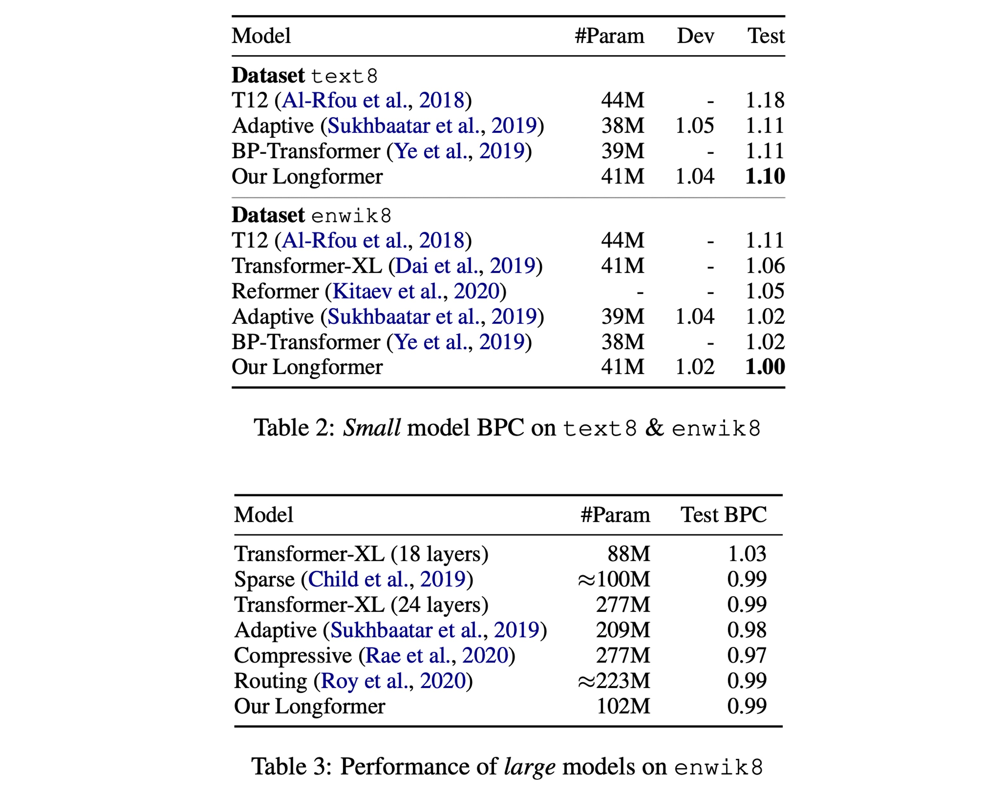

# [20.04] Longformer

## Long Attention Mechanism

[**Longformer: The Long-Document Transformer**](https://arxiv.org/abs/2004.05150)

---

The computational complexity of the Transformer’s self-attention mechanism is $O(n^2)$.

Whenever an algorithm exhibits such computational complexity, it indicates a significant room for optimization.

Wait, does this introduction sound familiar?

## Problem Definition

To address the computational complexity issue of the original Transformer, researchers have continuously sought optimization methods.

One approach is adopting the design principles of **Transformer-XL**, which handles long documents using a sliding window mechanism combined with an additional memory segment.

- [**Transformer-XL: Attentive to Longer Contexts**](../1901-transformer-xl/index.md)

However, the sliding window design has inherent limitations in bidirectional attention mechanisms.

Another approach is sparse attention mechanisms, such as the **Sparse Transformer** proposed a year before this paper.

- [**Sparse Transformer: Sparse Attention Mechanism**](../1904-sparse-transformer/index.md)

Previous studies on sparse attention mechanisms did not explore pre-training models and their generalization across various downstream tasks.

The motivation for this paper becomes clear:

1. Using “sparse attention mechanisms” for long contexts is a promising approach.
2. However, the design of the attention pattern needs optimization.
3. Moreover, pre-training frameworks should be introduced, and generalization across more downstream tasks should be tested.

## Solution

### Model Architecture

This paper is relatively straightforward to understand because the image above summarizes the core ideas.

The description is clear: the authors propose three types of sparse architectures to test the ability to handle long documents:

- The figure (a) shows the original attention mechanism, where each token attends to all other tokens.
- The figure (b) depicts Sliding Window Attention, where each token attends to a fixed range of tokens before and after it.
- The figure (c) illustrates Dilated Sliding Window Attention, where each token attends to tokens at fixed intervals before and after it.
- The figure (d) demonstrates Global+Sliding Window Attention, where, in addition to each token attending to a fixed range of tokens, a few “specific” tokens attend to all other tokens mutually.
  - In the figure, the “specific” tokens are the 1st, 2nd, 6th, and 16th tokens. Of course, the actual design can be adjusted.

### Autoregressive Modeling

This paper uses the Dilated Sliding Window Attention mechanism, i.e., the design shown in figure (c). Following previous studies, different dilation rates are applied to different layers.

Specifically, smaller dilation rates are used in the lower layers, while larger dilation rates are used in the higher layers, allowing the model to have different receptive fields at different levels.

Some training techniques are also employed. Instead of directly using ultra-long contexts from the beginning, the context length is gradually increased, making it easier for the model to converge.

Starting from shorter sequence lengths and window sizes in the initial stage helps the model quickly learn to capture local details. In subsequent stages, the system doubles the window size and sequence length while halving the learning rate. This training method accelerates the training process and prepares the model for handling longer sequences.

The model is trained in five stages. In these five stages, the model gradually adapts to processing increasingly long sequences.

The final stage starts with a sequence length of 2,048 and increases to 23,040. This gradual increase allows the model to handle large-scale data without exceeding memory limits.

### Autoencoding Modeling

In addition to comparing autoregressive models, the authors also compare with autoencoding models like BERT.

Due to the high cost of training BERT, the authors choose to fine-tune a pre-trained RoBERTa model using MLM while modifying the original attention mechanism to the Longformer design.

Here, the Sliding Window Attention mechanism is used, as shown in figure (b).

Due to the sparse attention mechanism, the context length can be increased from 512 to 4,096 compared to the original RoBERTa.

Additionally, some specific tasks require global attention mechanisms, such as the \[CLS\] token for text classification and all question tokens for QA tasks. In these cases, the authors use the Global+Sliding Window Attention design, as shown in figure (d).

## Discussion

### Autoregressive Experiment Results

Referencing Table 2 in the paper, experimental results show that on smaller models, Longformer achieves the best performance.

Referencing Table 3 in the paper, on larger models of the same scale, Longformer performs on par with other state-of-the-art models.

### Autoencoding Experiment Results

The table above summarizes the results of all fine-tuning experiments.

The authors observe that Longformer consistently outperforms the RoBERTa baseline.

- For tasks requiring long contexts (e.g., WikiHop and Hyperpartisan), the performance improvement is particularly significant.
- For TriviaQA, the improvement is smaller because local context is usually sufficient to answer the questions.
- For HotpotQA, supporting fact supervision allows the model to easily find relevant context and then focus on the local context, resulting in smaller gains.
- WikiHop only includes distant supervision for intermediate reasoning chains, and Longformer excels by reasoning over the entire context.
- On the IMDB and OntoNotes datasets, the performance improvement is smaller. For IMDB, most of the dataset consists of short documents, so the baseline handling smaller chunks can stitch mentions into coreference chains without considering cross-chunk interactions.

### Autoregressive Ablation Experiments

The authors conducted two sets of ablation experiments on autoregressive models.

The first set tests the sliding window design:

- Decreasing w (from 512 to 32), meaning gradually reducing the sliding window size from the bottom layer.
- Fixed w (=230), meaning using the same sliding window size from start to finish.
- Increasing w (from 32 to 512), meaning gradually increasing the sliding window size from the bottom layer.

Results show that the design with Increasing w performs best, aligning with intuition as it allows the model to have different receptive fields at different levels.

The second set tests whether to use the dilated sliding window mechanism. Results show that using the dilated sliding window design on two heads of the multi-head attention yields the best results.

:::tip
Regarding the second ablation experiment, the authors' original text states:

> Adding some dilation to two heads leads to some improvement compared with no dilation at all.

We assume the “heads” refer to two of the heads in the multi-head attention mechanism. If this understanding is incorrect, please let us know.
:::

### Autoencoding Ablation Experiments

The authors conducted a series of ablation experiments on the autoencoding model.

First, all experiments were conducted using the Longformer-base model. Unless otherwise specified, all experiments use the same hyperparameters and fine-tune for five epochs.

1. **Benefits of Long Sequences**: Longformer benefits from longer sequences, enhancing model performance.
2. **Impact of Global Attention**: Global attention and its separate projection matrix positively impact model performance.
3. **Impact of Pretraining**: MLM pretraining helps improve model performance.
4. **Impact of Training Time**: Longer training times contribute to performance improvement.
5. **Comparison with RoBERTa-base**: When Longformer’s configuration matches RoBERTa-base (seqlen: 512 and n2 attention), Longformer’s performance is slightly inferior to RoBERTa-base, confirming that the performance improvement is not due to additional pretraining.
6. **Impact of Unfreezing Position Embeddings Only**: Using a pretrained RoBERTa model and unfreezing only the added position embeddings slightly reduces performance. This indicates that Longformer can effectively learn and utilize long-range context in task-specific fine-tuning with large training datasets (e.g., WikiHop).

## Conclusion

We believe the focus of this paper is on the design of sparse attention mechanisms.

Longformer’s global attention mechanism is determined by downstream tasks to decide which tokens should have a global view. In contrast, the earlier Sparse Transformer used fixed intervals to achieve “pseudo” global attention.

As for which design is better, Longformer indeed outperforms other previous sparse architectures based on the experimental results. However, the differences are not substantial.

Therefore, the choice depends on the user’s needs (or trying out each architecture could also be considered).
