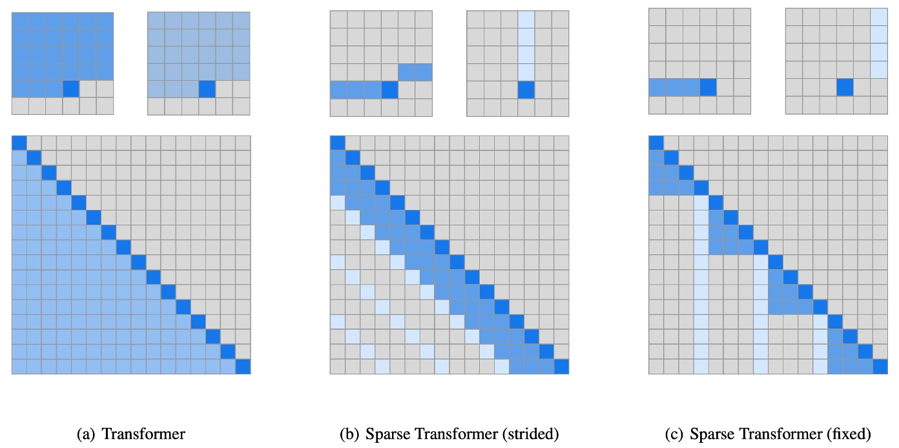
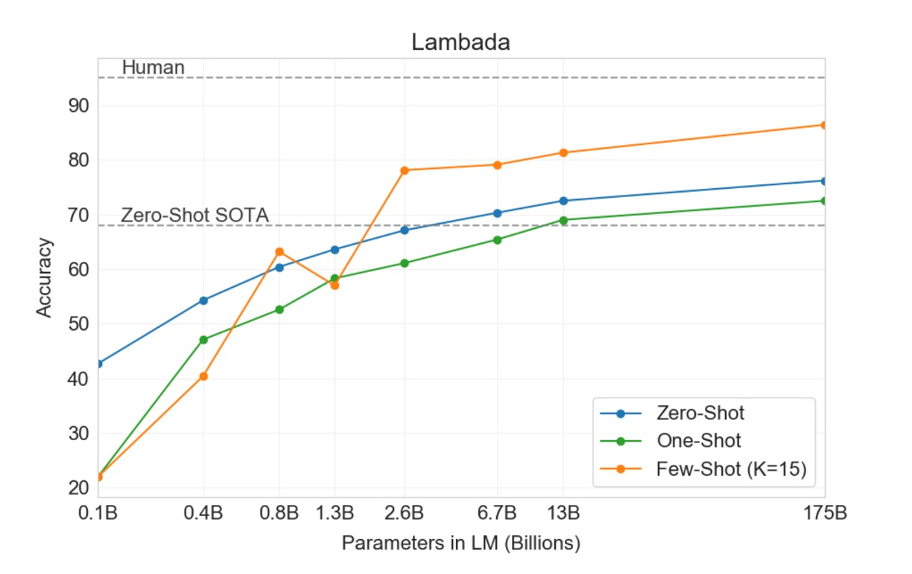

## Ninety-Six Layer Decoder

**[Language Models are Few-Shot Learners](https://arxiv.org/abs/2005.14165)**

---

The second generation of GPT stacked forty-eight layers of Transformer decoders. OpenAI felt this wasn't enough, so they stacked ninety-six layers of Transformer decoders, reaching an unprecedented 175 billion parameters, naming it GPT-3.

## Problem Definition

Recent work has demonstrated that by pre-training on a large corpus of text and then fine-tuning on specific tasks, significant progress can be made on many NLP tasks and benchmarks. Ideally, an NLP system should be able to quickly adapt and handle a variety of language tasks with minimal instruction or examples, much like a human. However, current research shows a significant gap between this ideal and reality, presenting several challenges:

### Diverse Language Task Requirements

Current language models face the need to adapt to a wide range of language tasks, from grammatical corrections to abstract concept generation. Each new task typically requires a large, specific labeled dataset, limiting the model's general applicability.

### Dependence on Large Supervised Datasets

Collecting and annotating large datasets for many language tasks is expensive and time-consuming. Each new task necessitates repeating this data collection process, increasing development costs and extending deployment times.

### Over-Specialization and Generalization Issues

Current models, when fine-tuned on specific tasks, may become overly specialized, resulting in poor generalization to data outside the training distribution. Training can also introduce spurious correlations that mislead the model, affecting its long-term and broad applicability.

### Human Learning Efficiency vs. Model Efficiency

Humans can quickly adapt to new tasks with minimal examples or direct instructions, whereas current models rely heavily on large amounts of labeled data, making them inefficient in comparison.

## Solution

In GPT-3, the basic pre-training method, including the model, data, and training, follows a similar approach to GPT-2 but with simple scaling up of model size, dataset size and diversity, and training length. The use of contextual learning also aligns with GPT-2, but this work systematically explores different settings of contextual learning, mainly differentiated as:

1. **Fine-tuning**

   - This is the most common approach, involving updating the pre-trained model's weights by training on a task-specific supervised dataset, typically using thousands to hundreds of thousands of labeled examples. The main advantage of fine-tuning is achieving state-of-the-art performance on many benchmarks.
   - The main drawbacks are the need for a new large dataset for each task, potential poor generalization outside the training distribution, and the possibility of exploiting spurious features in the training data, leading to unfair comparisons with human performance.
   - In this work, the authors did not fine-tune GPT-3, as their focus was on task-agnostic performance. However, GPT-3 can be fine-tuned in principle, which is a promising direction for future work.

     :::tip
     This likely foreshadows the release of ChatGPT-3.5.
     :::

2. **Few-shot**

   - Few-shot means providing the model with a few task demonstrations as conditions during inference without allowing weight updates.

     :::tip
     As illustrated in the example above, if the task is to translate English sentences into French, a few examples can be given to the model, such as:

     - `Translate English to French: "sea otter" -> "loutre de mer", cheese -> `

     The primary content to be translated would then follow, expecting the model to provide the French translation for `cheese`.
     :::

   - The main advantage is significantly reducing the need for task-specific data and reducing the potential for learning overly narrow distributions from large, narrow fine-tuning datasets.
   - The main disadvantage is that, to date, this approach has performed much worse than state-of-the-art fine-tuned models. Additionally, it still requires some task-specific data.

3. **One-shot**

   - One-shot is similar to few-shot but only allows one demonstration and requires a natural language description of the task. This method closely resembles how humans communicate some tasks. For example, when generating datasets for human workers (e.g., Mechanical Turk), a task demonstration is typically provided. Without an example, conveying the task's nature or format can be challenging.

4. **Zero-shot**

   - Zero-shot is similar to one-shot but does not allow for demonstrations and only provides natural language instructions describing the task. This method offers the greatest convenience and robustness potential and avoids spurious correlations but is the most challenging setting. In some cases, understanding the task format without prior examples can be difficult, making this setting "substantially harder."

### Model Architecture

In this work, the authors used the same model and architecture as GPT-2, including modified initialization, pre-normalization, and reversible tokenization.

The difference is that they used sparse attention in the Transformer, a technique detailed in another paper that the reader can refer to for more information:

- [**\[19.04\] Sparse Transformer**](../1904-sparse-transformer/index.md)

  

To study the dependence of machine learning performance on model size, the authors trained eight different model sizes, ranging from 125 million to 175 billion parameters across three orders of magnitude, with the largest model named GPT-3.

The table above shows that all models used a context window of 2048 tokens. The models were partitioned across GPUs along the depth and width dimensions to minimize inter-node data transfer. The exact architectural parameters of each model were chosen based on computational efficiency and load balancing across the GPU layout.

### Dataset Setup

The authors used nearly a terabyte of text data from the Common Crawl dataset for pre-training.

They also found that unfiltered or lightly filtered versions of Common Crawl typically had lower quality than carefully curated datasets.

To improve the dataset's average quality, they took three steps:

1. **Data Filtering and Quality Control**: Filtering the Common Crawl data to select data similar to a range of high-quality reference corpora.
2. **Deduplication**: Performing fuzzy deduplication at the document level, both within and across datasets, to prevent data redundancy and maintain the integrity of validation sets.
3. **Enhancing Data Diversity**: Adding known high-quality reference corpora to the training mix to enhance and diversify the Common Crawl data.

Using this approach, they collected 41 monthly Common Crawl snapshots from 2016 to 2019, containing 45TB of compressed plaintext before filtering and 570GB after filtering, equivalent to approximately 400 billion byte-pair encoded tokens.

Additionally, during training, sampling was not performed by dataset size but more frequently from higher-quality datasets. For example, Common Crawl and Books2 datasets were sampled less than once, while other datasets were sampled 2-3 times. This approach essentially traded a small amount of overfitting for higher-quality training data.

:::tip
During pre-training, accidentally seeing test or development sets can contaminate downstream task performance.

To minimize this, the authors searched for and attempted to eliminate any overlaps between benchmark and training data. Unfortunately, filtering errors caused some overlaps to be missed, and due to training costs, the models could not be retrained (as they ran out of money), so they had to try to mitigate this error later.
:::

## Discussion

The authors tested GPT-3's performance on language modeling and related tasks, including word prediction and sentence or paragraph completion.

### LAMBADA

The LAMBADA dataset requires the model to predict the last word of a sentence, necessitating reading the entire context. This benchmark particularly challenges the model's ability to capture long-range dependencies.

- Recent research indicated diminishing returns from scaling language models on the LAMBADA benchmark. Previous research showed that doubling model size between two advanced results only increased accuracy by 1.5%, concluding that scaling hardware and data to improve performance was not a feasible path.
- OpenAI disagrees, stating the scale was insufficient. In the zero-shot setting, GPT-3 achieved 76% accuracy on LAMBADA, an 8% improvement over the previous best technology (blue line above).
- In the few-shot setting, GPT-3 achieved 86.4% accuracy, over an 18% improvement over the previous best technology (orange line above).

It is worth noting that when the model size is insufficient, the few-shot setting significantly degrades performance, as shown by a 20% gap in the chart above. In other words, the model size must be large enough to perform well in the few-shot setting. According to the chart, this "breakthrough" phenomenon begins to appear at around 2.6 billion parameters, providing a reference point for future researchers.

### Closed Book Question Answering

This task measures GPT-3's ability to answer broad factual knowledge questions, typically answered by information retrieval systems locating relevant texts and generating answers. This task is known as the "open-book" setting, where the system can search and use relevant texts to answer questions. Another setting is the "closed-book," where the system directly answers questions without external information.

In this study, GPT-3 was tested in the same closed-book setting, achieving 64.3% in the zero-shot setting, 68.0% in the one-shot setting, and 71.2% in the few-shot setting. Compared to the fine-tuned T5-11B, GPT-3 improved by 14.2% in the zero-shot setting, 3.8% over the version with custom span prediction for Q&A, and achieved state-of-the-art levels in the one-shot setting.

Across all tested datasets, the authors found that performance changes smoothly with model size, reflecting the idea that model capacity directly translates to more "knowledge" absorbed by the model parameters.

## Conclusion

The paper is a 75-page PDF containing many charts beyond those mentioned above. All charts indicate a common trend: large language models need to be tested in a few-shot setting to realize their full potential. This trend holds across various tasks and benchmarks, leading to a series of "prompt engineering" studies aiming to find the best prompts for optimal performance in a few-shot setting.

Despite significant advancements in text generation and natural language processing, GPT-3 still faces issues such as semantic repetition, loss of coherence, and logical errors. It also shows specific weaknesses in handling commonsense physics and contextual learning behaviors, reflecting limitations in some specific language tasks.

Additionally, concerning bias and fairness, GPT-3 and similar large language models inherently absorb and reflect biases present in their training data, sourced from vast amounts of internet text. These biases manifest in several ways:

### 1. Gender Bias

GPT-3 demonstrates notable biases when handling gender-related content.

For example, in generated texts about professions, the model often associates males with certain occupations (e.g., tech, engineering) and females with others (e.g., nursing, teaching).

Such biases may reinforce societal stereotypes about gender roles.

### 2. Racial Bias

Regarding race, language models might generate texts that include or imply certain racial group characteristics, potentially leading to negative descriptions of some groups.

For example, when prompted about individuals of a particular race, the generated text might disproportionately reflect negative or stereotypical traits.

### 3. Religious Bias

GPT-3 may also exhibit biases in handling religion-related queries, such as using overly generalized or biased descriptions when discussing characteristics of different religious followers.

---

These challenges and their solutions underscore the importance of balancing technological progress with ethical responsibility in developing large language models, highlighting the need for ongoing research and improvement to mitigate unfairness.

GPT-3 and similar language models show significant potential in enhancing text generation and natural language processing capabilities but face several challenges. Future research must balance technological advancements with ethics, fairness, and efficiency to ensure these advanced technologies serve humanity while promoting fair and sustainable development.
