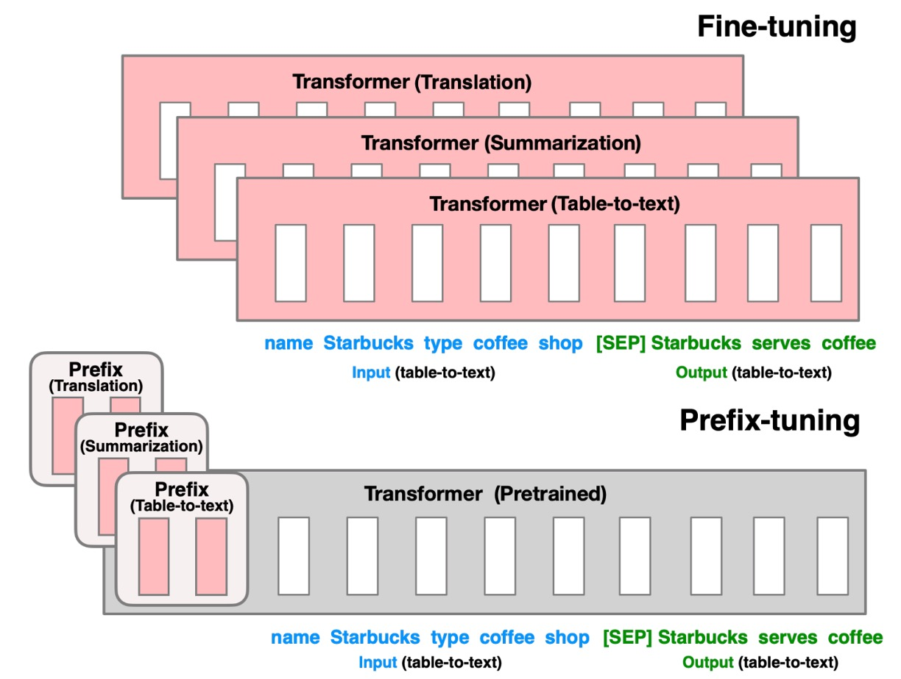
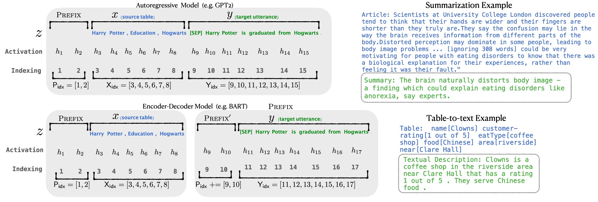
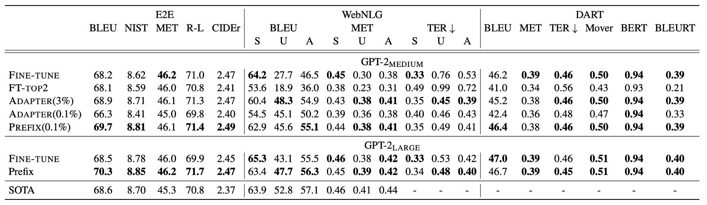
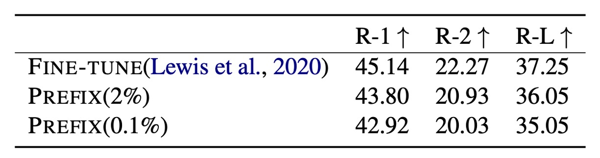
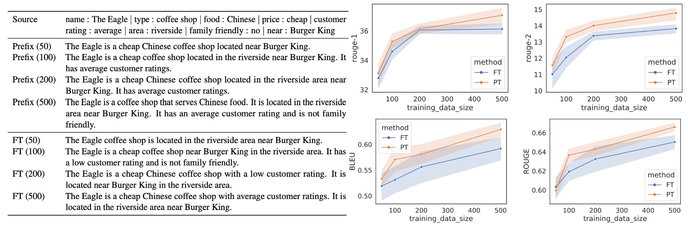
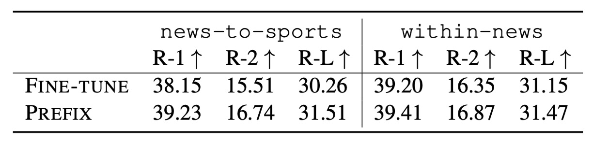

# [21.01] Prefix-Tuning

## Is it the Same or Different?

[**Prefix-Tuning: Optimizing Continuous Prompts for Generation**](https://arxiv.org/abs/2101.00190)

---

There are a few common ways to leverage pre-trained language models:

1. **Fine-tuning**: Adjusting the model’s parameters to adapt it to new tasks.

   However, this approach isn’t accessible to most people since it requires large datasets and significant computational resources.

2. **Prompt-based methods**: Designing prompts to guide the model in generating the desired outputs.

   For example, if the task is to summarize a text, different models might require different prompts:

   1. GPT-3: `Summarize with 3 sentences about the following article:`
   2. T5: `summarize the following article:`
   3. BART: `Document summarization:`
   4. ...

   **Drawback**: Each model has a different way of interpreting prompts, so constant experimentation and fine-tuning are necessary.

---

Is there any other solution?

Of course! Creativity is never in short supply among researchers.

Recently, **AutoPrompt** introduced an automated approach to discover optimal prompts. This method combines the benefits of both fine-tuning and prompt-based techniques.

- [**[20.10] AutoPrompt: Model Prompt Optimization**](../2010-autoprompt/index.md)

By using a set of learnable parameters, AutoPrompt enables the model to discover the prompts that work best with its structure.

## Defining the Problem

<figure style={{"width": "70%"}}>

</figure>

As mentioned earlier, the problem lies in the fact that pre-trained models are too large for most users to fine-tune, and prompt-based methods require constant testing.

To address this, the authors propose a new approach: **Prefix-Tuning**. The concept is simple: as shown in the diagram above, a **prefix** token is inserted at the beginning of the input to guide the model’s output generation.

Wait, isn’t this the same as what AutoPrompt does?

Exactly!

The difference lies in how the prompt is created. AutoPrompt selects and combines already **pre-trained tokens** to build a suitable prompt. In contrast, **Prefix-Tuning trains new tokens directly in the feature space** to achieve optimal results.

The authors argue that AutoPrompt may generate prompts with discontinuities since it relies on combining discrete, pre-trained tokens. On the other hand, Prefix-Tuning operates in the continuous feature space, resulting in smoother, more coherent prompts better suited to the task at hand.

## Solving the Problem

### Model Architecture

The diagram above illustrates the architecture of Prefix-Tuning. The model consists of the following key components:

1. **Trainable Prefix Parameters $P_\theta$**:
   These are newly introduced parameters placed at the beginning of the input sequence. Their length and dimensionality can be configured. During training, these parameters are optimized to steer the model toward producing task-specific outputs.

2. **Frozen Pre-trained Language Model $\text{LM}_\phi$**:
   This refers to a large language model, such as GPT-2 or GPT-3, whose parameters remain **fixed** during Prefix-Tuning. This approach avoids the heavy resource demands of full fine-tuning.

3. **Input Sequence $x$**:
   This is the task-specific input, such as an article for summarization or tabular data that needs to be described.

4. **Output Sequence $y$**:
   This is the output generated by the model, such as a summary of the article or a textual description of the table.

### Implementation Details

The implementation of Prefix-Tuning involves several key steps:

1. **Prefix Parameter Initialization**:

   - A matrix of trainable prefix parameters $P_\theta$ is created with dimensions $|P_{\text{idx}}| \times \text{dim}(h_i)$, where $|P_{\text{idx}}|$ is the length of the prefix and $\text{dim}(h_i)$ is the hidden state dimension of the language model.

2. **Reparameterization**:

   - Directly optimizing the high-dimensional matrix $P_\theta$ can lead to instability. To address this, the authors introduce a reparameterization strategy:

     - **Low-dimensional Representation $P'_\theta$**:
       A smaller matrix $P'_\theta$ with dimensions $|P_{\text{idx}}| \times d'$, where $d' < \text{dim}(h_i)$.
     - **Multi-Layer Perceptron (MLP)**:
       The MLP maps the smaller matrix to the original high-dimensional space:
       $$
       P_\theta[i, :] = \text{MLP}_\theta \left( P'_\theta[i, :] \right)
       $$
     - **Optimization Process**:
       During training, only the parameters of $P'_\theta$ and the MLP weights $\theta$ are optimized, while the parameters of the pre-trained language model $\phi$ remain fixed.

3. **Forward Propagation**:
   - **Prefix Activation**:
     For each position $i \in P_{\text{idx}}$, the activation value is directly taken from $P_\theta[i, :]$:
     $$
     h_i = P_\theta[i, :]
     $$
   - **Input Sequence Processing**:
     For the input sequence $x$ and the output sequence $y$, the activations follow the standard calculations of the pre-trained language model, with the prefix influencing the results:
     $$
     h_i = \text{LM}_\phi(z_i, h_{<i})
     $$
     where $z_i$ is the $i$-th token of the input sequence, and $h_{<i}$ contains the activations from the prefix and the previous tokens in the sequence.

The objective of training is to **maximize the log-likelihood** of the output sequence $y$:

$$
\max_\theta \log p_\phi(y | x, P_\theta) = \sum_{i \in Y_{\text{idx}}} \log p_\phi(z_i | h_{<i})
$$

Here, only the prefix parameters $\theta$ are optimized, while the parameters of the language model $\phi$ remain fixed.

Once training is complete, the optimized high-dimensional prefix matrix $P_\theta$ is retained. Since reparameterization is only needed during training, the MLP used to map the low-dimensional matrix can be discarded after training.

During inference, the optimized prefix $P_\theta$ is concatenated with a new input sequence $x$. The combined sequence is then fed into the pre-trained language model to generate the output $y$.

### Dataset Setup

1. **Table-to-Text Generation Task**:

   - The authors use three datasets, sorted by complexity and size:

     1. **E2E (Novikova et al., 2017)**:

        - A single-domain dataset focusing on restaurant reviews, containing around 50K data samples with 8 fields per entry.
        - Each sample has multiple reference outputs, with an average output length of 22.9 tokens.
        - **Evaluation metrics**: BLEU, NIST, METEOR, ROUGE-L, CIDEr.

     2. **WebNLG (Gardent et al., 2017)**:

        - A dataset containing 22K samples, with each entry represented as a (subject, property, object) triple.
        - It spans 14 domains, with the test set divided into **“Seen”** and **“Unseen”** categories to assess the model’s generalization capability.
        - The average output length is 22.5 tokens.
        - **Evaluation metrics**: BLEU, METEOR, TER.

     3. **DART (Radev et al., 2020)**:
        - An open-domain dataset containing 82K samples, with an input format similar to WebNLG.
        - It is compiled from multiple sources, including WikiSQL, WikiTableQuestions, E2E, and WebNLG.
        - The average output length is 21.6 tokens.
        - **Evaluation metrics**: BLEU, METEOR, TER, MoverScore, BERTScore, BLEURT.

2. **Summarization Task**:

   - **XSUM (Narayan et al., 2018)**:
     - A large dataset with 225K news articles paired with corresponding summaries.
     - The average article length is 431 tokens, while the average summary length is 23.3 tokens.
     - **Evaluation metrics**: ROUGE-1, ROUGE-2, ROUGE-L.

## Discussion

### Performance on Table-to-Text Generation

Despite using only **0.1%** of the task-specific parameters, Prefix-Tuning outperforms other lightweight fine-tuning methods:

- **Adapter-Tuning (ADAPTER)**: Although both methods use 0.1% of the parameters, Prefix-Tuning achieves an average **4.1-point increase** in **BLEU** scores.
- **FT-TOP2**: This approach fine-tunes only the top two layers of the model’s parameters.

Prefix-Tuning performs on par with, and in some cases even surpasses, full fine-tuning. Additionally, compared to Adapter-Tuning, which uses 3.0% of the model’s parameters, Prefix-Tuning remains competitive in performance.

The consistent results across all three datasets—**E2E**, **WebNLG**, and **DART**—highlight the versatility of Prefix-Tuning. Its strong performance on the open-domain DART dataset indicates that Prefix-Tuning can adapt to various domains and relational structures, demonstrating its **robust generalization capabilities**.

Experiments with **GPT-2 Medium** and **GPT-2 Large** show that Prefix-Tuning scales well with model size, suggesting its applicability to even larger models, such as GPT-3.

### Performance on Summarization

<figure style={{"width": "70%"}}>

</figure>

Using **2% of task-specific parameters**, Prefix-Tuning achieves a **ROUGE-L score of 36.05**, only slightly below the full fine-tuning score of **37.25**. However, when the parameter usage is further reduced to **0.1%**, the ROUGE-L score drops to **35.05**, indicating a performance decline with fewer parameters.

Prefix-Tuning’s performance in summarization lags slightly behind full fine-tuning, likely due to the following reasons:

1. **Data Volume**:
   The **XSUM** dataset contains **four times** as many samples as the table-to-text datasets, requiring the model to process a larger amount of data.

2. **Input Length**:
   On average, XSUM articles are **17 times longer** than the tabular inputs, resulting in significantly more complex input sequences.

3. **Task Complexity**:
   Summarization demands more from the model, requiring it to **comprehend** the content, identify key information, and generate concise summaries.

Although Prefix-Tuning falls short of full fine-tuning in the summarization task, it still demonstrates **strong potential in resource-constrained environments**. Different tasks pose different challenges for models, and Prefix-Tuning’s advantage diminishes when processing long and complex content. Nonetheless, the method delivers performance comparable to full fine-tuning while drastically reducing the number of trainable parameters.

### Low-Resource Settings

In low-resource scenarios, **Prefix-Tuning** outperforms fine-tuning, with an **average improvement of 2.9 BLEU points** while using far fewer parameters. As the size of the dataset increases, the performance gap between Prefix-Tuning and fine-tuning gradually narrows.

To evaluate performance under low-resource conditions, the authors sampled subsets from the complete datasets—**E2E** for table-to-text generation and **XSUM** for summarization. They created smaller datasets containing **{50, 100, 200, 500}** samples. Each dataset size was tested using **five different random samples**, with **two random seeds** for each sample, resulting in the **average performance across 10 models** per size.

Both Prefix-Tuning and fine-tuning exhibit **undergeneration** issues in low-data settings, meaning some table content is omitted from the output. However, Prefix-Tuning produces outputs that remain more faithful to the input tables, even with only 100 or 200 samples. In contrast, fine-tuning occasionally generates misleading outputs—such as misreporting a customer rating as “low” when it is actually “average.” Prefix-Tuning avoids such inaccuracies, maintaining fidelity to the input data.

In summary, Prefix-Tuning has a clear **advantage in low-resource settings**, producing better results with fewer parameters. This method excels at accurately reflecting the input content, and its performance is **more stable and reliable** than fine-tuning in scenarios with limited data.

### Extrapolation Ability

<figure style={{"width": "70%"}}>

</figure>

The authors also explore **Prefix-Tuning’s extrapolation capability**—the model’s ability to handle topics during testing that differ from those seen during training.

- **Extrapolation Setup**:

  - **Table-to-Text Generation**:

    - The **WebNLG** dataset is used, with the table topics divided into:
      - **SEEN**: Nine categories present in both the training and validation sets.
      - **UNSEEN**: Five categories that appear only in the test set.

    The model is trained on the SEEN categories, and its performance is evaluated on the UNSEEN categories.

  - **Summarization**:
    Two types of extrapolation scenarios are tested:
    1. **News-to-Sports Transfer**:
       The model is trained on news articles and tested on sports articles.
    2. **Intra-News Transfer**:
       The model is trained on articles from categories such as **World, UK, and Business** and tested on articles from other news domains, such as **Health and Technology**.

Prefix-Tuning outperforms fine-tuning across **all evaluation metrics**, demonstrating **strong extrapolation capabilities** in both table-to-text generation and summarization tasks.

Interestingly, **Adapter-Tuning** performs similarly to Prefix-Tuning in these extrapolation scenarios. Both methods **freeze the pre-trained language model’s parameters**, which helps retain the model’s generalization capabilities across new topics. This suggests that **preserving the original parameters** of the language model, rather than modifying them through extensive fine-tuning, enhances the model’s ability to generalize to unseen domains.

### How Long Should the Prefix Be?

Experiments show that **longer prefixes** tend to improve performance, but performance may slightly decline beyond a certain threshold.

- In the **summarization task**, the optimal prefix length is **200** tokens.
- In the **table-to-text generation task**, the best performance is achieved with a prefix length of **10** tokens.

The prefix length has **minimal impact on inference speed** because GPUs can **parallelize attention calculations** efficiently.

### Initialization Strategies

<figure style={{"width": "80%"}}>

</figure>

In **low-data scenarios**, the **initialization strategy** has a significant impact on performance:

- **Random initialization** results in lower performance with high variability.
- **Activation-based initialization using meaningful words** substantially improves performance.

Using words relevant to the task (e.g., "summarization" or "table-to-text") yields better results than using irrelevant words (e.g., "elephant" or "divide"). However, even initializing with irrelevant words performs better than random initialization.

### Suitable Use Cases

Prefix-Tuning is particularly useful in scenarios that require **independent training for a large number of tasks**, such as **personalized models for multiple users**. To protect user privacy, data from different users must remain isolated, and each user requires a separate model. In this setting, each user is treated as a distinct task.

Prefix-Tuning allows for **flexible addition or removal of users** by modifying the prefixes, preventing data contamination across users.

In contrast, **Adapter-Tuning** struggles in these scenarios since the adapters are integrated into the **transformer layers**. This makes it difficult to separate computations and share resources efficiently across multiple models.

### Why Does Prefix-Tuning Perform Well on Unseen Topics?

The authors dedicate a section to address this question.

First, **pre-trained language models** are trained on **large-scale general corpora**, which helps the model develop broad generalization abilities. **Freezing the parameters** of these pre-trained models during Prefix-Tuning preserves this generalization capability, allowing the model to perform well on **unseen topics**. Both **Prefix-Tuning** and **Adapter-Tuning** follow this principle by leaving the pre-trained parameters untouched and only fine-tuning a small number of parameters. This prevents interference with the model’s original abilities.

In contrast, **full fine-tuning** can lead to **overfitting**, especially when trained on narrow domains or small datasets. Lightweight tuning methods, like Prefix-Tuning and Adapter-Tuning, mitigate overfitting by optimizing only a small subset of the parameters. As a result, the model retains its generalization capability, making it more suitable for handling **new or unseen topics**.

However, the authors acknowledge that while lightweight tuning retains generalization, it might **limit the model’s ability to optimize fully** for new tasks. In **highly complex tasks**—such as those requiring deep understanding or complex reasoning—full fine-tuning may still be necessary, as lightweight tuning might not be sufficient.

The strong extrapolation results of Prefix-Tuning might also depend on **specific datasets or tasks**. On **irregular or highly complex data**, lightweight tuning methods might struggle to maintain stable generalization performance. Additionally, some of the “unseen” topics in the evaluation may overlap with the **pre-training data**, potentially skewing the results positively.

Ultimately, the authors admit that this remains an **open question**, requiring further research to fully understand why Prefix-Tuning excels in unseen-topic scenarios.

:::tip
While the authors offer some explanations for Prefix-Tuning’s success with unseen topics, they acknowledge that the **exact reason remains unclear**.
:::

## Conclusion

Prefix-Tuning is a **lightweight fine-tuning method** that guides the model to generate task-specific outputs by adding a small set of trainable prefix parameters.

This approach delivers **impressive performance** in both **table-to-text generation** and **summarization** tasks, even when using only a fraction of the parameters. It also performs exceptionally well in **low-resource** and **unseen-topic** scenarios, demonstrating robust **generalization capabilities**.

:::tip
One noticeable drawback of this method is that it **consumes part of the input sequence** to store the prefix tokens.

For example, experiments suggest that **200 tokens** are required for optimal performance in summarization. With many language models limited to **512 input tokens**, using nearly half the available space for prefixes can feel **inefficient**.
:::
