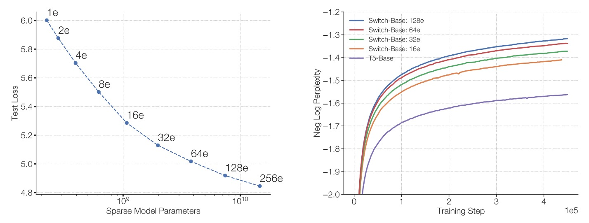

# [21.01] Switch Transformer

## Let the Experts Speak

[**Switch Transformers: Scaling to Trillion Parameter Models with Simple and Efficient Sparsity**](https://arxiv.org/abs/2101.03961)

---

The effectiveness of large language models (LLMs) is well known.

However, the approach of mindlessly stacking parameters will eventually hit a limit.

## Defining the Problem

One idea is to take the fine-tuning route, like the LoRA approach we have seen before, but this doesn't fundamentally solve the problem.

The fundamental issue lies in the fact that the model architecture we use is computationally dense, leading to high computational costs.

And that’s not all— the self-attention mechanism’s $O(n^2)$ complexity causes the computation to grow exponentially as the model size increases, making it impractical with current hardware resources.

Another solution direction is the Mixtures of Experts (MoE) model.

MoE is not a new concept. Google Brain proposed this idea back in 2017.

- [**[17.01] Outrageously Large Neural Networks: The Sparsely-Gated Mixture-of-Experts Layer**](https://arxiv.org/abs/1701.06538)

    

    <figure style={{"width": "50%"}}>
    
    </figure>
    

MoE decomposes the model into multiple "experts," with a "router" assigning each token to the most suitable expert based on the token's characteristics. This "sparse activation" strategy allows for a significant increase in the number of model parameters without adding extra computation per data point.

In other words, the goal of MoE is to build a model that is "massive in size but only activates a small portion of its components for each computation," aiming to achieve better performance at the same hardware cost.

The authors argue that the MoE model uses a "top-$k$" expert routing strategy ($k > 1$), which, while providing the router with multiple experts to choose from, also introduces relatively complex computation and communication costs. This process can likely be simplified:

- **As the saying goes, too many cooks spoil the broth, so here, just one "expert" is enough!**

## Solving the Problem

### Model Architecture

<figure style={{"width": "90%"}}>

</figure>

From the model architecture diagram, we can clearly see the design concept of the Switch Transformer:

1. **Replacing Traditional FFN with Sparse Expert Layers (Switch FFN)**:

   In a typical Transformer, each token goes through the same set of FFN weights for feedforward computation. However, in the Switch Transformer, the FFN is decomposed into multiple "experts," each of which is an independent FFN.

2. **The Role of the Router**:
   The diagram shows a router that dynamically selects which expert will handle each token based on its characteristics (e.g., the input word vector representation).

   - For example, in the diagram, there are two tokens (x1 = "More" and x2 = "Parameters"). The router will process and evaluate each token separately, then assign x1 to a specific expert and x2 to another (or the same) expert for processing.

3. **Sparsity Feature**:
   Since each token is processed by only one expert FFN (instead of a dense FFN processing all tokens at once), this is what is called "sparsity." Although there are multiple expert parameters in total, only a small subset is activated at a time, greatly reducing the computational load.

4. **Output and Router Weights (Gate Value)**:
   After each token passes through its assigned expert FFN, it is multiplied by a "gate value" generated by the router. This value acts as a weighting factor to indicate the level of trust or importance the expert has in processing that token.

This is the dynamic routing mechanism of the Switch Transformer, where multiple experts each handle individual tokens.

### Expert Capacity

<figure style={{"width": "90%"}}>

</figure>

When we have multiple experts processing a batch of tokens, we set a maximum token capacity limit for each expert.

This limit is determined by the "expert capacity," which is calculated as:

$$
\text{expert capacity} = \frac{\text{total tokens in batch}}{\text{num experts}} \times \text{capacity factor}
$$

In other words, the "slot" number for each expert is fixed, and the "capacity factor" adjusts the additional space.

Each token is processed by a router, which chooses the most suitable expert based on a probability distribution. Ideally, token distribution is balanced, with all expert capacities filled without exceeding them, allowing each expert to focus on its task.

If certain experts are assigned more tokens than others (imbalanced distribution), an "Overflow" situation occurs. This means some tokens that were meant for a particular expert cannot be processed because the expert's capacity is full. These "overflow" tokens must bypass this layer and move to the next (as indicated by the red dashed lines in the diagram).

Increasing the capacity factor allows for more space, reducing the likelihood of overflow. However, this also means that in some cases, parts of the experts' space may remain empty (as shown by the white spaces in the diagram), which leads to more unnecessary computation and communication costs.

Therefore, Switch Transformer needs to balance the "expert capacity" and "token routing" to achieve optimal performance.

### Load Balancing Loss

To ensure the router does not repeatedly assign tokens to the same expert, Switch Transformer introduces a differentiable load balancing loss.

The basic idea is to make the number of tokens assigned to each expert and the total probability assigned by the router to each expert as even as possible. Let $f_i$ be the fraction of tokens assigned to expert $i$ and $P_i$ be the average routing probability for that expert, i.e.,

$$
f_i = \frac{1}{T} \sum_{x \in B} 1\{\arg\max p(x) = i\},
$$

$$
P_i = \frac{1}{T} \sum_{x \in B} p_i(x).
$$

If we want all experts to be evenly distributed, the ideal situation is $f_i \approx \frac{1}{N}$ and $P_i \approx \frac{1}{N}$. Therefore, the auxiliary loss function is defined as:

$$
\text{loss}_{\text{aux}} = \alpha \cdot N \sum_{i=1}^{N} f_i P_i,
$$

where $\alpha$ is a hyperparameter (in this study, $\alpha = 10^{-2}$). The more balanced the distribution, the closer $f_i$ and $P_i$ are to $1/N$, and the lower the overall loss.

This mechanism provides additional gradients during training, encouraging the model to achieve more even load distribution.

### Improved Training and Fine-Tuning

The sparse expert model in Switch Transformer may cause instability during training, especially with hard-switching routing decisions and the use of low-precision formats (like bfloat16).

The authors propose two improvements:

1. **Selective Precision Management**: Use float32 precision locally within the routing function, only performing computations on the device in float32, then converting the results back to bfloat16. This approach retains the speed of bfloat16 training while maintaining the stability of float32.
2. **Smaller Parameter Initialization**: Initialization is crucial for the success of deep learning models. The authors recommend reducing the Transformer initialization scale $s=1.0$ by a factor of ten. This strategy improves model quality and reduces instability during early training.

In addition, to address the overfitting problem during the fine-tuning stage, the authors propose a simple but effective method to alleviate this issue:

- **Increase the dropout within the expert layers, known as "Expert dropout."**

By setting different dropout rates for each expert layer during fine-tuning, this approach effectively reduces overfitting and improves performance on downstream tasks with small datasets.

## Discussion

### Comparison with Dense Models

The authors compared the Switch T5 Base model with the dense model baseline, and the results show that the model using the Switch Transformer architecture outperforms across all 101 languages.

By introducing expert sparsity, the Switch Transformer significantly improves performance over models that merely increase dense parameters in a multilingual and multitask pre-training setting. The improvement is not limited to specific languages but represents an overall enhancement in performance.

### Impact of the Number of Experts

<figure style={{"width": "90%"}}>

</figure>

The authors discuss several scaling characteristics, starting with the impact of the number of experts on model performance.

- **Left Diagram**:

  - The horizontal axis represents the model's number of parameters (mainly increased by adding more experts).
  - The vertical axis shows the model's perplexity.

  The point in the top left corresponds to T5-Base (approximately 223 million parameters). As the number of experts increases (from 2 to 256 experts), the total parameter count increases significantly, but the computation remains approximately the same.

  The results show that increasing the number of experts reduces perplexity even though the computational budget remains unchanged, which means the model's quality keeps improving.

---

- **Right Diagram**:

  - The horizontal axis is the number of training steps.
  - The vertical axis represents the negative log perplexity, where higher values indicate lower perplexity (better model performance).

  The diagram compares the dense model baseline (represented by the purple line) with several configurations of experts in the Switch-Base model. The results show that, under the same computational budget, the Switch-Base model with more experts achieves better performance in the same number of training steps, exhibiting better "sample efficiency."

In conclusion, increasing the number of experts (and thus the number of parameters) allows the Switch Transformer to both improve model quality and accelerate learning, demonstrating the effectiveness of the "sparse experts" method for model scaling.

### Fixed Computation and Training Time

<figure style={{"width": "70%"}}>

</figure>

The authors compare the training results under the same TPU core resources and identical FLOP configurations per sample.

The results, as shown in the above figure, indicate that, compared to traditional dense Transformers, the Switch Transformer (especially with 64 experts) achieves the same quality performance as T5-Base in much less time, even requiring only one-seventh of the time needed by T5-Base to reach the same perplexity level. Moreover, after reaching that quality threshold, the Switch Transformer continues to improve its model performance.

### Model and Data Parallelism

The authors further explore how to balance resources in large-scale training scenarios, considering "data parallelism," "model parallelism," and "expert parallelism."

1. **Data Parallelism**:
   The training data is divided into multiple parts, and each computation core handles a different portion of the data, but the model parameters are the same across all cores. After training, the gradients from each core are aggregated and used to update the overall model parameters. The advantage is simplicity; there is no need for communication of parameters or intermediate results during forward and backward propagation—only gradient aggregation at the end. However, as the model size increases, the memory and computation pressure on individual cores also increase.

2. **Model Parallelism**:
   The model parameters (such as large weight matrices in FFN layers) are split across different cores, with each core storing and computing only a portion of the weights. This allows for training larger models since the full weight matrix no longer needs to fit into a single core. The trade-off is that cores need to frequently communicate during the computation. For example, FFN inputs and outputs need to be passed and aggregated between cores, as each core computes only a part of the output.

3. **Expert Parallelism**:
   This is one of the key features of the Switch Transformer. The model is split into multiple "experts," each running on a different core, and each token is processed by only one expert based on the routing mechanism. This allows for increasing the number of parameters without significantly increasing the computation load. However, as the number of experts increases beyond a certain point, the benefits diminish, so data and model parallelism need to be combined to achieve optimal resource usage.

The detailed schematic is shown below:

<figure style={{"width": "90%"}}>

</figure>

This diagram uses a 4×4 dashed grid to illustrate how model weights and data are distributed across different computation cores in a distributed training setup. The diagram is divided into two parts:

- **Upper Part**:
  Different sized shapes represent the large weight matrices in the model (e.g., larger weight matrices in FFN layers). Each core stores a portion of the weights, distributing a fixed amount of parameters to each core. Larger weight matrices mean more computation per token, but the weight splitting balances the load across the cores.

- **Lower Part**:
  Shows how the data (token batches) are split. Each core receives an equal amount of tokens to maintain consistent memory usage across cores. However, different data partitioning strategies affect whether the tokens each core holds are the same or different (distinguished by color in the grid). These variations in data splitting will influence training performance and communication costs.

By combining data parallelism, model parallelism, and expert parallelism, the authors successfully trained Switch Transformers with 395 billion and 1.6 trillion parameters and showed superior perplexity performance compared to T5-XXL models under equivalent FLOP conditions.

This demonstrates that scaling up the number of parameters to huge sizes is theoretically feasible and can improve sample efficiency. However, occasional training instability still occurs with the Switch-XXL model, indicating that stability remains an unavoidable issue in practical applications.

:::tip
Model crashes mean the invested resources are wasted in an instant. Caution is required.
:::

### Is the Success Due to the Large Number of Parameters?

Yes, the authors admit that the advantage of the Switch Transformer comes from its massive parameter count:

- **But this is a deliberate design strategy!**

Increasing the number of parameters while maintaining the same computational budget leads to better sample efficiency and performance. In contrast to the traditional approach of scaling by increasing FLOPs (computational load), this method shows its value by achieving "better results with the same time and computational resources."

### Can Small Models Benefit?

The authors emphasize that while Switch Transformers focus on extremely large models (hundreds of billions or even trillions of parameters), they can still run on standard GPUs/TPUs with a small number of experts (e.g., 2 experts) and still provide performance gains. In other words, researchers and users with small or medium-scale models can also benefit from this method.

### Why Aren't Sparse Models Widely Adopted?

The success of dense models in the past, along with hardware optimization and fast adaptation for these models, has reduced the motivation to experiment with sparse methods. Additionally, sparse models faced many implementation and training challenges (e.g., complexity of routing mechanisms, training instability, communication issues between cores).

Switch Transformer has made significant improvements in these areas, lowering the barriers for users to adopt sparse models.

## Conclusion

Switch Transformers simplify the Mixture of Experts (MoE) design, achieving an easy-to-understand, stable, and efficient model architecture that maximizes sample efficiency. This simplification reduces the implementation complexity of Switch Transformers in real-world applications.

Compared to dense model baselines, Switch Transformers show outstanding performance in multiple natural language processing tasks and various training modes, achieving significant speed-ups.

The authors believe that the application of "sparse models" is definitely a direction worth exploring further and hope this research will bring more attention to this field.
