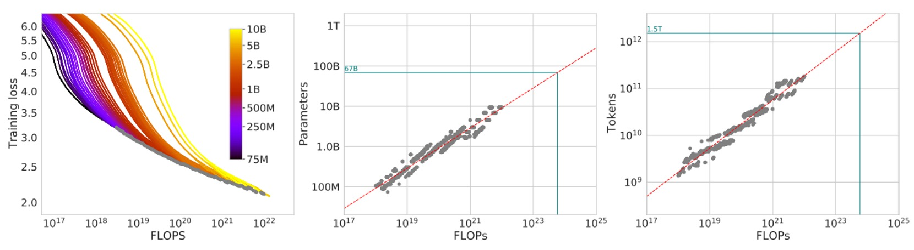
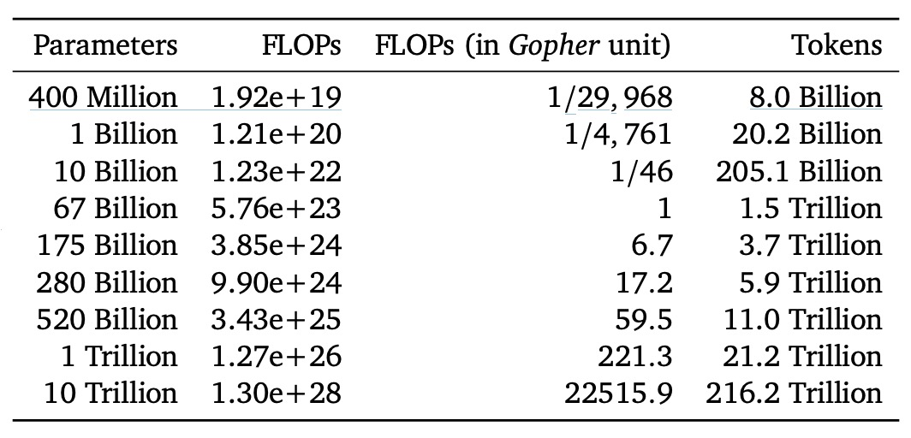

## Chinchilla's Gaze

[**Training Compute-Optimal Large Language Models**](https://arxiv.org/abs/2203.15556)

---

We’ve grown tired of commenting on the authors’ various bizarre naming choices.

This paper is an advanced version of Scaling Laws. The authors challenge some previous viewpoints and propose a new training strategy.

:::tip
If you’re not familiar with Scaling Laws yet, you can refer to our previous article:

- [**[20.01] Scaling Laws: The Scaling Laws of Models**](../2001-scaling_laws/index.md)
  :::

## Defining the Problem

Recent large language models, whether dense transformer architectures or mixture-of-experts (MoE) models, are all striving for larger and larger parameter sizes, with models easily reaching hundreds of billions, even up to five hundred billion parameters.

This expansion brings a series of problems, such as soaring training and inference costs, as well as the need for larger and higher-quality datasets to feed these models. Without such datasets, no matter how large the model, it won't produce satisfactory results.

The problem the authors of this paper aim to solve is:

- **Given a fixed computation (FLOPs) budget, how should we choose the optimal combination of "model size" and "dataset size" to minimize the final pre-training loss of the language model?**

Although Scaling Laws have tried to answer the question "Given computational resources, what model size should we choose?", the Scaling Laws experiments fix the number of training tokens and learning rate schedules, which leads to slightly biased conclusions on this issue:

- **The Scaling Laws analysis tends to suggest "make the model bigger, but don’t increase the dataset size that much".**

The authors of this paper, however, believe that adjusting the learning rate and training steps appropriately reveals that model size and dataset size should increase in equal proportions.

A more formal description is that the authors define the optimal solution as follows:

$$
N_{\text{opt}}(C), D_{\text{opt}}(C) \;=\; \arg\min_{N,D \;\;s.t.\;\; \text{FLOPs}(N,D)=C}\, L(N,D),
$$

Where:

- $N$ is the number of model parameters,
- $D$ is the number of training tokens (representing the amount of training data),
- $C$ is the fixed computation budget (i.e., how many FLOPs you can spend to train with the given compute power and time),
- $L(N, D)$ is the pre-training loss of the model after training with $N$ parameters and $D$ training tokens.

The goal of this paper is to optimize the combination of "model size (N)" and "training token count (D)" within a fixed computation budget (C).

## Solving the Problem

To reduce the difficulty of reading the following article, please remember the corresponding terms:

- $C$: Fixed computation (FLOPs) budget,
- $N$: Model size (number of parameters),
- $D$: Training data size (number of training tokens),

The authors propose three different methods to estimate the "optimal scaling relationship of $N$ and $D$ with respect to $C$."

### Approach 1: Fixed Model Size ($N$)

In this approach, the authors first "fix a set of model sizes," and for each model size, they try different training data amounts.

Model sizes range from around 70M parameters to over 10B parameters, with four independent training runs for each size. The training data amounts vary by up to 16 times. During training, the learning rate decays according to a schedule, and for each setting, smoothing and interpolation are applied to obtain continuous loss curves.

With this experimental design, they can intuitively answer: "Given a specified FLOPs budget $C$, which combination of $(N, D)$ achieves the minimum loss $L(N,D)$?"

From a mathematical perspective, the authors aim to solve the following optimization problem:

$$
N_{\text{opt}}(C), D_{\text{opt}}(C) = \arg\min_{N, D \; s.t. \; \text{FLOPs}(N,D)=C} L(N,D).
$$

In this process, they chose 1500 different $C$ values distributed on a logarithmic scale (i.e., different FLOPs budgets) and observed the corresponding $N_{\text{opt}}(C)$ and $D_{\text{opt}}(C)$.

Through fitting, they found that the optimal parameter configuration approximately follows:

$$
a = 0.50, \quad b = 0.50
$$

This means that when available compute power $C$ increases, the best strategy is to increase both model parameters $N$ and training tokens $D$ at about the same rate of $C^{0.5}$. This result is a significant departure from previous literature, which mostly suggested that the model size should increase faster than the training data size.

The experimental results are shown in the figure below:

On the left of the figure, each curve corresponds to different model sizes $N$ and training data amounts. The x-axis roughly represents the FLOPs used during training, and the y-axis shows the loss $L$ of the model during training.

The authors first plot all these training curves, then take the envelope, i.e., the minimum possible loss $L_{\min}(C)$ achieved in each experiment at any given FLOPs budget $C$.

With the envelope, we can see: given a fixed computation budget, is there a better $(N, D)$ combination that can achieve a lower loss? If so, that would mean we can adjust the ratio of model size and training tokens to get better results.

Next, the middle graph shows the inferred "optimal model parameter count $N_{\text{opt}}(C)$" based on the envelope at different FLOPs $C$. In simple terms, this tells us the optimal model size for a specific FLOPs budget.

The right graph shows how the "optimal number of training tokens $D_{\text{opt}}(C)$" changes with FLOPs. After extracting these points, the authors fit them with a power-law relationship to find scaling relationships like $N_{\text{opt}}(C) \propto C^a$ and $D_{\text{opt}}(C) \propto C^b$.

The green dotted line in the figure represents the FLOPs used by the Gopher model (around $5.76 \times 10^{23}$) for comparison.

Based on these envelope lines and the inferred power-law relationships, it is evident that the optimal $N_{\text{opt}}$ and $D_{\text{opt}}$ differ significantly from Gopher's original design. This means that by adjusting the configuration according to the analysis in this paper, one could achieve a lower loss with the same compute budget.

### Approach 2: Fixed Training Data Size ($D$)

In this method, the authors first fix a set of FLOPs budgets, and for each fixed $C$, they adjust model size $N$ and training token count $D$ to ensure that the total FLOPs spent during training exactly equals the specified $C$ value.

In simple terms, they "fix the FLOPs consumption," and along this "constant FLOPs line," they examine how different model sizes affect the final loss $L$.

Theoretically, this graph usually forms a "U-shaped curve" (or something like the bottom of a parabola), indicating that there is an optimal model size $N_{\text{opt}}(C)$ that minimizes the loss under fixed compute. They fit this curve with a parabolic function to find the position of the minimum.

Through this fitting, the authors obtain a set of data points that can be fitted with a power law:

$$
N_{\text{opt}} \propto C^a \quad \text{and} \quad D_{\text{opt}} \propto C^b.
$$

The experimental results are shown in the figure below:

They calculate $a \approx 0.49$ and $b \approx 0.51$.

Similarly, this suggests that as the compute budget $C$ increases, the best strategy is to let model size $N$ and training token count $D$ grow together at roughly $\sqrt{C}$ (because 0.5 power means taking the square root).

Finally, they apply this result to estimate the FLOPs budget used in Gopher training (green markers in the figure).

The conclusion is similar to the previous method: current large models may be too big, with too few training tokens. Based on these results, if we reduce the model size and increase the training token count under the same compute budget, we could theoretically achieve a better final loss.

### Approach 3: Unified Parametric Model

Since we have a wealth of experimental data $(N, D, L)$ from "Approach 1" and "Approach 2," why not directly use an appropriate mathematical model to fit all the final loss data simultaneously and then see what the optimal scaling rule derived from this is?

Assume a parametric functional form as follows:

$$
\hat{L}(N,D) = E + \frac{A}{N^\alpha} + \frac{B}{D^\beta}.
$$

In this model:

- $E$ can be viewed as the theoretical lower bound of the loss in the ideal case, representing the entropy of natural text in the data generation process.
- $\frac{A}{N^\alpha}$ represents a bias that still exists in a finite model size, even when training the model to its maximum capacity. As $N$ increases, the model approaches the ideal generation process, but the gap is never completely eliminated.
- $\frac{B}{D^\beta}$ represents the "under-training" error due to insufficient training tokens and insufficient training steps. As $D$ increases, this error decreases.

The authors then use the L-BFGS optimizer to minimize the Huber loss, ensuring that $\hat{L}(N,D)$ closely matches the actual observed experimental loss $L$ on the logarithmic scale ($\log L$).

The objective function here is:

$$
\min_{A,B,E,\alpha,\beta} \sum_{i} \text{Huber}_\delta\bigl(\log \hat{L}(N_i,D_i) - \log L_i\bigr),
$$

Once the parametric model is obtained, the authors can solve the optimization problem under the fixed FLOPs budget $C$ to obtain $N_{\text{opt}}(C)$ and $D_{\text{opt}}(C)$.

Since the relationship between FLOPs and $N, D$ is approximately $\text{FLOPs}(N,D) \approx 6ND$ (according to the Scaling Laws conclusion), this constraint is introduced. Through mathematical derivation, it is found that $N_{\text{opt}}(C)$ and $D_{\text{opt}}(C)$ also follow a power-law relationship:

$$
N_{\text{opt}}(C) \propto C^a, \quad D_{\text{opt}}(C) \propto C^b,
$$

Where:

$$
a = \frac{\beta}{\alpha+\beta}, \quad b = \frac{\alpha}{\alpha+\beta}.
$$

After fitting and parameter estimation, they find approximately $a = 0.46$ and $b = 0.54$, which closely matches the conclusions from the first two methods: it still recommends increasing $N$ and $D$ in equal proportions.

Finally, they use this parametric model to plot various iso-loss contours and iso-FLOP slices, and use the blue "efficient frontier" to show where the minimum loss can be achieved with the same compute budget, as shown in the figure below:

When applied to the FLOPs budget used by Gopher, they predict the optimal model size should be about 40B parameters, much smaller than the original 280B in Gopher, while requiring more training tokens.

## Discussion

Despite the different implementation details and analytical approaches in the first three methods, the recommendations they provide are very similar:

- **As computation resources (FLOPs) increase, the best approach is to expand both model parameters $N$ and training data (token count) $D$ in almost "equal proportion."**

In other words, if your compute power $C$ increases, the optimal strategy is $N_{\text{opt}}(C) \propto C^a$ and $D_{\text{opt}}(C) \propto C^b$, with both $a$ and $b$ close to 0.5.

<figure style={{"width": "90%"}}>

</figure>

In contrast, Scaling Laws' conclusions (as shown in the table above) suggest that $N$ should grow faster ($a \approx 0.73$) and $D$ should grow more slowly ($b \approx 0.27$). The analysis in this paper indicates that previous viewpoints may have underestimated the benefits of increasing the training token count, meaning the "importance of data" has been overlooked.

The authors then list the required FLOPs and corresponding training tokens for different model sizes, when situated on the "compute-optimal frontier," in the following table:

<figure style={{"width": "80%"}}>

</figure>

The results show that training a 175B parameter model (the size of GPT-3) to its "compute-optimal" state requires far more FLOPs and tokens than the common approaches today! In other words, to train such a large model to its optimal state, the computational and data requirements far exceed the scale of current mainstream investments.

For example, based on Gopher's training scale (around $5.76 \times 10^{23}$ FLOPs), the analysis predicts that the optimal model size should be around 67B parameters, paired with approximately 1.5 trillion training tokens. This is four times smaller than the original 280B model used in Gopher, but it requires several times more data.

:::tip
The authors also note that while these results have "uncertainty when extrapolating," they clearly show that many large language models today are "underfed," meaning their parameter sizes are not the "compute-optimal" choice given the available training compute and data.
:::

### Chinchilla's Performance

<figure style={{"width": "80%"}}>

</figure>

The authors named their model Chinchilla and tested its performance on various benchmarks, including language modeling tasks and MMLU. The above figure shows Chinchilla's performance on various subsets of The Pile.

The experimental results show that Chinchilla achieves significant improvements in bits-per-byte (bpb) score compared to Gopher, meaning its compression performance (accuracy in predicting text) is better than Gopher's. Compared to Jurassic-1 (178B parameters), it only slightly lags behind in the dm_mathematics and ubuntu_irc subsets, outperforming it in all other areas.

:::info
The paper contains a lot of experimental results, most of which lead to consistent conclusions. Interested readers are encouraged to refer to the original paper for more details.
:::

## Conclusion

Finally, the authors admit that due to the high cost of training extremely large models, they only performed actual validation on Chinchilla and Gopher, without conducting a full range of "intermediate scale" experiments.

Moreover, their analysis assumes that the relationship between $N_\text{opt}(C)$ and $D_\text{opt}(C)$ is a simple power law, but as the scale expands, there may be curvature, suggesting that the optimal model size may be smaller at very high compute. Additionally, their experiments were performed under a "less than one epoch" scenario, where the data is seen only once, and future research may need to consider scenarios involving "multiple epochs."

Nevertheless, the results of Chinchilla relative to Gopher nicely confirm their theory: with the same training costs, using smaller models trained on more data indeed outperforms models that are purely scaled up in size. Researchers should place more emphasis on expanding and improving the quality of datasets rather than focusing solely on model size.

Finally, the authors speculate that this "model size vs. training data" optimization relationship is not limited to language models, but also applies to the training of models in other domains. By estimating the optimal model size and training schedule in advance, much resource wastage can be avoided, which is a valuable insight for the future research community.

:::tip
We graciously accept these conclusions, which were "stacked up with money," with gratitude.
:::
