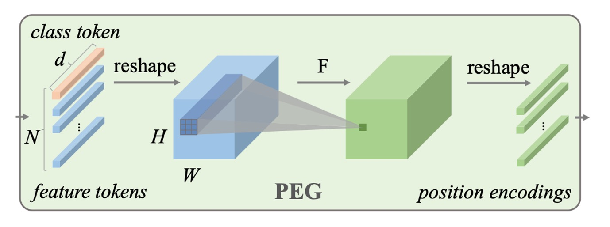
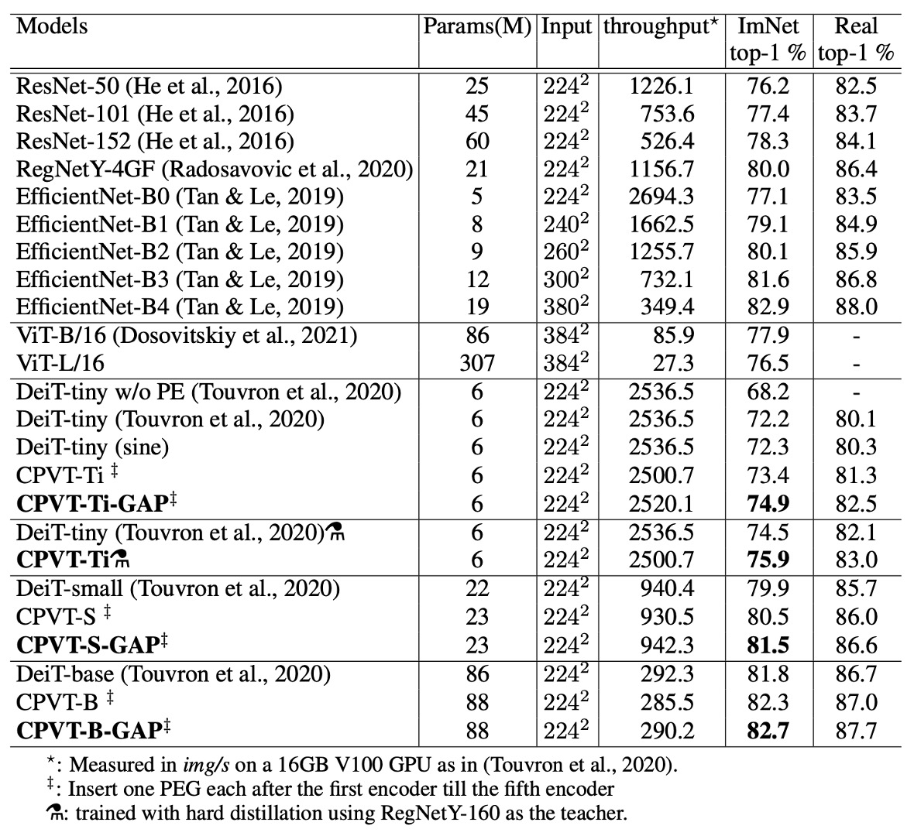

# [21.02] CPVT

## Conditional Positional Encodings

[**Conditional Positional Encodings for Vision Transformers**](https://arxiv.org/abs/2102.10882v3)

---

Shortly after the introduction of ViT (Vision Transformer), a wave of research emerged to improve its architecture.

If you've worked with ViT-based models, you might share the same frustration: the "learnable" positional encodings are challenging to use!

## Defining the Problem

In ViT, the input image is divided into fixed-size patches, and each patch is combined with a corresponding learnable absolute positional encoding. However, this positional encoding approach comes with two significant issues:

### Sequence Expansion

The length of the absolute positional encoding is fixed, which limits the model’s ability to handle longer sequences than what it was trained on.

You might wonder: **Can we just discard the positional encoding altogether?**

- **The answer is no!**

Removing positional encoding dramatically reduces model performance, as shown in the DeiT (Data-efficient Image Transformer) paper. In the DeiT-tiny model trained on ImageNet, accuracy drops from 72.2% to 68.2% without positional encodings—a significant and catastrophic drop.

This makes sense because the order of the input sequence carries crucial information. Without positional encodings, the model would lose the ability to capture this order.

### Translation Invariance

Translation invariance means the model can adjust its response when an object moves within the image.

In the ViT architecture, each image patch is added to a unique positional encoding, which causes the model to lose translation invariance. This negatively impacts performance, especially in classification tasks.

Research on DeiT has demonstrated that positional encodings can be extended to longer sequences using interpolation. However, this method requires multiple rounds of fine-tuning. If the model is deployed without fine-tuning, performance drastically declines.

**What about using relative positional encodings (RPE) instead?**

- **The answer: It addresses both of these issues.**

But, because it lacks absolute position information, experiments have shown that models with relative positional encodings underperform compared to those with absolute encodings.

:::tip

In fact, there's approximately a 1.5% accuracy difference between relative positional encodings and absolute positional encodings on the ImageNet dataset.
:::

## Solving the Problem

### Conditional Positional Encodings


To address these issues, the authors propose a new type of positional encoding: **Conditional Positional Encodings (CPE)**.

As shown in the figure above, the leftmost image represents the original ViT architecture, where the image patches are directly added to a "learnable" absolute positional encoding.

In the center image, the proposed CPE architecture introduces a key modification: **the positional encoding calculation occurs within the Transformer encoder itself**.

Specifically, it’s applied **after the first encoder layer but before the second one**.

:::tip
What’s this about?

We’ll come back to that later—let’s first look at the structure of the positional encoding itself.
:::

### Positional Encoding Generator



The Positional Encoding Generator (PEG) is key to the proposed CPE. Let’s break down its structure:

- **It’s simply a 2D convolution layer!**

After the image is split into patches, these patches pass through a convolution layer to generate the corresponding positional encodings.

This convolution layer is designed with **zero padding**, which allows the model to infer specific positional information. Through convolution, the model can dynamically generate the appropriate positional encodings based on the input image, which is what gives this method the name **Conditional Positional Encoding**.

The paper provides implementation details, and here’s a simplified version:

```python title="Algorithm 1 PyTorch snippet of PEG by the authors"
import torch
import torch.nn as nn

class VisionTransformer:

    def __init__(self, layers=12, dim=192, nhead=3, img_size=224, patch_size=16):
        self.pos_block = PEG(dim)
        self.blocks = nn.ModuleList([
            TransformerEncoderLayer(dim, nhead, dim*4)
            for _ in range(layers)
        ])
        self.patch_embed = PatchEmbed(img_size, patch_size, dim*4)

    def forward_features(self, x):
        B, C, H, W = x.shape
        x, patch_size = self.patch_embed(x)
        _H, _W = H // patch_size, W // patch_size
        x = torch.cat((self.cls_tokens, x), dim=1)
        for i, blk in enumerate(self.blocks):
            x = blk(x)
            if i == 0:
                x = self.pos_block(x, _H, _W)
        return x[:, 0]

class PEG(nn.Module):

    def __init__(self, dim=256, k=3):
        # Only for demo use, more complicated functions are effective too.
        self.pos = nn.Conv2d(dim, dim, k, 1, k//2, groups=dim)

    def forward(self, x, H, W):
        B, N, C = x.shape
        cls_token, feat_tokens = x[:, 0], x[:, 1:]
        feat_tokens = feat_tokens.transpose(1, 2).view(B, C, H, W)
        x = self.pos(feat_tokens) + feat_tokens
        x = x.flatten(2).transpose(1, 2)
        x = torch.cat((cls_token.unsqueeze(1), x), dim=1)
        return x
```

As you can see, the implementation of `PEG` really is just a single Conv2d layer without anything extra.

### Model Training Strategy

To validate this new positional encoding approach, the authors followed the DeiT training strategy rigorously. The experimental setup is as follows:

1. **Dataset**

   - The study uses the ImageNet dataset, which includes 1,000 classes and 1.3 million images for training.
   - Evaluation is conducted on the 50,000-image validation set.
   - The larger JFT-300M dataset was not used.

2. **Model Variants**

   - Three model variants of different sizes were designed for various computational needs.
   - All experiments were run on Tesla V100 machines.
   - Training the tiny model for 300 epochs took approximately 1.3 days (on a single node with 8 V100 GPUs), while CPVT-S and CPVT-B took 1.6 days and 2.5 days, respectively.

3. **Training Details**

   - Except for CPVT-B, the other models were trained for 300 epochs using Tesla V100 machines with a batch size of 2048.
   - The AdamW optimizer was used for training.

## Discussion

### PEG Placement


Why is PEG placed after the first encoder layer and before the second?

:::tip

- **Position 0**: After the first encoder layer’s output.
- **Position -1**: Before the first encoder.
  :::

The authors experimented with placing PEG in different positions in the model. According to the results (as shown in the table above), placing PEG at position 0 or position 3 led to the best Top-1 accuracy, around 72.4%. Placing PEG at position 0 performed better than at position -1, indicating that position 0 outperforms position -1.

The main difference between these positions is their receptive fields. Position 0 has a global receptive field, while position -1 can only see local regions. By increasing the convolution kernel size, the two positions should yield similar results.

To verify this hypothesis, the authors used a larger convolution kernel (27×27, with padding size 13) at position -1. The results showed similar performance (72.5%) to position 0, confirming this hypothesis.

However, increasing the convolution kernel size also increases computational complexity. Therefore, the authors chose to place PEG at position 0 to achieve better performance without added complexity.

### Where Does PEG’s Improvement Come From?

<div align="center">
<figure style={{ "width": "70%"}}>

</figure>
</div>

One might suspect that the improvement from PEG comes from the extra learnable parameters introduced by the convolution layer rather than the local relationships it retains. To test this, the authors applied PEG only to the calculation of Q and K in the attention layer to ensure that only positional information is transmitted.

As shown in the table above, under this condition, DeiT-tiny’s Top-1 accuracy reached 71.3%, significantly better than DeiT-tiny without positional encoding (68.2%) and close to the result when using PEG on Q, K, and V (72.4%). This demonstrates that PEG mainly serves as a positional encoding scheme rather than relying on extra learnable parameters from the convolution layer.

To further rule out that PEG’s performance improvement was due to additional parameters, the authors conducted another experiment: they randomly initialized a 3×3 PEG and fixed its weights. The result was a Top-1 accuracy of 71.3%, 3.1% higher than DeiT-tiny with no positional encoding. Since PEG’s weights were fixed, this performance improvement could only be attributed to the positional information provided by PEG.

:::tip
This means that even a "non-trainable" convolution kernel can enhance model performance.
:::

Conversely, when using 12 convolution layers (with kernel size 1, i.e., no local relationships) to replace PEG, the number of learnable parameters far exceeded that of PEG, but performance only improved by 0.4%, reaching 68.6%. This further confirms that PEG’s effectiveness comes mainly from positional information, not the extra parameters.

### Generalization to Higher Resolutions


As shown in the table above, PEG can directly generalize to larger image sizes without requiring fine-tuning. This was tested by evaluating models trained on 224 × 224 images with larger resolutions (384 × 384, 448 × 448, 512 × 512).

For the DeiT-tiny model, when using 384 × 384 input images, performance dropped from 72.2% to 71.2% with learnable positional encodings. Using sinusoidal encodings dropped it further to 70.8%.

In contrast, the CPVT model equipped with PEG can directly handle larger input images, and CPVT-Tiny (CPVT-Ti) saw performance increase from 73.4% to 74.2% at the 384 × 384 resolution. CPVT-Ti outperformed DeiT-tiny by 3.0%, with this gap continuing to widen as input resolution increases.

### Reducing Complexity

In PEG, if depth-wise convolutions are used, the additional number of parameters is $d \times l \times k^2$ (where $d$ is the model dimension, $l$ is the depth of the convolution, and $k$ is the kernel size). For separable convolutions, the number of parameters is $l(d^2 + k^2d)$.

For example, in CPVT-Tiny, when $k = 3$ and $l = 1$ (i.e., the model dimension $d = 192$), PEG introduces 1,728 parameters. In contrast, the DeiT-tiny model uses learnable positional encodings with 192 × 14 × 14 = 37,632 parameters.

Thus, CPVT-Tiny uses 35,904 fewer parameters than DeiT-tiny. Even using four layers of separable convolutions, the number of additional parameters in CPVT-Tiny is only 960 (38,952 − 37,632), which is almost negligible compared to DeiT-tiny’s total 5.7M parameters.

### Performance on ImageNet



Compared to DeiT, CPVT models achieve higher Top-1 accuracy with similar inference speeds. CPVT models can improve performance with increasing input image resolution without requiring fine-tuning, while DeiT's performance drops as the resolution increases.

CPVT models equipped with global average pooling (GAP) have set a new performance record for ViT-based models, achieving state-of-the-art results.

When comparing the CPVT-Tiny and DeiT-tiny models after additional hard distillation training, using the RegNetY-160 model as a teacher, the CPVT model achieved a Top-1 accuracy of 75.9%, surpassing DeiT-tiny by 1.4%.

### Comparison with Other Positional Encodings

<div align="center">
<figure style={{ "width": "70%"}}>

</figure>
</div>

Finally, the authors compared PEG with other common positional encoding methods and analyzed the combination of PEG with absolute positional encoding (APE) and relative positional encoding (RPE).

1. **Comparison of PEG and Other Positional Encodings**

   - The DeiT-tiny model using learnable absolute positional encoding (LE) achieved a Top-1 accuracy of 72.2%.
   - Using 2D sinusoidal encoding resulted in similar performance.
   - When using relative positional encoding (RPE, with hyperparameter K set to 8), the Top-1 accuracy dropped to 70.5%, lower than LE. One reason for this is that RPE does not encode absolute position information, leading to reduced performance.

2. **Combining PEG with Other Encodings**

   Combining learnable absolute positional encoding with a single-layer PEG improved the baseline CPVT-Ti model's performance by 0.5%. When using four layers of PEG, the model achieved a Top-1 accuracy of 72.9%. Adding PEG to the first five Transformer blocks further improved accuracy to 73.4%, outperforming the effect of stacking PEG in a single block.

## Conclusion

The authors demonstrate that PEG significantly improves model performance in handling long input sequences and maintaining translation invariance. In classification tasks, PEG outperforms both absolute positional encodings (APE) and relative positional encodings (RPE).

Furthermore, PEG is simple to implement, introduces minimal additional computational costs, and requires only a small number of extra parameters, making it an effective and practical solution.

:::tip
In research, we often encounter strong opinions about which architectures to use—whether you should exclusively use Transformer-based models without CNNs or CNNs without Transformers.

But from a practical perspective, a simple and effective method that boosts performance is exactly what we need.

Let's give it a try sometime and share the results later!
:::
