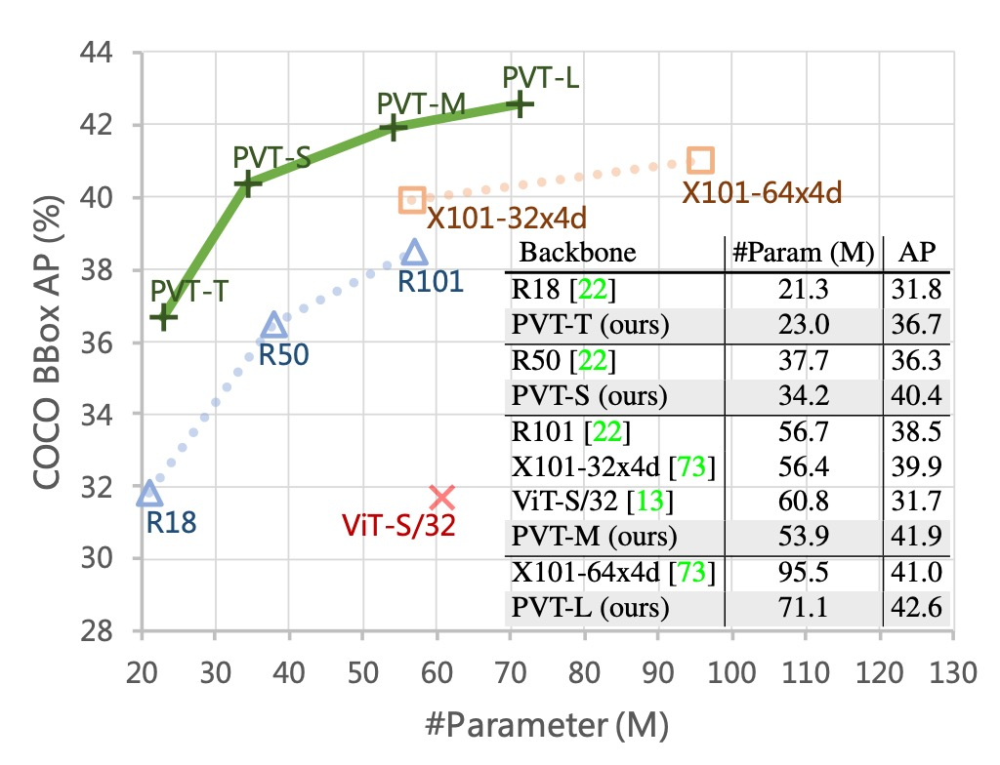
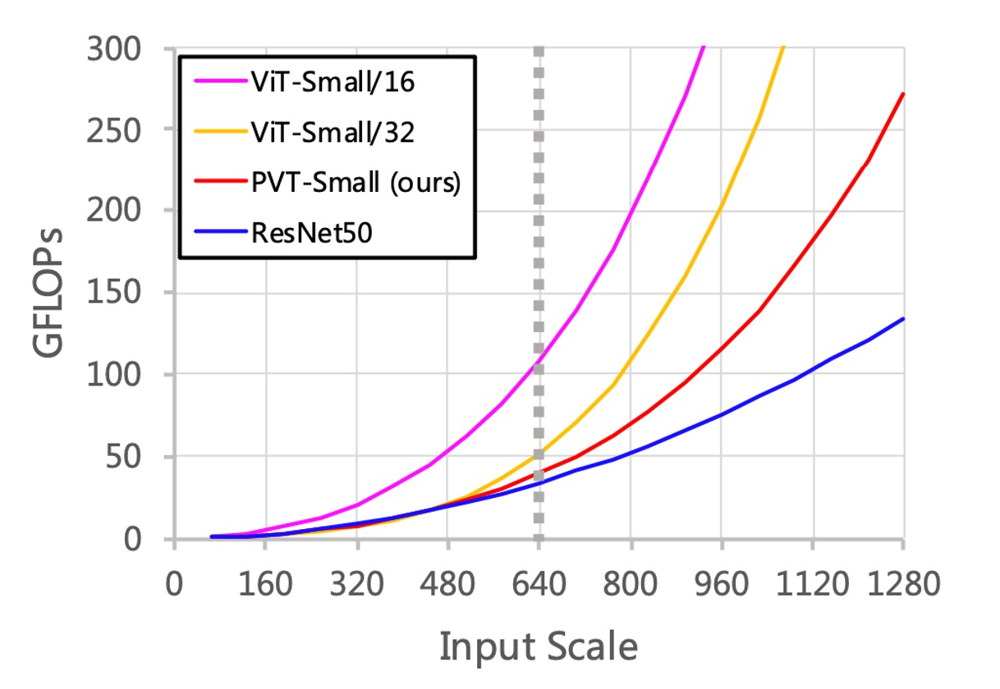

## Spatial Reduction Attention Mechanism

[**Pyramid Vision Transformer: A Versatile Backbone for Dense Prediction without Convolutions**](https://arxiv.org/abs/2102.12122)

---

ViT has achieved remarkable results in image classification, officially marking the entry of the Transformer architecture into the realm of computer vision.

## Defining the Problem

The ViT architecture begins by using 16 x 16 large kernel convolutions for patchifying images. For a 224 x 224 image, this process results in a 14 x 14 image. This resolution is sufficient for image classification tasks that rely on highly abstract global features. However, for dense prediction tasks like image segmentation or object detection, this patchifying method loses local details.

- **Because the details are lost in the 16 x 16 feature compression process.**

Obviously, we need more refined features for dense prediction tasks. So, what if we change the 16 x 16 convolution to a 2 x 2 convolution?

- **Of course not!**

Let's take a 224 x 224 image as an example:

- Using a 16 x 16 patch size, we get 14 x 14, totaling 196 input tokens.
- Using a 2 x 2 patch size, we get 112 x 112, totaling 12,544 input tokens.

**Imagine calculating a 12,544 x 12,544 self-attention matrix...**

Clearly, no one would consider this a good idea.

## Solving the Problem

### Model Architecture


The above image shows the design of the PVT architecture. While it may look complex, it essentially follows the same principles as convolutional neural network (CNN) architectures.

### Hierarchical Structure

First, we notice the hierarchical structure, similar to the common 1/2 downsampling in ConvNets, split into five stages. Therefore, there are 1/2 size feature maps, 1/4 size feature maps, 1/8 size feature maps, and so on. In the PVT architecture, it starts from a 1/4 size feature map and goes down to a 1/32 size feature map.

The downsampling process is implemented using convolutions with specified strides. For example, an input image of 3 x 224 x 224 with a stride of 4 convolution, producing 64 output channels, will result in a feature map of 64 x 56 x 56.

So, in the first stage, the input to the Transformer encoder is:

- **Sequence Length**: 3136 (all image patches, i.e., 56 x 56)
- **Feature Number**: 64 (features per patch, i.e., the number of channels)

### Spatial Reduction Attention (SRA)


After obtaining the feature maps, we realize that a (56 x 56) x (56 x 56) self-attention matrix is still enormous and needs serious handling.

The authors propose the concept of "Spatial Reduction Attention" (SRA), which retains the size of the queries (Q) but reduces the size of the keys (K) and values (V). For example, if the original self-attention map size is (56 x 56) x (56 x 56), reducing the key and value sizes to (7 x 7) will change the attention map size to 3136 x 49.

What seemed like an overly large self-attention matrix is now manageable.

Here's a closer look at the core concept of the paper. The key part is highlighted, and the `sr_ratio` setting in this paper is **[8, 4, 2, 1]**, indicating the spatial reduction ratio for each stage.

```python {31-34,40-44}
# Reference:
#   - https://github.com/whai362/PVT/blob/v2/classification/pvt.py

import torch
import torch.nn as nn

class SpatialReductionAttention(nn.Module):

    def __init__(
        self,
        dim,
        num_heads=8,
        qkv_bias=False,
        qk_scale=None,
        attn_drop=0.,
        proj_drop=0.,
        sr_ratio=1
    ):
        super().__init__()
        self.dim = dim
        self.num_heads = num_heads
        head_dim = dim // num_heads
        self.scale = qk_scale or head_dim ** -0.5

        self.q = nn.Linear(dim, dim, bias=qkv_bias)
        self.kv = nn.Linear(dim, dim * 2, bias=qkv_bias)
        self.attn_drop = nn.Dropout(attn_drop)
        self.proj = nn.Linear(dim, dim)
        self.proj_drop = nn.Dropout(proj_drop)

        self.sr_ratio = sr_ratio
        if sr_ratio > 1:
            self.sr = nn.Conv2d(dim, dim, kernel_size=sr_ratio, stride=sr_ratio)
            self.norm = nn.LayerNorm(dim)

    def forward(self, x, H, W):
        B, N, C = x.shape
        q = self.q(x).reshape(B, N, self.num_heads, C // self.num_heads).permute(0, 2, 1, 3)

        if self.sr_ratio > 1:
            x_ = x.permute(0, 2, 1).reshape(B, C, H, W)
            x_ = self.sr(x_).reshape(B, C, -1).permute(0, 2, 1)
            x_ = self.norm(x_)
            kv = self.kv(x_).reshape(B, -1, 2, self.num_heads, C // self.num_heads).permute(2, 0, 3, 1, 4)
        else:
            kv = self.kv(x).reshape(B, -1, 2, self.num_heads, C // self.num_heads).permute(2, 0, 3, 1, 4)
        k, v = kv[0], kv[1]

        attn = (q @ k.transpose(-2, -1)) * self.scale
        attn = attn.softmax(dim=-1)
        attn = self.attn_drop(attn)

        x = (attn @ v).transpose(1, 2).reshape(B, N, C)
        x = self.proj(x)
        x = self.proj_drop(x)

        return x
```

### Model Configuration

Finally, let's look at the PVT model configuration.

1. $P_i$: Patch size at stage $i$
2. $C_i$: Number of output channels at stage $i$
3. $L_i$: Number of encoder layers at stage $i$
4. $R_i$: Reduction ratio of SRA at stage $i$
5. $N_i$: Number of heads in SRA at stage $i$
6. $E_i$: Expansion ratio in the feed-forward layer at stage $i$

The model design follows the design rules of ResNet:

1. Use smaller output channels in the shallow stages.
2. Concentrate most computational resources in the middle stages.

For discussion purposes, the table below shows a series of PVT models of different scales: PVT-Tiny, PVT-Small, PVT-Medium, and PVT-Large. Their parameter counts are comparable to ResNet18, ResNet50, ResNet101, and ResNet152, respectively.


## Discussion

### ImageNet Performance


The authors compare PVT with two of the most representative CNN backbones, ResNet and ResNeXt, which are widely used in many downstream task benchmarks.

In the table above, PVT models outperform traditional CNN backbones with similar parameter counts and computational budgets.

For instance, with a similar GFLOP, PVT-Small achieves a top-1 error rate of $20.2\%$, outperforming ResNet50's $21.5\%$ by $1.3$ percentage points ($20.2\%$ vs. $21.5\%$).

With similar or lower complexity, PVT models achieve comparable performance to recently proposed Transformer-based models like ViT and DeiT.

PVT-Large achieves a top-1 error rate of $18.3\%$, on par with ViT (DeiT)-Base/16's $18.3\%$.

### Object Detection Performance


Since this architecture targets dense prediction tasks from the outset, let's focus on PVT's performance in dense prediction tasks.

1. **Datasets**:

   - Using the COCO benchmark
   - Training set: COCO train2017 (118k images)
   - Validation set: COCO val2017 (5k images)

2. **Models and Initialization**:

   - Standard detectors: RetinaNet and Mask R-CNN
   - Backbone initialized with ImageNet pretrained weights
   - New layers initialized with Xavier initialization

3. **Training Settings**:
   - Batch size: 16
   - Hardware: 8 V100 GPUs
   - Optimizer: AdamW
   - Initial learning rate: $1 \times 10^{-4}$

With comparable parameter counts, PVT models significantly outperform traditional models. With RetinaNet, PVT-Tiny's AP is 4.9 points higher than ResNet18 (36.7 vs. 31.8).

With Mask R-CNN, PVT-Tiny's mask AP (APm) is 35.1, 3.9 points higher than ResNet18 (35.1 vs. 31.2), and even 0.7 points higher than ResNet50 (35.1 vs. 34.4).

These results suggest that PVT can serve as a good alternative to CNN backbones for object detection and instance segmentation tasks.

The image below shows PVT's results on the COCO validation set.



### Contribution of the Pyramid Structure

The authors conducted several ablation studies to verify the impact of different parts of PVT on performance.

First, the contribution analysis of the pyramid structure is shown in the table below:


Compared to the original ViT structure, PVT's pyramid structure improved the AP score by 8.7 percentage points.

This indicates that the pyramid structure design helps improve performance in dense prediction tasks.

### Depth vs. Width Trade-off


The authors further explore whether PVT should be deeper or wider, as well as the impact of feature map sizes at different stages on performance.

By multiplying PVT-Small's hidden dimension by 1.4, making it comparable to PVT-Medium in parameter count, the experiments show that deeper models perform better under similar parameter counts.

### Addressing but Not Solving the Core Issue



Lastly, the authors discussed performance limitations.

As the input size increases, the GFLOPs of PVT grow faster than ResNet but slower than ViT. When the input size does not exceed 640×640 pixels, PVT-Small and ResNet50 have similar GFLOPs.

Additionally, with a fixed input image size of 800 pixels on the shorter side, the inference speed of RetinaNet based on PVT-Small is slower.

In practical scenarios, convolutional network architectures are better suited for large input sizes, a key direction for performance improvement.

:::tip
The root cause is that the SRA mechanism merely reduces the size of the self-attention matrix without addressing the computational complexity issue of the self-attention matrix at its core.
:::

## Conclusion

Although in 2021, comparing against ResNet and ResNeXt might seem conservative, this study introduces the pyramid structure into Transformers to provide a pure Transformer backbone for dense prediction tasks, rather than focusing on task-specific heads or image classification models, offering an important direction for future research.

At this point, Transformer-based models in computer vision are still in their early stages, and many potential technologies and applications remain to be explored.
