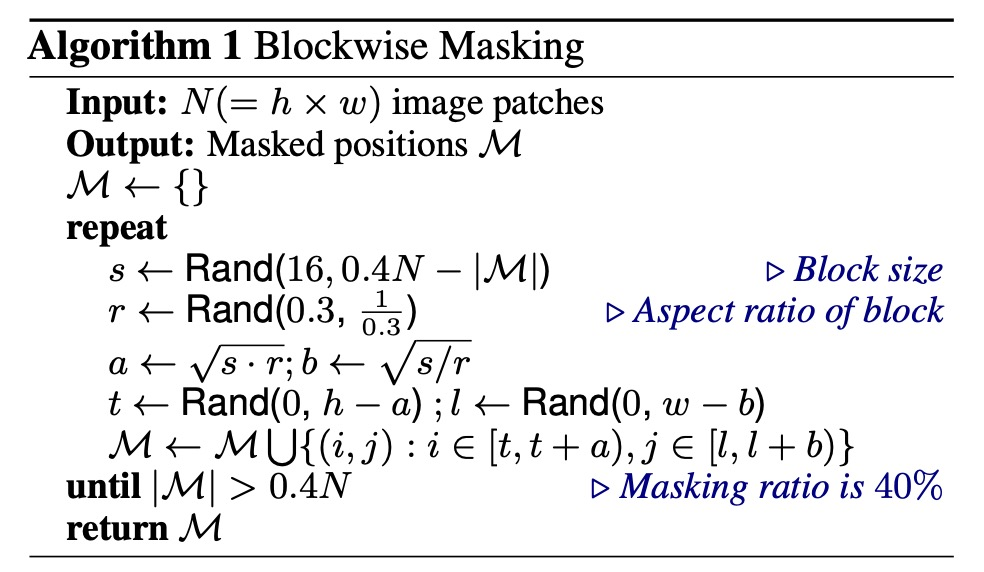
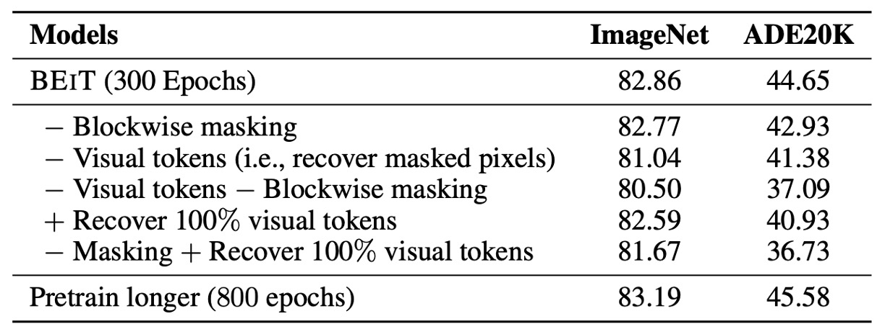

## Discrete Encoding Pre-Training

[**BEiT: BERT Pre-Training of Image Transformers**](https://arxiv.org/abs/2106.08254)

---

The main comparisons in this paper are made between ViT and DeiT.

The primary objective is to improve the classification performance of the ViT architecture on ImageNet.

## Problem Definition

BERT has achieved impressive results through MLM pre-training in the past, proving to be one of the most effective pre-training methods for self-encoding models.

- [**BERT: Twelve Layers of Encoders**](../../transformers/1810-bert/index.md)

However, the BERT concept doesn't translate as well to the image domain. In ViT, the authors attempted to mask parts of the model and predict the "RGB average" of each masked part for self-supervised learning, but the results were underwhelming. Eventually, they resorted to supervised learning for pre-training.

This paper aims to address the unresolved issues left by previous research by proposing a new pre-training method:

- Instead of directly predicting image pixel values, the authors suggest predicting "discrete labels" of images. This approach enables the model to learn higher-level features rather than just pixel values.

## Problem Solving

### Model Architecture

There are two architectures present here, which we will examine in sequence.

The first architecture is similar to a VAE, shown at the top of the image. This is not the author's proposed architecture but rather a result of prior research, only used to decompose images into small patches with labels.

This part aims to discretize the image, allowing the model to learn higher-level features rather than just pixel values. The overall concept is like training an "image dictionary," corresponding to different abstract concepts of the image, with a total of 8192 labels.

For details on the training method and more information, please refer to the original paper:

- [**[21.02] Zero-Shot Text-to-Image Generation**](https://arxiv.org/abs/2102.12092)

  :::tip
  Yes, it's the famous DALL-E.
  :::

---

The second architecture, shown in the lower part of the image, is the model that actually participates in gradient updates.

This part is identical to the ViT we are familiar with. The difference is that instead of using image labels for supervision, BEiT introduces BERT's MLM mechanism:

1. **Patchify**: The image is split into small patches, similar to ViT.
2. **Blockwise Masking**: This part differs, as some patches are randomly masked. The masking logic is detailed in the paper:

   

   The masking logic uses "block-wise" rather than "token-level" masking like BERT. Each iteration randomly generates an aspect ratio and selects the mask size, then covers the entire block.

   This process repeats until 40% of the image blocks are masked.

3. **Transformer Encoder**: This part is the same as ViT's Encoder, where the masked blocks are input into the model for prediction.
4. **Masked Patch Prediction**: This part predicts the labels of the masked blocks, one of the 8192 labels mentioned earlier.

### Training Method

BEiT's network architecture follows ViT-Base's design to ensure fair comparison. BEiT employs a 12-layer Transformer structure with a hidden size of 768, 12 attention heads, and a 3072 intermediate size in the FFN. The input patch size is 16 × 16, with a vocabulary size of 8192 visual tokens generated by a trained image tokenizer.

BEiT is pre-trained on the ImageNet-1K training set, containing about 1.2 million images. The pre-training process includes image augmentations like random resizing, cropping, horizontal flipping, and color jittering. Importantly, labels are not used during pre-training.

The authors experimented with a 224 × 224 resolution, splitting the input image into 14 × 14 patches, and randomly masking up to 75 patches (around 40%).

Pre-training lasted for approximately 500,000 steps (around 800 epochs) with a batch size of 2000. They used the Adam optimizer with $\beta_1 = 0.9$ and $\beta_2 = 0.999$, a learning rate set at $1.5 \times 10^{-3}$, with the first 10 epochs as a warm-up period, followed by cosine learning rate decay. Weight decay was set at 0.05, and random depth with a rate of 0.1 was employed.

Training utilized 16 Nvidia Tesla V100 32GB GPU cards, taking about five days.

To stabilize large-scale Transformer pre-training, the authors emphasized proper initialization. Initially, all parameters were randomly initialized within a small range (e.g., $[-0.02, 0.02]$), and for the $l$-th layer of the Transformer, the output matrices of the self-attention module and FFN were rescaled by $\frac{1}{\sqrt{2l}}$.

### Fine-tuning for Downstream Tasks

After pre-training BEiT, the authors added task-specific layers on the Transformer and fine-tuned the parameters on downstream tasks, similar to BERT.

The paper uses image classification and semantic segmentation as examples. For other visual tasks, the pre-train and fine-tune paradigm can be directly applied.

- **Image Classification**: For image classification, the authors used a simple linear classifier as the task layer. The representations were aggregated using average pooling and passed to a softmax classifier.
- **Semantic Segmentation**: For semantic segmentation, the authors followed the task layer used in SETR-PUP. They employed the pre-trained BEiT as the backbone encoder and combined it with several deconvolution layers as the decoder to generate segmentation. The model was fine-tuned end-to-end, similar to image classification.

  - [**[20.12] Rethinking Semantic Segmentation from a Sequence-to-Sequence Perspective with Transformers**](https://arxiv.org/abs/2012.15840)

## Discussion

### Performance on ImageNet

The authors investigated the performance of the BEiT model on the image classification task, comparing it in detail with several popular visual Transformer models. Among these models, only iGPT has 1.36B parameters, while the others are of basic size. Notably, ViT-JFT300M was pre-trained on 300 million images internally at Google, giving it an advantage in comparison.

However, the study shows that the pre-trained BEiT model significantly outperforms these comparative models on the ImageNet dataset.

To further validate BEiT's performance, the authors fine-tuned it on a 224 × 224 resolution and then additionally fine-tuned on images with a 384 × 384 resolution. The results indicate that the higher resolution significantly improves BEiT's performance on ImageNet, even surpassing $\text{ViT}_{384}$, which was pre-trained on ImageNet-22K.

Additionally, the study extended the BEiT model to larger versions (e.g., BEiT-L) and found that its performance improvement is more pronounced than when scaling ViT from base to large versions. This demonstrates BEiT's potential in handling larger models. As the model size increases, BEiT's performance improvement is more significant, especially in scenarios with insufficient labeled data.

### Ablation Studies

Finally, the authors conducted ablation studies on several key components. Firstly, they examined Blockwise masking by randomly sampling mask positions. The results show that Blockwise masking benefits both image classification and semantic segmentation tasks, particularly in the latter.

Next, the authors removed visual tokens and instead predicted the original pixels of the masked areas, turning the pre-training task into a pixel regression problem. The results demonstrate that the proposed masked image modeling task significantly outperforms simple pixel-level autoencoding.

Compared to the results in the table, the ablation results underperform compared to vision Transformers trained from scratch, indicating that visual token prediction is a crucial component of BEIT.

Thirdly, the authors ablated both visual tokens and Blockwise masking, showing that Blockwise masking benefits pixel-level autoencoding more by alleviating short-range dependency issues.

Fourthly, restoring all visual tokens harms downstream task performance. Fifthly, the authors compared BEiT's performance at different training steps, showing that extending pre-training time can further improve downstream task performance.

These ablation studies indicate that Blockwise masking and visual token prediction are essential to BEIT's success.

## Conclusion

BEiT continues the unfinished self-supervised pre-training of ViT, successfully transferring BERT's success to the ViT architecture. By introducing a self-supervised pre-training framework, BEiT achieves excellent fine-tuning results on downstream tasks like image classification and semantic segmentation.

Additionally, this method has an interesting feature of automatically acquiring knowledge about semantic regions without any manual labeling (as shown above), laying a significant foundation for future multi-modal pre-training tasks.

Subsequent versions, BEiT-V2 and BEiT-V3, have further improvements, which we will discuss when they become relevant.
