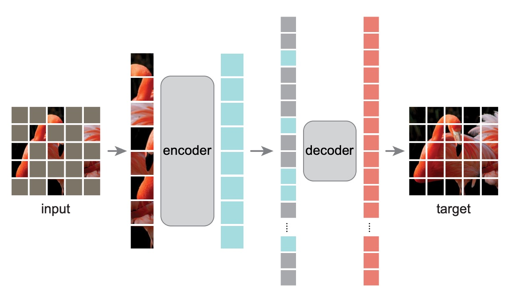
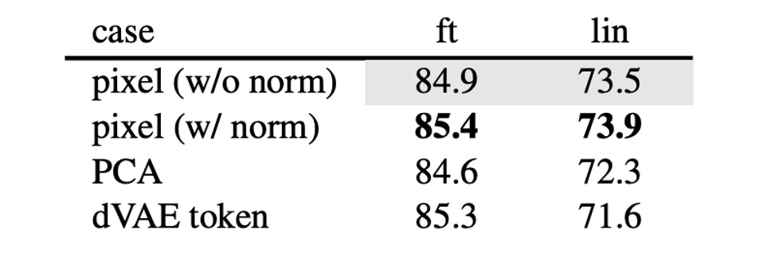

## A Quarter of the Clue

[**Masked Autoencoders Are Scalable Vision Learners**](https://arxiv.org/abs/2111.06377)

---

In the field of NLP, the most famous pre-training method is Masked Language Modeling (Mask LM). Simply put, 15% of the tokens in the input data are masked, and the model is trained to predict the content of the masked tokens. This classic learning paradigm has given rise to many successful models such as BERT, RoBERTa, and ALBERT.

But what about images?

Why doesn't the vision domain have a similar pre-training method?

## Defining the Problem

When ViT was proposed, similar experiments had already been conducted.

- [**[20.10] ViT: Pioneering a New Frontier**](../2010-vit/index.md)

In the paper, the authors emulated the Mask LM approach by masking parts of the image and having the model predict the masked portions. They also explored the differences between predicting pixels versus regions.

The conclusion was: neither worked well.

Neither self-supervised training method outperformed supervised methods.

---

The authors of this paper believe the main issue lies in the difference between the **information density of language and vision**.

Language is a human-generated signal with high semantic and informational density. When training a model to predict a few missing words in a sentence, the task seems to trigger complex language understanding. In contrast, images are natural signals with significant spatial redundancy. The model can recover the missing information from neighboring patches without needing a high-level understanding of parts, objects, or scenes.

For the model, it can simply interpolate from nearby patches to restore most of the information, without any real incentive to learn deeply. Naturally, the final results are disappointing.

## Solving the Problem

To overcome this disparity, the authors decided to mask most of the patches—how about 75%?

### Model Architecture

Unlike the architecture discussed in the ViT paper, some changes were made here.

Initially, as before, the image is split into patches, and some patches are randomly masked. To avoid center bias, the masked patches are randomly sampled.

- **Encoder**

  This is where things start to differ.

  The masked patches are not fed into the Encoder model, nor do they contribute to the loss calculation. The model only trains on the unmasked patches.

  The advantage of this approach is that it allows the model to be trained using a smaller portion of the data, reducing computational costs while still training a large model. When it comes to inference, removing all the masks reveals the full capabilities of the model.

- **Decoder**

  Here, an auxiliary Decoder model is introduced for training purposes. The input to the Decoder is the "complete" image sequence, including the masked patches. The masked patches contain only positional information, with no other content.

  The model's goal is to predict the masked patches and compare them to the original image to calculate the loss.

  After pre-training, this entire module can be discarded, leaving only the Encoder.

### Training Method

MAE reconstructs the input by predicting the pixel values of each masked patch. The final layer of the Decoder is a linear projection, with the number of output channels equal to the number of pixel values in a patch.

The loss function is the Mean Squared Error (MSE) between the reconstructed image and the original image in pixel space. Training is only conducted on the masked patches, not the entire image.

The authors included numerous illustrations in the paper to ensure readers understood the concept. Here's one of the images:

On the left is the input image with masks, in the middle is the Decoder’s output, and on the right is the original image.

## Discussion

The authors first optimized the ViT training method, boosting the top-1 accuracy from 76.5% to 82.5% as the model baseline.

The MAE approach further improved the model's performance to 84.9%, a staggering result.

### How Much Masking is Optimal?

The authors experimented with two scenarios: Fine-tuning and Linear-probing.

:::tip
The difference is that Fine-tuning directly fine-tunes the pre-trained model, while Linear-probing freezes the pre-trained model and only trains the final classifier.
:::

As shown in the image above, when the masking ratio exceeds 80%, performance starts to drop. The optimal performance is between 40% and 80%. Based on the Linear-probing results, the authors chose a 75% masking ratio.

It’s particularly noteworthy that inputting masked patches during the Encoder stage leads to a significant performance drop (14%). This is because this approach misaligns the model's training and deployment phases, hindering learning.

### Decoder Parameters

The authors further explored the impact of Decoder parameters on the final results.

The experiments showed that a Decoder depth of 8 layers worked best, and the Decoder width didn’t need to match the Encoder’s width (dim=1024); about half the width sufficed.

### Learning Targets

The results in this paper are based on reconstructing the original pixels, but the authors also explored other learning targets, such as predicting PCA components or dVAE latent variables.

These alternatives didn’t perform as well as reconstructing original pixels, though predicting normalized pixel values showed promising results.

### Data Augmentation

The authors tested data augmentation methods like random cropping and rotation during training. The results showed that these augmentations weren’t necessary— the model achieved the best results using the original images.

This contrasts sharply with contrastive learning methods, which heavily rely on data augmentation. For example, in methods like BYOL and SimCLR, performance drops significantly without augmentation.

- [**[20.02] A Simple Framework for Contrastive Learning of Visual Representations**](https://arxiv.org/abs/2002.05709)
- [**[20.06] Bootstrap your own latent: A new approach to self-supervised Learning**](https://arxiv.org/abs/2006.07733)

### Masking Strategy

In addition to the proposed masking strategy, the authors tested several other approaches:

- random: random masking
- block: block masking
- grid: grid masking

The differences are shown below:

The experiments revealed that block masking performs well at a 50% masking ratio but falls short at a 75% ratio compared to random masking. The random method allows for the most extensive masking, incorporating it into model training while providing the best results.

### Performance on ImageNet

1. **Comparison of Self-Supervised Methods**:

   - For the ViT-B model, the performance differences between methods are minimal.
   - For the ViT-L model, the differences are more significant, highlighting the challenge of reducing overfitting in larger models.
   - The MAE method scales well, consistently improving accuracy on larger models.
   - Using the ViT-H model (224 size), the MAE method achieved 86.9% accuracy; when resized to 448, the accuracy increased to 87.8% using only IN1K data.

2. **Comparison with State-of-the-Art Methods**:

   - Among all methods using only IN1K data, the MAE method surpasses the previous best accuracy (87.1%) achieved by advanced networks.
   - The MAE method is more accurate than the BEiT model, simpler, faster to train (3.5x per epoch), and doesn’t require dVAE pre-training.

The MAE model undergoes 1600 epochs of pre-training to enhance accuracy, yet the total pre-training time is still less than other methods. Compared to supervised pre-training, the MAE method helps scale up the model and demonstrates better performance.

## Conclusion

In image processing, light signals don’t have the clear semantic decomposition found in text, yet MAE can generate detailed image reconstructions, indicating that it captures many critical visual concepts.

This is reminiscent of the success in the NLP domain. We can see that the vision field is developing along a similar trajectory, albeit in a different way.

Many subsequent studies have borrowed from this approach, incorporating MAE techniques into their training processes to improve model performance. We will share these related studies as we encounter them in the future.
