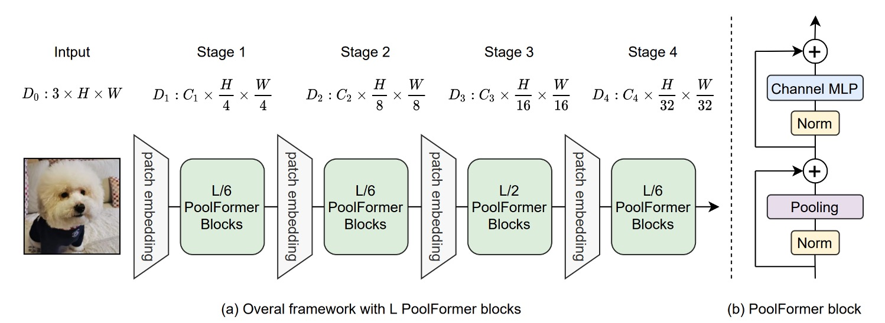
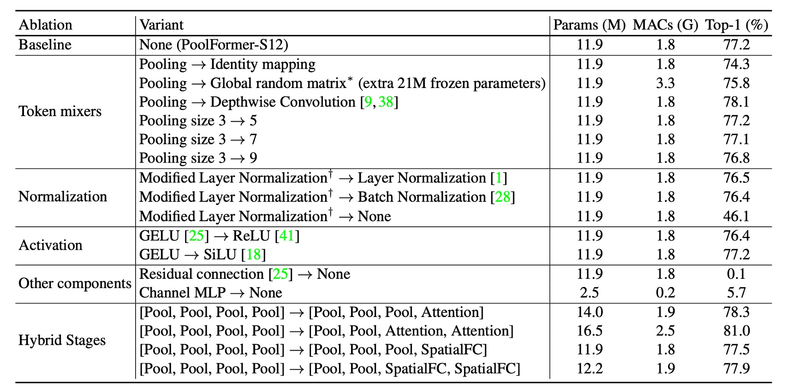

## You Need a Meta!

[**MetaFormer Is Actually What You Need for Vision**](https://arxiv.org/abs/2111.11418)

---

The introduction of the Transformer architecture into the vision domain has sparked a significant wave of research. In previous studies, most researchers focused on improving the performance of the Token-Mixer or optimizing the Patchify process. However, an important issue was often overlooked: **the framework**.

## Problem Definition


This "framework" refers to the fundamental structure that makes up the Transformer, including:

### Input Embedding

This component converts an image into a sequence of vectors, usually accomplished through CNNs.

:::tip
Typically, this involves non-overlapping sliding window large-kernel convolutions, which effectively function as fully connected layers. CNNs are used because the sliding window mechanism facilitates patch extraction.
:::

### Token-Mixer

This part involves the mixing of tokens, typically achieved through the self-attention mechanism of Transformers. Recent research introduced the MLP-Mixer concept, replacing self-attention with MLP to reduce computational load.

### Channel MLP

This component handles the mixing of dimensions within each token, usually achieved through MLP.

### Is Token-Mixer Really the Key?

The authors explore whether the success of Transformers is mainly due to the attention-based Token-Mixer or the overall architecture of the Transformer (MetaFormer). They experiment by replacing the original attention module with simple pooling operations to verify the critical role of the MetaFormer architecture in model performance.

## Solution

### Model Architecture



To validate the importance of MetaFormer, the authors minimized the role of the Token-Mixer by replacing the self-attention module with pooling operations. Pooling operations are extremely simple, second only to identity mapping, performing statistical operations such as max pooling or average pooling on a set of data.

Additionally, the authors adopted a multi-level architecture similar to PVT, downsampling in stages like in CNN models.

- [**PVT: Spatial Reduction Attention Mechanism**](../2102-pvt/index.md)

Regarding the pooling operation, the authors provided implementation details:

```python {20}
import torch.nn as nn

class Pooling(nn.Module):

    def __init__(self, pool_size=3):
        super().__init__()
        self.pool = nn.AvgPool2d(
            pool_size,
            stride=1,
            padding=pool_size//2,
            count_include_pad=False,
        )

    def forward(self, x):
        """
        [B, C, H, W] = x.shape
        Subtraction of the input itself is added since the block already has a
        residual connection.
        """
        return self.pool(x) - x
```

Note the implementation line `self.pool(x) - x`. Initially, this might seem confusing. The authors included a comment explaining that it is due to the residual connection mechanism in the Token-Mixer structure, i.e.,

$$
x = x + \text{TokenMixer}(x)
$$

Subtracting `x` cancels out the original residual connection, isolating the effect of the pooling operation.

### Model Configuration


The architecture configuration follows a 1:1:3:1 ratio from previous studies, with an MLP expansion ratio of 4.

## Discussion

### ImageNet Experiments


The PoolFormer experiment results are astonishing, surpassing many previously "carefully designed" models, including ViT, MLP-Mixer, and PVT. Simply using "average pooling" as a substitute for the Token-Mixer achieves remarkable performance, highlighting the importance of the MetaFormer architecture.

When plotted as a chart, it is evident that PoolFormer outperforms other models in terms of parameters and computational efficiency.


### Ablation Experiments

:::tip
Based on the title of this paper, this section is arguably the most crucial.
:::



To further validate PoolFormer's effectiveness, the authors conducted ablation experiments, gradually reverting the PoolFormer architecture to the original Transformer structure.

1. **Token-Mixer**

   - **Identity Mapping**
     - Replacing pooling with identity mapping, MetaFormer still achieved 74.3% top-1 accuracy, indicating that the MetaFormer architecture is key to performance.
   - **Global Random Matrix**
     - Using a global random matrix for token mixing resulted in 75.8% accuracy, 1.5% higher than identity mapping.
   - **Depthwise Convolution**
     - Replacing pooling with depthwise convolution, the model achieved 78.1% top-1 accuracy, 0.9% higher than PoolFormer-S12.

2. **Pooling Size**

   - Testing pool sizes of 3, 5, and 7 found similar performance, with the default being pool size 3.

3. **Modified Layer Normalization (MLN)**

   - Calculating the mean and variance of marked and channel dimensions, outperforming Layer Normalization and Batch Normalization by 0.7% and 0.8%, respectively.
   - Removing normalization reduced performance to 46.1%.

4. **GELU vs ReLU vs SiLU**

   - Using ReLU, performance dropped by 0.8%.
   - Using SiLU, performance was the same as GELU.
   - GELU is the default choice.

5. **Residual Connection and Channel MLP**

   - Without residual connection or channel MLP, the model failed to converge, with accuracy only 0.1%/5.7%.

6. **Hybrid Models**
   - Using pooling at the bottom stage and attention or spatial MLP-based mixers at the top stage achieved 81.0% accuracy with 16.5M parameters and 2.5G MAC.
   - Compared to ResMLP-B24, which required 116M parameters and 23G MACs for the same accuracy.

Based on these ablation experiments, the authors concluded several points:

- The MetaFormer architecture is key to performance.
- Simple pooling as a Token-Mixer can achieve competitive performance.
- Modified Layer Normalization (MLN) outperforms standard LayerNorm and BatchNorm.
- Residual connections and Channel MLP are indispensable components.
- Combining pooling with other Token-Mixers may be a promising direction for performance improvement.

## Conclusion

In this study, the authors abstracted the original Transformer into a general MetaFormer architecture. This abstraction highlights that the attention mechanism in Transformers can be generalized as a Token-Mixer, providing a flexible and powerful framework. By using pooling, a highly simplistic operation, as the Token-Mixer, the authors demonstrated the competitive performance of the PoolFormer model across various vision tasks, strongly supporting the claim that **MetaFormer Is Actually What You Need for Vision**.

Future research directions include examining the broad applicability and robustness of the MetaFormer architecture. The authors suggest exploring the application of PoolFormer in natural language processing (NLP) tasks to verify MetaFormer’s effectiveness in the NLP domain. If proven, the MetaFormer will solidify its status as a universal architecture.
