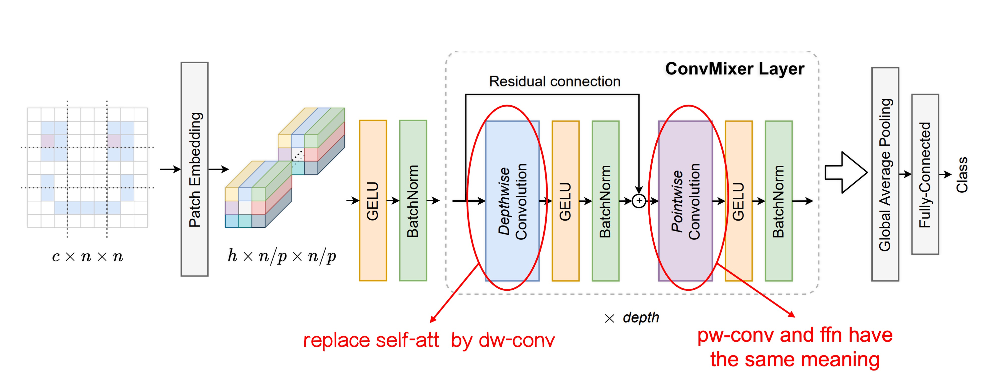
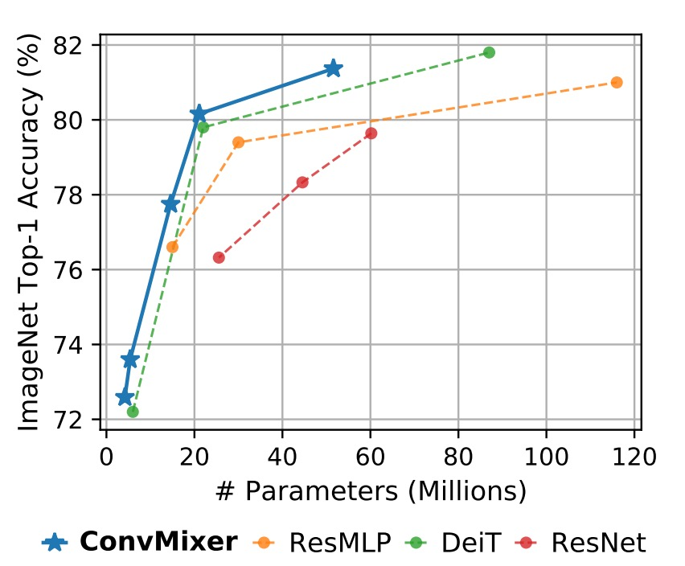

# [22.01] ConvMixer

## Convolutional Mixer

[**Patches Are All You Need?**](https://arxiv.org/abs/2201.09792)

---

In recent years, we've frequently come across titles like "**XXX is all you need**". These catchy titles always pique our curiosity, prompting us to dive in and see what's new this time.

## Problem Definition

Since the introduction of ViT (Vision Transformer), researchers have been eager to understand why Transformers perform so well. Is it due to the self-attention mechanism? The token-mixing process? Or the overall architecture design?

In this paper, the authors explore whether the strength of ViT stems from the Patchify mechanism. To investigate this, they introduce ConvMixer, a model designed to eliminate the influence of the self-attention mechanism. If the model still performs well without self-attention, it could indicate that the Patchify mechanism is indeed crucial to the model's success.

## Solution

### Model Architecture

The authors made two main modifications to the original ViT architecture:

1. **Replacing the Self-Attention module with a Convolution module.**

   As shown in the image above, we've highlighted the changes made to the architecture.

   The initial Patchify process remains unchanged, but in the token-mixing stage, the authors replaced the Self-Attention module with Depthwise Convolution.

   This change limits each token's ability to "see" all other tokens, restricting them instead to their "nearby" tokens (depending on the convolution kernel size). By removing the self-attention mechanism, the authors aimed to isolate the impact of the Patchify mechanism on model performance.

2. **Replacing the MLP with Pointwise Convolution.**

   This modification is essentially a non-change since Pointwise Convolution is equivalent to an MLP.

   It's worth noting because these operations can all be implemented through convolution. The fully connected layer operations on image channels, when done through convolution, are termed Pointwise Convolution.

### Training Strategy

The authors did not introduce additional training data, opting instead to train directly on ImageNet.

The training setup was similar to other models, using techniques like RandomAug and MixUp. They used the AdamW optimizer, though the number of epochs was relatively low, which the authors attribute to limited computational resources.

### Model Design Parameters

The ConvMixer model's design parameters include the following four key elements:

1. **Width (hidden dimension, h):** This refers to the embedding dimension of the patches, also known as the model's hidden dimension.

2. **Depth (d):** The number of repetitions of ConvMixer layers, representing the model's depth.

3. **Patch size (p):** A parameter that controls the internal resolution of the model, determining the initial division size of the input image during convolution.

4. **Kernel size (k):** The kernel size of the depthwise convolution layer, which influences the scope of the convolution operation.

ConvMixer models are typically named based on their hidden dimension and depth, such as ConvMixer-h/d. Additionally, ConvMixer supports variable input sizes, with the internal resolution determined by dividing the original input size n by the patch size p.

## Discussion

### Performance on ImageNet

:::tip
Due to the smaller patch size, ConvMixer has a noticeably slower inference speed compared to its competitors.
:::

ConvMixer-1536/20 outperforms ResNet-152 despite having significantly fewer parameters. ConvMixer-768/32 also achieves similar accuracy while using only one-third of the parameters of ResNet-152.

ConvMixer-1536/20, with its relatively small number of parameters, surpasses ResMLP-B24 in accuracy and performs comparably to DeiT-B, demonstrating parameter efficiency. In contrast, the results for DeiT and ResMLP involve hyperparameter tuning, while ConvMixer's results were obtained without any hyperparameter tuning.

## Conclusion

This paper introduces ConvMixer, a model designed to minimize the impact of the self-attention mechanism to explore the significance of the Patchify process.

The experimental results show that even after removing the self-attention mechanism, the model's performance remains strong. The authors draw two conclusions:

1. The Patchify mechanism is indeed important.
2. ConvMixer is a simple yet powerful approach, making it a worthwhile consideration.

:::tip
Based on the experimental results, we agree with the conclusion that the self-attention mechanism is not strictly necessary. However, the simplicity of the Patchify process leaves little room for further simplification.

Everyone knows that "Patchify" is essentially just a linear operation, akin to the `nn.Embedding` operation commonly used in NLP tasks. In NLP, we rarely see anyone praising `nn.Embedding` as a powerful operation. Instead, most of the focus is on designing the tokenizer, whether to use BPE, WordPiece, or some other method to create more "efficient" tokens.

Given the title of this paper, we were hoping to see a "magical Patchify" operation that could significantly boost model performance within the same Transformer framework.

At that point, I might have been able to say, "A good patchify is all you need."

But then we'd be faced with another dilemma:

We originally moved away from convolutional networks' inductive biases to adopt Transformers, only to circle back and add more operations to this "powerful" structure, as if we don't fully trust it to solve the problem on its own.

Oh, what a paradox this topic has turned out to be!
:::
