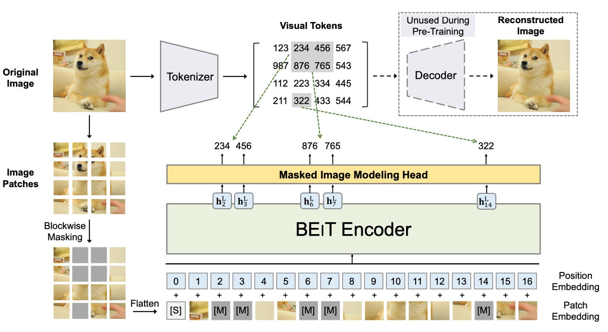

## Hidden Codes in High Dimensions

[**BEiT v2: Masked Image Modeling with Vector-Quantized Visual Tokenizers**](https://arxiv.org/abs/2208.06366)

---

Do you remember BEiT?

If you've forgotten, let's quickly review, or you won't be able to understand this paper:

<figure style={{"width": "80%"}}>

</figure>

The core concept of BEiT is to transform an image into a set of discrete visual features (a total of 8192 features). There are two architectures involved here, as shown in the figure above.

The first architecture is similar to a VAE structure, located in the upper half of the image. This part is based on previous research and does not participate in training; it is only used to convert the image into a set of discrete visual features. The overall concept is similar to training an "image dictionary" that corresponds to different abstract concepts of the image.

The second architecture is the lower half, which is the model that participates in gradient updates. This part introduces BERT's MLM mechanism to mask and reconstruct image patches. Since it involves masking image patches, it is also called Masked Image Modeling (MIM).

:::tip
If you're interested in the details of BEiT, you can refer to our previous notes:

- [**[21.06] BEiT: Discrete Encoding Pre-Training**](../2106-beit/index.md)
  :::

## Defining the Problem

Speaking of MIM, the most famous method in recent years is probably MAE.

MAE believes that there is a lot of redundancy in image information, so masking a small region is insufficient for the model to learn useful information. In MAE's approach, a strategy of masking 50% to 75% of the pixels in the image is used to increase the difficulty of learning for the model.

The experimental results are indeed impressive, creating a trend.

:::tip
If you want to learn more about MAE, you can read this article:

- [**[21.11] MAE: A Quarter of the Clue**](../2111-mae/index.md)
  :::

However, MAE ultimately focuses on "low-level" pixel reconstruction, neglecting "high-level" semantic information, leading to insufficient semantic capability in representation learning.

So, what is "high-level" semantic information?

The authors believe that the visual tokens proposed by BEiT represent a "higher-level" abstract concept that goes beyond pixels. Therefore, building on the success of BEiT, the goal here is to find ways to help the model learn richer semantic information.

## Solving the Problem

### Model Architecture

The authors refer to this architecture as: Vector-Quantized Knowledge Distillation, or VQ-KD for short.

A bunch of terms suddenly appear, catching us off guard. Let's follow the diagram step by step.

- **Step 1: Calculate Image Features**

  First, the input image $x \in \mathbb{R}^{H \times W \times C}$ is divided into $N = \frac{HW}{P^2}$ image patches.

  Suppose the image size is $224 \times 224$, and each patch is $16 \times 16$, then there are $14 \times 14 = 196$ patches, i.e., $N=196$. Each patch is flattened and passed through a ViT encoder to obtain a vector representation $h_i$, where $i=1,2,\dots,N$.

  Therefore, we have a set of vectors $\{h_i\}_{i=1}^N$, each corresponding to an image patch.

  Up to this point, there is not much difference from the first generation of BEiT.

---

- **Step 2: Query the Codebook with Features**

  This is where things start to differ. In the first generation of BEiT, the authors directly used the visual tokens generated by DALL-E.

  The second generation architecture, however, directly sets up a codebook $V \in \mathbb{R}^{K \times D}$, which contains $K$ code vectors $\{v_j\}_{j=1}^K$, each of which is a $D$-dimensional vector.

  To map $h_i$ to a code $v_{z_i}$, the authors use the following formula to find the most similar code index $z_i$:

  $$
  z_i = \arg\min_j \| \ell_2(h_i) - \ell_2(v_j) \|^2,
  $$

  L2 normalization means projecting the vector $h_i$ onto the unit sphere to find the most similar code $v_j$ to $h_i$. This method compares the direction of vectors rather than their magnitude.

  This step is the "vector quantization" process, which converts continuous feature vectors into discrete codes.

---

- **Step 3: Align with Teacher Model for Knowledge Distillation**

  After selecting the code $v_{z_i}$, the L2 normalized vector $\ell_2(v_{z_i})$ is input to a decoder (also a Transformer architecture).

  The output of the decoder is $o_i$, and the goal is to learn high-level semantics by aligning it with the semantic features $t_i$ provided by a "teacher model" (e.g., CLIP).

  During training, we aim to maximize the cosine similarity between $o_i$ and $t_i$, guiding the decoder to produce semantically rich representations.

  This step is the "knowledge distillation" process, enabling the model to learn richer semantic information.

---

In simple terms, the decoder receives the code vector and outputs $o_i$, attempting to maximize $\cos(o_i, t_i)$ (indicating that $o_i$ is as similar as possible to $t_i$).

In the quantization process (where the code is selected via arg min), the code $z_i$ cannot be directly differentiated. The authors solve this using the following methods:

- Use a stop-gradient operation (denoted $sg[\cdot]$) to stop the gradient from flowing through specific paths.
- Perform a "straight-through" operation on the decoder input gradient, sending it back to the encoder, so both the encoder and the codebook can update.

The overall training objective for VQ-KD is:

$$
\max_{\{v_j\}} \sum_{x \in D} \sum_{i=1}^{N} \cos(o_i, t_i) - \| sg[\ell_2(h_i)] - \ell_2(v_{z_i}) \|_2^2 - \|\ell_2(h_i) - sg[\ell_2(v_{z_i})]\|_2^2,
$$

This objective function consists of three parts:

- $\cos(o_i, t_i)$: Maximize the similarity between the decoder output and the teacher features to ensure the code contains rich semantic information.
- $\| sg[\ell_2(h_i)] - \ell_2(v_{z_i}) \|_2^2$: Ensure that the selected code $v_{z_i}$ is close to the encoder output $h_i$ (but $h_i$ does not backpropagate gradients to $v_{z_i}$).
- $\|\ell_2(h_i) - sg[\ell_2(v_{z_i})]\|_2^2$: Ensure that the encoder output $h_i$ is close to the selected code $v_{z_i}$ (codes do not receive gradients from this term).

Through the stop-gradient operation, the encoder and codebook are guided to adjust in opposite directions, ultimately achieving a codebook with a well-distributed semantic representation.

A common issue during training is that only a few codes in the codebook are frequently used, while others remain "idle."

To solve this, the authors use the following strategies:

- Use L2 normalization to compute distances, which helps balance the usage rates of the codes.
- Reduce the codebook vector dimensionality to 32 and map it back to a higher-dimensional space, which helps reduce the problem of some codes being overused.
- Use Exponential Moving Average (EMA) to update the codes, ensuring smoother and more diverse updates.

Through these steps and techniques, VQ-KD allows the visual tokenizer to learn to represent images using a set of discrete codes, preserving semantic information while achieving a transformation from continuous features to high-semantic discrete representations.

### Pretraining Method

After completing VQ-KD, the visual tokenizer has learned to use discrete codes to represent images. The next step is to use these codes for MIM pretraining.

Approximately 40% of the patches of the input image $x$ are randomly masked. After masking, the masked positions $M$ are replaced with the same learnable embedding vector $e[M]$ instead of the original patch embeddings $e_{p_i}$.

In the diagram above, the blue part represents the MIM pretraining process of BEiT's first generation, with the same masking ratio. During prediction, a simple fully connected layer (MIM head) is used to predict the visual codes, where the visual code $z_i$ is provided by the pretrained visual tokenizer, i.e., $z_i$ is the discrete code corresponding to the patch in the original image.

The MIM training loss is:

$$
L_{\text{MIM}} = -\sum_{x \in D} \sum_{i \in M} \log p(z_i | x_i^M)
$$

Here, $D$ is the image dataset used for pretraining.

### Global Representation Pretraining

The original term is "Global Representation Pretraining."

In the diagram above, the "Path Aggregation" part is a new design in BEiT v2.

To ensure that the supervisory information deeply integrates with the global visual tokenizer, the authors propose a new design called "Global Representation Pretraining."

The method adds a Transformer decoder at the last layer of the visual tokenizer, concatenating the [CLS] token with the patch features from a middle layer, and then feeding them into a shallow Transformer decoder to predict the masked patches.

The decoder here shares parameters with the original MIM head, and the loss is computed in the same way as the MIM loss, denoted as $L_{c}^{\text{MIM}}$. Therefore, the final pretraining loss is the sum of the original MIM loss and the shallow decoder MIM loss:

$$
L_{\text{total}} = L_{\text{MIM}} + L^{c}_{\text{MIM}}
$$

After training, the shallow decoder is discarded, leaving only the [CLS] token with global feature capabilities.

### Model Configuration

- **Visual Tokenizer**

  For the pretraining of BEIT V2 at base (B) and large (L) scales, the architecture of the visual tokenizer adopts ViT-B/16. The decoder uses a three-layer Transformer, with the same dimensionality and attention heads as the tokenizer encoder.

  The teacher model is OpenAI CLIP-B/16, and VQ-KD is trained on ImageNet-1K (with a resolution of 224×224). For both base-size and large-size model pretraining, the same base-size teacher is used to train the tokenizer.

  The codebook size is $K=8192$, and the code dimension is $D=32$.

  :::tip
  For other details, please refer to Appendix D of the paper.
  :::

- **Masked Image Modeling Settings**

  Similar to BEiT, the authors conduct self-supervised pretraining on the unlabeled ImageNet-1K with an input image resolution of $224 \times 224$.

  The model uses ViT-B/16 and ViT-L/16 as the backbone architecture ($16 \times 16$ patch). In the patch aggregation strategy, $l=9$ is set for ViT-B/16 and $l=21$ for ViT-L/16, with a default depth of 2 layers. The masking ratio is 40% (approximately 75 patches), and the masking strategy is block-wise masking.

  :::tip
  For other details, please refer to Appendix E of the paper.
  :::

## Discussion

### Comparison with Other Methods

<figure style={{"width": "80%"}}>

</figure>

First, let's look at the fine-tuning results. The authors compared BEiT v2 with BEiT, CAE, SplitMask, PeCo, and MVP, showing that BEiT v2 significantly outperforms the other methods in top-1 accuracy on ImageNet-1K.

With more pretraining epochs, BEiT v2’s top-1 accuracy can be further improved, reaching 85.5%, setting a new record for self-supervised methods. For ViT-L/16, after 300 epochs, it reaches 86.6%, and with longer pretraining, it can be improved to 87.3%.

The last column in the table presents the results of experiments on the ADE20K (Zhou et al., 2019) dataset, which contains 25K images and 150 semantic categories. Using UperNet (Xiao et al., 2018) as the task head, the model is fine-tuned for 160K iterations with an input resolution of $512 \times 512$.

The results show that BEiT v2 significantly outperforms previous self-supervised methods on ADE20K, with the ViT-L/16 model achieving an mIoU of 56.7, setting a new record for MIM methods.

### Ablation Study - Codebook Size

The table above shows the impact of VQ-KD with different architectures and codebook sizes.

The experiments use ViT-B/16 without patch aggregation (pretrained for 300 epochs) as the baseline.

The results show:

- A deeper decoder improves reconstruction performance but reduces codebook usage, leading to worse downstream task performance.
- Reducing the dimensionality of the codebook search improves the utilization of the codebook.

### Ablation Study - Patch Aggregation Strategy

<figure style={{"width": "80%"}}>

</figure>

Next, the authors perform an ablation study on the patch aggregation strategy, and the results show:

- Using a shallower head (1 or 2 layers) outperforms using a deeper head (3 layers), indicating that shallow heads are more inclined to use the input [CLS] token.
- Models that apply this strategy outperform baseline models without it, especially in linear probing, showing that it enhances image-level representations.
- Sharing the MIM head under this strategy helps improve downstream task performance.

### Ablation Study - Teacher Objective Analysis

<figure style={{"width": "80%"}}>

</figure>

The authors compare the VQ-KD performance with DINO and CLIP as teacher models:

- When DINO is used as the teacher, BEiT v2 achieves 84.4% on ImageNet and 49.2% on ADE20K, both significantly outperforming the original DINO model.
- When CLIP is used as the teacher, BEiT v2 continues to improve, demonstrating the scalability of VQ-KD.

The gray text in the table indicates the results of fine-tuning the VQ-KD encoder directly on ImageNet. It can be observed that its transfer ability is weaker than the teacher model. However, after adding MIM pretraining, the model surpasses both the teacher and the tokenizer encoder, confirming the advantage of this self-supervised learning method.

### Codebook Visualization

Finally, let’s look at the visualization of the codebook.

The authors use VQ-KD to calculate the discrete codes on the ImageNet-1k validation set, clustering image patches that share the same code together. It can be observed that patches under the same code exhibit similar semantic features. For example, code 7856 corresponds to patches related to "eyes," including eyes of people, cats, dogs, fish, and snakes.

## Conclusion

The concept of the codebook is very appealing.

From the current research trends, the codebook is not only useful for image tokenization, helping to train higher-quality visual tokenizers and MIM pretraining, but it is also seen as a powerful method to bridge the multimodal domain. Additionally, by using discrete codes as intermediates, models can directly extract semantic features from large amounts of unlabeled data, reducing reliance on large-scale manual annotations. Domains lacking annotated data might be able to apply the codebook method for self-supervised learning.

Overall, this paper improves BEiT’s pretraining process with VQ-KD, successfully advancing MIM to a higher level of semantic understanding. The patch aggregation mechanism proposed by the authors allows the model to aggregate global information, narrowing the gap between pretraining objectives and downstream applications.

The next step is to bring the concept of "discrete encoding" into the multimodal domain. See BEiT-3.

- [**[22.08] BEiT-3: Great Minds Think Alike**](../../multimodality/2208-beit-v3/index.md)
