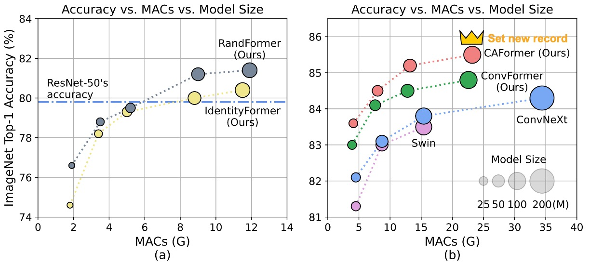

# [22.10] CAFormer

## MetaFormer User Manual

[**MetaFormer Baselines for Vision**](https://arxiv.org/abs/2210.13452v2)

---

After publishing the first MetaFormer paper, the authors released another paper to demonstrate its performance.

- [**PoolFormer: You Need a Meta!**](../2111-poolformer/index.md)

This paper doesn't propose a new architecture but builds on the previous framework, showing users how to construct models using it.

We believe this paper serves as the MetaFormer user manual.

## Defining the Problem

The authors guide you step-by-step on how to use MetaFormer.

## Solving the Problem

### Model Architecture

To demonstrate the performance of MetaFormer, the authors introduced four types of Token Mixers to examine their impact on model performance:

1. **Identity Token Mixer**: Identity mapping that does nothing.
2. **Random Token Mixer**: Uses an attention mechanism with a randomly initialized attention map that is frozen and not trained.
3. **Conv Token Mixer**: Uses depthwise convolution from MobileNetV2 for information exchange.
4. **Self-Attention Token Mixer**: Uses self-attention for information exchange, like the original Transformer.

Combining these four Token Mixers in the model's four downsampling stages, the authors proposed four models:

1. **IdentityFormer**: Uses the Identity Token Mixer throughout.
2. **RandFormer**: Uses Identity Token Mixer for the first two stages and Random Token Mixer for the last two stages.
3. **ConvFormer**: Uses Conv Token Mixer throughout, forming an "all-convolutional" architecture.
4. **CAFormer**: Uses Conv Token Mixer for the first two stages and Self-Attention Token Mixer for the last two stages.

### StarReLU

In this paper, the authors introduce a new activation function called StarReLU.

This function is derived from the ReLU and GELU activation functions commonly used in Transformer models.

First, ReLU is defined as:

$$
\mathrm{ReLU}(x) = \mathrm{max}(0, x)
$$

where $x$ represents the input neuron, with a computational cost of 1 FLOP per unit.

Subsequently, the GELU activation function, widely adopted in models like BERT, GPT-3, and ViT, is approximately defined as:

$$
\mathrm{GELU}(x) = x\Phi (x) \approx 0.5 \times x(1 + \mathrm{tanh}(\sqrt{2 / \pi}(x + 0.044715 \times x^{3})))
$$

where $\Phi(·)$ is the cumulative distribution function of the Gaussian distribution. GELU's computational cost is 14 FLOPs.

To simplify GELU, Squared ReLU has been proposed:

- [**Primer: Searching for Efficient Transformers for Language Modeling**](https://arxiv.org/abs/2109.08668)

defined as:

$$
\mathrm{SquaredReLU}(x) = x\mathrm{ReLU}(x) = (\mathrm{ReLU}(x))^{2}
$$

with a computational cost of 2 FLOPs per input unit.

However, Squared ReLU's performance on certain image classification models is inferior to GELU, possibly due to a shift in output distribution. For instance, if the input $x$ follows a normal distribution with mean 0 and variance 1:

$$
\mathrm{E}\left((\mathrm{ReLU}(x))^2\right) = 0.5, \qquad \mathrm{Var}\left((\mathrm{ReLU}(x))^2\right) = 1.25
$$

To address this, the authors propose StarReLU, defined as:

$$
\mathrm{StarReLU}(x) = \frac{\left(\mathrm{ReLU}(x)\right)^2 - \mathrm{E}\left((\mathrm{ReLU}(x))^2\right)}{\sqrt{\mathrm{Var}\left((\mathrm{ReLU}(x))^2\right)}}
$$

$$
= \frac{\left(\mathrm{ReLU}(x)\right)^2 - 0.5}{\sqrt{1.25}}
$$

$$
\approx 0.8944 \cdot \left(\mathrm{ReLU}(x)\right)^2 - 0.4472
$$

The StarReLU activation function includes more multiplications in its computation, thus the name.

To adapt to different models and initialization conditions, the scaling factor $s$ and offset $b$ are set as learnable parameters:

$$
\mathrm{StarReLU}(x) = s \cdot (\mathrm{ReLU}(x))^{2} + b
$$

where $s$ and $b$ are shared scalars for all channels.

StarReLU's computational cost is 4 FLOPs, significantly lower than GELU's 14 FLOPs, while offering better performance.

## Discussion

### Using Basic Token Mixers

:::tip
PoolFormerV2 shows no difference from V1 in the table above. However, to compare with other architectures, the authors applied different training techniques and methods, distinguishing V2 from V1.
:::

1. **IdentityFormer Performance**

   - **Small Models**
     - IdentityFormer-S12: Outperforms RSB-ResNet-18 by 4.0%.
     - IdentityFormer-S24: Outperforms RSB-ResNet-34 by 2.7%.
   - **Scaling Up**
     - IdentityFormer-M48: 73M parameters, 12G MACs, achieving 80.4% accuracy.
     - Comparison: RSB-ResNet-50's accuracy is 79.8%.

2. **RandFormer Performance**

   - **Using Random Mixer for the Last Two Stages**
     - RandFormer-S12: 76.6% accuracy, 2.0% higher than IdentityFormer-S12.
     - RandFormer-M48: 81.4% accuracy, 1.0% higher than IdentityFormer-M48.
   - **Medium and Large Models**
     - RandFormer-M36: 81.2% accuracy, close to RSB-ResNet-101's 81.3%.

MetaFormer shows stable performance, with the IdentityFormer-M48 model achieving an accuracy of over 80% on ImageNet-1K with similar parameters and MACs. This indicates that MetaFormer maintains satisfactory performance even under specific conditions.

The results for RandFormer indicate MetaFormer’s good compatibility with various Token Mixers. This suggests that MetaFormer can maintain excellent performance when using different Token Mixers. However, compared to PoolFormerV2, which uses a pooling-based Token Mixer, IdentityFormer and RandFormer still lag behind.

The lower performance of IdentityFormer is understandable, as direct mapping without any token mixing leads to subpar performance. The performance gap between RandFormer and PoolFormerV2 might be due to the local inductive bias introduced by pooling. These differences further highlight the importance of Token Mixers in model performance.

### Using Common Token Mixers

1. **ConvFormer and CAFormer Architectures**

   - ConvFormer uses separable convolution from MobileNetV2 as the Token Mixer.
   - CAFormer uses separable convolution in the first two stages and standard self-attention in the last two stages.

2. **ConvFormer Performance**

   - **ConvFormer outperforms the powerful CNN model ConvNeXt.**

     - Reference: [**ConvNeXt**](../../classic-cnns//2201-convnext/index.md)
     - ConvFormer-B36 (100M parameters, 22.6G MACs) achieves 0.5% higher top-1 accuracy at 224\*224 resolution than ConvNeXt-B (198M parameters, 34.4G MACs), with only 51% of the parameters and 66% of the MACs.

   - **ConvFormer outperforms several strong attention-based or hybrid models.**
     - ConvFormer-M36 achieves 1.0%/0.4% better performance than Swin-B/CoAtNet-2, with 35%/24% fewer parameters and 17%/18% fewer MACs.

3. **CAFormer Performance**

   - CAFormer sets a new record on ImageNet-1K, achieving a top-1 accuracy of 85.5% at 224\*224 resolution.
   - When pretrained on ImageNet-21K, ConvFormer-B36 and CAFormer-B36’s performance improved to 87.0% and 87.4%, respectively, increasing accuracy by 2.2% and 1.9% over ImageNet-1K training.
   - CAFormer consistently outperforms other models of different sizes, demonstrating superior performance.

ConvFormer-B36 shows better performance than ConvNeXt-L by 0.2%, with 49% fewer parameters and 34% fewer MACs. This highlights MetaFormer’s significant advantages in performance and resource efficiency. Even with "conventional" Token Mixers, ConvFormer and CAFormer achieve impressive performance.

### Ablation Experiments

1. **Impact of Activation Functions**

   - **Replacing ReLU with StarReLU**
     - ConvFormer-S18: Performance drops from 83.0% to 82.1%.
     - CAFormer-S18: Performance drops from 83.6% to 82.9%.
   - **Replacing ReLU with Squared ReLU**
     - Performance is satisfactory but not as good as GELU.
   - **Replacing GELU with StarReLU**
     - ConvFormer-S18 and CAFormer-S18 accuracy increases by 0.3% and 0.2%, respectively.
     - Reduces 71% of activation FLOPs.

2. **Application of StarReLU Variants**

   - By default, StarReLU with learnable scale and bias is used to adapt to different models and initialization conditions.

3. **Impact of Other Techniques**

   - **ResScale**
     - Performs best among branch output scaling techniques.
   - **Disabling Bias in Each Block**
     - No effect on ConvFormer-S18.
     - Improves CAFormer-S18 performance by 0.1%.

## Conclusion

The authors demonstrate MetaFormer’s performance and provide several conclusions:

1. **MetaFormer Ensures Stable Performance**

   The IdentityFormer model, using direct mapping as a Token Mixer, achieves over 80% accuracy on ImageNet-1K. This indicates that MetaFormer can deliver strong performance even in basic configurations.

2. **MetaFormer Pairs Well with Any Token Mixer**

   The RandFormer model, using random matrices as Token Mixers, achieves over 81% accuracy, outperforming IdentityFormer. This suggests that MetaFormer is reliable when adopting new Token Mixers.

3. **MetaFormer Easily Achieves State-of-the-Art Results**

   The ConvFormer model, using depthwise separable convolution as a Token Mixer, outperforms the powerful CNN model ConvNeXt. The CAFormer model, using depthwise separable convolution in the lower stages and self-attention in the upper stages, sets a new record on ImageNet-1K with a top-1 accuracy of 85.5% at 224 × 224 resolution under regular supervised training.

4. **New Activation Function StarReLU**

   Compared to the commonly used GELU, StarReLU reduces activation FLOPs by 71% and offers better performance. StarReLU, a variant of Squared ReLU, addresses distribution shift issues and shows great potential for application in MetaFormer-like models and other neural networks.

MetaFormer demonstrates immense potential for achieving state-of-the-art performance, and with the introduction of advanced Token Mixers or training strategies, models similar to MetaFormer are expected to continue setting new performance records.
