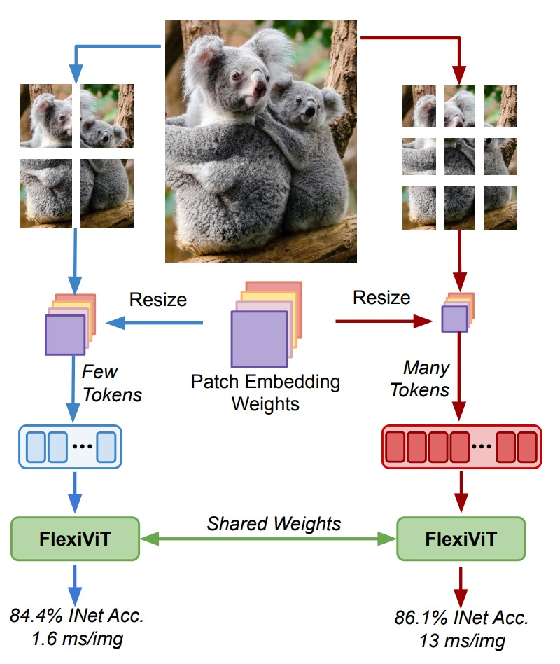
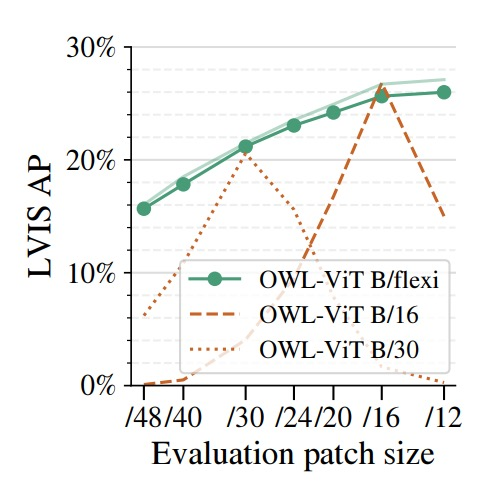

## Flexible Patch Sizes

[**FlexiViT: One Model for All Patch Sizes**](https://arxiv.org/abs/2212.08013)

---

Today, let's take a look at a work from Google Research.

## Problem Definition

<div align="center">
<figure style={{"width": "60%"}}>

</figure>
</div>

The rise of Vision Transformers (ViT) marks a paradigm shift in visual representation.

Images are divided into fixed-size patches, and self-attention is applied to process global relationships, rather than relying on convolutional filters in traditional CNNs.

However, a key design aspect behind this revolution—patch size—has long been treated as a fixed hyperparameter:

> **Why has no one challenged the design of patch size?**

The authors point out a paradox in this paper:

- Patch size significantly affects model computational cost and classification performance.
- Patch size cannot be adjusted without retraining the model.

Therefore, to bring higher resource adaptability and transfer potential to ViT, is it possible to:

> **Support multiple patch sizes with the _same set of parameters_?**

## Solution

<div align="center">
<figure style={{"width": "80%"}}>

</figure>
</div>

After reviewing this algorithm implementation, we have finished another paper!

Let's go through it line by line.

### Random Patch Size

```python
1 model = ViT(...)
2 for batch in data:
3     ps = np.random.choice([8, 10, ..., 40, 48])
4     logits = model(batch["images"], (ps, ps))
5     # [...] backprop and optimize as usual
```

These five lines define the core training behavior of FlexiViT:

- Line 3: At the start of each batch, randomly select a patch size `ps`
- Line 4: Pass this size into the model for forward propagation
- Line 5: Standard backpropagation without extra modifications

This patch-wise randomization strategy exposes the model during training to varying token lengths, multiple position encodings, and different computational loads, enabling it to maintain stable predictions across patch size variations.

### Dynamic Reconfiguration Inside the Model

```python
7 class ViT(nn.Module):
8     def __call__(self, image, patchhw):
9         # Patchify, flexibly:
10        w = self.param("w_emb", (32, 32, 3, d))
11        b = self.param("b_emb", d)
12        w = resize(w, (*patchhw, 3, d))
13        x = conv(image, w, strides=patchhw) + b
```

This code handles the initial patch embedding part of ViT, corresponding to the original ViT architecture's `Conv2d(patch_size, d)`:

- Line 10: Initialize a set of **32×32** patch embedding weights `w` by default
- Line 12: Dynamically resize `w` according to the current patch size
- Line 13: Use the resized `w` as convolution kernels with stride `patchhw` to patchify the image

In other words, **the patchifying logic changes from static to dynamic**.

No longer must we train separate embeddings for each size; now one core parameter set suffices, which is resampled (via PI-resize or bilinear interpolation) to fit all sizes.

### Scalable Positional Encoding

```python
14        # Add flexible position embeddings:
15        pe = self.param("posemb", (7, 7, d))
16        pe = resize(pe, (*x.shape[1:3], d))
17        return TransformerEncoder(...)(x + pe)
```

The positional encoding is handled similarly to patch embeddings:

- Start with a default 7×7 `posemb`
- Dynamically resize it in real time to match the current token grid size (determined by `patchhw`)
- Add it to `x` before passing to the Transformer encoder

This means that positional semantics are no longer tied to fixed sizes but can flexibly adapt spatial structure according to token length, while preserving the native ViT self-attention design and downstream compatibility.

### How to Correctly Adjust the Size?

:::tip
This section is very important—do not skip!
:::

**When supporting multiple patch sizes, a commonly overlooked point is how the inner product relationship between patch embedding weights and input patches deforms with size changes.**

Suppose our input patch is $x \in \mathbb{R}^{p \times p}$, and the corresponding patch embedding weights are $\omega \in \mathbb{R}^{p \times p}$.

In standard ViT, token generation comes from their inner product:

$$
e = \langle x, \omega \rangle
$$

If both $x$ and $\omega$ are bilinearly upscaled to $2p \times 2p$, then the new inner product approximately becomes:

$$
\langle \text{resize}^{2p}_{p}(x), \text{resize}^{2p}_{p}(\omega) \rangle \approx \tfrac{1}{4} \langle x, \omega \rangle
$$

That is, the token norm scales with size changes, causing semantic instability.

Such scale shift not only disturbs training but also breaks the model’s generalization across patch sizes.

To keep consistency, the inner product results of the two tokens should be equal, aiming for:

- **The token semantics remain unchanged even if both patch and embedding are resized.**

$$
\langle x, \omega \rangle \overset{?}{=} \langle Bx, \hat{\omega} \rangle
$$

where $B$ is the linear mapping matrix representing bilinear resize:

$$
\text{resize}^{p^*}_{p}(o) = B^{p^*}_{p} \cdot \text{vec}(o)
$$

To solve this mismatch, the authors propose a **mathematically more consistent weight transformation** called:

- **Pseudo-Inverse Resize (PI-resize).**

The formula is:

$$
\hat{\omega} = \arg\min_{\hat{\omega}} \mathbb{E}_{x \sim X} \left[ \left( \langle x, \omega \rangle - \langle Bx, \hat{\omega} \rangle \right)^2 \right]
$$

When $p^* \geq p$, it can be solved via the Moore-Penrose pseudo-inverse:

$$
\hat{\omega} = P \omega
$$

where:

$$
P = (B^\top B)^{-1} B^\top = (B^\top)^+
$$

Thus, for any $x$:

$$
\langle x, \omega \rangle = \langle Bx, \hat{\omega} \rangle
$$

meaning **the token embedding inner product is exactly preserved.**

:::info
The above derivation relies on a "no information loss" resize, applicable to upsampling scenarios.

In the case of downsampling ($p^* < p$), an approximate minimum-error solution must be obtained based on the statistical distribution of $x$; for example, when $x \sim \mathcal{N}(0, I)$, the same solution can be derived.
:::

In the figure below, the authors use ViT-B/8 as the base model, resizing patch embeddings and input images together, then observe accuracy changes.

<div align="center">
<figure style={{"width": "80%"}}>

</figure>
</div>

Comparison of methods:

- **Vanilla resize**: Direct bilinear interpolation
- **Norm heuristic**: Fixed norm normalization after token embedding
- **Area heuristic**: Rescaling according to patch area ratio
- **PI-resize**: Inner-product equivalent adjustment via mathematical derivation

Results show PI-resize is the only method that maintains accuracy almost without drop on upscale; it also yields the most stable and least fluctuating performance on downscale.

### The Representational World of FlexiViT

FlexiViT’s design goal is to maintain stable prediction across multiple patch sizes.

But a deeper question arises:

> **Does the representation learned internally by the model remain consistent under different patch sizes?**

To inspect FlexiViT’s representation stability, the authors use common similarity measures:

- **CKA (Centered Kernel Alignment)**: measures similarity between neural network layer outputs
- **Arc-Cosine + t-SNE**: converts similarity to distance metrics for visualization

Using these tools, they observe whether feature maps produced at various patch sizes (e.g., grid size = 5, 10, 30) at each layer remain consistent.

The key findings from the figure below are:

<div align="center">
<figure style={{"width": "80%"}}>

</figure>
</div>

- **Early layers stable**: From layer 0 to 6 before MLP, representations are highly consistent across patch sizes
- **Middle layers diverge**: At the MLP in layer 6, representations noticeably diverge and separate by grid size
- **Later layers converge**: Final layers (especially layer 11) gradually realign
- **CLS token stable**: Although patch token distributions vary with grid size, the overall CLS token representation for classification stays highly aligned across sizes

This analysis reveals an interesting phenomenon:

FlexiViT does not forcibly compress inputs of different sizes into identical representations, but lets intermediate layers form adaptive processing paths for different resolutions, yet ultimately align for classification output.

This indirectly explains why it can successfully support multiple patch sizes:

> **The model learns “how to take different routes but reach the same destination.”**

## Discussion

Due to space limitations, we will not include all experimental figures here.

Below, we highlight some key excerpts; readers interested in other experiments are encouraged to consult the original paper.

### Cross-Task Overview

<div align="center">
<figure style={{"width": "90%"}}>

</figure>
</div>

The figure above shows FlexiViT’s transfer performance across multiple downstream tasks, including image classification, semantic segmentation, image-text retrieval, and open-vocabulary object detection.

In the experiments, the authors fine-tuned and inferred with a pretrained FlexiViT-B model at fixed patch sizes (/16 and /30) and compared it with ViT-B models pretrained specifically for those patch sizes.

Results indicate that FlexiViT’s overall performance is comparable or slightly better than individually trained ViTs. Particularly, at smaller patch size (/16), FlexiViT slightly leads in accuracy; at larger patch size (/30), the difference is within 0.2 to 0.4 percentage points, effectively on par.

This means FlexiViT does not sacrifice prediction quality for multi-size adaptability.

More importantly, this performance is achieved with a single set of weights.

Traditionally, supporting multiple resource constraints or task scenarios requires training multiple ViT models separately. In contrast, FlexiViT offers a more practical solution: significantly simplifying model maintenance and deployment costs without compromising performance.

In other words, for applications needing dynamic switching between “high performance” and “resource efficiency,” one FlexiViT can replace multiple ViTs, serving as a unified backbone and deployment choice.

### Fast Transfer and Inference Flexibility

<div align="center">
<figure style={{"width": "70%"}}>

</figure>
</div>

The figure above illustrates a highly valuable feature of FlexiViT in practical deployment:

- **It can be fine-tuned at low computational cost and then leverage higher resolution at inference to gain better performance.**

In the experiments, both FlexiViT-B and ViT-B/30 were fine-tuned only on an 8×8 grid size on ImageNet-1k, then tested at various grid sizes.

Results show that the standard ViT-B/30’s accuracy drops rapidly once deviating from the original training size; FlexiViT, however, improves Top-1 accuracy by 3.5 percentage points (from 81.8% to 85.3%) when scaling from 8×8 to 24×24.

The right chart further compares a single FlexiViT-B model fine-tuned at grid sizes 8×8, 15×15, and 30×30, then tested across different grids.

It shows that regardless of the initial fine-tuning size, the model consistently benefits from higher resolution inference with a smooth performance increase.

This property introduces a new model usage strategy:

**We can quickly fine-tune coarsely in resource-limited scenarios, then dynamically switch to finer granularity at inference to gain higher recognition accuracy.**

For systems needing to support varied compute resources, A/B testing, or dynamic tuning, this “low training cost, high inference flexibility” characteristic provides significantly greater operational freedom and practical value.

### Open-Vocabulary Object Detection

<div align="center">
<figure style={{"width": "50%"}}>

</figure>
</div>

The authors applied FlexiViT to open-vocabulary object detection by using it as the image encoder within the OWL-ViT detection framework, comparing with fixed patch size ViT-B/16 and ViT-B/30 backbones.

The benchmark dataset LVIS features high category diversity and a long-tailed distribution, making it particularly suitable for zero-shot detection evaluation.

Results demonstrate that Flexi OWL-ViT (using the flexible B/flexi backbone) achieves average precision (AP) no worse than fixed backbone versions at all evaluated patch sizes.

At higher resolutions (e.g., /24 and /30), it even surpasses ViT-B/30 by 2–3 percentage points, showing its generalization potential as resolution increases. At lower resolutions (/12 or /16), FlexiViT maintains stable accuracy without degradation.

This characteristic is especially important for open-vocabulary detection.

Because object sizes vary greatly across scenes, the optimal patch size is not fixed; sometimes fine resolution is needed for precise localization, sometimes coarse perception suffices for broad coverage.

FlexiViT’s flexible patch encoding enables the model to adjust resolution according to image characteristics and computing resources without retraining, offering more practical adaptability and deployment efficiency for open-world tasks.

### Time Is Compute

<div align="center">
<figure style={{"width": "50%"}}>

</figure>
</div>

Finally, the authors explore an additional but highly valuable direction:

- **Using flexible patch training to accelerate ViT pretraining.**

The figure compares two settings on ImageNet-21k pretraining: the traditional ViT-B/16 trained with fixed patch size, versus (Flexi)ViT-B/16 trained with a curriculum of multiple patch sizes.

Looking at TPU core-hours on the x-axis, FlexiViT consistently maintains higher accuracy almost throughout, with about a 1 percentage point improvement at around 400 hours compared to the standard model. This gap remains or slightly widens with longer training.

This training approach resembles a dynamic curriculum design:

**Start with large patch sizes (fast compute, coarse semantics) to quickly build semantic structures; gradually transition to finer patches to add detail and recognition ability.**

The result is faster and more stable learning.

Practically, this design serves as a plug-in speedup for existing ViT pretraining pipelines. Even if the final model target is a single patch size, multi-size curriculum shortens convergence time and boosts early-stage performance, extending FlexiViT’s “flexibility” value beyond inference to training efficiency and resource utilization optimization.

## Conclusion

FlexiViT presents a simple yet effective strategy, enabling a single model to trade off computation and resolution demands.

It introduces no extra architectural complexity but revisits ViT’s fundamental design: **patchification**, extracting a key parameter to regulate compute and semantic representation.

Through random patch size training, PI-resize weight reconfiguration, and precise knowledge distillation guidance, FlexiViT achieves stable performance across diverse downstream tasks, including image classification, semantic segmentation, open-vocabulary detection, and multimodal retrieval, all supported by a single backbone.

FlexiViT invites us to rethink the role of patchification, and we may soon see more creative applications ranging from token encoding to structural compression, multiscale fusion, and data-driven scheduling.
