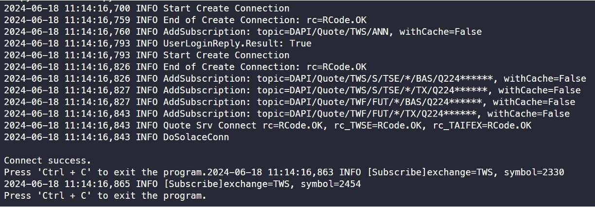

# Quotation System

After analyzing MasterLink's Python API for their quotation system, we can develop our own quotation system based on our specific needs.

Although the usage examples provided by MasterLink do not explicitly demonstrate how to subscribe to multiple stock symbols, we found this functionality in the source code. Since we are not developing a mobile app and cannot integrate a UI interface, we will output each subscribed stock to an external file instead of displaying it in the command line to avoid clutter.

## Logging In

You can directly input your username and password into the class, or you can follow our approach by storing account information in a YAML file.

The parameter file must include the username, password, and account number to log into MasterLink.

First, import the `QuotationSystem` class from `autotraderx`:

```python
from autotraderx import load_yaml
from autotraderx.masterlink import QuotationSystem

# Load account infos
cfg = load_yaml(DIR / "account.yaml")

# Login account
handler = QuotationSystem(
    user=cfg["user"],
    password=cfg["password"],
    subscribe_list=["2330", "2454"]
)
```

When logging in, you need to include the stock symbols you want to subscribe to. This can also be written into the YAML file, so you don't have to change the code each time.

## Starting the Quotation System

After logging in, you can start the quotation system:

```python
handler.run()
```



Once started, the quotation system will create files in the execution directory, including:

1. **log\[date\]\[stock_symbol\]\_info.md**: Records the previous day's closing price, the latest transaction price, the latest transaction volume, and other information.
2. **log\[date\]\[stock_symbol\]\_match.md**: Records each tick's transaction information for the stock.

Then, you can simply wait as the quotation system will automatically update the stock information.

To stop the quotation system, press `Ctrl + C`.

## Content Examples

Below are examples of the updated file contents:

### Basic Stock Information

| Item                              | Value     |
| --------------------------------- | --------- |
| Chinese Name                      | TSMC      |
| Exchange Code                     | TWS       |
| Reference Price                   | 921.0000  |
| Upper Limit Price                 | 1010.0000 |
| Lower Limit Price                 | 829.0000  |
| Previous Day's Volume             | 26262     |
| Previous Day's Ref Price          | 922.0000  |
| Previous Day's Close Price        | 921.0000  |
| Industry Category                 | 24        |
| Stock Anomaly Code                | 0         |
| Non-10 Par Value Remark           |           |
| Abnormal Recommendation Indicator |           |
| Day Trading Indicator             | A         |
| Trading Unit                      | 1000      |

### Daily Transaction Data

| Transaction Time | Transaction Price | Price Change | Transaction Volume | Total Volume |
| ---------------- | ----------------- | ------------ | ------------------ | ------------ |
| 11:14:28.097382  | 944.0000          | +23.000      | 2                  | 23491        |
| 11:14:33.153135  | 944.0000          | +23.000      | 1                  | 23492        |
| 11:14:37.089803  | 944.0000          | +23.000      | 2                  | 23494        |
| 11:14:38.663758  | 944.0000          | +23.000      | 4                  | 23498        |
| 11:14:59.809925  | 945.0000          | +24.000      | 1                  | 23499        |
| 11:15:00.081727  | 944.0000          | +23.000      | 2                  | 23501        |
| 11:15:00.196828  | 944.0000          | +23.000      | 1                  | 23502        |
| 11:15:00.567548  | 944.0000          | +23.000      | 1                  | 23503        |
| 11:15:04.071329  | 944.0000          | +23.000      | 1                  | 23504        |
| 11:15:04.598060  | 944.0000          | +23.000      | 1                  | 23505        |
| 11:15:07.634295  | 944.0000          | +23.000      | 3                  | 23508        |
| 11:15:10.137589  | 944.0000          | +23.000      | 2                  | 23510        |
| 11:15:12.460697  | 944.0000          | +23.000      | 3                  | 23513        |

## Additional Features

We have some additional features pending completion, such as:

1. **Specify Output Format**: Currently, we only output to markdown files, but we can consider other formats like CSV or JSON in the future.
2. **Import Trading Events**: Integrate the quotation system with the trading system so that when the quotation system detects a certain price, it can automatically place an order.

For now, the output format is not a pressing issue, so it can be left as is. Importing trading events is more complex, usually referred to as a "trading strategy," and varies with different targets. Designing this feature will be our next development focus.

Of course, other features can be added. You can give us suggestions, and we will consider incorporating them into the quotation system.
