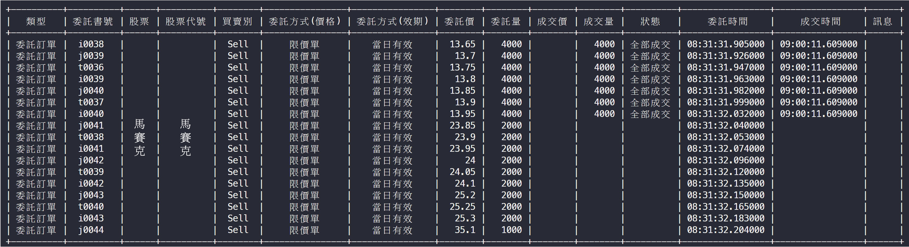

# Order System

After analyzing MasterLink's Python API for the order system, we can develop a customized order system based on our needs.

In most scenarios, we will operate a single securities account, so our current implementation is based on a single account.

:::warning
We do not recommend any stocks; all stock information in the securities account will be blurred.
:::

## Logging In

You can directly input your username and password into the class, or follow our approach by storing account information in a YAML file.

The parameter file must include the username, password, and account number to log into MasterLink successfully.

```python
from autotraderx import load_yaml
from autotraderx.masterlink import Trader

# Load account info
cfg = load_yaml(DIR / "account.yaml")

# Login account
account = Trader(
    user=cfg["user"],
    password=cfg["password"],
    account_number=str(cfg["account_number"]),
    is_sim=False,
    is_force=True,
    is_event=False,
)

account.login()
# Do something
account.stop()
```

## Checking Inventory

After logging in, call the `get_inventory` function to check the current inventory status.

The query results are displayed directly in the command line, showing the current inventory status. If you need the information for further use, you can directly use the return value.

```python
data = account.get_inventory()
```


The output format of `data` is a dictionary, with contents like:

```python
{
    '2002': {
        'Stock': 'CSC',
        'Short Selling Inventory (lots)': '0',
        'Financing Inventory (lots)': '0',
        'Custody Inventory (lots)': '1',
        'Odd Lot Inventory (shares)': '0'
    },
    '2330': {
        'Stock': 'TSMC',
        'Short Selling Inventory (lots)': '0',
        'Financing Inventory (lots)': '0',
        'Custody Inventory (lots)': '1',
        'Odd Lot Inventory (shares)': '0'
    },
    # ...omitted
}
```

If you don't want the information to be displayed in the command line, set the `verbose` parameter to `False` when initializing the `Trader`.

```python
account = Trader(
    verbose=False
)
```

## Checking Order Information

After logging in, call the `get_order_report` function to check all current order information.

The query results are displayed directly in the command line, showing all current order information. If you need the information for further use, you can directly use the return value.



```python
data = account.get_order_report()
```

The output format of `data` is List\[Dict\], with contents like:

```python
[
    {
        'Order Price': '13.95',
        'Order Type (Price)': 'Limit Order',
        'Order Type (Validity)': 'Day Order',
        'Order Time': '08:31:32.032000',
        'Order Number': 'i0040',
        'Order Quantity': '4000',
        'Transaction Price': '',
        'Transaction Time': '',
        'Transaction Quantity': '',
        'Status': '',
        'Stock': 'Blurred',
        'Stock Code': 'Blurred',
        'Message': '',
        'Side': 'Sell',
        'Type': 'Order'
    },
    # ...omitted
]
```

## Checking Transaction Information

After logging in, call the `get_trade_report` function to check all current transaction information.

The query results are displayed directly in the command line, showing all current transaction information. If you need the information for further use, you can directly use the return value.


```python
data = account.get_trade_report()
```

The output format of `data` is List\[Dict\], with contents like:

```python
[
    {
        'Order Price': '13.95',
        'Order Type (Price)': 'Limit Order',
        'Order Type (Validity)': 'Day Order',
        'Order Time': '08:31:32.032000',
        'Order Number': 'i0040',
        'Order Quantity': '4000',
        'Transaction Price': '',
        'Transaction Time': '09:00:11.609000',
        'Transaction Quantity': '4000',
        'Status': '111) Fully Executed',
        'Stock': 'Blurred',
        'Stock Code': 'Blurred',
        'Message': '',
        'Side': 'Sell',
        'Type': 'Order'
    },
    # ...omitted
]
```

## Order Type Definitions

In the order process, MasterLink defines several constants that we need to understand.

### OrderType

```python
# Order Type (Validity)
class OrderType(str, Enum):
    # Day Order
    ROD = "R"
    # Immediate or Cancel
    IOC = "I"
    # Fill or Kill
    FOK = "F"
```

### PriceType

```python
# Order Type (Price)
class PriceType(str, Enum):
    # Limit Order
    LMT = "L"
    # Market Order
    MKT = "M"
```

### TradingType

```python
# Trading Type
class TradingType(str, Enum):
    # Custody
    CUSTODY = "G"
```

### TradingUnit

```python
# Trading Unit
class TradingUnit(int, Enum):
    COMMON = 1000
    ODD = 1
```

### TradingSession

```python
# Trading Session
class TradingSession(str, Enum):
    # Normal
    NORMAL = "N"
    # After-Hours
    FIXED_NORMAL = "F"
    # Intraday Odd Lot
    ODD = "R"
    # After-Hours Odd Lot
    FIXED_ODD = "L"
```

### Side

```python
# Buy/Sell
class Side(str, Enum):
    # Buy
    Buy = "B"
    # Sell
    Sell = "S"
```

## Placing a Buy Order

After logging in, call the `buy` function to place a buy order.

For example, buy 1 lot of TSMC (stock code: 2330) at 500 TWD.

Default order settings:

- Price Type: OrderType.KMT, Limit Order
- Order Type: PriceType.ROD, Day Order
- Trading Session: TradingSession.NORMAL, Normal Trading Session
- Trading Unit: TradingUnit.COMMON, Common Trading Unit

```python
account.buy(symbol="2330", qty=1, price=500)
```

## Placing a Sell Order

After logging in, call the `sell` function to place a sell order.

For example, sell 1 lot of TSMC (stock code: 2330) at 500 TWD.

Default order settings:

- Price Type: OrderType.KMT, Limit Order
- Order Type: PriceType.ROD, Day Order
- Trading Session: TradingSession.NORMAL, Normal Trading Session
- Trading Unit: TradingUnit.COMMON, Common Trading Unit

```python
account.sell(symbol="2330", qty=1, price=500)
```

## Custom Order Settings

After logging in, call the `set_order` function to place a custom order.

Below is the definition of the `set_order` function, allowing you to set order parameters as needed.

```python
 def set_order(
        self,
        symbol: str,    # Stock Code
        side: Side,     # Buy/Sell
        qty: int,       # Order Quantity
        price: float,   # Order Price
        order_type: OrderType = OrderType.ROD,  # Order Type
        price_type: PriceType = PriceType.MKT,  # Price Type
        trading_session: TradingSession = TradingSession.NORMAL,  # Trading Session
        trading_unit: TradingUnit = TradingUnit.COMMON,  # Trading Unit
    ):
        self.api.ReqBasic(symbol)

        order = Order(
            tradingSession=trading_session,
            side=side,
            symbol=symbol,
            priceType=price_type,
            price=str(price),
            tradingUnit=trading_unit,
            qty=str(qty),
            orderType=order_type,
            tradingAccount=self.account_number,
            userDef=''
        )
        rc = self.api.NewOrder(order)
        if rc == RCode.OK:
            print('Order placed successfully')
        else:
            print('Order placement failed! Please run the program again and correct the input based on the feedback')
```

:::warning
In the `set_order` function, to buy 1 lot, the `qty` parameter should be 1000.
:::

For example, buy 1 lot of TSMC (stock code: 2330) at 500 TWD, with the order type as Fill or Kill, and the price type as Market Order.

```python
account.set_order(
    symbol="2330",
    side=Side.Buy,
    qty=1000,
    price=500,
    order_type=OrderType.FOK,
    price_type=PriceType.MKT
)
```

## Changing the Order Price

You need to find the "Order Number" to change the price, then call the `change_price` function.

For example, change the price of TSMC (stock code: 2330) to 600 TWD.

```python
account.change_price(order_number="i0041", mod_price=600)
```

## Changing the Order Quantity

You need to find the "Order Number" to change the quantity, then call the `change_qty` function.

For example, change the quantity of TSMC (stock code: 2330) from 1 lot to 2 lots.

```python
account.change_qty(order_number="i0041", mod_qty=2000)
```

## Canceling an Order

To cancel an order, change the "Order Quantity" to 0 using the `change_qty` function.

## Other Functions

The original API also has functions for querying collateral balances. However, we currently do not have the necessary permissions on our account to develop and test these functions.

Moreover, we could not find information on "querying the transaction price of the account inventory" in MasterLink's API. Upon tracing the code, we discovered that the final data layer is encapsulated in `.dll` files. To obtain this information, we would need to decompile the `.dll` files and parse the data, which is quite an extensive task.

As a result, we currently cannot provide the "inventory average price calculation" service. Hopefully, MasterLink will release this feature in the future.

:::tip
If you know how to obtain the "average price of inventory," i.e., the "transaction price per share of inventory," please let us know! 🙏 🙏 🙏
:::
