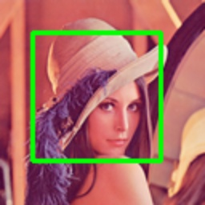

# draw_box

>[draw_box(img: np.ndarray, box: Union[Box, np.ndarray], color: _Color = (0, 255, 0), thickness: _Thickness = 2) -> np.ndarray](https://github.com/DocsaidLab/DocsaidKit/blob/71170598902b6f8e89a969f1ce27ed4fd05b2ff2/docsaidkit/vision/visualization/draw.py#L31)

- **Description**

    Draw Bounding Box on an image.

- **Parameters**

    - **img** (`np.ndarray`): The image to draw on, as a NumPy array.
    - **box** (`Union[Box, np.ndarray]`): The Bounding Box to draw, can be a Box object or a NumPy array in the form [x1, y1, x2, y2].
    - **color** (`_Color`): The color of the box to draw. Defaults to (0, 255, 0).
    - **thickness** (`_Thickness`): The thickness of the box outline to draw. Defaults to 2.

- **Returns**

    - **np.ndarray**: The image with the drawn box.

- **Example**

    ```python
    import docsaidkit as D

    img = D.imread('lena.png')
    box = D.Box([20, 20, 100, 100])
    box_img = D.draw_box(img, box, color=(0, 255, 0), thickness=2)
    ```

    
