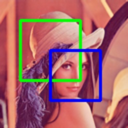

# draw_boxes

> [draw_boxes(img: np.ndarray, boxes: _Boxes, colors: _Colors = (0, 255, 0), thicknesses: _Thicknesses = 2) -> np.ndarray](https://github.com/DocsaidLab/Capybara/blob/main/capybara/vision/visualization/draw.py)

- **Dependencies**

  - Install `capybara-docsaid[visualization]` first.

- **Description**: Draws multiple bounding boxes on an image.

- **Parameters**

  - **img** (`np.ndarray`): The image to draw on, as a NumPy array.
  - **boxes** (`Union[Boxes, np.ndarray]`): A list of `Box` or `[[x1, y1, x2, y2], ...]`.
  - **colors** (`_Colors`): Box colors (BGR). A single color or a list. Default is (0, 255, 0).
  - **thicknesses** (`_Thicknesses`): Line thickness(es). A single value or a list. Default is 2.

- **Returns**

  - **np.ndarray**: The image with the bounding boxes drawn.

- **Example**

  ```python
  from capybara import Box, imread
  from capybara.vision.visualization.draw import draw_boxes

  img = imread('lena.png')
  boxes = [Box([20, 20, 100, 100]), Box([150, 150, 200, 200])]
  boxes_img = draw_boxes(
      img,
      boxes,
      colors=[(0, 255, 0), (255, 0, 0)],
      thicknesses=2,
  )
  ```

  
