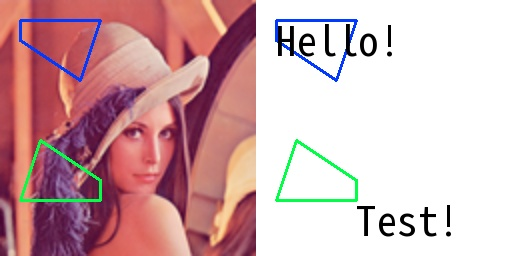

# draw_ocr_infos

> [draw_ocr_infos(img: np.ndarray, texts: List[str], polygons: Polygons, colors: tuple = None, concat_axis: int = 1, thicknesses: int = 2, font_path: str = None) -> np.ndarray](https://github.com/DocsaidLab/DocsaidKit/blob/71170598902b6f8e89a969f1ce27ed4fd05b2ff2/docsaidkit/vision/visualization/draw.py#L308)

- **Description**

    Draw OCR (Optical Character Recognition) results on an image.

- **Parameters**

    - **img** (`np.ndarray`): The image to draw on.
    - **texts** (`List[str]`): List of detected text strings.
    - **polygons** (`D.Polygons`): List of polygons representing the detected text boundaries.
    - **colors** (`tuple`): RGB values of the colors to draw. If not provided, a unique color is generated for each text based on a fixed logic.
    - **concat_axis** (`int`): The axis used to concatenate the original image and the annotated image. Defaults to 1 (horizontal).
    - **thicknesses** (`int`): The thickness of the polygons to draw. Defaults to 2.
    - **font_path** (`str`): Path to the font file to use. If not provided, the default font "NotoSansMonoCJKtc-VF.ttf" is used.

- **Returns**

    - **np.ndarray**: The image concatenated with the annotated image.

- **Example**

    ```python
    import docsaidkit as D

    img = D.imread('lena.png')
    texts = ['Hello!', 'Test!']
    polygons = [
        D.Polygon([(20, 20), (100, 20), (80, 80), (20, 40)]),
        D.Polygon([(100, 200), (20, 200), (40, 140), (100, 180)])
    ]
    ocr_img = D.draw_ocr_infos(img, texts, polygons, concat_axis=1, thicknesses=2)
    ```

    
