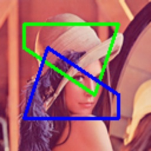

# draw_polygons

> [draw_polygons(img: np.ndarray, polygons: Polygons, color: _Colors = (0, 255, 0), thickness: _Thicknesses = 2, fillup=False, **kwargs) -> np.ndarray](https://github.com/DocsaidLab/DocsaidKit/blob/71170598902b6f8e89a969f1ce27ed4fd05b2ff2/docsaidkit/vision/visualization/draw.py#L156)

- **Description**

    Draw multiple polygons on an image.

- **Parameters**

    - **img** (`np.ndarray`): The image to draw on, as a NumPy array.
    - **polygons** (`List[Union[Polygon, np.ndarray]]`): The polygons to draw, can be a list of Polygon objects or a NumPy array in the form [[x1, y1], [x2, y2], ...].
    - **color** (`_Colors`): The color(s) of the polygons to draw. Can be a single color or a list of colors. Defaults to (0, 255, 0).
    - **thickness** (`_Thicknesses`): The thickness(es) of the polygon outlines to draw. Can be a single thickness or a list of thicknesses. Defaults to 2.
    - **fillup** (`bool`): Whether to fill the polygons. Defaults to False.
    - **kwargs**: Additional parameters.

- **Returns**

    - **np.ndarray**: The image with the drawn polygons.

- **Example**

    ```python
    import docsaidkit as D

    img = D.imread('lena.png')
    polygons = [
        D.Polygon([(20, 20), (100, 20), (80, 80), (20, 40)]),
        D.Polygon([(100, 100), (20, 100), (40, 40), (100, 80)])
    ]
    polygons_img = D.draw_polygons(img, polygons, color=[(0, 255, 0), (255, 0, 0)], thickness=2)
    ```

    
