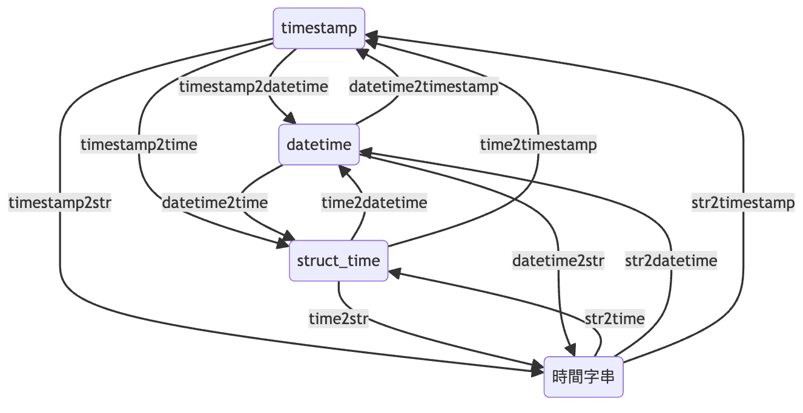
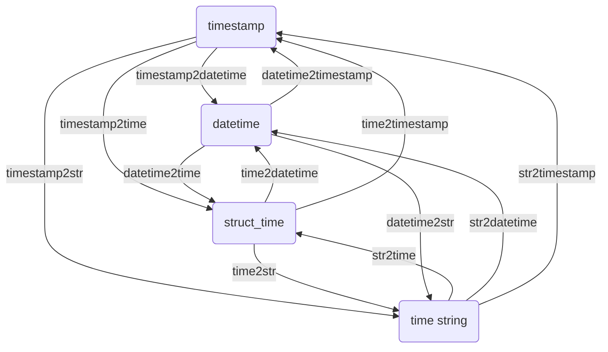

# Time2Time

This is a tool designed to convert between different time formats.

In Python, converting between various time modules has always been a troublesome task.

To solve this problem, we developed several conversion functions that make it easier to convert between `datetime`, `struct_time`, `timestamp`, and time strings.

Here is a diagram illustrating the relationships between these functions:



If you're curious about how the diagram above was created, you can refer to the following Mermaid code:



The diagram tells a story: first, find the conversion function you need and then follow the arrows to get the result.

---

## timestamp2datetime

> [timestamp2datetime(ts: Union[int, float]) -> datetime](https://github.com/DocsaidLab/Capybara/blob/975d62fba4f76db59e715c220f7a2af5ad8d050e/capybara/utils/time.py#L189)

- **Description**: Converts a timestamp to a `datetime` object.

- **Parameters**

  - **ts** (`Union[int, float]`): The timestamp.

- **Returns**

  - **datetime**: The corresponding `datetime` object.

- **Example**

  ```python
  import capybara as cb

  ts = 1634025600
  dt = cb.timestamp2datetime(ts)
  print(dt)
  # >>> 2021-10-12 16:00:00
  ```

## timestamp2time

> [timestamp2time(ts: Union[int, float]) -> struct_time](https://github.com/DocsaidLab/Capybara/blob/975d62fba4f76db59e715c220f7a2af5ad8d050e/capybara/utils/time.py#L193)

- **Description**: Converts a timestamp to `struct_time`.

- **Parameters**

  - **ts** (`Union[int, float]`): The timestamp.

- **Returns**

  - **struct_time**: The corresponding `struct_time` object.

- **Example**

  ```python
  import capybara as cb

  ts = 1634025600
  t = cb.timestamp2time(ts)
  print(t)
  # >>> time.struct_time(tm_year=2021, tm_mon=10, tm_mday=12, tm_hour=16, tm_min=0, tm_sec=0, tm_wday=1, tm_yday=285, tm_isdst=0)
  ```

## timestamp2str

> [timestamp2str(ts: Union[int, float], fmt: str) -> str](https://github.com/DocsaidLab/Capybara/blob/975d62fba4f76db59e715c220f7a2af5ad8d050e/capybara/utils/time.py#L197)

- **Description**: Converts a timestamp to a time string.

- **Parameters**

  - **ts** (`Union[int, float]`): The timestamp.
  - **fmt** (`str`): The time format.

- **Returns**

  - **str**: The formatted time string.

- **Example**

  ```python
  import capybara as cb

  ts = 1634025600
  s = cb.timestamp2str(ts, fmt='%Y-%m-%d %H:%M:%S')
  print(s)
  # >>> '2021-10-12 16:00:00'
  ```

## time2datetime

> [time2datetime(t: struct_time) -> datetime](https://github.com/DocsaidLab/Capybara/blob/975d62fba4f76db59e715c220f7a2af5ad8d050e/capybara/utils/time.py#L201)

- **Description**: Converts `struct_time` to a `datetime`.

- **Parameters**

  - **t** (`struct_time`): `struct_time`.

- **Returns**

  - **datetime**: `datetime`.

- **Example**

  ```python
  import capybara as cb

  ts = 1634025600
  t = cb.timestamp2time(ts)
  dt = cb.time2datetime(t)
  print(dt)
  # >>> datetime.datetime(2021, 10, 12, 16, 0)
  ```

## time2timestamp

> [time2timestamp(t: struct_time) -> float](https://github.com/DocsaidLab/Capybara/blob/975d62fba4f76db59e715c220f7a2af5ad8d050e/capybara/utils/time.py#L207)

- **Description**: Converts `struct_time` to a timestamp.

- **Parameters**

  - **t** (`struct_time`): `struct_time`.

- **Returns**

  - **float**: timestamp.

- **Example**

  ```python
  import capybara as cb

  ts = 1634025600
  t = cb.timestamp2time(ts)
  ts = cb.time2timestamp(t)
  print(ts)
  # >>> 1634025600.0
  ```

## time2str

> [time2str(t: struct_time, fmt: str) -> str](https://github.com/DocsaidLab/Capybara/blob/975d62fba4f76db59e715c220f7a2af5ad8d050e/capybara/utils/time.py#L213)

- **Description**: Converts `struct_time` to a time string.

- **Parameters**

  - **t** (`struct_time`): `struct_time`.
  - **fmt** (`str`): The time format.

- **Returns**

  - **str**: time string.

- **Example**

  ```python
  import capybara as cb

  ts = 1634025600
  t = cb.timestamp2time(ts)
  s = cb.time2str(t, fmt='%Y-%m-%d %H:%M:%S')
  print(s)
  # >>> '2021-10-12 16:00:00'
  ```

## datetime2time

> [datetime2time(dt: datetime) -> struct_time](https://github.com/DocsaidLab/Capybara/blob/975d62fba4f76db59e715c220f7a2af5ad8d050e/capybara/utils/time.py#L219)

- **Description**: Converts `datetime` to a `struct_time`.

- **Parameters**

  - **dt** (`datetime`): `datetime`.

- **Returns**

  - **struct_time**: `struct_time`.

- **Example**

  ```python
  import capybara as cb

  ts = 1634025600
  dt = cb.timestamp2datetime(ts)
  t = cb.datetime2time(dt)
  print(t)
  # >>> time.struct_time(tm_year=2021, tm_mon=10, tm_mday=12, tm_hour=16, tm_min=0, tm_sec=0, tm_wday=1, tm_yday=285, tm_isdst=-1)
  ```

## datetime2timestamp

> [datetime2timestamp(dt: datetime) -> float](https://github.com/DocsaidLab/Capybara/blob/975d62fba4f76db59e715c220f7a2af5ad8d050e/capybara/utils/time.py#L225)

- **Description**: Converts `datetime` to a timestamp.

- **Parameters**

  - **dt** (`datetime`): `datetime`.

- **Returns**

  - **float**: timestamp.

- **Example**

  ```python
  import capybara as cb

  ts = 1634025600
  dt = cb.timestamp2datetime(ts)
  ts = cb.datetime2timestamp(dt)
  print(ts)
  # >>> 1634025600.0
  ```

## datetime2str

> [datetime2str(dt: datetime, fmt: str) -> str](https://github.com/DocsaidLab/Capybara/blob/975d62fba4f76db59e715c220f7a2af5ad8d050e/capybara/utils/time.py#L231)

- **Description**: Converts `datetime` to a time string.

- **Parameters**

  - **dt** (`datetime`): `datetime`.
  - **fmt** (`str`): The time format.

- **Returns**

  - **str**: time string.

- **Example**

  ```python
  import capybara as cb

  ts = 1634025600
  dt = cb.timestamp2datetime(ts)
  s = cb.datetime2str(dt, fmt='%Y-%m-%d %H:%M:%S')
  print(s)
  # >>> '2021-10-12 16:00:00'
  ```

## str2time

> [str2time(s: str, fmt: str) -> struct_time](https://github.com/DocsaidLab/Capybara/blob/975d62fba4f76db59e715c220f7a2af5ad8d050e/capybara/utils/time.py#L237)

- **Description**: Convert a time string to `struct_time`.

- **Parameters**

  - **s** (`str`): time string.
  - **fmt** (`str`): The time format.

- **Returns**

  - **struct_time**: `struct_time`.

- **Example**

  ```python
  import capybara as cb

  s = '2021-10-12 16:00:00'
  t = cb.str2time(s, fmt='%Y-%m-%d %H:%M:%S')
  print(t)
  # >>> time.struct_time(tm_year=2021, tm_mon=10, tm_mday=12, tm_hour=16, tm_min=0, tm_sec=0, tm_wday=1, tm_yday=285, tm_isdst=-1)
  ```

## str2datetime

> [str2datetime(s: str, fmt: str) -> datetime](https://github.com/DocsaidLab/Capybara/blob/975d62fba4f76db59e715c220f7a2af5ad8d050e/capybara/utils/time.py#L243)

- **Description**: Convert a time string to `datetime`.

- **Parameters**

  - **s** (`str`): The time string.
  - **fmt** (`str`): The time format.

- **Returns**

  - **datetime**: `datetime`.

- **Example**

  ```python
  import capybara as cb

  s = '2021-10-12 16:00:00'
  dt = cb.str2datetime(s, fmt='%Y-%m-%d %H:%M:%S')
  print(dt)
  # >>> datetime.datetime(2021, 10, 12, 16, 0)
  ```

## str2timestamp

> [str2timestamp(s: str, fmt: str) -> float](https://github.com/DocsaidLab/Capybara/blob/975d62fba4f76db59e715c220f7a2af5ad8d050e/capybara/utils/time.py#L249)

- **Description**: Convert a time string to a timestamp.

- **Parameters**

  - **s** (`str`): The time string.
  - **fmt** (`str`): The time format.

- **Returns**

  - **float**: The timestamp.

- **Example**

  ```python
  import capybara as cb

  s = '2021-10-12 16:00:00'
  ts = cb.str2timestamp(s, fmt='%Y-%m-%d %H:%M:%S')
  print(ts)
  # >>> 1634025600.0
  ```
