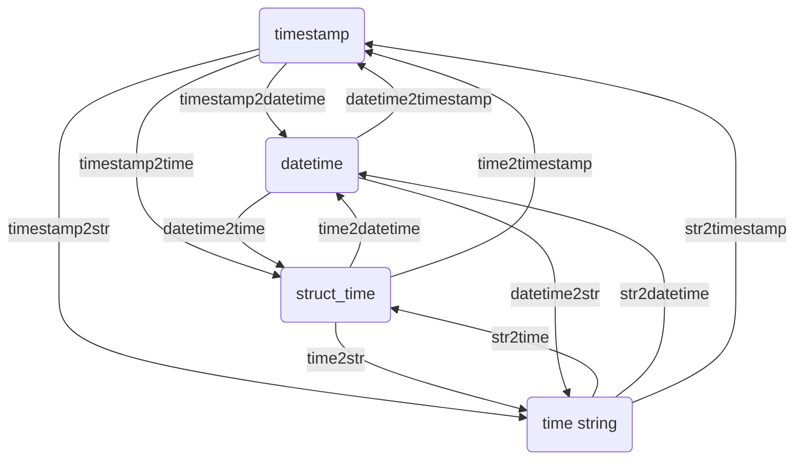

# Time2Time

This module provides conversion helpers between different time formats.

To reduce the friction of converting between `datetime`, `struct_time`, `timestamp`, and time strings, Capybara provides the following helpers.

Relationship diagram:


```mermaid
graph TD
    timestamp(timestamp)
    struct_time(struct_time)
    datetime(datetime)
    str(time string)

    timestamp -->|timestamp2datetime| datetime
    timestamp -->|timestamp2time| struct_time
    timestamp -->|timestamp2str| str

    struct_time -->|time2datetime| datetime
    struct_time -->|time2timestamp| timestamp
    struct_time -->|time2str| str

    datetime -->|datetime2time| struct_time
    datetime -->|datetime2timestamp| timestamp
    datetime -->|datetime2str| str

    str -->|str2time| struct_time
    str -->|str2datetime| datetime
    str -->|str2timestamp| timestamp
```

---

## timestamp2datetime

> [timestamp2datetime(ts: int | float) -> datetime](https://github.com/DocsaidLab/Capybara/blob/main/capybara/utils/time.py)

- **Description**: Converts a timestamp to `datetime`.

- **Parameters**

  - **ts** (`int | float`): Timestamp.

- **Returns**

  - **datetime**: `datetime`.

- **Example**

  ```python
  import capybara.utils.time as ct

  ts = 1634025600
  dt = ct.timestamp2datetime(ts)
  print(dt)
  # >>> 2021-10-12 16:00:00
  ```

## timestamp2time

> [timestamp2time(ts: int | float) -> struct_time](https://github.com/DocsaidLab/Capybara/blob/main/capybara/utils/time.py)

- **Description**: Converts a timestamp to `struct_time`.

- **Parameters**

  - **ts** (`int | float`): Timestamp.

- **Returns**

  - **struct_time**: `struct_time`.

- **Example**

  ```python
  import capybara.utils.time as ct

  ts = 1634025600
  t = ct.timestamp2time(ts)
  print(t)
  # >>> time.struct_time(tm_year=2021, tm_mon=10, tm_mday=12, tm_hour=16, tm_min=0, tm_sec=0, tm_wday=1, tm_yday=285, tm_isdst=0)
  ```

## timestamp2str

> [timestamp2str(ts: int | float, fmt: str) -> str](https://github.com/DocsaidLab/Capybara/blob/main/capybara/utils/time.py)

- **Description**: Converts a timestamp to a time string.

- **Parameters**

  - **ts** (`int | float`): Timestamp.
  - **fmt** (`str`): Time format.

- **Returns**

  - **str**: Time string.

- **Example**

  ```python
  import capybara.utils.time as ct

  ts = 1634025600
  s = ct.timestamp2str(ts, fmt='%Y-%m-%d %H:%M:%S')
  print(s)
  # >>> '2021-10-12 16:00:00'
  ```

## time2datetime

> [time2datetime(t: struct_time) -> datetime](https://github.com/DocsaidLab/Capybara/blob/main/capybara/utils/time.py)

- **Description**: Converts `struct_time` to `datetime`.

- **Parameters**

  - **t** (`struct_time`): `struct_time`.

- **Returns**

  - **datetime**: `datetime`.

- **Example**

  ```python
  import capybara.utils.time as ct

  ts = 1634025600
  t = ct.timestamp2time(ts)
  dt = ct.time2datetime(t)
  print(dt)
  # >>> datetime.datetime(2021, 10, 12, 16, 0)
  ```

## time2timestamp

> [time2timestamp(t: struct_time) -> float](https://github.com/DocsaidLab/Capybara/blob/main/capybara/utils/time.py)

- **Description**: Converts `struct_time` to a timestamp.

- **Parameters**

  - **t** (`struct_time`): `struct_time`.

- **Returns**

  - **float**: Timestamp.

- **Example**

  ```python
  import capybara.utils.time as ct

  ts = 1634025600
  t = ct.timestamp2time(ts)
  ts = ct.time2timestamp(t)
  print(ts)
  # >>> 1634025600.0
  ```

## time2str

> [time2str(t: struct_time, fmt: str) -> str](https://github.com/DocsaidLab/Capybara/blob/main/capybara/utils/time.py)

- **Description**: Converts `struct_time` to a time string.

- **Parameters**

  - **t** (`struct_time`): `struct_time`.
  - **fmt** (`str`): Time format.

- **Returns**

  - **str**: Time string.

- **Example**

  ```python
  import capybara.utils.time as ct

  ts = 1634025600
  t = ct.timestamp2time(ts)
  s = ct.time2str(t, fmt='%Y-%m-%d %H:%M:%S')
  print(s)
  # >>> '2021-10-12 16:00:00'
  ```

## datetime2time

> [datetime2time(dt: datetime) -> struct_time](https://github.com/DocsaidLab/Capybara/blob/main/capybara/utils/time.py)

- **Description**: Converts `datetime` to `struct_time`.

- **Parameters**

  - **dt** (`datetime`): `datetime`.

- **Returns**

  - **struct_time**: `struct_time`.

- **Example**

  ```python
  import capybara.utils.time as ct

  ts = 1634025600
  dt = ct.timestamp2datetime(ts)
  t = ct.datetime2time(dt)
  print(t)
  # >>> time.struct_time(tm_year=2021, tm_mon=10, tm_mday=12, tm_hour=16, tm_min=0, tm_sec=0, tm_wday=1, tm_yday=285, tm_isdst=-1)
  ```

## datetime2timestamp

> [datetime2timestamp(dt: datetime) -> float](https://github.com/DocsaidLab/Capybara/blob/main/capybara/utils/time.py)

- **Description**: Converts `datetime` to a timestamp.

- **Parameters**

  - **dt** (`datetime`): `datetime`.

- **Returns**

  - **float**: Timestamp.

- **Example**

  ```python
  import capybara.utils.time as ct

  ts = 1634025600
  dt = ct.timestamp2datetime(ts)
  ts = ct.datetime2timestamp(dt)
  print(ts)
  # >>> 1634025600.0
  ```

## datetime2str

> [datetime2str(dt: datetime, fmt: str) -> str](https://github.com/DocsaidLab/Capybara/blob/main/capybara/utils/time.py)

- **Description**: Converts `datetime` to a time string.

- **Parameters**

  - **dt** (`datetime`): `datetime`.
  - **fmt** (`str`): Time format.

- **Returns**

  - **str**: Time string.

- **Example**

  ```python
  import capybara.utils.time as ct

  ts = 1634025600
  dt = ct.timestamp2datetime(ts)
  s = ct.datetime2str(dt, fmt='%Y-%m-%d %H:%M:%S')
  print(s)
  # >>> '2021-10-12 16:00:00'
  ```

## str2time

> [str2time(s: str, fmt: str) -> struct_time](https://github.com/DocsaidLab/Capybara/blob/main/capybara/utils/time.py)

- **Description**: Converts a time string to `struct_time`.

- **Parameters**

  - **s** (`str`): Time string.
  - **fmt** (`str`): Time format.

- **Returns**

  - **struct_time**: `struct_time`.

- **Example**

  ```python
  import capybara.utils.time as ct

  s = '2021-10-12 16:00:00'
  t = ct.str2time(s, fmt='%Y-%m-%d %H:%M:%S')
  print(t)
  # >>> time.struct_time(tm_year=2021, tm_mon=10, tm_mday=12, tm_hour=16, tm_min=0, tm_sec=0, tm_wday=1, tm_yday=285, tm_isdst=-1)
  ```

## str2datetime

> [str2datetime(s: str, fmt: str) -> datetime](https://github.com/DocsaidLab/Capybara/blob/main/capybara/utils/time.py)

- **Description**: Converts a time string to `datetime`.

- **Parameters**

  - **s** (`str`): Time string.
  - **fmt** (`str`): Time format.

- **Returns**

  - **datetime**: `datetime`.

- **Example**

  ```python
  import capybara.utils.time as ct

  s = '2021-10-12 16:00:00'
  dt = ct.str2datetime(s, fmt='%Y-%m-%d %H:%M:%S')
  print(dt)
  # >>> datetime.datetime(2021, 10, 12, 16, 0)
  ```

## str2timestamp

> [str2timestamp(s: str, fmt: str) -> float](https://github.com/DocsaidLab/Capybara/blob/main/capybara/utils/time.py)

- **Description**: Converts a time string to a timestamp.

- **Parameters**

  - **s** (`str`): Time string.
  - **fmt** (`str`): Time format.

- **Returns**

  - **float**: Timestamp.

- **Example**

  ```python
  import capybara.utils.time as ct

  s = '2021-10-12 16:00:00'
  ts = ct.str2timestamp(s, fmt='%Y-%m-%d %H:%M:%S')
  print(ts)
  # >>> 1634025600.0
  ```
