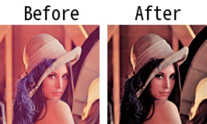

# imadjust

> [imadjust(img: np.ndarray, rng_out: tuple[int, int] = (0, 255), gamma: float = 1.0, color_base: str = "BGR") -> np.ndarray](https://github.com/DocsaidLab/Capybara/blob/main/capybara/vision/functionals.py)

- **Description**: Adjusts the intensity of an image.

- **Parameters**

  - **img** (`np.ndarray`): The input image to adjust the intensity. It can be 2-D or 3-D.
  - **rng_out** (`Tuple[int, int]`): The target intensity range for the output image. Default is (0, 255).
  - **gamma** (`float`): The value used for gamma correction. If gamma is less than 1, the mapping will be skewed toward higher (brighter) output values. If gamma is greater than 1, the mapping will be skewed toward lower (darker) output values. Default is 1.0 (linear mapping).
  - **color_base** (`str`): The color basis of the input image. Should be 'BGR' or 'RGB'. Default is 'BGR'.

- **Returns**

  - **np.ndarray**: The adjusted image.

- **Example**

  ```python
  from capybara import imread
  from capybara.vision.functionals import imadjust

  img = imread('lena.png')
  adj_img = imadjust(img, gamma=2)
  ```

  
