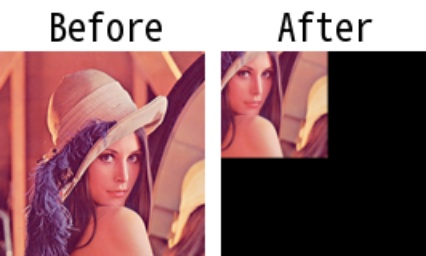

# imcropbox

> [imcropbox(img: np.ndarray, box: Union[Box, np.ndarray], use_pad: bool = False) -> np.ndarray](https://github.com/DocsaidLab/Capybara/blob/975d62fba4f76db59e715c220f7a2af5ad8d050e/capybara/vision/functionals.py#L257)

- **Description**: Crops the input image using the provided bounding box.

- **Parameters**

  - **img** (`np.ndarray`): The input image to crop.
  - **box** (`Union[Box, np.ndarray]`): The cropping box. The input can be a custom `Box` object from Capybara, defined by the coordinates (x1, y1, x2, y2), or a NumPy array with the same format.
  - **use_pad** (`bool`): Whether to use padding for out-of-bounds areas. If set to True, the outer regions will be padded with zeros. Default is False.

- **Returns**

  - **np.ndarray**: The cropped image.

- **Example**

  ```python
  import capybara as cb

  # Using custom Box object
  img = cb.imread('lena.png')
  box = cb.Box([50, 50, 200, 200], box_mode='xyxy')
  cropped_img = cb.imcropbox(img, box, use_pad=True)

  # Resize the cropped image to the original size for visualization
  cropped_img = cb.imresize(cropped_img, [img.shape[0], img.shape[1]])
  ```

  
