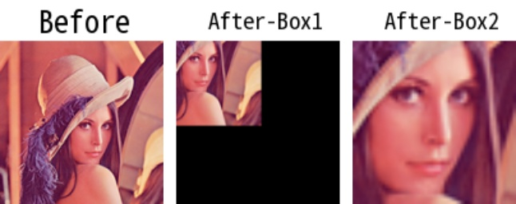

# imcropboxes

> [imcropboxes(img: np.ndarray, boxes: Union[Box, np.ndarray], use_pad: bool = False) -> List[np.ndarray]](https://github.com/DocsaidLab/Capybara/blob/975d62fba4f76db59e715c220f7a2af5ad8d050e/capybara/vision/functionals.py#L325)

- **Description**: Crops the input image using multiple provided bounding boxes.

- **Parameters**

  - **img** (`np.ndarray`): The input image to crop.
  - **boxes** (`Union[Boxes, np.ndarray]`): The cropping boxes. The input can be a custom `Boxes` object from Capybara, defined as a list of `Box` objects, or a NumPy array with the same format.
  - **use_pad** (`bool`): Whether to use padding for out-of-bounds areas. If set to True, the outer regions will be padded with zeros. Default is False.

- **Returns**

  - **List[np.ndarray]**: A list of cropped images.

- **Example**

  ```python
  import capybara as cb

  # Using custom Box objects
  img = cb.imread('lena.png')
  box1 = cb.Box([50, 50, 200, 200], box_mode='xyxy')
  box2 = cb.Box([50, 50, 100, 100], box_mode='xyxy')
  boxes = cb.Boxes([box1, box2])
  cropped_imgs = cb.imcropboxes(img, boxes, use_pad=True)

  # Resize the cropped image to the original size for visualization
  cropped_img = cb.imresize(cropped_img, [img.shape[0], img.shape[1]])
  ```

  
