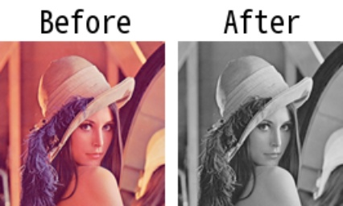

# imcvtcolor

> [imcvtcolor(img: np.ndarray, cvt_mode: Union[int, str]) -> np.ndarray](https://github.com/DocsaidLab/Capybara/blob/975d62fba4f76db59e715c220f7a2af5ad8d050e/capybara/vision/functionals.py#L96)

- **Description**: Converts the input image to a different color space.

- **Parameters**

  - **img** (`np.ndarray`): The input image to be converted.
  - **cvt_mode** (`Union[int, str]`): The color conversion mode. It can be an integer constant representing the conversion code or a string representing an OpenCV color conversion name. For example, `BGR2GRAY` is used to convert a BGR image to grayscale. For available options, refer to the [**OpenCV COLOR** documentation](https://docs.opencv.org/4.x/d8/d01/group__imgproc__color__conversions.html).

- **Returns**

  - **np.ndarray**: The image in the desired color space.

- **Example**

  ```python
  import capybara as cb

  img = cb.imread('lena.png')
  ycrcb_img = cb.imcvtcolor(img, 'BGR2YCrCb')
  ```

  

  ```python
  import capybara as cb

  img = cb.imread('lena.png')
  gray_img = cb.imcvtcolor(img, 'BGR2GRAY')
  ```

  
