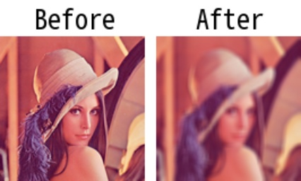

# meanblur

> [meanblur(img: np.ndarray, ksize: \_Ksize = 3, \*\*kwargs) -> np.ndarray](https://github.com/DocsaidLab/Capybara/blob/975d62fba4f76db59e715c220f7a2af5ad8d050e/capybara/vision/functionals.py#L33)

- **Description**: Applies mean blur to the input image.

- **Parameters**

  - **img** (`np.ndarray`): The input image to be blurred.
  - **ksize** (`Union[int, Tuple[int, int]]`): The size of the kernel used for blurring. If an integer is provided, a square kernel of the specified size is used. If a tuple `(k_height, k_width)` is provided, a rectangular kernel of the specified size is used. Default is 3.

- **Returns**

  - **np.ndarray**: The blurred image.

- **Example**

  ```python
  import capybara as cb

  img = cb.imread('lena.png')
  blur_img = cb.meanblur(img, ksize=5)
  ```

  
