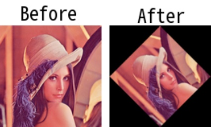

# imrotate

> [imrotate(img: np.ndarray, angle: float, scale: float = 1, interpolation: Union[str, int, INTER] = INTER.BILINEAR, bordertype: Union[str, int, BORDER] = BORDER.CONSTANT, bordervalue: Union[int, Tuple[int, int, int]] = None, expand: bool = True, center: Tuple[int, int] = None) -> np.ndarray](https://github.com/DocsaidLab/Capybara/blob/975d62fba4f76db59e715c220f7a2af5ad8d050e/capybara/vision/geometric.py#L80)

- **Description**: Rotates the input image.

- **Parameters**

  - **img** (`np.ndarray`): The input image to be rotated.
  - **angle** (`float`): The rotation angle in degrees, counterclockwise.
  - **scale** (`float`): The scaling factor. Default is 1.
  - **interpolation** (`Union[str, int, INTER]`): The interpolation method. Available options include: INTER.NEAREST, INTER.LINEAR, INTER.CUBIC, INTER.LANCZOS4. Default is INTER.LINEAR.
  - **bordertype** (`Union[str, int, BORDER]`): The border type. Available options include: BORDER.CONSTANT, BORDER.REPLICATE, BORDER.REFLECT, BORDER.REFLECT_101. Default is BORDER.CONSTANT.
  - **bordervalue** (`Union[int, Tuple[int, int, int]]`): The value used to fill the border. Only used when bordertype is BORDER.CONSTANT. Default is None.
  - **expand** (`bool`): Whether to expand the output image to fit the entire rotated image. If True, the output image will be expanded to accommodate the full rotated image. If False or omitted, the output image will be the same size as the input image. Note that the expand flag assumes rotation around the center with no translation. Default is False.
  - **center** (`Tuple[int, int]`): The center of rotation. Default is the center of the image.

- **Returns**

  - **np.ndarray**: The rotated image.

- **Example**

  ```python
  import capybara as cb

  img = cb.imread('lena.png')
  rotate_img = cb.imrotate(img, 45, bordertype=cb.BORDER.CONSTANT, expand=True)

  # Resize the rotated image to the original size for visualization
  rotate_img = cb.imresize(rotate_img, [img.shape[0], img.shape[1]])
  ```

  
